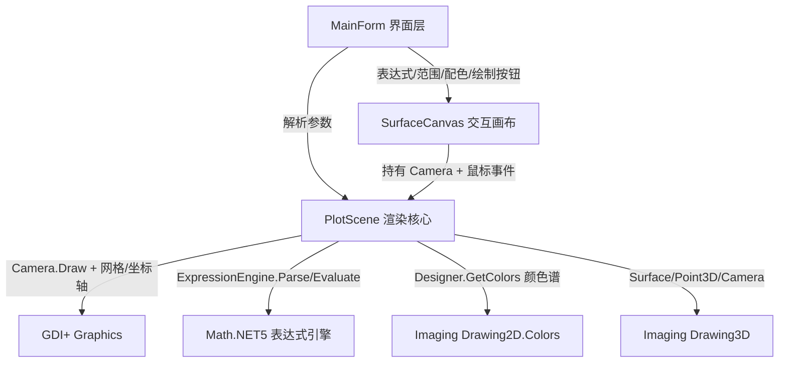

## 用户需求概述

基于现有代码库开发一个 light 主题的 WinForms 三维数学表达式绘图程序：用户在输入框中输入数学表达式，程序调用 `ExpressionEngine` 将其解析为表达式对象并采样求值，生成三维曲面或参数化三维曲线数据，再通过 `Drawing3D` 的 `Camera`/`Surface`/`PainterAlgorithm` API 渲染到可交互的三维画布上（叠加 3D 光照与热图着色），并绘制坐标轴与底面网格。程序启动即演示一个默认三维曲面表达式。

## 核心功能

- 表达式输入与解析：支持曲面模式 `z=f(x,y)`（单输入框）与参数化三维曲线模式 `x(t),y(t),z(t)`（三个输入框 + 参数 t 范围）；支持 x/y 或 t 的采样范围与分辨率设置；解析失败时给出错误提示而不崩溃。
- 三维曲面生成与渲染：在网格上采样逐点求值得到 `z`，构造四边形 `Surface` 面片，面片颜色依据 z 值归一化后查 `Designer.GetColors` 连续颜色谱（热图），经 `Camera.Draw` 叠加 3D 光照渲染。
- 三维参数曲线生成与渲染：在 t 区间采样得到三维点序列，按采样顺序连接成折线，可依据 t 做渐变着色。
- 交互式三维画布：鼠标左键拖拽旋转观察视角（修改相机 Euler 角）、鼠标滚轮调整观察距离（修改 ViewDistance）、鼠标右键拖拽平移视角（修改相机 Offset）；画面支持双缓冲与按需重绘。
- 辅助元素：在三维场景中绘制 X/Y/Z 坐标轴与底面参考网格，便于数据定位。
- 配色与主题：提供 viridis/magma/turbo 等热图配色下拉选择；整体 light 亮色主题（白底、浅色控件）。
- 默认演示：启动即加载默认曲面表达式（如 `sin(sqrt(x*x + y*y))`）并完成居中、自动视距适配与渲染。

## 技术栈

- 语言/框架：VB.NET + Windows Forms（WinExe），`net10.0-windows`，`UseWindowsForms=true`，`UseWPF=True`（与 ModelViewer 一致以启用 `#If WINDOWS` GDI+ 分支）。
- 复用工程引用（参照 `gr/ModelViewer/ModelViewer.vbproj` 与 `Data_science/Visualization/DataPlot/DataPlot.vbproj`）：
- `gr/Microsoft.VisualBasic.Imaging/imaging.NET5.vbproj`（提供 `Drawing3D.Camera/Surface/Point3D/PainterAlgorithm` 与 `Drawing2D.Colors.Designer`）
- `Data_science/Mathematica/Math/Math/Math.NET5.vbproj`（提供 `Math.Scripting.MathExpression.ExpressionEngine`）
- `Microsoft.VisualBasic.Core/src/Core.vbproj`、`mime/text%html/html_netcore5.vbproj`、`gr/Drawing-net4.8/Drawing-net4.8.vbproj`（提供 `PainterAlgorithm` 中 `CTypeBrushObject` 等 GDI+ 扩展）。

## 实现方案

- 整体策略：新建独立 WinForms 工程 `Data_science/Visualization/Expression3DPlotter/`，完全复用 `ModelViewer` 已验证的「Camera + SceneRenderer + RenderPanel + MainForm」交互骨架，仅替换数据来源为「表达式解析 → 网格/曲线采样」。
- 渲染链路：表达式文本 → `ExpressionEngine.Parse` 预编译为 `Expression` 对象（仅一次）→ 循环 `engine.SetSymbol("x"/"y"/"t", val)` + `engine.Evaluate(expr As Expression)` 采样 → 构造 `Surface`（四边形面片，刷子颜色来自 `Designer.GetColors(scheme,256)` 颜色表按 z 归一化索引）→ `Camera.Draw(g, surfaces)`（内部完成批量 SIMD 旋转、透视投影、画家算法与光照叠加）。
- 关键决策：
- 预编译表达式而非每次 `Evaluate(String)`，避免逐点重复 tokenize 解析，网格 60×60≈3600 面片时开销可控。
- 复用 `SceneRenderer` 的 `Centroid/Radius` 质心居中 + `FitView`（含 perspectiveK 弱透视系数）保证模型绕中心旋转且初始完整可见。
- 曲面着色采用「热图基色 + 光照叠加」：`Camera.Draw` 默认 `illumination=True`，在 `Designer` 颜色基础上由 `PainterAlgorithm` 调制明暗，立体感强且颜色层次清晰。
- 坐标轴/底面网格复用 `SceneRenderer.DrawGround` 的 `ToScreen`（Rotate→Project→PointF）思路，并新增 X/Y/Z 三轴绘制（轴端点经相机变换后 `DrawLine`）。
- 性能与可靠性：采样与渲染分离，仅在「绘制」或交互时重绘；`Camera.Rotate/Project` 与 `PainterAlgorithm` 已并行化；对 `NaN/Infinity` 采样点做剔除或夹紧（夹到 [zmin,zmax]）避免投影异常；表达式解析失败捕获异常并回显错误信息。
- 架构可扩展性：将「数据生成」「渲染场景」「交互画布」「界面」分层，后续可加入等高线、动画、导出图片等而不破坏现有结构。

## 实现要点（防回归）

- 工程必须与 `ModelViewer` 同样配置（`net10.0-windows`/`UseWindowsForms`/`UseWPF`），否则 `Camera.Draw` 的 `#If WINDOWS` GDI+ 分支不可用。
- 每帧重绘只调用 `Camera.Draw`/网格绘制，不重新解析表达式、不重新生成 `Surface`（仅在「绘制」按钮或参数变更时重建），避免交互卡顿。
- 新增工程不修改 `ModelViewer`/`DataPlot`/库源码，仅复用其模式与公共 API，控制改动半径。

## 架构设计



## 目录结构

本实现新增一个独立 WinForms 工程，全部为新建文件，不修改现有库代码。

```
Data_science/Visualization/Expression3DPlotter/
├── Expression3DPlotter.vbproj   # [NEW] WinExe / net10.0-windows / UseWindowsForms+UseWPF；引用 imaging.NET5、Math.NET5、Core、html_netcore5、Drawing-net4.8；StartupObject 指向 Program.Main；配置 ProjectReference 相对路径（参照 ModelViewer.vbproj）。
├── Program.vb                  # [NEW] 入口模块。Sub New 调用 ImageDriver.Register()；<STAThread> Main 调用 Application.EnableVisualStyles + Application.Run(New MainForm())（照搬 ModelViewer/Program.vb）。
├── PlotScene.vb               # [NEW] 渲染核心（对应 SceneRenderer）。封装 Camera、List(Of Surface)、曲线 Point3D()、颜色表；方法：SetSurface(exprZ,xRng,yRng,div,scheme)、SetCurve(exprX,exprY,exprZ,tRng,div,scheme)、FitView()、Draw(g,size)。内含 Centroid/Radius 居中、GetColorTable(Designer.GetColors)、ToScreen、DrawGround（底面网格）、DrawAxes（X/Y/Z 坐标轴）。
├── ExpressionEvaluator.vb      # [NEW] 表达式求值封装。封装 ExpressionEngine.Parse 预编译与 SetSymbol+Evaluate 采样；提供安全的 EvaluatePoint(x,y)/(t) 并处理 NaN/Infinity；解析异常向上抛出供界面提示。
├── SurfaceCanvas.vb            # [NEW] 交互画布控件（对应 RenderPanel）。Inherits Panel，DoubleBuffered=True；重写 OnMouseWheel 抛 Zoom 事件；MouseDown/Move/Up 实现左键旋转(AngleY+=dx*0.4, AngleX+=dy*0.4)、右键平移(Offset)、滚轮缩放(ViewDistance*=0.9/1.1)；Paint 委托给 PlotScene.Draw。
└── MainForm.vb                # [NEW] 主窗体（对应 ModelViewer/MainForm）。以代码构建控件：表达式输入框（曲面单框/曲线三框切换）、x/y 或 t 范围与分辨率 NumericUpDown、配色 ComboBox(viridis/magma/inferno/plasma/turbo/jet/rainbow)、绘制按钮、StatusStrip 状态栏；light 主题（BackColor=SystemColors.Control、画布 White）；Load 时加载默认曲面 demo 并 FitView 渲染。
```

## 关键代码结构

- `PlotScene.SetSurface(zExpr As Expression, xMin#, xMax#, yMin#, yMax#, div%, scheme$)`：在 (div+1)² 网格上采样 z，构建四边形 `Surface` 列表，颜色按平均 z 在 `[zmin,zmax]` 归一化索引 `Designer.GetColors(scheme,256)`。
- `PlotScene.SetCurve(xExpr As Expression, yExpr As Expression, zExpr As Expression, tMin#, tMax#, div%, scheme$)`：采样 t 得到 `Point3D()` 折线，按 t 归一化渐变着色后随相机旋转投影绘制。
- `SurfaceCanvas` 复用 `RenderPanel` 的 `Event Zoom(delta As Integer)` 与 `MainForm` 的鼠标交互逻辑（左旋转/右平移/滚轮缩放）。

## 设计风格

采用 light 亮色主题的现代化数据可视化桌面界面（VB.NET Windows Forms）。整体以白色/浅灰为底，蓝色为主强调色，扁平化控件与清晰分区，突出中央三维画布。顶部为工具栏（表达式切换、范围/分辨率、配色、绘制按钮），中央为可交互三维画布（白色背景，叠加坐标轴、底面网格与热图曲面），底部为状态栏显示角度/视距/面数等信息。

## 页面/控件布局（自上而下分块）

- 顶部工具栏（ToolStrip）：左侧为「曲面 / 曲线」模式切换；曲面模式显示单个表达式框 `z=f(x,y)`，曲线模式切换为三个表达式框 `x(t) y(t) z(t)`；范围输入（xmin/xmax/ymin/ymax 或 tmin/tmax）、分辨率 NumericUpDown；配色 ComboBox；「绘制」按钮。
- 中央画布区（SurfaceCanvas，Dock=Fill）：白底三维视口，渲染热图曲面/曲线 + 坐标轴 + 底面网格；支持左键旋转、右键平移、滚轮缩放；框选/聚焦以获得鼠标事件。
- 底部状态栏（StatusStrip）：实时显示 视角角度(X/Y)、视距、模型半径、面/点数、错误信息。
- 整体无多余装饰，控件间距统一（Padding 8），圆角按钮，Hover 轻微高亮，错误时表达式框红边提示。