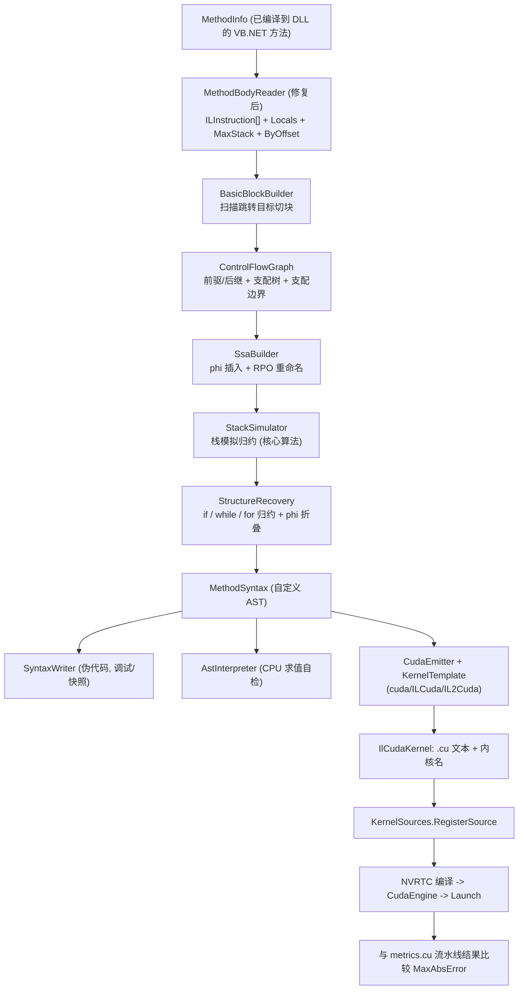

## Product Overview

在已有的 CUDA 计算框架之上，新增一条"由 VB.NET 方法自动生成 CUDA 内核"的完整流水线：运行时读取已编译方法的 CIL 指令流，用栈模拟与流图分析把它还原成一套自定义的表达式/语句树（AST），再由 AST 生成 `.cu` 源码并交给 NVRTC 编译执行，从而摆脱手写 `metrics.cu` 的约束。同时对现有那部分 IL 反编译实现做缺陷修复与自检能力建设，并在 demo 工程中用等价的 VB.NET 度量函数做端到端数值对比。

## Core Features

- **IL 解码层修复与增强**：修正指令偏移（含双字节操作码）、补全 `switch` 操作数、统一变量索引类型、填充操作数字节、暴露局部变量类型表/最大栈深/异常子句/按偏移的指令索引，并让资源释放安全化。
- **自定义表达式与语句节点模型**：字面量、参数引用、局部引用、一元/二元运算、类型转换、方法调用、数组取元素、数组长度、三元；语句层含块、变量声明、赋值、表达式语句、返回、if/else、while、for、break/continue，每个节点带类型标注。
- **栈模拟归约（核心算法）**：压栈类指令压入节点，运算/调用类指令弹栈构建二元、一元、调用节点再压回；`stloc`/`starg` 生成赋值或声明，`ret` 生成返回节点；对 VB 函数返回值的隐藏局部变量做特判折叠。
- **控制流图与 SSA**：扫描全部跳转目标切分基本块，构建前驱/后继、支配树与支配边界，插入 φ 并完成变量重命名。
- **结构化还原**：把条件菱形归约为 if/else，把回边自然循环归约为 while，归纳变量形态进一步归约为 for；短路布尔折叠为逻辑与/或；无法结构化的形状给出可定位的诊断而不是静默出错。
- **AST 到 CUDA 发射**：类型映射、数学函数到设备内联函数映射、按优先级加括号的表达式发射、`extern "C" __global__` 内核骨架（grid-stride 一维 / 二维索引、边界保护、结果写回）。
- **内核映射约定**：优先识别 `<CudaKernel>` / `<CudaIndex>` / `<CudaInput>` / `<CudaOutput>` 标注；未标注时自动回退为"纯标量函数 + 自动包裹内核骨架"。
- **测试与对比**：编写与 `metrics.cu` 等价的 VB.NET 度量函数（纯标量公式、带循环的行统计、带循环加分支的直接协方差），反编译后生成内核，与手写内核的皮尔逊相关矩阵、欧氏距离矩阵逐元素比较最大绝对误差；无 GPU 时用 AST 解释求值自检并输出生成的源码，保证命令行始终可跑出结论。

## Tech Stack Selection

- 语言/框架：VB.NET，`net10.0`，`Option Explicit On` / `Option Infer On`（与现有工程一致）
- 依赖：仅 BCL（`System.Reflection` / `System.Reflection.Emit` / `System.Collections.Generic`）。ILCuda 工程维持"零 NuGet 依赖"约束，新增代码同样不引入任何包
- 既有可复用资产：
- `KernelSources.RegisterSource(name, text, origin)` —— 运行时注入生成 `.cu` 的入口，必须在 `CudaEngine.TryCreate` 之前调用
- `CudaEngine.GetKernel(name)` / `CudaKernel.Launch(stream, config, ParamArray args)` / `LaunchPlanner.For1D` / `For2D`
- `CpuMetrics.MaxAbsError` —— 误差比较
- `ConsoleReporter` —— 控制台排版（框架库本身不写 Console）
- 命名空间：新增代码落在 `Microsoft.VisualBasic.ApplicationServices.Development.VisualStudio.IL`（VisualStudio 工程）与 `Microsoft.VisualBasic.Computing.ILCuda.IL2Cuda`（ILCuda 工程）

## Implementation Approach

整体策略是**四段式管道 + 可控失败**：`MethodInfo → ILInstruction[] → 基本块/CFG → SSA → 栈模拟 → 结构化 AST → CUDA 源文本 → NVRTC`。

关键决策与权衡：

1. **不引入 Mono.Cecil / ICSharpCode.Decompiler**：受"零 NuGet"约束，且现有 `MethodBodyReader` 已实现 90% 的 IL 解码，只需修复缺陷，成本远低于引入外部依赖。
2. **栈模拟以基本块为单位，块内独立跑**：CLR 规范保证基本块边界处除"短路布尔"外不存在跨块栈值。因此块入口栈深按支配前驱传播即可；栈槽不参与 SSA，只有参数与局部变量参与 SSA —— 这把 SSA 的规模从"变量 + 栈槽"降到"变量"，显著简化 φ 插入与重命名。
3. **SSA 采用标准 Braun 式简化版**：迭代式支配树（Cooper-Harvey-Kennedy）+ 支配边界插 φ + RPO 重命名。φ 的消解不在独立 pass 做，而在结构化还原时"就地折叠"：if 的 join φ 变成 then/else 分支末尾赋值并把声明提升到 if 之前；while 头部的 φ 变成声明提升 + latch 末尾赋值。这样既满足"每块做 SSA 变换"的要求，又避免实现一个完整的 φ 消除 + 拷贝传播框架。
4. **结构化还原只覆盖可归约形状**：菱形 → if/else；单一回边自然循环 → while，若头部条件为 `i < n` 且 latch 为 `i = i + step` 则提升为 for；其余形状直接抛出带指令偏移的诊断。首版不生成 `goto`，宁可显式失败也不产出语义不明的 CUDA 代码。
5. **CUDA 侧采用"纯标量内核 + 宿主编排"路线**：反编译的目标函数保持为纯计算函数，CUDA 发射器自动生成内核骨架（索引、边界保护、数组读写、结果写回）。这样 AST 只需覆盖数值表达式与控制流，不需要处理对象布局、字段、装箱、异常。
6. **不支持的指令立即报错**：`newobj`/`callvirt` 到非白名单方法/字段访问/装箱/异常 → 抛出带 offset 与 opcode 的诊断异常，保证"生成错代码"不会发生。

性能与规模：反编译只在进程启动时执行一次，不是热路径。指令数 N、块数 B、变量数 V 均在数十到数百量级；支配树 O(N·B)，重命名 O(V·B)，结构化还原 O(B²) 最坏，实际远低于毫秒级，无需缓存。日志只走结构化诊断对象（`DecompileDiagnostics`），不写 Console、不打大 payload。

向后兼容：`MethodBodyReader` 保留 `IEnumerable(Of ILInstruction)` 与 `GetBodyCode()` 语义，现有调用方 `vs_solutions/dev/VisualStudio/test/Module2.vb` 不受影响；新增成员均为追加。

## Architecture Design



分层职责：

- **解码层**（VisualStudio/IL 根）：只负责把字节流变成结构化指令与元信息，不含任何语义。
- **语法层**（IL/Syntax）：纯数据节点模型，被反编译器、解释器、CUDA 发射器三方共享，不依赖任何一方。
- **反编译层**（IL/Decompiler）：CFG/SSA/栈模拟/结构还原，输出 `MethodSyntax`；失败时输出结构化诊断。
- **发射层**（ILCuda/IL2Cuda）：消费 AST 产出 CUDA C 文本，是唯一知道 CUDA 细节的层。
- **测试层**（ILCuda/test/IlDecompile）：提供被反编译的样本函数与端到端对比驱动。

## Implementation Notes

- **VB 返回值隐藏局部**：VB 的 `Function` 会生成与函数同名的隐藏局部变量，IL 形如 `stloc rv / ldloc rv / ret`，多返回路径时散落各处。必须在 `MethodDecompiler` 中做"返回值槽识别"：把对该局部的 `stloc` 直接归约为 `ReturnStatement`，而不是普通赋值，否则会生成错误的内核。
- **优先使用 `MathF` 而非 `Math`** 编写样本函数：`MathF.Sqrt/Max/Min` 是 `float32` 签名，IL 中无 `conv.r8/r4` 往返，发射时可直接映射为 `sqrtf/fmaxf/fminf`，避免 Double/Single 混用导致精度与生成代码双重复杂化。
- **`KernelSources.RegisterSource` 的时机**：必须在 `CudaEngine.TryCreate` 之前；`Program.Main` 开头已有 `KernelSources.Register(...)`，生成的 `.cu` 注入紧随其后。
- **命名冲突**：所有源码合并为单个 NVRTC 编译单元，生成的内核名、`#define` 宏、内部函数名都要加 `il_` 前缀，避免与 `metrics.cu` 及框架自带 4 个 `.cu` 撞名。
- **栈深度越界与 dup 模式**：`dup`（短路布尔、`a = b = expr`）要复制栈顶节点而非共享引用出错；块入口栈深不一致时记录诊断而不是静默丢弃。
- **Blast radius**：不改动 `metrics.cu`、`GpuMetrics`、`CpuMetrics` 的现有行为；`test.vbproj` 与 `VisualStudio.NET5.vbproj` 均无需修改（SDK 自动包含 `.vb`）。
- **无 GPU 降级**：对比驱动在 `engine Is Nothing` 时只执行"反编译 → 伪代码 → AST 解释求值自检 → 打印生成源码"，保证命令永远有输出，与既有 `selftest` 风格一致。

## Directory Structure

```
vs_solutions/dev/VisualStudio/IL/
├── ILInstruction.vb                      # [MODIFY] 指令模型增强：填充 OperandData；新增 StackPop/StackPush 推导、
│                                         #          IsBranch/IsConditionalBranch/IsReturn/IsLoad/IsStore 判定、BranchTargets；
│                                         #          保留原有 GetCode() 友好输出
├── MethodBodyReader.vb                   # [MODIFY] 修复 Offset（改读操作码前记录起始位置）、InlineSwitch 操作数赋值、
│                                         #          var 索引统一为 Integer；新增 Instructions / MaxStack / Locals /
│                                         #          ExceptionClauses / ByOffset(offset->index) 索引；Dispose 空安全且不清空列表
├── Globals.vb                            # [MODIFY] 补充 StackDelta(op As OpCode) 等 opcode 元信息助手（供栈模拟复用）
├── Syntax/
│   ├── SyntaxNode.vb                     # [NEW] 抽象基类与枚举：MustInherit SyntaxNode（NodeType / Type）、
│   │                                     #       MustInherit Expression / Statement、SyntaxKind、BinaryOperator、UnaryOperator
│   ├── Expressions.vb                    # [NEW] LiteralExpression / ParameterExpression / LocalExpression / BinaryExpression /
│   │                                     #       UnaryExpression / ConvertExpression / CallExpression / ArrayIndexExpression /
│   │                                     #       ArrayLengthExpression / TernaryExpression / PhiExpression
│   └── Statements.vb                     # [NEW] BlockStatement / VariableDeclarationStatement / AssignmentStatement /
│                                         #       ExpressionStatement / ReturnStatement / IfStatement / WhileStatement /
│                                         #       ForStatement / BreakStatement / ContinueStatement / MethodSyntax
└── Decompiler/
    ├── BasicBlock.vb                     # [NEW] 基本块：偏移区间、指令切片、前驱/后继、支配节点、支配边界、入口/出口栈
    ├── ControlFlowGraph.vb               # [NEW] 由跳转目标切块建图；迭代支配树（Cooper-Harvey-Kennedy）、支配边界、
    │                                     #       反向后序（RPO）、回边与自然循环识别
    ├── SsaBuilder.vb                     # [NEW] 变量集合（参数+局部）上插 φ 与 RPO 重命名；版本号管理
    ├── StackSimulator.vb                 # [NEW] 核心算法：逐指令栈模拟归约（ldc/ldarg/ldloc/ldelem/ldlen/dup、
    │                                     #       add/sub/mul/div/rem/neg/and/or/xor/shl/shr/ceq/cgt/clt/not、conv.*、
    │                                     #       call/callvirt 白名单、stloc/starg/stelem、br/brtrue/brfalse/switch、ret）
    ├── StructureRecovery.vb              # [NEW] 菱形→if/else、自然循环→while、归纳变量→for、短路布尔→AndAlso/OrElse、
    │                                     #       φ 就地折叠为分支赋值
    ├── MethodDecompiler.vb               # [NEW] 总入口 Decompile(MethodInfo, DecompileOptions) As MethodSyntax；
    │                                     #       串联读 IL→切块→CFG→SSA→栈模拟→结构还原；返回值隐藏局部折叠；
    │                                     #       DecompileOptions 与 DecompileDiagnostics（结构化诊断，不写 Console）
    ├── SyntaxWriter.vb                   # [NEW] AST → 类 VB 伪代码（缩进），供 --dump-ast 与测试快照
    └── AstInterpreter.vb                 # [NEW] AST 的 CPU 解释求值（Single/Double/Integer/Boolean/数组），
                                          #       无 GPU 时验证"反编译语义 == 原方法"

cuda/ILCuda/IL2Cuda/
├── CudaAttributes.vb                     # [NEW] <CudaKernel(name, mode, blockSize)> / <CudaIndex> / <CudaInput> /
│                                         #       <CudaOutput> 与 CudaIndexMode 枚举（Grid1D / Grid2D / None）
├── CudaTypeMap.vb                        # [NEW] 类型映射（Single→float、Double→double、Int32→int、Boolean→int）；
│                                         #       Math/MathF → sqrtf/fabsf/powf/expf/logf/fminf/fmaxf/floorf/ceilf；
│                                         #       运算符与字面量格式化（1.0F→1.0f、True→1）
├── CudaEmitter.vb                        # [NEW] 表达式/语句 → CUDA C（按优先级加括号、缩进）；
│                                         #       EmitFunction → __device__ 标量函数
├── KernelTemplate.vb                     # [NEW] extern "C" __global__ 骨架：1D grid-stride 或 2D 索引 prologue、
│                                         #       边界 return 保护、数组加载、函数调用、结果写回 epilogue
└── IlCudaKernel.vb                       # [NEW] 端到端：IlCudaTranslator.Translate(MethodInfo) → IlCudaKernel
                                          #       （Name / Source / Register() / Launch()）；Attribute 优先、无标注回退默认约定

cuda/ILCuda/test/IlDecompile/
├── MetricFunctions.vb                    # [NEW] 待反编译的样本函数（Public Shared、纯计算）：
│                                         #       FinalizeCorrelation（含 i==j 对角特判，验证 if/else）、
│                                         #       PearsonFromStats / EuclideanFromStats（纯标量，验证默认约定回退）、
│                                         #       RowSumSq（for 循环，对应 rowStatsKernel）、
│                                         #       PearsonDirect（循环+分支，对应 gram+finalize 合并公式）
└── IlCudaComparison.vb                   # [NEW] 对比驱动：反编译并打印诊断/伪代码 → AST 解释求值自检 →
                                          #       发射 .cu 并注入 KernelSources → 创建 engine →
                                          #       与 metrics.cu 的 corr/dist 逐元素比较 MaxAbsError；
                                          #       无 GPU 时降级为源码预览 + 解释自检

cuda/ILCuda/test/
├── Program.vb                            # [MODIFY] Main 开头在 KernelSources.Register 之后注入 IL 生成的 .cu；
│                                         #          新增 il / il-compare 命令与 --dump-ast、--emit-il-cu <dir> 参数；更新 PrintHelp
└── Reporter.vb                           # [MODIFY] 增加 PrintIlDecompile / PrintComparison 排版（消费结构化诊断）

cuda/ILCuda/README.md                     # [MODIFY] 补充 IL→CUDA 流水线章节、目录结构、il / il-compare 用法与实测误差
```

## Key Code Structures

```
' IL/Decompiler/MethodDecompiler.vb —— 反编译总入口（签名级）
Namespace IL
    Public Class DecompileOptions
        Public Property EnableSsa As Boolean = True
        Public Property FoldShortCircuit As Boolean = True
        Public Property Diagnostics As DecompileDiagnostics
    End Class

    Public Class DecompileDiagnostics
        Public ReadOnly Property Messages As IReadOnlyList(Of String)
        Public Sub Warn(offset As Integer, message As String)
        Public Function ToString() As String
    End Class

    Public Module MethodDecompiler
        ''' MethodInfo -> 自定义 AST；不可归约时抛出带 offset 的 DecompileException
        Public Function Decompile(method As Reflection.MethodInfo,
                                  Optional options As DecompileOptions = Nothing) As MethodSyntax
    End Module
End Namespace
```

```
' cuda/ILCuda/IL2Cuda/IlCudaKernel.vb —— 端到端翻译与注册（签名级）
Namespace IL2Cuda
    Public Module IlCudaTranslator
        ''' MethodInfo -> .cu 源码 + 内核名（优先读 <CudaKernel>，无标注走默认标量包裹约定）
        Public Function Translate(method As Reflection.MethodInfo,
                                  Optional kernelName As String = Nothing) As IlCudaKernel
    End Module

    Public Class IlCudaKernel
        Public ReadOnly Property Name As String          ' 与 .cu 中 extern "C" 名称一致（il_ 前缀）
        Public ReadOnly Property Source As String        ' 完整 .cu 文本
        Public Sub Register()                            ' KernelSources.RegisterSource(Name & ".cu", Source, "il")
        Public Sub Launch(engine As Runtime.CudaEngine,
                          config As Runtime.LaunchConfig, ParamArray args As Object())
    End Class
End Namespace
```

## Agent Extensions

### SubAgent

- **code-explorer**
- Purpose：在编写 `test/IlDecompile/` 样本函数与对比驱动、以及修改 `Program.vb` / `Reporter.vb` 之前，精确核对尚未读取的既有 API：`MatrixData` 的字段与构造（`Rows/Cols/Data/RowNames`）、`MetricResult`、`DeviceBuffer(Of Single)` 的读写签名、`ConsoleReporter` 的输出方法签名、`KernelEmulator.RunSelfTest` 的既有自检风格，以及 `Microsoft.VisualBasic.Core` 中可复用的类型/字符串助手。
- Expected outcome：拿到可直接照抄的调用约定与命名风格，避免新代码与 demo 工程既有模式不一致导致的编译错误与返工。