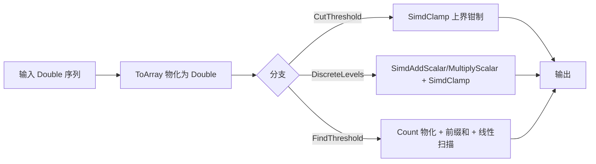

## 用户需求

针对 `Data_science\Mathematica\Math\Math\Distributions\TrIQ.vb` 与 `Data_science\Mathematica\Math\Math\Distributions\ECDF.vb` 中的分布计算代码做性能优化。先判断能否优先用核心库 `Microsoft.VisualBasic.Core\src\Math\SIMD` 的算子做 SIMD 加速，再据此落地优化，并新增基准/校验测试。

## 产品概述

对质谱成像对比度优化（TrIQ）与经验累积分布（ECDF）这两类数值计算做性能提速。其中 TrIQ 的逐元素映射/钳制适合直接走 SIMD 向量化；ECDF 的阈值查找瓶颈在算法层面（O(n²) 反复切片 + 重算前缀累计），SIMD 无法直接加速，改用一次前缀和 + 线性扫描降到 O(n)。要求保持公共 API 签名与数值结果完全一致。

## 核心功能

- TrIQ.CutThreshold：把 `If xi > cut Then cut Else xi` 等价改写为 SIMD 上界钳制。
- TrIQ.DiscreteLevels：把仿射映射 `(w-minf)/(T-minf)*n` 与 `w>=T` 取 `n-1` 的语义，改写为 SIMD 数乘数加 + 区间钳制，min/max 改用 SIMD 归约。
- ECDF.FindThreshold：消除 `sample.Take(k)` 反复分配与 CDF 重复累加，改为计数列物化 + 单次前缀和 + 线性扫描（O(n)），返回边界语义不变。
- 新增基准/校验测试：大数组（约 1e6 Double）下逐项比对改写前后结果一致，并测量三个函数的耗时。

## 技术栈

- 语言/平台：VB.NET（.NET，目标框架同 `Math.NET5.vbproj`）。
- 复用算子库：`Microsoft.VisualBasic.Core\src\Math\SIMD`（已通过 `Core.vbproj` 被 Math 工程引用，可直接 `Imports Microsoft.VisualBasic.Math.SIMD`）。
- 门面方法（来自 `SimdExtensions`，已验证签名）：
- `SimdClamp(v As Double(), min As Double, max As Double) As Double()`（底层 `SimdMath.Clamp`，语义为 `Min(Max(v,min),max)`，端点包含）
- `SimdAddScalar(v As Double(), scalar As Double) As Double()`、`SimdMultiplyScalar(v As Double(), scalar As Double) As Double()`（底层 `SimdEngine` 的 `Vector(Of T)` 自动分发 + 标量回退）
- `SimdMin(v As Double()) As Double`、`SimdMax(v As Double()) As Double`（底层 `SimdReduce`）

## 实现方案

### 总体判断（SIMD 适用性）

- **TrIQ.CutThreshold / DiscreteLevels：适合 SIMD**。二者都是对原始 `Double()` 的纯数据并行逐元素变换，核心库提供直接对应的 `SimdClamp` / 数乘数加 / 归约内核，且在 `disable` 配置或老硬件下自动标量回退，正确性无风险。
- **ECDF.FindThreshold：不适合作为 SIMD 优先项**。其热点操作的是 `DataBinBox(Of Double)()` 对象数组（带 `.Count` 属性），并非连续 `Double()` 向量；所需的“累计 CDF”本质是前缀和，库内没有对应内核；且原实现在循环里 `sample.Take(k)` 每次新建切片并从零累加，整体为 O(n²)。因此走算法改写（O(n)）收益最大，SIMD 无法触及主瓶颈。

### 关键技术与等价性论证

1. **CutThreshold**：原式 `If xi > cut Then cut Else xi` 等价于上界钳制（含 `xi=cut` 时结果为 `cut`）。直接改为 `Return v.SimdClamp(Double.MinValue, cut)`。原式返回惰性 `IEnumerable(Of Double)`，改写后返回 `Double()`（仍为 `IEnumerable`），调用方仅做枚举，行为兼容。
2. **DiscreteLevels**：`scaler=[minf,T]`、`levelRange=[0,n]`，`ScaleMapping(w,levelRange)` 公式为 `(w-Min)/Length*valueRange.Length + valueRange.Min`。等价变换链：`(f - minf) * (n/(T-minf))` 后 `SimdClamp(..., 0, n-1)` 再 `CInt`。证明：`w=T` 时映射值恰为 `n`→钳为 `n-1`，与原 `w>=T` 取 `n-1` 一致；`w` 恒 `>=minf`（取自 `f`）。`minf`/`f.Max` 改用 `SimdMin`/`SimdMax`。必须保留 `T=minf`（Length=0）时全返回 `0` 的边界语义。
3. **ECDF.FindThreshold**：将 `sample` 各 `bin.Count` 物化为 `Double()` `counts`，做一次包含式前缀和 `cum()`，`N = cum(last)`；循环 `k=1..len-1` 取 `cdf = cum(k-1)/N`，完整复刻原“`cdf>q` 退出 / `d<=eps` 返回 `sample(k).Boundary.Min` / 否则跟踪 `minK,minD` / 最终返回 `sample(minK-1).Boundary.Max`”的返回边界语义。原共享方法 `CDF` 保留以兼容既有调用，热路径不再调用。

### 实现要点与注意

- 保持三个公共 API 的签名（`IEnumerable(Of Double)` / `IEnumerable(Of Integer)` / `Double`）与数值结果一致；可先在内部用旧实现保留对照，确保测试逐项相等。
- `SimdAddScalar`/`SimdMultiplyScalar` 各自返回新数组（链式会产生两个临时数组），数据规模大时收益仍显著；若后续需零分配可改单趟循环，但首版优先复用现有门面、降低回归风险。
- 不改动 `ECDF` 构造函数与 `X` 属性、`TrIQ` 其余函数，控制改动辐射面。

## 架构设计

仅在既有 `Distributions` 模块内做就地优化，不引入新层。数据流：



## 目录结构

```
Data_science/Mathematica/Math/
├── Math/
│   └── Distributions/
│       ├── TrIQ.vb     # [MODIFY] 新增 Imports Microsoft.VisualBasic.Math.SIMD；
│       │               #   用 SimdClamp 改写 CutThreshold；用 SimdAddScalar/
│       │               #   SimdMultiplyScalar + SimdClamp + SimdMin/SimdMax
│       │               #   改写 DiscreteLevels。保持返回类型与数值一致。
│       └── ECDF.vb     # [MODIFY] FindThreshold 改为 Count 物化 + 单次前缀和
│                       #   + 线性扫描（O(n)）；保留 CDF 共享方法兼容。
└── test/
    └── DistributionsPerfTest.vb  # [NEW] 新增基准/校验：构造约 1e6 随机 Double，
                                  #   逐项比对改写前后输出一致，并测量
                                  #   CutThreshold/DiscreteLevels/FindThreshold 耗时。
```

## 关键代码结构

复用 `Microsoft.VisualBasic.Math.SIMD` 门面（已验证，无需新增）：

- `Function SimdClamp(v As Double(), min As Double, max As Double) As Double()`
- `Function SimdAddScalar(v As Double(), scalar As Double) As Double()`
- `Function SimdMultiplyScalar(v As Double(), scalar As Double) As Double()`
- `Function SimdMin(v As Double()) As Double` / `Function SimdMax(v As Double()) As Double`