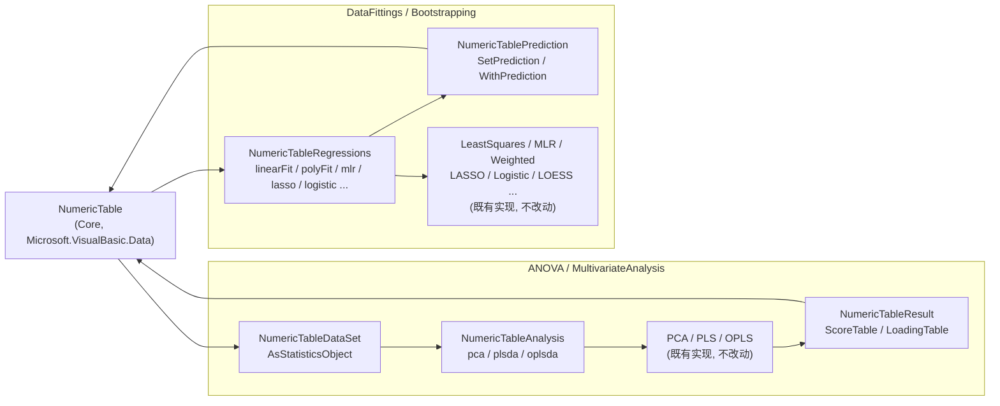

## 产品概述

框架底层（Core）已落地统一二维表对象 `NumericTable`，用于承载"预处理后的纯数值表"（特征矩阵 + 标签矩阵 + 行列名）。本次将其推广到多变量统计分析与回归建模：让 ANOVA 项目的 PCA / PLS-DA / OPLS-DA 与 DataFittings 项目的全部回归算法都能直接以该表为输入，并把分析结果（降维投影、载荷、预测值）再以表或标签列的形式返回，从而形成"统一表进、统一表出"的分析流水线。

## 核心功能

- 多变量分析（PCA / PLS-DA / OPLS-DA）改由统一二维表驱动：表的特征矩阵作为自变量 X，指定标签列作为响应/分组 y，直接产出分析结果对象。
- 结果可回表：从分析结果中提取降维投影（得分）为一张新表（行=样本、列=各主成分/潜变量），提取载荷为另一张新表（行=变量、列=各成分，并附带 VIP 与回归系数）。
- 回归算法统一入口：线性拟合、多项式拟合、多元线性回归、加权线性回归、非负最小二乘、逻辑回归、LASSO、LOESS / LOWESS 局部回归等全部改为接受统一二维表，返回各自原有模型对象。
- 输入约定统一：X 取表的全部特征列；y 由参数指定标签列名，缺省取第一个标签列，表中无标签列时报错；一元/多项式类算法要求特征恰好只有一列。
- 结果回写：提供预测值写回能力，把模型对各样本的预测值与残差以新增标签列的形式写回表，便于与原始观测值同表对比。
- 旧入口兼容：基于 DataFrame 与实体/点集合的旧入口保留可用但标注为过时，指向新的统一表入口。
- 提供可运行的自检程序，实测上述入口与结果抽取能正常工作。

## 技术栈

- 语言/运行时：VB.NET，目标框架 `net10.0`（与现有工程一致），不引入任何第三方依赖。
- 复用既有资产：`Microsoft.VisualBasic.Core` 的 `NumericTable`（`Microsoft.VisualBasic.Data`）与 `NumericTableExtensions`；ANOVA 的 `StatisticsObject` / `MultivariateAnalysisResult` / `PCA` / `PLS` / `OPLS`；DataFittings 的 `IFitted` / `FitResult` / `MLRFit` / `WeightedFit` / `LogisticFit` / `LassoFit`。
- 数值与转换工具复用 Core：`Microsoft.VisualBasic.Linq.ToMatrix`（锯齿数组 → `Double(,)`）、`.RowIterator`（`Double(,)` → 锯齿数组）、`Microsoft.VisualBasic.Math.LinearAlgebra.{Vector, NumericMatrix}`。
- 自检：沿用工程既有约定 `_smoketest` 控制台工程（参考 `Data_science/MachineLearning/DeepLearning/_smoketest/smoketest.vbproj`，`OutputType=Exe`、`net10.0`、`WarningLevel=0`）。

## 实现方案

- 总体策略：**只新增、不重写**。为两个项目各新增一层 "NumericTable 适配 + 统一入口" 的扩展方法模块，内部把表拆解为既有的低层数据结构并调用现有算法；旧签名与行为一律不动。
- ANOVA：新增 `NumericTable → StatisticsObject` 适配（特征矩阵直传 `XDataMatrix`，标签列作为 `YVariables`，`XLabels=featureNames`、`YLabels=YLabels2=行名`、`XIndexes/YIndexes` 补序号，随后按 `Scale`/`Transform` 初始化）；在此基础上新增 `pca`/`plsda`/`oplsda` 三个扩展入口，返回既有的 `MultivariateAnalysisResult`。
- ANOVA 结果抽取：新增 `ScoreTable`/`LoadingTable` 两个扩展，依据 `mvar.analysis` 分发 PCA/PLS/OPLS 的列构成（PCA 用 `TPreds`/`PPreds`；PLS 追加 `Y experiment`/`Y predicted` 与 `VIP`/`Coefficients`；OPLS 再追加 `ToPreds`/`PoPreds`），列名用 `PC*`/`T*`/`P*`/`To*`/`Po*` 前缀前缀命名，行名分别取样本行名与变量名。
- DataFittings：新增统一回归入口模块，统一解析 `(X, y)` 后转调现有算法——一元/多项式类要求 `nfeatures = 1`（否则抛 `ArgumentException` 并在 XML 注释中说明），多元类直接用全部特征；全部入口返回既有模型对象。
- 预测回写：新增 `SetPrediction`（复用 `IFitted.GetY(features(i))`，对 `FitResult` 与 `MLRFit` 均适用），把预测值写入 `prediction` 标签列，可选写入 `residual`；LASSO 补充 `LassoFit.toNumericTable()` 以便与其它结果统一。
- 过时标记：对 ANOVA 的 DataFrame/实体集合入口（`CommonDataSet` 的 `DataFrame` 与 `INamedValue`/`IVector`/`DynamicPropertyBase` 重载、`GetPCAScore`/`GetPCALoading`/`GetPLSScore`/`GetPLSLoading`）与 DataFittings 的 `PointF`/`toDataFrame` 入口统一加 `<Obsolete(reason, False)>`（**警告级**），避免破坏下游工程的既有构建。
- 性能与复杂度：算法输入默认**直接引用**表的特征矩阵（不做深拷贝），仅在必须 `Double(,)` 时做一次转换；`ScoreTable`/`LoadingTable` 为单次 O(n·k) 装配；PCA/PLS 的计算复杂度与现状完全一致。
- 关键技术决策理由：把契约/适配层放在各算法项目内（而非 Core），因为 `MultivariateAnalysisResult`、`FitResult` 等结果类型定义在上层，Core 无法反向引用；把入口做成 `<Extension>`，可获得 `x.pca()` / `x.linearFit(y:="label")` 的链式调用风格，与前序 Clustering 重构保持一致。

## 实现要点

- **PCA 副作用**：`PCA.PrincipalComponentAnalysis` 会就地 deflate `statObject.XScaled`（以及 `XTransformed` 的引用），因此每次 `x.pca()` 调用必须**新建** `StatisticsObject`，严禁跨调用缓存复用同一实例。
- **标签列规则**：`y` 为 `Nothing`/空时取 `labelNames(0)`；表中无任何标签列时抛异常（与回归侧统一）；标签列名不存在时沿用 `NumericTable.GetLabel` 抛出的 `KeyNotFoundException`。
- **一元算法规则**：`LinearFit`/`PolyFit`/`WeightedLinearFit`/`Lowess`/`Loess`/`AutoPointDeletion` 要求 `nfeatures = 1`，多列时显式抛错并在 XML 注释写明；多元算法（`MultipleLinearRegression`/`LogisticRegression`/`Lasso`/NNLS）使用全部特征列。
- **兼容与影响面**：`Obsolete` 一律用警告级（第二参数 `False`）；标记前须检索调用点（`tutorials/VBS`、`Data_science/Visualization/Plots-statistics/PCA` 等存在 `GetPCAScore`/`CommonDataSet` 引用），确认仅产生警告；`DoubleLinear.AutoPointDeletion` 内部对 `LinearRegression(PointF(), ...)` 的调用改为直接走 `Vector` 重载，避免自产过时警告且行为不变。
- **日志与进度**：沿用现有 `VBDebugger`/`println`/`tqdm_verbose` 机制，不新增日志通道；不输出原始大矩阵。
- **文档要求**：ANOVA 工程 `GenerateDocumentationFile=True`，所有新增公共成员必须补 XML 注释。
- **未细读项须先核实**：`LOESS/LOESS.vb`、`Linear/FeatureProjection.vb`、`GaussNewtonSolver.vb`、`BayesianCurveFitting.vb`、`stockpredict.vb`、`Evaluation.vb`，以及 ANOVA 的 `AnovaMain.vb`/`ANOVA/`/`KruskalWallis/` 是否存在 DataFrame/实体集合入口；`LMA.NonLinearFit` 目前为 `NotImplementedException` 桩实现，只提供 `AsFitInputs` 适配（`NumericTable → IEnumerable(Of FitInput)`）而不伪造求解器。

## 架构设计



## 目录结构

```
Data_science/Mathematica/Math/ANOVA/
├── _smoketest/
│   ├── smoketest.vbproj                       # [NEW] net10.0 控制台自检工程，引用 ANOVA.vbproj，WarningLevel=0
│   └── Program.vb                             # [NEW] 构造带标签列的 NumericTable，依次实测 pca/plsda/oplsda 与 ScoreTable/LoadingTable，断言行列维度与行名并输出 PASS/FAIL
├── MultivariateAnalysis/
│   ├── NumericTableDataSet.vb                 # [NEW] 命名空间 Microsoft.VisualBasic.Math.Statistics.Hypothesis.ANOVA。
│   │                                          #       实现 <Extension> table.AsStatisticsObject(Optional y As String = Nothing, Optional scale As ScaleMethod = ScaleMethod.AutoScale, Optional transform As TransformMethod = TransformMethod.None) As StatisticsObject：
│   │                                          #       X = features 转 Double(,)（复用 ToMatrix，避免深拷贝时直接按行索引填充）；y = 指定标签列（缺省第一个标签列，无标签列抛异常）；
│   │                                          #       补齐 XLabels/YLabels/YLabels2/XIndexes/YIndexes；decoder 保持 Nothing（表内为纯数值）。
│   ├── NumericTableAnalysis.vb                # [NEW] 三个统一入口扩展（每次调用内部新建 StatisticsObject，规避 PCA 就地 deflate 副作用）：
│   │                                          #       pca(maxPC:=5, cutoff:=1E-07, y:=Nothing, scale, transform) As MultivariateAnalysisResult
│   │                                          #       plsda(component:=-1, y:=Nothing, scale, transform) As MultivariateAnalysisResult
│   │                                          #       oplsda(component:=-1, y:=Nothing, scale, transform) As MultivariateAnalysisResult
│   │                                          #       内部转调 PCA.PrincipalComponentAnalysis / PLS.PartialLeastSquares / OPLS.OrthogonalProjectionsToLatentStructures，不复制算法逻辑。
│   ├── NumericTableResult.vb                  # [NEW] 结果抽取扩展（按 mvar.analysis 分发 PCA/PLS/OPLS）：
│   │                                          #       ScoreTable(mvar) As NumericTable：行=样本（YLabels 缺省用 YLabels2/序号），特征=TPreds（PC1..PCn / T1..Tn），OPLS 追加 To1..Tom，再追加 Y experiment / Y predicted（若存在）。
│   │                                          #       LoadingTable(mvar) As NumericTable：行=变量（XLabels 缺省用序号），特征=PPreds（PC1..PCn / P1..Pn），OPLS 追加 Po1..Pom，再追加 VIP / Coefficients。
│   │                                          #       复用 Core 的 ToEmbeddingTable 风格构造新表（行名+列名+特征矩阵），保证可直接链式送入聚类等后续入口。
│   ├── DataSet.vb                             # [MODIFY] 给 DataFrame 重载与 {INamedValue, IVector} / DynamicPropertyBase 实体集合重载的 CommonDataSet 加 <Obsolete("use NumericTable.AsStatisticsObject instead", False)>；实现体保持不变。
│   ├── PCAData.vb                             # [MODIFY] GetPCAScore / GetPCALoading（返回 DataFrame）加警告级 Obsolete，指向 ScoreTable/LoadingTable；实现体保持不变（保留原转置布局语义）。
│   └── PLSData.vb                             # [MODIFY] GetPLSScore / GetPLSLoading（返回 DataFrame）加警告级 Obsolete，指向 ScoreTable/LoadingTable；GetComponents 不受影响。
└── ANOVA/ 、KruskalWallis/ 、AnovaMain.vb      # [MODIFY-可选] 若检索到 DataFrame/实体集合式旧入口，同样补警告级 Obsolete（先核实再改，无匹配则不动）

Data_science/Mathematica/Math/DataFittings/
├── _smoketest/
│   ├── smoketest.vbproj                       # [NEW] net10.0 控制台自检工程，引用 linear-netcore5.vbproj，WarningLevel=0
│   └── Program.vb                             # [NEW] 构造单特征表与多特征表，实测各类回归入口 + SetPrediction 写回，断言 R2、预测列长度与数值合理性，输出 PASS/FAIL
├── NumericTableRegressions.vb                 # [NEW] 命名空间 Microsoft.VisualBasic.Data.Bootstrapping（需 Imports Microsoft.VisualBasic.Data）。
│   │                                          #       私有助手：解析 (X As Double()(), y As Double())——y 缺省第一个标签列、无标签列抛异常；一元算法校验 nfeatures = 1。
│   │                                          #       统一入口（均带 Optional y As String = Nothing 与 Optional Silent As Boolean = False）：
│   │                                          #       LinearFit → LeastSquares.LinearFit（1 特征）As FitResult
│   │                                          #       PolyFit(poly_n) → LeastSquares.PolyFit（1 特征）As FitResult
│   │                                          #       LinearRegression(weighted As Weights) → Extensions.LinearRegression(X, Y, weighted) As IFitted（1 特征）
│   │                                          #       WeightedLinearFit(orderOfPolynomial:=2, weights:=Nothing) → WeightedLinearRegression.Regress(X, Y, W, order) As WeightedFit（1 特征，W 缺省用 1/x^2）
│   │                                          #       MultipleLinearRegression → Multivariate.LinearFittingAlgorithm.LinearFitting(xm, y) As MLRFit（X 用 ToMatrix 转 Double(,)）
│   │                                          #       LogisticRegression(rate:=0.0001, iterations:=3000) → New Logistic.Logistic(nfeatures, rate)（设 ITERATIONS）后 Train(New Instance(yv(i), features(i))) As LogisticFit
│   │                                          #       Lasso(maxAllowedFeaturesPerModel:=-1) → LassoFitGenerator.init(featureNames, nsamples) + setFeatureValues/setTarget + fit(...) As LassoFit
│   │                                          #       Lowess(f:=2/3, nsteps:=3) → LowessFittings.Lowess(x, y, n, f, nsteps) （1 特征）
│   │                                          #       Loess(span, degree) → LOESS 入口包装（1 特征，先核实 LOESS.vb 精确签名）As LOESSModel
│   │                                          #       Nnls(maxIterations, tolerance) → NonNegativeLeastSquares.Solve(A, b) As Double()（A 用 ToMatrix）
│   │                                          #       AutoPointDeletion(max:=-1, keepsLowestPoint:=False, ByRef removed As Integer()) → DoubleLinear.AutoPointDeletion（1 特征，返回 IFitted 并回传被剔除的行下标）
│   │                                          #       AsFitInputs → NumericTable → IEnumerable(Of LMA.FitInput)，供 matrix.NonLinearFit() 使用
│   │                                          #       FeatureProjection / GaussNewtonSolver / BayesianCurveFitting 的入口：先核实其输入形态后补适配（若为可用实现则提供表入口，若为桩实现则提供输入适配并注释说明）
├── NumericTablePrediction.vb                  # [NEW] 结果回写扩展：
│   │                                          #       SetPrediction(table, fitted As IFitted, Optional name As String = "prediction", Optional withResidual As Boolean = False) As NumericTable
│   │                                          #         逐行 fitted.GetY(features(i)) 写入标签列；withResidual 时另写 "residual" = 预测值 - 该 y 标签列实际值。
│   │                                          #       PredictTable(fitted, source, Optional prefix As String = "prediction") As NumericTable（在源表副本上写回，不修改源表）。
│   │                                          #       维度校验：写入列长度必须等于 nsamples，复用 SetLabel 的既有校验。
├── Linear/
│   ├── Extensions.vb                          # [MODIFY] LinearRegression(line As PointF(), weighted) 加警告级 Obsolete，指向表入口。
│   └── DoubleLinear.vb                        # [MODIFY] AutoPointDeletion(PointF...) 加警告级 Obsolete；内部对 LinearRegression 的调用改为直接走 Vector 重载，避免自产警告、行为不变。
└── LASSO/
    └── LassoFit.vb                            # [MODIFY] 新增 toNumericTable(featureNames) As NumericTable（复刻 toDataFrame 的列语义）；toDataFrame() 加警告级 Obsolete 指向 toNumericTable()。
```

## 关键代码结构

```
' ---------- ANOVA：入表 + 结果回表（命名空间 Microsoft.VisualBasic.Math.Statistics.Hypothesis.ANOVA） ----------
<Extension>
Public Function AsStatisticsObject(table As NumericTable,
                                   Optional y As String = Nothing,
                                   Optional scale As ScaleMethod = ScaleMethod.AutoScale,
                                   Optional transform As TransformMethod = TransformMethod.None) As StatisticsObject

<Extension>
Public Function ScoreTable(mvar As MultivariateAnalysisResult) As NumericTable
<Extension>
Public Function LoadingTable(mvar As MultivariateAnalysisResult) As NumericTable

' ---------- DataFittings：统一回归入口 + 预测回写（命名空间 Microsoft.VisualBasic.Data.Bootstrapping） ----------
<Extension>
Public Function MultipleLinearRegression(table As NumericTable, Optional y As String = Nothing) As MLRFit
<Extension>
Public Function SetPrediction(table As NumericTable, fitted As IFitted,
                             Optional name As String = "prediction",
                             Optional withResidual As Boolean = False) As NumericTable
```

## Agent Extensions

### Skill

- **lsp-code-analysis**
- Purpose: 在标记 `Obsolete` 与改动内部调用前，用语义级引用查询精确定位 `CommonDataSet`（DataFrame/实体集合重载）、`GetPCAScore`、`GetPCALoading`、`GetPLSScore`、`GetPLSLoading`、`LassoFit.toDataFrame`、`Extensions.LinearRegression(PointF())`、`DoubleLinear.AutoPointDeletion` 的全部调用点与实现点。
- Expected outcome: 输出调用点清单与影响面结论，确保过时标记仅以警告级落地、不破坏 `tutorials`、`Data_science/Visualization` 等下游工程的构建，并确认 `AutoPointDeletion` 内部改调 `Vector` 重载后行为一致。

### SubAgent

- **code-explorer**
- Purpose: 定位并核实尚未细读的回归入口与其输入形态（`LOESS/LOESS.vb`、`Linear/FeatureProjection.vb`、`GaussNewtonSolver.vb`、`BayesianCurveFitting.vb`、`LassoFitGenerator.fit` 参数语义），以及 ANOVA 的 `AnovaMain.vb`/`ANOVA/`/`KruskalWallis/` 是否含 DataFrame 或实体集合式旧入口。
- Expected outcome: 给出每个算法的精确签名、输入/输出类型与适配方式清单（含"可用实现 vs 桩实现"的判定），确保"所有回归算法"无遗漏、且不伪造不存在的求解器。