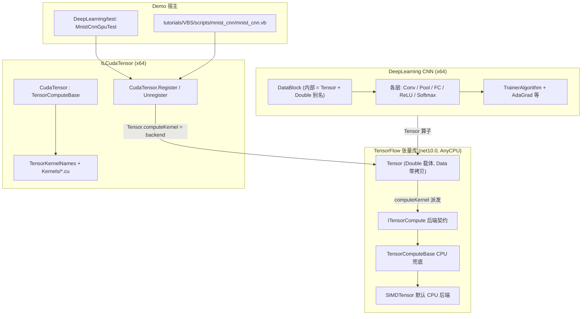

## 需求概述

围绕 `Data_science\MachineLearning\DeepLearning\` 的卷积神经网络（CNN），把其数值计算从自研的 `DataBlock`（扁平 `Double()` + 手写多重循环）迁移到 TensorFlow 张量库的 `Tensor` 对象，并接入 `cuda\ILCudaTensor` 的 CUDA 后端，实现**端到端 GPU 加速**；最终产出两处可运行 demo：`DeepLearning\test` 工程中的 MNIST CNN GPU 测试，以及 `tutorials\VBS\scripts\mnist_cnn\mnist_cnn.vb` 的 VBS 脚本版本。

## 一、CNN 代码审查与可行性结论（需求第 1 项，已调研）

**审查结论**：CNN 目录 39 个 .vb 文件的数值核心全部建立在 `CNN\data\DataBlock.vb` 之上——内部是扁平 `Double() w/dw` + `(SX,SY,Depth)` 三级索引（`ix = (SX*y+x)*Depth+depth`），计算实现为显式多重 `For` 循环，仅用 `Microsoft.VisualBasic.Math.SIMD` 做局部向量化、`VectorTask` 按 depth 并行。**CNN 与 `TensorFlow.Tensor` 零耦合**：`CNN\` 目录内没有任何一处引用 Tensor 类型。

**可行性判定**：

| 维度 | 结论 |
| --- | --- |
| 数据载体迁移 | 可行。`Tensor.Data` 零拷贝返回 `Double()`，可让 `DataBlock` 内部持 Tensor 而对外保留原签名 |
| 全连接层 / 激活层 / Softmax / 参数更新 | **高可行**，现有算子即可表达，能真正落到 GPU |
| 卷积层 | 需新增算子。可用 im2col + `MatMul` 走现有 GEMM 内核，或在后端补 conv2d 内核 |
| 池化层 | **必须新增算子**，现有后端无 pooling/argmax-window，且现有实现依赖 `Dictionary(Of String, SwitchMap)` 字符串键，无法映射到 GPU |
| 端到端全 GPU | **当前不可行，必须先行补齐后端能力** |


三条硬约束：`ITensorCompute` 无 conv/pool 算子；`CudaTensor` 为拷贝式执行模型（每次算子调用都 H→D 上传 + 内核 + D→H 读回）；存在 GPU 阈值 `MinGpuElements=4096`、`MinGemmElements=65536`，MNIST 单样本（784 元素）会全部回退 CPU，**必须 batch 化**。

## 二、已确认的范围（用户选择）

1. **加速范围 = 端到端全 GPU**：在"可表达层走 GPU + 卷积走 GEMM"基础上，还要到 `ILCudaTensor` 侧新增 conv2d / pooling 的 CUDA 内核并扩展 `ITensorCompute` / `CudaTensor`。
2. **数据契约 = 用 Tensor 替换 DataBlock**：层间数据载体改为 Tensor。

## 三、核心功能

1. **张量后端补齐卷积/池化算子**：`ITensorCompute` 增加 `Conv2D`、`Conv2DBackwardInput`、`Conv2DBackwardFilter`、`MaxPool2D`（含 argmax 输出）、`MaxPool2DBackward`；`TensorComputeBase` 提供 CPU 正确性实现；`CudaTensor` 用新增 `.cu` 内核 override。
2. **CNN 数据载体 Tensor 化**：`DataBlock` 内部唯一数据变为 Tensor（`Value` / `Grad`），对外公开签名保持不变，模型序列化继续可用。
3. **CNN 各层计算 Tensor 化**：卷积、池化、全连接、激活、Softmax/损失、训练器参数更新全部改走 `Tensor` / `Math` / `nn` 公开 API，从而由 `Tensor.computeKernel` 统一派发到 CPU(SIMD) 或 CUDA 后端。
4. **GPU 计算引擎注册与 MNIST CNN demo**：`DeepLearning\test` 引用 `ILCudaTensor` + `ILCuda`，调用 `CudaTensor.Register()` 切换后端，batch 化跑 MNIST CNN 训练/推理，输出 CPU 与 GPU 的数值一致性与耗时对比；无 GPU 时优雅回退并打印诊断。
5. **VBS 脚本 demo**：将同一份逻辑移植到 `tutorials\VBS\scripts\mnist_cnn\mnist_cnn.vb`，通过 `#include` 引用 `.nuget\net10.0` 下已存在的 `Microsoft.VisualBasic.DeepLearning.dll`、`...ILCuda.dll`、`...ILCuda.GPUTensor.dll`，注册 GPU 引擎后运行。

## 四、视觉/输出效果（控制台）

分节输出：环境探测（默认后端 / SIMD 能力 / GPU 设备与 NVRTC 版本）→ 内核注册结果（含 IL2Cuda 内核翻译成功数、失败清单）→ 训练过程（按 batch 输出 loss，逐步打印）→ 预测统计（每类正确数/总数/百分比 + 总正确率，沿用现有 `printPredictions` 排版）→ CPU vs GPU 数值最大绝对误差表（每项标注 OK/FAIL）→ 耗时与加速比汇总 → 无 GPU 时的结构化修复建议列表。

## 技术栈

- VB.NET / net10.0，SDK 风格工程；`LangVersion latest`
- 张量库：`Data_science\MachineLearning\TensorFlow\TensorFlow.vbproj`（RootNamespace `Microsoft.VisualBasic.MachineLearning.TensorFlow`，无 GPU 依赖，通过运行期注入后端）
- CUDA 后端：`cuda\ILCudaTensor\ILCudaTensor.vbproj`（AssemblyName `Microsoft.VisualBasic.Computing.ILCuda.GPUTensor`，x64，OutputPath `../../.nuget`）依赖 `cuda\ILCuda\ILCuda.vbproj`（x64，NVRTC + Driver API 纯 Interop）
- CNN：`Data_science\MachineLearning\DeepLearning\DeepLearning.NET6.vbproj`（AssemblyName `Microsoft.VisualBasic.DeepLearning`，PlatformTarget x64，OutputPath `../../../.nuget/`）
- 测试宿主 A：`Data_science\MachineLearning\DeepLearning\test\test.vbproj`
- 测试宿主 B：VBS 脚本引擎 `vs_solutions\VBS\VBS.vbproj`（`.nuget\net10.0\vbs.exe`）
- 内核编译：NVRTC 运行期 JIT（`KernelSources.CombinedSource()` 合并全部内嵌 `.cu` 为单一编译单元）

## 实现方案

整体策略：**自底向上补齐后端能力，再自顶向下迁移 CNN，最后接入两个 demo 宿主**。核心设计是让 `DataBlock` 成为"内部即 Tensor"的薄壳，从而在满足"用 Tensor 替换 DataBlock"的前提下把 24 个引用文件的改动收敛到"只改计算实现"。

### 决策一：DataBlock 内部 Tensor 化，外部签名冻结

`Tensor._Data` 本身就是 `Double()` 且 `Tensor.Data` 零拷贝返回，因此可以做到：

```text
DataBlock
├── Friend Value As Tensor        ' 唯一数据载体（值）
├── Friend Grad  As Tensor        ' 唯一数据载体（梯度）
├── Friend w  As Double()         ' = Value.Data 的别名（保留，供 5 处直接访问 w/dw 的文件）
├── Friend dw As Double()         ' = Grad.Data  的别名
└── SX / SY / Depth / trace       ' 形状与标记
```

理由与收益：

| 项 | 说明 |
| --- | --- |
| 满足需求 | 层间数据载体在实质上已是 `Tensor`，可被 `computeKernel` 派发到 GPU |
| 收敛改动 | `Weights` / `Gradients` 属性、全部 `getWeight/setWeight/addGradient/...`、4 个构造函数签名全部不变，24 个引用文件可编译期零改动通过 |
| 兼容 `Friend w/dw` | `Conv2DTransposeLayer`、`GaussianLayer`、`SigmoidLayer` 共 3 个文件直接读写 `Friend w/dw`，保留别名数组后语义不变 |
| 序列化 | `w`/`dw` 继续作为持久字段（走"基元数组"分支，磁盘字节格式不变），两个 Tensor 字段标 `<IgnoreDataMember>`；旧 `.CNN` 模型继续可读 |
| 风险点 | `mulGradient` 等"整体替换 dw 数组引用"的成员会使别名失效，必须改为同步刷新别名 |


相比"直接把 39 个文件的字段类型换成 Tensor"，该方案把爆炸半径从 24 个文件 x 84 处收敛到 1 个文件 + 每层的计算实现，是端到端全 GPU 目标下唯一可控的落地路径。若后续要求彻底 `"CNN2"` 魔数版本化序列化，只需替换 `SaveModelCNN` / `ReadModelCNN` 两处，不影响其它层。

### 决策二：卷积走 im2col + GEMM，并同时补 GPU conv 内核

两条通道并存，互为兜底：

1. `Tensor` 侧的 `Conv2D` 算子在后端实现：GPU 用新增的 `tensorConv2DForwardKernel`，CPU 用 `TensorComputeBase` 的 im2col + 三重循环。
2. `CudaTensor.Conv2D` 若内核不可用则 `Return MyBase.Conv2D(...)`，与现有算子一致地优雅回退。

反向传播按`gradInput` 与 `gradFilter` 拆成两个算子，避免 GPU 端 scatter-add 需要原子操作：`gradFilter` 用 im2col 后 GEMM（`colIm^T · gradOutput`），`gradInput` 用 `gradOutput · filter^T` 后 col2im。

### 决策三：池化在 GPU 上单次前向同时产出 values 与 argmax

现有 CPU 实现用 `Dictionary(Of String, SwitchMap)`（字符串键 `"ax,ay"`），GPU 上不可行。改为：

```
Function MaxPool2D(x As Tensor, size As Integer, stride As Integer, padding As Integer,
                   ByRef argMax As Tensor) As Tensor
```

`MaxPool2DForwardKernel` 每个输出元素一个线程，把获胜者的**扁平输入下标**写入 `argMax`；`MaxPool2DBackwardKernel` 按 `argMax` 做 scatter-add（每个输出位置唯一对应一个输入位置，无需原子操作）。

### 决策四：Batch 化驱动 GPU 阈值

`CudaTensor` 现有阈值（`MinGpuElements=4096` / `MinGemmElements=65536`）会让 MNIST 单样本全部回退 CPU。demo 必须使用 batch（建议 32 或 64）：

| 层 | 单样本 | batch=32 |
| --- | --- | --- |
| conv1 输出 | 24x24x32 = 18432 | 589824（远超 4096） |
| fc1 GEMM m*k*n | 1x1024x10 = 10240（< 65536，回退） | 32x1024x10 = 327680（走 GPU） |


保留阈值不变（不修改后端默认行为），改为在 demo 中显式 batch 化并在文档中说明。

### 决策五：Tensor 增加无参构造与零拷贝包装

为支撑序列化与避免无谓拷贝：

- 新增 `Public Sub New()`（真正的无参构造，供 `ObjectInputStream` 的 `Activator.CreateInstance` 使用）。
- 新增 `Public Shared Function Wrap(data As Double(), ParamArray shape As Integer()) As Tensor`：不拷贝、直接持有 `data`（与现有 `New(data, shape)` 的 `Clone` 语义区分），供 `DataBlock` 构建别名视图使用。

### 决策六：平台与引用

`ILCuda` 强制 x64，而 `DeepLearning\test\test.vbproj` 目前是 AnyCPU。必须显式加：

```xml
<Platforms>AnyCPU;x64</Platforms>
<PlatformTarget>x64</PlatformTarget>
<ProjectReference Include="..\..\..\..\cuda\ILCuda\ILCuda.vbproj" />
<ProjectReference Include="..\..\..\..\cuda\ILCudaTensor\ILCudaTensor.vbproj" />
```

否则会触发 MSB3270 架构不匹配，且运行时加载 x64 程序集失败。

## 架构设计



数据流（CNN 单次迭代）：

```text
DataBlock(输入, Data=Tensor)
  -> ConvolutionLayer.forward  -> computeKernel.Conv2D      -> Tensor(新 DataBlock)
  -> ReluLayer.forward         -> computeKernel.Relu        -> Tensor
  -> PoolingLayer.forward      -> computeKernel.MaxPool2D   -> Tensor + argMax
  -> ... -> FullyConnectedLayer -> computeKernel.MatMul     -> Tensor
  -> SoftMaxLayer              -> computeKernel.Softmax     -> loss 梯度
  -> 各层 backward             -> Conv2DBackward*/MaxPool2DBackward/MatMul
  -> Trainer.adjustWeights     -> computeKernel.(Add/Multiply/DivideScalar) -> 权重更新
```

## 目录结构

```text
Data_science/MachineLearning/TensorFlow/            # [MODIFY] 张量库：补算子与构造
├── Tensor.vb                  # [MODIFY] 新增无参构造 New()；新增 Wrap(data, shape) 零拷贝包装
└── Compute/
    ├── ITensorCompute.vb      # [MODIFY] 新增 #Region "卷积与池化"：Conv2D / Conv2DBackwardInput /
    │                          #          Conv2DBackwardFilter / MaxPool2D(ByRef argMax) / MaxPool2DBackward
    ├── TensorComputeBase.vb   # [MODIFY] 上述算子的 CPU 正确性实现（im2col / col2im / 窗内 argmax）
    └── SIMDTensor.vb          # [MODIFY] 可选：为 MatMul 路径复用已有 SIMD；其余继承基类

cuda/ILCudaTensor/                                  # [MODIFY] CUDA 后端
├── ILCudaTensor.vbproj        # [MODIFY] EmbeddedResource 增加 Kernels\conv.cu、Kernels\pool.cu
├── GPUTensor/
│   ├── CudaTensor.vb          # [MODIFY] Override Conv2D / Conv2DBackward* / MaxPool2D / MaxPool2DBackward
│   ├── TensorKernels.vb       # [MODIFY] 新增内核名常量（tensorConv2D…/tensorMaxPool2D…）
│   └── DeviceCache.vb         # [不改] 复用现有显存 LRU 缓存
├── Kernels/
│   ├── conv.cu                # [NEW] tensorConv2DForwardKernel / tensorConv2DBackwardInputKernel /
│   │                          #       tensorConv2DBackwardFilterKernel（im2col + GEMM，double）
│   └── pool.cu                # [NEW] tensorMaxPool2DForwardKernel(含 argmax 输出) /
│                              #       tensorMaxPool2DBackwardKernel（按 argmax scatter-add）
└── test/
    ├── test.vbproj            # [不改]
    └── Program.vb             # [MODIFY] 新增 conv2d / pooling 的 CPU-vs-GPU 一致性断言

Data_science/MachineLearning/DeepLearning/           # [MODIFY] CNN 迁移
├── CNN/
│   ├── data/DataBlock.vb      # [MODIFY] 内部改为 Value/Grad (Tensor) + w/dw (Double 别名)，
│   │                          #          全部公开签名不变；mulGradient 等改为同步刷新别名
│   ├── Layers/
│   │   ├── ConvolutionLayer.vb        # [MODIFY] forward/backward 改走 Conv2D / Conv2DBackward*
│   │   ├── PoolingLayer.vb            # [MODIFY] forward/backward 改走 MaxPool2D(含 argmax) / MaxPool2DBackward
│   │   ├── FullyConnectedLayer.vb     # [MODIFY] forward/backward 改走 MatMul / Transpose
│   │   ├── RectifiedLinearUnitsLayer.vb / LeakyReluLayer.vb / SigmoidLayer.vb /
│   │   │   TanhLayer.vb / DropoutLayer.vb / GaussianLayer.vb /
│   │   │   FourierFeatureLayer.vb / LocalResponseNormalizationLayer.vb / MaxoutLayer.vb
│   │   │                      # [MODIFY] 逐元素计算改走 computeKernel 一元/标量算子
│   │   └── losslayers/SoftMaxLayer.vb / RegressionLayer.vb / SVMLayer.vb
│   │                          # [MODIFY] 改走 Softmax / LogSoftmax / 逐元素算子
│   └── trainers/
│       ├── TrainerAlgorithm.vb        # [MODIFY] adjustWeights 的 l1/l2 衰减与 g/batch_size 改走 Tensor 逐元素
│       └── SGD/AdaGrad/AdaDelta/Adam/Nesterov/WindowGrad Trainer.vb
│                              # [MODIFY] update() 的就地更新改走 Tensor 算子
└── test/
    ├── test.vbproj            # [MODIFY] 加 Platforms/PlatformTarget=x64；引用 ILCuda + ILCudaTensor
    ├── MnistCnnGpuTest.vb     # [NEW] GPU 加速 demo：注册 CudaTensor、batch 化训练、CPU/GPU 误差与耗时对比
    └── MnistTest.vb           # [MODIFY] Main(args) 增加 --gpu 分派（保持原 CPU 路径不变）

tutorials/VBS/scripts/mnist_cnn/
└── mnist_cnn.vb               # [MODIFY] 重写为 CUDA 加速 CNN demo（#include GPUTensor/ILCuda/DeepLearning/TensorFlow）
```

## 关键代码结构

后端契约新增（`Compute\ITensorCompute.vb`）：

```
#Region "卷积与池化"

' x: (N, C, H, W) 行主序；filters: (OutC, C, KH, KW)；返回 (N, OutC, H', W')
Function Conv2D(x As Tensor, filters As Tensor, bias As Tensor,
                stride As Integer, padding As Integer) As Tensor

' 反向：对输入的梯度，返回 (N, C, H, W)
Function Conv2DBackwardInput(gradOutput As Tensor, filters As Tensor,
                             inputShape As Integer(), stride As Integer, padding As Integer) As Tensor

' 反向：对卷积核的梯度，返回 (OutC, C, KH, KW)
Function Conv2DBackwardFilter(gradOutput As Tensor, x As Tensor,
                              filterShape As Integer(), stride As Integer, padding As Integer) As Tensor

' 最大池化前向：argMax 输出每个输出位置对应的输入扁平下标（供反向 scatter-add）
Function MaxPool2D(x As Tensor, size As Integer, stride As Integer, padding As Integer,
                   ByRef argMax As Tensor) As Tensor

' 最大池化反向
Function MaxPool2DBackward(gradOutput As Tensor, argMax As Tensor,
                           inputShape As Integer()) As Tensor
#End Region
```

`DataBlock` 内部结构（`CNN\data\DataBlock.vb`）：

```
Public Class DataBlock
    ' 唯一数据载体
    Friend Value As Tensor          ' 值
    Friend Grad As Tensor           ' 梯度

    ' 兼容别名：指向 Tensor.Data，保持 3 处直接访问 w/dw 的调用点语义不变
    Friend w As Double()
    Friend dw As Double()

    Public ReadOnly Property SX As Integer
    Public ReadOnly Property SY As Integer
    Public ReadOnly Property Depth As Integer
    Public ReadOnly Property Weights As Double()     ' = Value.Data
    Public ReadOnly Property Gradients As Double()   ' = Grad.Data
    ' 其余 getWeight/setWeight/addGradient/clone/addImageData 等签名全部保持
End Class
```

## 执行细节

- **先做基线**：改造前先跑通现有 `MnistTest`（CPU/SIMD 路径），记录 loss、分类正确率与耗时，作为后续每一步的数值回归基准；CNN 的随机初始化用 `Vector.rand` 私有 RNG，重构后如需逐位复现需保留同一 RNG 而非换用 `Tensor.Random`。
- **数值等价优先**：所有迁移遵循"先让 CPU(SIMD) 后端结果与原实现一致，再切 GPU 验证"的顺序，避免把"迁移错误"与"GPU 错误"混在一起排查。
- **`<IgnoreDataMember>`**：`DataBlock` 的 `Value` / `Grad` 两个 Tensor 字段必须标记，`w`/`dw` 继续参与反射序列化，保证旧 `.CNN` 模型可读（否则 `ObjectInputStream` 会因字段名/类型不匹配直接抛异常）。
- **别名刷新**：`mulGradient`、以及任何会"整体替换 `dw` 引用"的算子，必须在替换后重新绑定 `Grad` 与 `dw` 别名，否则出现"写入丢失"的隐蔽 bug。
- **内核命名与包装**：新增 `.cu` 的 `extern "C"` 符号统一加 `tensor` 前缀避免与 `tensor.cu`/`gemm.cu` 及 `ILCuda` 框架内核撞名（所有 `.cu` 会合并进同一个 NVRTC 编译单元）；共享内存一律用**静态** `__shared__`（NVRTC 不支持一个编译单元里多个 `extern __shared__`）；不使用 `INFINITY` 宏。
- **新增 `.cu` 必须登记**：`ILCudaTensor.vbproj` 的 EmbeddedResource 是逐个显式列出的，漏登记则 `KernelSources.Register` 读不到、内核名解析失败。
- **回退策略**：`CudaTensor` 内所有新算子保持既有模式——先维度/形状校验，再阈值或内核可用性判断，失败即 `Return MyBase.Xxx(...)`，绝不让 demo 崩。
- **GPU 阈值与 batch**：demo 必须 batch 化（建议 32）才能越过 `MinGpuElements=4096` / `MinGemmElements=65536`；在测试中需打印实际生效阈值与"该算子走了 GPU 还是 CPU 回退"，避免"假通过"。
- **性能预期**：拷贝式执行模型下，小 batch 的端到端加速比可能有限；demo 的验收标准定为"数值一致 + 后端真实生效（可观测）+ 给出耗时对比"，而非承诺固定加速倍数。
- **VBS 侧约束**（沿用已知引擎规则）：`#include` 的 DLL 需位于脚本目录 / `App.HOME`（`.nuget\net10.0`）/ `libs`；生成的编译单元只自动导入 `Microsoft.VisualBasic.CommandLine`、`Microsoft.VisualBasic`、`System.*` 等固定几项，`Microsoft.VisualBasic.Computing.ILCuda.*`、`Microsoft.VisualBasic.MachineLearning.*` 必须自行 `imports`；顶层变量不得命名为 `args`；顶层函数参数列表不能出现数组类型（需数组参数时放进 `Public Class` 的 `Shared` 方法）。
- **VBS 无 GPU 回退**：脚本中用 `CudaTensor.Register(opts)` 的返回值分支，失败时打印 `CudaTensor.LastError` 与 `opts.Diagnostics` 并走 CPU 路径，保证脚本始终能跑出结果。

## 验证方式

| 阶段 | 验证 |
| --- | --- |
| 基线 | `dotnet run` 跑通 `MnistTest`，记录 loss / 正确率 / 耗时 |
| 后端算子 | 编译 `ILCudaTensor`；扩展 `cuda\ILCudaTensor\test\Program.vb` 增加 conv2d/pooling 的 CPU-vs-GPU 断言（池化 `=0`，卷积 `<1e-12`），运行退出码 0 |
| DataBlock 迁移 | 编译 `DeepLearning.NET6.vbproj`，24 个引用文件零改动通过；跑 `MnistTest`，CPU 路径 loss/正确率与基线一致 |
| 各层 Tensor 化 | 每完成一组层即跑一次 `MnistTest`，与基线数值一致 |
| GPU demo | 编译并运行 `test\test.vbproj`（x64），确认 `Tensor.computeKernel.Name = "CUDA"`、GPU 设备/镜像信息、CPU-vs-GPU 误差在容差内、打印耗时对比；拔掉 GPU 场景下确认优雅回退 |
| VBS demo | `dotnet build vs_solutions\VBS\VBS.vbproj -c Release`；`vbs.exe tutorials\VBS\scripts\mnist_cnn\mnist_cnn.vb --mnist-data <路径>` 跑通并输出 GPU 注册信息与训练/预测结果 |


## 风险与兜底

| 风险 | 兜底 |
| --- | --- |
| 卷积反向 GPU 端 scatter-add 需要原子操作 | 拆成 `BackwardFilter`（im2col+GEMM，无冲突）与 `BackwardInput`（col2im，按输出位置唯一写入），规避原子操作 |
| 池化 argmax 的字符串字典键无法上 GPU | 改为整数扁平下标张量 `argMax`，前向内核一次产出 values+argmax |
| `DataBlock` 别名数组失效导致梯度写入丢失 | 引入统一的 `ReplaceGradient(newArr)` 内部方法，所有"整数组替换"路径必须经由它刷新 `Grad`/`dw` |
| 序列化不兼容导致旧模型不可读 | `Value`/`Grad` 标 `<IgnoreDataMember>`，`w`/`dw` 继续作为持久字段，磁盘格式字节级不变 |
| AnyCPU 工程引用 x64 的 ILCuda 触发 MSB3270 | test 工程显式设 `Platforms=AnyCPU;x64` + `PlatformTarget=x64` |
| 小张量回退 CPU 造成"假 GPU 加速" | demo batch 化并打印每个算子的实际执行后端；必要时在测试内临时调低阈值做对照 |
| 逐位数值不可复现（随机初始化 RNG 不同） | 保留原 `Vector.rand` 初始化路径，不换成 `Tensor.Random`；比较用容差而非逐位相等 |
| 改动面大导致中途不可编译 | 严格按阶段推进，每阶段结束必须"可编译 + 回归基线一致"才进入下一阶段 |


## Agent Extensions

### SubAgent

- **code-explorer**
- Purpose: 在本次跨 6 个工程（TensorFlow / ILCudaTensor / ILCuda / DeepLearning / DeepLearning.test / VBS）的大重构中，用于精确定位符号定义、调用点与影响面，包括：`DataBlock` 在 24 个文件中的 84 处引用的逐个归类、`Friend w/dw` 直接访问点的完整清单、`TensorComputeBase` 中适合插入新算子的位置与可复用辅助方法签名、`.cu` 内核与 `TensorKernelNames` 的对应关系、以及各 `*.vbproj` 的 OutputPath/PlatformTarget 冲突核查。
- Expected outcome: 每个动手修改前都拿到"目标文件 + 行号 + 现成可复用范式"的准确清单，确保跨工程改动的爆炸半径可控、无遗漏调用点、无编译期遗漏，从而在保持既有架构一致性的前提下完成端到端 GPU 加速落地。