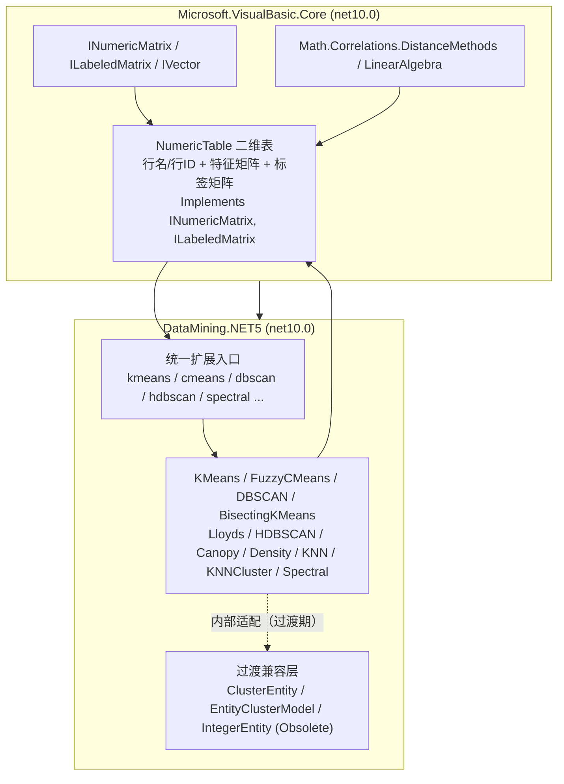

## Product Overview

在 sciBASIC# 框架最底层项目 `Microsoft.VisualBasic.Core`（`Core.vbproj`）中新增一个"经过预处理之后的纯数值二维表"对象，作为全框架统一的数据载体；并基于该对象重构 `Data_science/DataMining/DataMining/DataMining.NET5.vbproj` 中 Clustering 文件夹下的全部聚类算法，使其统一采用该二维表作为输入与输出，从而支持 `x.kmeans(k:=3)`、`x.cmeans(c:=9)` 等一致的调用方式。

## Core Features

- 新增纯数值二维表对象：持有行 ID/行名、特征列名与特征数据矩阵、标签列名与标签数据矩阵；实现既有的 `INumericMatrix` 与 `ILabeledMatrix` 接口，保证与现有数值/距离计算体系兼容。
- 表数据操作：按行、按列取值，按列名读取特征与标签，行切片、列投影、克隆、矩阵打包（ArrayPack）。
- 结果回写能力：提供标签列的查询、新增、修改、删除，供聚类/回归把结果写入标签矩阵。
- 算法统一输入：Clustering 下 KMeans、FuzzyCMeans、DBSCAN、BisectingKMeans、Lloyds、HDBSCAN、Canopy、Density、KNN、KNNCluster、Spectral、Kmedoids、Evaluation 全部改为消费二维表。
- 统一调用入口：以扩展方法形式提供 `kmeans`、`cmeans`、`dbscan`、`bisectingKMeans`、`lloyds`、`hdbscan`、`canopy`、`density`、`knn`、`spectral` 等，输入与输出均为二维表，结果写入标签矩阵并返回该表。
- 平滑过渡：现有 `ClusterEntity`、`EntityClusterModel`、`IntegerEntity` 相关类型保留为过时兼容层，内部改为委托新表实现，后续再逐步删除。

## Tech Stack Selection

- 语言与运行时：VB.NET，目标框架 `net10.0`（沿用现状，不升级/降级）。
- 涉及项目：
- `Microsoft.VisualBasic.Core/src/Core.vbproj`（`RootNamespace = Microsoft.VisualBasic`，`AssemblyName = Microsoft.VisualBasic.Runtime`）。
- `Data_science/DataMining/DataMining/DataMining.NET5.vbproj`（`RootNamespace = Microsoft.VisualBasic.DataMining`，`AssemblyName = Microsoft.VisualBasic.DataMining.Framework`）。
- 复用的既有契约：`Microsoft.VisualBasic.Math.INumericMatrix`（`Math/Matrix.vb:71`）、`Microsoft.VisualBasic.ComponentModel.DataSourceModel.ILabeledMatrix`（`Data/ILabeledMatrix.vb:60`）、`Microsoft.VisualBasic.Math.IVector`（`Math/NumberGroups.vb`）。
- 复用的数值与距离计算：`Microsoft.VisualBasic.Math.Correlations.DistanceMethods`、`Math.LinearAlgebra`（`Vector`/`NumericMatrix`）。
- 无新增第三方依赖；不修改 `Data/DataFrame`，不让 DataMining 引用 `Data/DataFrame`。

## Implementation Approach

核心策略：以"接口不变、载体统一、算法收敛"为原则，在 Core 新增一个纯数值二维表，用行主序数值矩阵承载特征与标签，所有聚类算法统一改为消费该表。

- 表对象落在 Core：因 Core 被所有项目引用且无法反向引用 `Data/DataFrame`，将新表放在 Core 的 `Microsoft.VisualBasic.Data` 命名空间。它实现 `INumericMatrix`（`ArrayPack` 返回特征矩阵）与 `ILabeledMatrix`（`GetLabels` 返回行名），从而复用已有的 `Kmeans(Of T As {INumericMatrix, ILabeledMatrix})` 泛型约束模式。
- 纯数值定位：只存 `Double()()` + 行列名 + 行 ID。逻辑值、字符串枚举标签、缺失值统一由上游预处理阶段转成数值，算法层不再关心类型与缺失。
- 双矩阵结构：`features`（样本特征矩阵，行主序）与 `labels`（标签矩阵，行主序）。聚类/回归结果通过 `SetLabel`/`AddLabel` 写入 `labels`，方法返回填充后的表，天然支持 `x.kmeans(k:=3)` 的链式风格。
- 算法统一改造：将 `Cluster`/`KMeansCluster`/`ClusterCollection` 等的泛型参数由 `EntityBase(Of Double)` 收窄为数值行（`Double()` + 行 ID），KMeans/CMeans/DBSCAN/Bisecting/Lloyds/HDBSCAN/Canopy/Density/KNN/KNNCluster/Spectral 全部改为接收二维表或数值矩阵；距离计算统一走现有 `DistanceMethods` / HDBSCAN `IDistanceCalculator`。
- 兼容过渡：现有 `ClusterEntity`/`EntityClusterModel`/`IntegerEntity` 相关公开重载保留并标记 `<Obsolete>`，内部改为经适配调用新表 API，保证 `Visualization`、`tutorials` 等外部调用点在本次改动后仍可编译；这些类型后续再逐步删除。

关键决策与取舍：

- 选择 Core 而非 `Data.Framework`：避免新增项目引用、避免循环依赖，改动面最小。
- 选择"纯数值 + 双矩阵"而非通用混合类型表：符合"预处理之后"的定位，实现简单可靠，性能可控。
- 选择复用既有接口而非新造契约：现有泛型入口与数值工具可直接复用，降低技术债。
- Cluster 系列泛型收窄：以 `Double()` 行替代实体对象，去除 `EntityBase` 依赖，为后续删除实体类型铺路；代价是需要同步改造模型族与调用点。

性能与可靠性：

- 行主序 `Double()()` 连续存储，避免装箱/反射；`ArrayPack` 默认浅拷贝（与 `DataFrame.ArrayPack` 语义一致），需要隔离时显式 `deepcopy:=True`。
- 距离计算为 O(k·n·d)，改造后仍沿用现有一维数组距离函数，避免逐元素字典查找（替换原 `EntityClusterModel.Properties` 字典访问路径）。
- 切片/投影轻量实现，避免不必要深拷贝；对大表提供按需视图语义。

## Architecture Design



依赖方向保持单向：`Core ← DataMining`，`Core ← Math`，`DataMining ← Math`。不引入反向依赖。

## Directory Structure

```
Microsoft.VisualBasic.Core/src/
└── Data/
    ├── NumericTable.vb                  # [NEW] 统一纯数值二维表。持有 rowNames/rowIds、featureNames+features(Double()())、labelNames+labels(Double()())；实现 INumericMatrix.ArrayPack 与 ILabeledMatrix.GetLabels；提供行/列取值、按名取特征与标签、SetLabel/AddLabel/HasLabel、Slice/Select/Clone/ToArrayPack 与 FromRows/FromColumns 构造。行为对齐现有 DataFrame 的接口语义（ArrayPack 默认浅拷贝）。
    └── NumericTableExtensions.vb        # [NEW] 表的轻量扩展：行数/列数校验、特征矩阵打包、标签矩阵打包、行名缺省填充、与 DistanceMethods 的便捷数值访问；不引入新依赖。

Data_science/DataMining/DataMining/
├── Clustering/KMeans/KMeans.vb            # [MODIFY] KMeansAlgorithm 去泛型化，ClusterDataSet 改为消费 NumericTable（或 Double()()+行ID），结果写入标签列。
├── Clustering/KMeans/Models/Cluster.vb    # [MODIFY] 泛型参数由 EntityBase(Of Double) 收窄为数值行，移除实体依赖。
├── Clustering/KMeans/Models/KMeansCluster.vb # [MODIFY] ClusterMean/ClusterSum 基于 Double() 行计算。
├── Clustering/KMeans/Models/ClusterCollection.vb # [MODIFY] 集合元素改为数值行；保留 NumOfCluster/Add/Item。
├── Clustering/KMeans/Kmedoids.vb          # [MODIFY] DoKMedoids 改为消费 NumericTable，返回标签或写回标签列；CalculateClusterMean 基于 Double()。
├── Clustering/KMeans/Evaluation.vb        # [MODIFY] Silhouette/CalinskiHarabasz/Dunn/Davies-Bouldin 改为基于数值矩阵 + 标签。
├── Clustering/KMeans/Extensions.vb        # [MODIFY] 提供 `kmeans(x As NumericTable, k:=)` 主入口（写回标签并返回表）；旧 ClusterEntity/EntityClusterModel 重载标 Obsolete 并委托新入口。
├── Clustering/FuzzyCMeans/CMeans.vb       # [MODIFY] 主入口改为 `cmeans(x As NumericTable, c:=, m:=)`，隶属度矩阵写入标签列；保留旧 ClusterEntity 重载并标 Obsolete。
├── Clustering/FuzzyCMeans/Classify.vb     # [MODIFY] Classify 改为基于数值行与标签，去除 ClusterEntity 强绑定。
├── Clustering/FuzzyCMeans/Entity.vb       # [MODIFY] FuzzyCMeansEntity 降级为兼容包装或标记 Obsolete（后续删除）。
├── Clustering/DBSCAN/DbscanAlgorithm.vb   # [MODIFY] ComputeClusterDBSCAN 改为接收 NumericTable 与距离函数，返回写入集群标签的表。
├── Clustering/DBSCAN/DbscanPoint.vb       # [MODIFY] 由泛型 T 改为行索引 + 数值行，去除 IReadOnlyId 泛型约束。
├── Clustering/DBSCAN/DbscanSession.vb     # [MODIFY] 会话基于数值矩阵与行 ID 数组。
├── Clustering/DBSCAN/Extensions.vb        # [MODIFY] RunDbscanCluster 改为 NumericTable 版本；旧 EntityClusterModel 版本委托并标 Obsolete。
├── Clustering/DBSCAN/Optics/Point.vb      # [MODIFY] OPTICS 点改为数值行表示。
├── Clustering/BisectingKMeans/BisectingKMeans.vb # [MODIFY] 构造与 runBisectingKMeans 改为消费 NumericTable，结果写入标签列。
├── Clustering/BisectingKMeans/Cluster.vb  # [MODIFY] Cluster 的 DataPoints 由 List(Of ClusterEntity) 改为行索引集合 + 数值矩阵。
├── Clustering/Lloyds/Clustering.vb        # [MODIFY] 基类改为消费数值行集合。
├── Clustering/Lloyds/LloydsMethodClustering.vb # [MODIFY] 改为基于 NumericTable/数值矩阵，返回集群标签。
├── Clustering/Lloyds/Point.vb             # [MODIFY] Lloyds.Point 降级为兼容包装或标记 Obsolete（后续删除）。
├── Clustering/HDBSCAN/Runner/HdbscanParameters.vb # [MODIFY] DataSet 由泛型 T 改为数值矩阵/行索引；新增基于 Double() 的距离计算器。
├── Clustering/HDBSCAN/Runner/HdbscanRunner.vb     # [MODIFY] Run 改为消费 NumericTable，标签写入标签矩阵。
├── Clustering/HDBSCAN/Runner/HdbscanResult.vb     # [MODIFY] Labels 保持 Integer()，便于写回。
├── Clustering/HDBSCAN/Distance/*.vb               # [MODIFY] 新增面向 Double() 的 Euclidean/Manhattan/Cosine/Pearson/Supremum 计算器。
├── Clustering/Canopy.vb                   # [MODIFY] CanopyBuilder/KMeansSeeds 改为消费 NumericTable。
├── Clustering/Density.vb                  # [MODIFY] GetDensity 改为基于数值矩阵；保留泛型重载并标 Obsolete。
├── Clustering/KNN.vb                      # [MODIFY] 训练集改用 NumericTable，Classify 输出写回标签列。
├── Clustering/KNNCluster.vb               # [MODIFY] MakeKNNCluster 改为消费 NumericTable + 数值距离。
├── Clustering/Spectral.vb                 # [MODIFY] 构造改为接收 NumericTable，内部 kmeans 调用新入口，assignments 写回标签列。
├── ComponentModel/EntityBase.vb           # [MODIFY] 标记 Obsolete，注明由 NumericTable 取代（本阶段不删）。
├── ComponentModel/EntityModels/ClusterEntity.vb    # [MODIFY] 标记 Obsolete，保留转换到 NumericTable 的适配。
├── ComponentModel/EntityModels/EntityClusterModel.vb # [MODIFY] 标记 Obsolete，保留转换到 NumericTable 的适配。
├── ComponentModel/IntegerEntity.vb        # [MODIFY] 标记 Obsolete。
├── ComponentModel/EntityModels/DataSetConvertor.vb  # [MODIFY] 标记 Obsolete，供过渡期转换使用。
└── test/*.vb                              # [MODIFY] 更新/新增单元测试：构造 NumericTable、运行各算法、校验标签写回。

（外部调用点，随最后一个任务按需同步，保证可编译）
Data_science/Visualization/Visualization/Kmeans/Kmeans.vb          # [MODIFY] 迁移到 NumericTable 调用
Data_science/Visualization/Plots-statistics/PCA/PC2.vb             # [MODIFY] 迁移到 NumericTable 调用
Data_science/Visualization/Plots-statistics/Heatmap/PlotExtensions.vb # [MODIFY] 迁移到 NumericTable 调用
Data_science/Visualization/test/FuzzyCmeansVisualize.vb            # [MODIFY] 迁移到 NumericTable 调用
```

## Key Code Structures

```
Namespace Data

    ''' <summary>
    ''' 经过预处理之后的纯数值二维表：特征矩阵 + 标签矩阵 + 行列名。
    ''' 聚类/回归结果统一写入 <see cref="labels"/>。
    ''' </summary>
    Public Class NumericTable
        Implements Microsoft.VisualBasic.Math.INumericMatrix
        Implements ComponentModel.DataSourceModel.ILabeledMatrix

        Public Property name As String
        Public Property description As String
        ''' <summary>行 ID / 样本名</summary>
        Public Property rowNames As String()
        ''' <summary>特征列名</summary>
        Public Property featureNames As String()
        ''' <summary>特征矩阵，行主序 [n][m]</summary>
        Public Property features As Double()()
        ''' <summary>标签列名（聚类结果列也在此）</summary>
        Public Property labelNames As String()
        ''' <summary>标签矩阵，行主序 [n][k]</summary>
        Public Property labels As Double()()

        Public ReadOnly Property nsamples As Integer
        Public ReadOnly Property nfeatures As Integer

        Default Public ReadOnly Property Item(i As Integer) As Double()
        Public Function Row(i As Integer) As Double()
        Public Function Feature(name As String) As Double()
        Public Function GetLabel(name As String) As Double()
        Public Function HasLabel(name As String) As Boolean
        Public Sub SetLabel(name As String, values As Double())
        Public Function AddLabel(name As String, values As Double()) As NumericTable
        Public Function Slice(rows As IEnumerable(Of Integer)) As NumericTable
        Public Function [Select](features As IEnumerable(Of String)) As NumericTable
        Public Function Clone() As NumericTable
        Public Shared Function FromRows(rowNames As String(), features As Double()(),
                                         Optional featureNames As String() = Nothing) As NumericTable
    End Class
End Namespace

Namespace DataMining.KMeans
    <Extension>
    Public Function kmeans(source As Data.NumericTable, k As Integer,
                           Optional n_threads As Integer = 16) As Data.NumericTable
End Namespace

Namespace DataMining.FuzzyCMeans
    <Extension>
    Public Function cmeans(source As Data.NumericTable, c As Integer,
                           Optional m As Double = 2) As Data.NumericTable
End Namespace
```

## Implementation Notes

- 命名空间与命名：新表放入 Core 的 `Microsoft.VisualBasic.Data`（与 `src/Data/NamespaceDoc.vb` 的 `Namespace Data` 对应）；类型名用 `NumericTable`，避免与 `System.Data.DataTable`、`Math.Matrix`、`Data.Framework.DataFrame` 冲突。
- 接口成员按 VB 惯例以 `Private ... Implements` 实现（对齐 `DataFrame` 的 `ArrayPack`/`GetLabels` 写法）。
- `ArrayPack(Optional deepcopy As Boolean = False)` 必须与既有语义一致：默认浅拷贝。
- 行名缺省：未提供 `rowNames` 时按 `1..n` 生成；`labels` 为 `Nothing` 表示无标签列。
- 兼容层：旧实体重载保持公开签名不变，仅内部改为经适配委托新表 API，并加 `<Obsolete>` 说明；不做无关重构，控制影响范围。
- 日志：沿用现有 `.debug`/`.Warning` 扩展方法；不得打印大数据矩阵或敏感内容。
- 性能：避免重复 `ArrayPack` 深拷贝；距离计算复用 `DistanceMethods` 的一维数组实现；链路中不对每行做字典或反射访问。
- 测试：优先在 `Data_science/DataMining/DataMining/test` 下增量补充；保持 `test.vbproj` 的引用关系不变，不新增项目引用。

### Skill

- **lsp-code-analysis**
- Purpose: 在重构过程中做语义级导航与影响面分析，精确查找 `ClusterEntity`、`EntityClusterModel`、`KMeansAlgorithm`、`CMeans`、`BisectingKMeans`、`HdbscanRunner` 等类型的定义、引用与实现，确认改造点无遗漏。
- Expected outcome: 得到带位置的完整符号引用清单，避免改造遗漏并降低误改风险。

### SubAgent

- **code-explorer**
- Purpose: 跨目录大范围检索 Clustering 各算法的调用点与测试用例（含 Visualization、tutorials、test），汇总迁移影响面。
- Expected outcome: 产出结构化的调用点迁移清单，用于统一入口任务与调用点同步任务的落地。