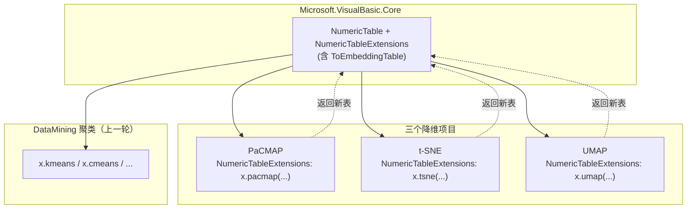

## 产品概述

为 `Data_science/DataMining` 下的三个降维项目 PaCMAP、t-SNE、UMAP 增加对统一二维表 `Microsoft.VisualBasic.Data.NumericTable` 的支持，使降维算法与上一轮已统一的聚类算法共享同一数据载体，并支持链式调用。

## 核心功能

- 三个降维算法各提供一个面向 `NumericTable` 的入口扩展方法，输入为经过预处理的纯数值二维表。
- 每个入口返回**新的** `NumericTable`：嵌入坐标作为新表的特征矩阵（列名 `dim_1..dim_n`），继承源表的行名与原有标签列，从而可以直接链式调用聚类，例如 `x.umap(dims:=2).kmeans(k:=3)`。
- PaCMAP 增加 `Silent` 选项（默认静默），避免作为库调用时向控制台打印迭代日志。
- 延续上一轮的弃用策略：UMAP 的 `InitializeFit(IEnumerable(Of ClusterEntity))`、DataMining 的 `ValueMapping.AsDataSet(...)` 等实体相关旧接口保留并标记为过时，主项目内屏蔽弃用警告，外部引用方仍收到提示。
- 为三个项目各补充一个可运行的冒烟测试，验证入口可用、结果正确写入新表、行名与标签被继承、且可与聚类入口链式互通。

## 视觉/交互效果

无界面，仅提供库级统一 API。调用效果示例：

```
Dim x As NumericTable          ' 预处理后的纯数值二维表
Dim y = x.umap(dims:=2)        ' 返回嵌入坐标表
Dim z = y.kmeans(k:=3)         ' 直接链式聚类，结果写入 y 的 cluster 标签列
```

## 技术栈选择

- 语言/运行时：VB.NET，`net10.0`（沿用现状，不升级/降级）。
- 涉及项目与其 `RootNamespace`：
- `Data_science/DataMining/PaCMAP/PaCMAP.vbproj` → `Microsoft.VisualBasic.DataMining.PaCMAP`（**开启 `Nullable=enable`、`ImplicitUsings=enable`、`AllowUnsafeBlocks`**）
- `Data_science/DataMining/t-SNE/t-SNE.vbproj` → `Microsoft.VisualBasic.MachineLearning.tSNE`
- `Data_science/DataMining/UMAP/UMAP.NET5.vbproj` → `Microsoft.VisualBasic.DataMining.UMAP`
- 复用既有契约：Core 的 `Microsoft.VisualBasic.Data.NumericTable`（`rowNames`/`featureNames`/`features`/`labelNames`/`labels`，实现 `INumericMatrix` 与 `ILabeledMatrix`）与 `NumericTableExtensions`（`NumericRows`、`RowIds` 等）。
- 无新增第三方依赖；不新增项目引用（三个项目均已引用 Core）。

## 实现思路

核心策略：**在 Core 增加一个可复用的"嵌入结果 → 新 NumericTable"辅助方法，然后在每个降维项目内新增一个 `NumericTableExtensions.vb` 扩展入口**，各入口只负责把二维表转换为该算法原生的输入形态、执行算法、再把嵌入结果封装为新表。

关键决策与理由：

- **结果封装统一放 Core**：`ToEmbeddingTable(source, embedding, prefix)` 只依赖 `NumericTable`，三个项目都引用 Core，可避免三处重复实现；统一保证 `nsamples` 一致、继承行名与标签、生成 `dim_1..dim_n` 列名。
- **扩展入口放各自项目**：PaCMAP 未引用 `DataMining.NET5`，而 t-SNE/UMAP 引用；把入口分别放在各项目内可保持依赖方向不变（Core ← 三个降维项目），避免让 Core 或 DataMining 反向依赖具体算法。
- **返回新表而非写回标签列**：降维结果是新的特征空间，作为 `features` 更符合语义，且能直接送入上一轮的 `kmeans/cmeans` 入口。
- **PaCMAP 矩形↔锯齿转换**：其 `Fit` 使用 `Double(,)` 矩形数组，而 `NumericTable.features` 为 `Double()()` 锯齿数组，入口需双向转换；同时按用户确认新增 `Silent`（默认 True）守卫 `Console.WriteLine`。
- **t-SNE 顺序约束**：`UseBarnesHut` 必须在 `InitDataRaw` 之前设置；`nthreads <= 0` 时用 `App.CPUCoreNumbers`。t-SNE 无 epochs API，入口暴露 `iterations`（默认 1000，对齐 van der Maaten 参考实现）。
- **UMAP 迭代步数**：`GetNEpochs()` 为 Private，必须使用 `InitializeFit(...)` 的返回值作为 `Step(nEpochs)` 的步数；`Step(..., tqdm_wrap:=False)` 关闭进度条。
- **命名冲突风险**：三个项目都存在与入口同名的类型（`PaCMAP`、`tSNE`、`Umap`），VB 标识符大小写不敏感。实现处对算法类型使用**限定名/别名**引用（如 `Imports PaCMAPEstimator = ...PaCMAP.PaCMAP`、`Imports UmapEstimator = ...UMAP.Umap`），并优先保持用户友好的 `x.pacmap(...)`、`x.tsne(...)`、`x.umap(...)`；若实测仍冲突，回退为 `pacmapEmbedding`/`tsneEmbedding`/`umapEmbedding`。

性能与可靠性：

- 入口内部一律使用 `NumericRows()` 取得的矩阵引用，避免不必要的深拷贝；仅在 PaCMAP 因矩形数组要求进行必要的结构转换。
- 三个算法均为计算密集，入口不引入额外 O(N^2) 开销；结果封装为 O(N·d)。
- 训练/测试规模的边界：PaCMAP 的远距离对采样在样本数过少时可能死循环，冒烟测试须使用足够大的 N（见下）。

## 实现说明

- **必须为 PaCMAP 与 t-SNE 项目补 `<Compile Remove="test\**" />`（含 `EmbeddedResource`/`None`）**：SDK 风格项目默认递归包含 `.vb`，若冒烟测试放在项目内 `test/` 子目录会被主项目误编译（UMAP 与 DataMining 已有该排除项，需确认 PaCMAP/t-SNE 并按需补齐）。
- UMAP 项目需新增 `<NoWarn>$(NoWarn);BC40000</NoWarn>`（因其 `Umap.vb` 自身引用了已弃用的 `ClusterEntity`）。
- 弃用标注：保持公开签名不变，仅在类型/方法上加 `<Obsolete(message, False)>`；消息指向 `Microsoft.VisualBasic.Data.NumericTable`。
- 可空处理：PaCMAP 工程 `Nullable=enable`，新增代码需避免引入可空警告。
- 日志：不在库入口中输出进度；异常使用既有约束异常类型（如 `InvalidConstraintException`）并在消息中给出样本数/维度不一致等可定位信息。
- 测试样本量：PaCMAP ≥ 64（且 `numNeighbourPairs` 远小于 N）、t-SNE 建议 ≥ 64 且 `perplexity ≤ N/3`、UMAP ≥ 32；控制规模以缩短运行时间。

## 架构设计



依赖方向保持单向：`Core ← 各降维项目`，并支持 `降维结果表 → 聚类入口` 的链式管线。

## 目录结构

```
Microsoft.VisualBasic.Core/
└── src/Data/
    └── NumericTableExtensions.vb                       # [MODIFY] 新增 ToEmbeddingTable(source, embedding, prefix)，校验样本数一致、复制 rowNames/labels/labelNames、生成 dim_1..dim_n 列名，无效维度抛 InvalidConstraintException

Data_science/DataMining/PaCMAP/
├── PaCMAP.vb                                            # [MODIFY] 新增 Public Property Silent As Boolean = True；Fit 中进度输出加 Not Silent 守卫，其余行为不变
├── PaCMAP.vbproj                                        # [MODIFY] 补 <Compile Remove="test\**" /> 等排除项
├── NumericTableExtensions.vb                            # [NEW] 命名空间 Microsoft.VisualBasic.DataMining.PaCMAP；x.pacmap(dims, neighbors, iterations, init) As NumericTable；锯齿→矩形转换调用 Fit，矩形→锯齿后 ToEmbeddingTable；用别名引用 PaCMAP 类型
└── test/PaCMAPNumericTableTests/
    ├── PaCMAPNumericTableTests.vbproj                   # [NEW] net10.0 控制台，引用 PaCMAP.vbproj
    └── Program.vb                                       # [NEW] 合成数据（N>=64）、断言结果表维度/列名/行名/标签继承

Data_science/DataMining/t-SNE/
├── t-SNE.vbproj                                         # [MODIFY] 补 <Compile Remove="test\**" /> 等排除项
├── NumericTableExtensions.vb                            # [NEW] 命名空间 Microsoft.VisualBasic.MachineLearning.tSNE；x.tsne(perplexity, dim, epsilon, iterations, useBarnesHut, nthreads) As NumericTable；先设 UseBarnesHut/nthreads 再 InitDataRaw，循环 Step，取 GetEmbedding
└── test/tSNENumericTableTests/
    ├── tSNENumericTableTests.vbproj                     # [NEW] net10.0 控制台，引用 t-SNE.vbproj
    └── Program.vb                                       # [NEW] 合成数据，验证入口与结果封装

Data_science/DataMining/UMAP/
├── Umap.vb                                              # [MODIFY] InitializeFit(IEnumerable(Of ClusterEntity)) 加 <Obsolete>
├── UMAP.NET5.vbproj                                     # [MODIFY] 新增 <NoWarn>$(NoWarn);BC40000</NoWarn>，补 <Compile Remove="test\**" /> 等排除项
├── NumericTableExtensions.vb                            # [NEW] 命名空间 Microsoft.VisualBasic.DataMining.UMAP；x.umap(dims, neighbors, epochs, minDist, spread) As NumericTable；InitializeFit 取步数、Step(n, tqdm_wrap:=False)、GetEmbedding 后 ToEmbeddingTable；用别名引用 Umap 类型
└── test/UMAPNumericTableTests/
    ├── UMAPNumericTableTests.vbproj                     # [NEW] net10.0 控制台，引用 UMAP.NET5.vbproj
    └── Program.vb                                       # [NEW] 合成数据 + 链式 x.umap(dims:=2).kmeans(k:=2) 验证

Data_science/DataMining/DataMining/
└── ValueMapping.vb                                      # [MODIFY] AsDataSet(IEnumerable(Of NamedCollection(Of Single))) 与 AsDataSet(IDataEmbedding, labels) 加 <Obsolete>
```

## 关键代码结构

```
Namespace Data
    <Extension>
    Public Function ToEmbeddingTable(source As NumericTable,
                                     embedding As Double()(),
                                     Optional prefix As String = "dim") As NumericTable
        ' 校验 embedding.Length = source.nsamples，否则抛 InvalidConstraintException
        ' 返回 New NumericTable(embedding, source.RowNamesOrDefault(), FieldName(prefix, dims))
        '        With { .labels = source.labels, .labelNames = source.labelNames, ... }
    End Function
End Namespace

Namespace DataMining.UMAP
    <Extension>
    Public Function umap(source As NumericTable,
                         Optional dims As Integer = 2,
                         Optional neighbors As Integer = 15,
                         Optional epochs As Integer? = Nothing,
                         Optional minDist As Double = 0.1,
                         Optional spread As Double = 1) As NumericTable
End Namespace
```

## Agent Extensions

### Skill

- **lsp-code-analysis**
- Purpose: 在新增 `x.pacmap`/`x.tsne`/`x.umap` 扩展方法时做语义级符号解析，核实方法名与同名类型（`PaCMAP`/`tSNE`/`Umap`）是否产生命名歧义，并定位 `InitializeFit`、`AsDataSet`、`ValueMapping` 等旧接口的全部引用点，确保弃用标注与改名方案无遗漏。
- Expected outcome: 得到带精确位置的符号引用/冲突清单，据此确定入口命名（`pacmap`/`tsne`/`umap` 或回退后缀方案）并确认所有需加 `<Obsolete>` 的位置。

### SubAgent

- **code-explorer**
- Purpose: 跨目录核对三个降维项目的入口调用点、`test/` 目录排除配置现状，以及上一轮 `NumericTableTests` 冒烟测试的写法，作为新增三个冒烟测试项目的模板依据。
- Expected outcome: 产出结构化的调用点与配置清单，确保冒烟测试项目放置位置正确、主项目不会误编译测试代码，且验证方式与既有约定一致。