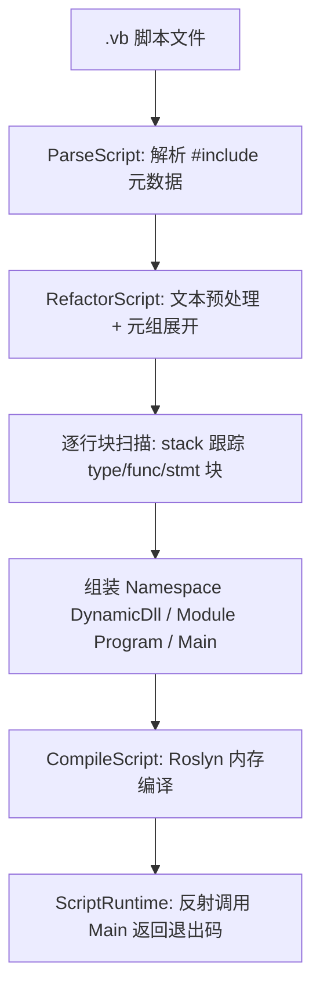

## 用户需求

修复 `vs_solutions\VBS\VBS.vbproj` 脚本引擎（VBS）在预处理阶段的 bug，并跑通 `tutorials\VBS` 文件夹下的全部测试脚本。

## 产品概述

VBS 是一个把 `.vb` 文件当作脚本运行的引擎：先对脚本源码做预处理，重构成合法的 VB.NET 源码（固定 `Namespace DynamicDll` / `Module Program` / `Function Main(args As CommandLine)` 容器），再用 Roslyn 内存编译成程序集并反射执行。当前 `kmeans.vb`、`tuple.vb` 可正常运行，但 `cuda.vb` 运行后脚本内容全部消失、无任何输出。

## 核心功能（本次要交付的内容）

1. **修复块扫描栈不平衡 bug**：预处理主循环用栈跟踪代码块的嵌套进出；`For...Next` / `Do...Loop` 块无法被正确识别为「已结束」，导致栈永远无法回到顶层，脚本的全部代码行被静默丢弃，最终生成一个空的 Main 骨架（编译通过、运行无输出）。需让 `Next` / `Loop` 正确闭合对应块。
2. **兜底 flush 残留代码**：逐行扫描结束后，若仍有未闭合的缓冲内容，应按块类型补发到对应集合，避免任何块不配对时整段代码被静默丢弃。
3. **修复元组分解临时变量名不递增**：`Dim (a, b) = expr` 展开出的临时变量名始终相同，脚本中出现多处元组声明时会变量重名。
4. **让 cuda.vb 可运行**：去掉脚本中对 `ConsoleReporter` 的依赖（该类型不在 `#include` 的 ILCuda 框架程序集内，属于 demo 工程），改用标准输出打印标题，仅依赖框架内置的 `KernelCatalog` / `KernelInfo`。
5. **回归验证**：`tutorials\VBS` 下 3 个脚本（tuple.vb / kmeans.vb / cuda.vb）全部跑通并输出预期结果。

## 技术栈

- 语言/框架：VB.NET，目标框架 `net10.0`，SDK 风格工程（`vs_solutions/VBS/VBS.vbproj`，`LangVersion 16`，`RootNamespace VBScriptHost`）
- 动态编译：`Microsoft.CodeAnalysis.VisualBasic` 5.9.0（Roslyn），内存 emit + `AssemblyLoadContext` 加载（`src/DynamicDll.vb`、`src/VBScript/ScriptRuntime.vb`）
- 正则预处理：`System.Text.RegularExpressions`
- 行切分：项目自有扩展 `String.LineTokens()`（`Microsoft.VisualBasic.Core/src/Extensions/StringHelpers/StringHelpers.vb:1484`）
- 构建产物输出目录：`../../.nuget/`（即 `.nuget/net10.0/vbs.exe`）

## 实现方案

整体策略：**只改 bug 点，不改架构**。沿用现有「正则 + 栈扫描」的预处理设计，做 3 处最小且可回归的修复，再调整 1 个教程脚本的依赖。

### 1. 根因修复：`IsBlockEnd` 大小写不匹配（核心）

`RefactorScript` 中所有入栈值统一为小写（`stack.Push(bt.ToLower)`，见 VBScript.vb 112/116/122/127/156 行），而 `IsBlockEnd` 用 `Select Case blockType` 匹配 `"For" / "Do"`。VB 默认 `Option Compare Binary`，`Select Case` 字符串比较**区分大小写**，`"for" <> "For"` → 永远落到 `Case Else`，用 `^end\s+for\b` 去匹配 `Next`，必然失败 → `For`/`Do` 块永不闭合 → 栈无法回到 0 → 代码全部丢弃。

修复方式：`IsBlockEnd` 内部先 `blockType.ToLower()`（或统一用 `String.Equals(..., OrdinalIgnoreCase)`）再 `Select Case "for" / "do"`，并保留 `Case Else` 的 `^end\s+<type>\b` 分支（`RegexOptions.IgnoreCase` 已保证其他块类型正确）。同时用 `Regex.Escape(blockType)` 拼接正则，避免块名含正则元字符。

影响面：`Using / While / Try / With / If / Select / SyncLock` 等原本就走 `Case Else`，行为不变；`For / Do` 从「永不闭合」变为「正常闭合」，只影响修复目标，无回归风险。

### 2. 兜底 flush 残留 buffer

扫描循环结束后（VBScript.vb 159 行之后），若 `buffer.Count > 0`（存在未闭合块），按 `bufferKind` 追加到 `typeBlocks / funcBlocks / mainBody`，避免静默丢代码。这是一处防御性改动，不改变正常路径的输出。

### 3. `TupleDestructuring` 计数器递增

VB 没有前缀自增，`++i` 实际被解析为一元 `+(+i)`，不递增。改为显式递增：计数器改为 `Dim i As Integer = 0`，在生成临时变量名前 `i += 1`，再用 `$"__tuple{i}"`。保证同一脚本内多个 `Dim (a,b) = ...` 生成互不冲突的临时变量名。

### 4. `tutorials/VBS/cuda.vb` 去 `ConsoleReporter` 依赖

`ConsoleReporter` 定义在 `cuda/ILCuda/test/Reporter.vb`（工程 `ILCuda/test/test.vbproj`，AssemblyName `ILCuda.Demo`，命名空间 `ILCudaDemo.Diagnostics`），而 `cuda/ILCuda/ILCuda.vbproj` 第 22-24 行显式 `<Compile Remove="test\**" />`，故它不在 `#include "Microsoft.VisualBasic.Computing.ILCuda.dll"` 内。按用户确认的方案：把 `ConsoleReporter.PrintTitle(...)` 换成 `Console.WriteLine(...)` 打印标题，脚本只依赖框架内置的 `Microsoft.VisualBasic.Computing.ILCuda.Runtime.KernelCatalog` / `KernelInfo`（`All()` 返回 `IReadOnlyList(Of KernelInfo)`，已确认存在且为 Public）。

## 执行细节（落地要点）

- **不要**改 `RefactorScript` 的组装结构（Option/Imports/Namespace/Module/Main 顺序、顶层函数转多行 Lambda），否则会破坏已跑通的 `kmeans.vb` / `tuple.vb`。
- 顶层函数被重写为多行 Lambda（`Dim RunListKernels = Function() As Integer ... End Function`）放进 Main，末尾 `Call RunListKernels()` 调用；这是既有设计（见 `README.md`），保持不变。
- 逐行扫描为 O(n) 单次遍历 + 每常数条正则，脚本规模为几十至几百行，性能无瓶颈；修复不引入额外遍历。
- 编译失败时 `DynamicDll.CompileScript` 会抛 `InvalidOperationException` 并带完整诊断，验证阶段直接以它作为定位依据。
- 验证命令（在 `.nuget/net10.0` 下执行，该目录已含 `vbs.exe` 与 `Microsoft.VisualBasic.Computing.ILCuda.dll`）：
- `dotnet build vs_solutions/VBS/VBS.vbproj`（产出覆盖 `.nuget/net10.0/vbs.exe`）
- `.\vbs.exe <abs>\tutorials\VBS\tuple.vb` → 预期输出 `1 / 2 / 3`
- `.\vbs.exe <abs>\tutorials\VBS\cuda.vb` → 预期打印标题 + 内核列表 + 内核总数
- `.\vbs.exe <abs>\tutorials\VBS\kmeans.vb` → 回归，无异常且生成结果文件
- 若 `kmeans.vb` 因本地数据路径（`G:\...\bezdekIris.csv`）或输出盘符（`Z:\`）不可用而失败，属于环境依赖，需单独确认，不作为引擎 bug。

## 架构设计

数据流保持不变：



本次修改点全部位于 `D` 的块闭合判定（`IsBlockEnd`）、`D` 结束后的兜底 flush、以及 `C` 的元组临时变量命名；`E/F/G` 不动。

## 目录结构

```
vs_solutions/VBS/
├── src/VBScript/
│   ├── VBScript.vb              # [MODIFY] RefactorScript 主循环(92-159行)收尾处新增残留 buffer 兜底 flush；
│   │                            #          IsBlockEnd(340-346行)改为大小写不敏感的块类型判定(核心 bug 修复)
│   └── TupleDestructuring.vb    # [MODIFY] Expand(18-55行)元组临时变量计数器改为显式递增，修复 ++i 不生效
└── ../../
    └── tutorials/VBS/
        ├── cuda.vb              # [MODIFY] 去掉 ConsoleReporter 依赖，改用 Console.WriteLine 打印标题
        ├── kmeans.vb            # [验证] 回归验证，预期无改动
        └── tuple.vb             # [验证] 回归验证，预期无改动
```

## Agent Extensions

### SubAgent

- **code-explorer**
- 用途：在修复过程中若需要确认 `KernelCatalog` / `KernelInfo` / 其他被教程脚本引用的类型是否确实存在于目标程序集、或需要排查编译诊断中提到的符号来源时，用于跨目录快速定位定义与引用。
- 预期结果：准确给出符号所在文件与所属工程/程序集，避免再次出现「脚本引用了不在 #include 程序集内的类型」这类问题。