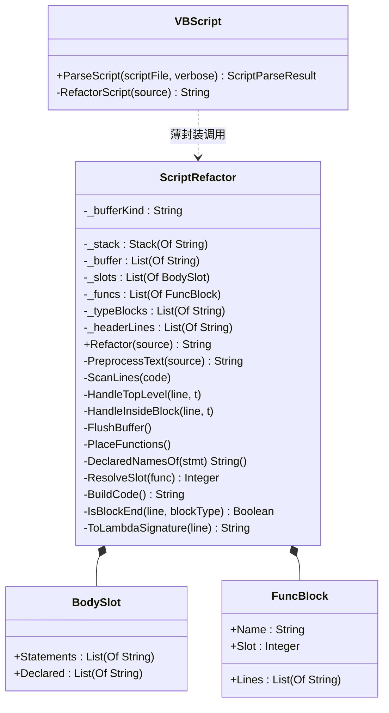

## 用户需求

### 需求一：修复顶层函数代码顺序缺陷

`tutorials\VBS\hola_layout.vb` 编译失败：

```
Unhandled exception. System.InvalidOperationException: 脚本代码编译失败!
(28) : error BC32000: Local variable 'rnd' cannot be referred to before it is declared.
(32) : error BC32000: Local variable 'g' cannot be referred to before it is declared.
```

脚本源码顺序为：`Dim g` / `Dim rnd` 在前，`public function rndPos()`（使用 `rnd`）、`public sub addNode()`（使用 `g`、调用 `rndPos()`）在后；但预处理生成的 `Main` 中两个 lambda 被排到了两条 `Dim` **之前**。

验收要求：

1. 完善 `vs_solutions\VBS\src\VBScript\VBScript.vb:74` 的 `RefactorScript` 代码顺序逻辑；
2. 编译 `vs_solutions\VBS\VBS.vbproj`，用 `"G:\GCModeller\src\runtime\sciBASIC#\.nuget\net10.0\vbs.exe" G:\GCModeller\src\runtime\sciBASIC#\tutorials\VBS\hola_layout.vb --verbose` 检查生成代码是否正确；
3. 把 `tutorials\VBS` 中所有脚本各跑一遍，确保预处理无问题。

### 需求二：重构（本轮追加）

除修复顺序错误外，还需把 `RefactorScript` 的逻辑重构为 **Class 对象**，按功能职责把该大型函数拆分为若干小函数。

## 产品概述

VBS 是以脚本方式运行 `.vb` 文件的引擎：预处理为合法 VB.NET → Roslyn 内存编译 → 反射执行。本次改动只落在预处理环节，外部行为（解析结果、编译、运行）保持不变。

## 核心功能

1. **顺序修复**：顶层函数重写为匿名函数后，其在 `Main` 中的落位不得早于它捕获的顶层变量、也不得早于它调用的其它顶层函数；不依赖任何顶层变量/函数的纯函数仍应被提前到 `Main` 开头，保留原有书写习惯。
2. **其余顶层语句**（`Dim`、`Const`、控制流块、可执行语句）保持源码相对顺序不变。
3. **类化重构**：把 `RefactorScript` 的扫描状态变成对象字段，按职责拆成小函数；块结构判定原样搬入，行为不变。
4. **回归**：6 个教程脚本全部可运行，且 `hola_layout.vb` 生成代码中 lambda 位于两条 `Dim` 之后。

## 技术栈

- VB.NET / net10.0，SDK 风格工程 `vs_solutions\VBS\VBS.vbproj`（`RootNamespace VBScriptHost`、`LangVersion 16`）
- Roslyn `Microsoft.CodeAnalysis.VisualBasic` 内存编译（`src\DynamicDll.vb`）
- 正则 + 栈扫描预处理（`src\VBScript\VBScript.vb`）
- 行切分：项目自有扩展 `String.LineTokens()`（`Microsoft.VisualBasic.Core\src\Extensions\StringHelpers\StringHelpers.vb:1484`）
- 构建产物输出目录 `..\..\..\.nuget\` → `.nuget\net10.0\vbs.exe`

## 根因

`RefactorScript` 组装阶段（VBScript.vb 198-208 行）**先把全部 `funcBlocks` 输出进 `Main`，再输出 `mainBody`**（注释："顶层函数(匿名函数形式)必须先于顶层语句声明"）。

顶层函数已被 `ToLambdaSignature` 重写为 `Dim f = Function()...` / `Dim f = Sub(...)...`，即 `Main` 里的**局部变量**；VB 要求局部变量先声明后使用，lambda 捕获的同样是局部变量。因此"一律提前"仅在函数既不捕获顶层变量、也不调用其它顶层函数时成立。

## 实现方案

### A. 重构：抽出 `ScriptRefactor` 类

新增 `vs_solutions/VBS/src/VBScript/ScriptRefactor.vb`（`Namespace Script`，与同目录 `ScriptParseResult.vb` / `TupleDestructuring.vb` 一类型一文件的既有风格一致），把扫描状态变为**对象字段**，按职责拆分：

| 成员 | 职责 |
| --- | --- |
| 字段 | `_stack` / `_buffer` / `_bufferKind`、`_slots`（语句槽位）、`_funcs`（顶层函数块）、`_typeBlocks`、`_headerLines` |
| `Public Function Refactor(source) As String` | 入口，只做编排：文本预处理 → 逐行扫描 → 落位求解 → 组装 |
| `Private Function PreprocessText(source) As String` | 移除 `#include`、`?"--a"` → `args("--a")`、调用 `TupleDestructuring.Expand` |
| `Private Sub ScanLines(code)` | 逐行主循环 |
| `Private Sub HandleTopLevel(line, t)` | 顶层分支：空行/注释、`Imports`/`Option`、类型块/函数块/lambda/控制流/普通语句分派 |
| `Private Sub HandleInsideBlock(line, t)` | 块内分支：`IsBlockEnd` 出栈并 flush、`IsNestedBlockStart` 入栈 |
| `Private Sub FlushBuffer()` | 把 `_buffer` 按 `_bufferKind` 派发（类型块进 `_typeBlocks`，函数块进 `_funcs`，其余新建槽位）；块闭合与循环结束兜底共用 |
| `Private Sub PlaceFunctions()` | 落位求解（见 B） |
| `Private Function DeclaredNamesOf(stmt) As String()` | 从 `Dim`/`Const` 提取声明名 |
| `Private Function SplitTopLevel(text) As String()` | 按顶层逗号切分（忽略 `()` 内逗号） |
| `Private Function ResolveSlot(func) As Integer` | 依赖 → 槽位 |
| `Private Function BuildCode() As String` | 组装最终源码（Option / Imports / Namespace / Module / Main / 嵌套类型） |
| 块判定（原样搬入，行为不变） | `StripComment` / `IsTypeBlockStart` / `IsFunctionBlockStart` / `IsLambdaBlockStart` / `IsControlBlockStart` / `IsNestedBlockStart` / `IsBlockEnd` / `ToLambdaSignature` |


配套私有小类型（同文件）：

- `BodySlot`：`Statements As List(Of String)`、`Declared As List(Of String)`
- `FuncBlock`：`Name As String`、`Lines As List(Of String)`、`Slot As Integer`

`VBScript.vb` 中 `RefactorScript` 瘦身为薄封装（`Return New ScriptRefactor().Refactor(source)`），原 `EmitBlock` 与块判定辅助函数删除；`ParseScript` 公开签名与行为不变。

### B. 顺序修复：按依赖落位

1. 顶层语句（单行语句、`For`/`Using`/`If`/`Try` 块）按源码顺序各成为一个槽位；每槽记录它声明的顶层变量名。
2. 顶层函数块记录：函数名、块文本（首行为 `ToLambdaSignature` 结果）。
3. 按源码顺序处理函数，并对函数间依赖做**迭代收敛**（支持互相递归）：

```
slot = max( 引用的顶层变量所在槽位, 引用的其它顶层函数的槽位, 上一个函数的 slot )
```

无依赖时为 `-1`，即放在所有语句之前——等价于原先的"提前声明"，纯函数不回归。

4. 组装：按 `-1, 0, 1, ...` 槽位顺序输出，每槽先输出语句，再输出挂在该槽上的函数块（块后补空行）。

预期：`rndPos`（依赖 `rnd`，槽 1）与 `addNode`（依赖 `g` 槽 0 + `rndPos` 槽 1）都落在两条 `Dim` 之后，与源码顺序一致，BC32000 消失。

## 执行细节

- **声明名提取**：`^(dim|const)\s+(?<decl>.+)（忽略大小写）→ `SplitTopLevel` 按顶层逗号切分 → 每段取首个标识符。覆盖 `Dim rows = 5, cols = 4`、`Dim grid(rows - 1, cols - 1) As String`、`Const` 等。**宁可多识别**（只是不提前，等价源码顺序），不可少识别（会复现 BC32000）。
- **引用判定**：对每个已知声明名/函数名用 `\b<name>\b`（IgnoreCase）在整段函数文本中匹配；排除函数自身名字。
- **必须保留的既有修复，不得回退**：`IsBlockEnd` 的 `blockType.ToLower()` 大小写无关判定（`For`/`Do` 闭合）、扫描结束兜底 flush 残留 `buffer`、`TupleDestructuring` 计数器显式递增（`i += 1`）。
- 类型定义块仍作为 `Module` 的嵌套类型输出在 `Main` 之后，缩进（8 空格）与逻辑不变；`Main` 体缩进 12 空格不变。
- 复杂度不变：一次 O(n) 扫描 + 一次按槽位 O(n) 输出；依赖扫描为「声明名数量 × 函数文本」的词边界正则，脚本规模（几十~几百行）无压力。
- `NamespaceName` / `ModuleName` / `MainName` 仍取自动态 `DynamicDll`（`VBScriptHost` 根命名空间），`ScriptRefactor` 内可直接引用；需 `Imports Microsoft.VisualBasic.CommandLine`（`GetType(CommandLine).Namespace`）。

## 架构设计



数据流不变：`脚本源码 → PreprocessText → ScanLines(栈扫描) → FlushBuffer(分派) → PlaceFunctions(落位) → BuildCode(组装) → Roslyn 编译`。本次仅把 B、C 两段从"一个大函数内的局部变量"改造为"对象字段 + 小函数"。

## 目录结构

```
vs_solutions/VBS/src/VBScript/
├── ScriptRefactor.vb   # [NEW] Public Class ScriptRefactor + 私有 BodySlot / FuncBlock
│                       #   入口 Refactor() 只编排; 其余按职责拆为 PreprocessText / ScanLines /
│                       #   HandleTopLevel / HandleInsideBlock / FlushBuffer / PlaceFunctions /
│                       #   DeclaredNamesOf / SplitTopLevel / ResolveSlot / BuildCode
│                       #   + 原样搬入的块结构判定(StripComment / IsTypeBlockStart /
│                       #     IsFunctionBlockStart / IsLambdaBlockStart / IsControlBlockStart /
│                       #     IsNestedBlockStart / IsBlockEnd / ToLambdaSignature)
└── VBScript.vb         # [MODIFY] RefactorScript 瘦身为 New ScriptRefactor().Refactor(source);
                        #          删除 EmitBlock 与已搬走的块判定辅助函数; ParseScript 签名不变

tutorials/VBS/          # [验证] hola_layout.vb(--verbose) + cuda/kmeans/mnist_umap/tuple/word2vector 回归
```

## 验证

- `dotnet build vs_solutions/VBS/VBS.vbproj -c Release`（0 error）
- `cd .nuget\net10.0; .\vbs.exe <abs>\tutorials\VBS\hola_layout.vb --verbose`
- 生成代码中 `Dim rndPos = Function() as FDGVector2` / `Dim addNode = Sub(label As String)` 必须位于 `Dim g As New NetworkGraph`、`Dim rnd As New Random(12345)` **之后**
- 脚本跑完并生成 `Z:\HOLA_complex_layout.png`，输出节点/边/bends 统计
- 回归 6 个脚本：`hola_layout.vb`、`cuda.vb`、`kmeans.vb`、`mnist_umap.vb`、`tuple.vb`、`word2vector.vb` —— 无 BC32000、无编译诊断、无预处理丢代码

## 风险与兜底

| 风险 | 兜底 |
| --- | --- |
| 声明名/引用扫描漏判，函数被提得过前 | 覆盖 `Dim`/`Const` 逗号分隔多名字与数组声明；多识别只是不提前（等价源码顺序），安全 |
| 函数互相递归调用 | `ResolveSlot` 迭代至收敛（限次），按源码顺序取 max 保证相对次序 |
| 重构引入回归 | 块结构判定原样搬入、逐字保留正则；用全部 6 个脚本回归，重点确认 `For`/`Do` 闭合与结束兜底 flush 未丢 |
| 函数捕获更后面才声明的变量 | slot 取 max 后移函数；若变量声明在调用点之后属脚本写法问题，保持 VB 原生报错 |
| 数据/环境依赖 | mnist 数据集、`Data\TextRank\Rapunzel.txt`、`Z:\` 均已实测存在；仍失败则属环境问题，需单独确认 |


## Agent Extensions

### SubAgent

- **code-explorer**
- 用途：重构搬迁前确认 `RefactorScript`、`EmitBlock` 及各块判定辅助函数（`StripComment`/`IsTypeBlockStart`/`IsFunctionBlockStart`/`IsLambdaBlockStart`/`IsControlBlockStart`/`IsNestedBlockStart`/`IsBlockEnd`/`ToLambdaSignature`）在仓库内没有其它调用点，避免删除后编译失败；并核对 `NamespaceName`/`ModuleName`/`MainName` 的定义位置与可见性。
- 预期结果：给出准确的引用清单与常量定义位置，确保 `VBScript.vb` 瘦身安全、新类可正确引用常量。