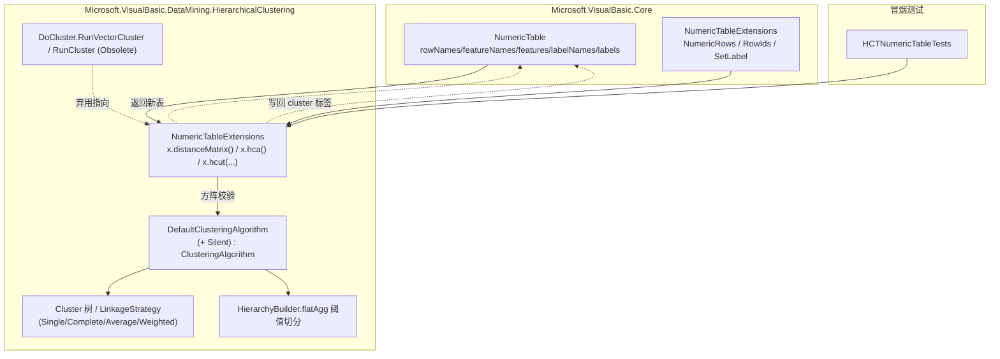

## 产品概述

为 `Data_science/DataMining/hierarchical-clustering` 层次聚类模块增加对统一二维表数据的支持，使其与前几轮已完成统一的聚类、降维模块共享同一数据载体，并支持链式调用。

## 核心功能

- 提供"特征矩阵表 → 距离矩阵表"的转换能力：把普通特征二维表转换为对称距离矩阵形式的二维表（行、列均为样本，对角线为 0），供层次聚类使用。
- 提供层次聚类主入口：对**距离矩阵形式**的二维表执行凝聚层次聚类，返回可绘制树状图的聚类树结果。
- 提供两种"切树"入口，把结果写回标签矩阵并返回原表：
- 按簇数量切分：指定目标簇数 k，得到 k 个簇并写入类别标签；
- 按距离阈值切分：指定距离阈值，得到该阈值下的扁平簇集合并写入类别标签。
- 新增静默运行能力：库方式调用时默认不向宿主控制台输出进度条与空行；可按需开启以查看进度。
- 输入契约提示：层次聚类入口必须在文档注释中显著提示"传入的二维表必须是距离矩阵"，并指明先使用转换函数将特征表转为距离矩阵表。
- 旧接口保留并标记为过时：原有的实体集合驱动入口保留可用，但标注为弃用并指向新的统一数据载体用法。

## 视觉/交互效果

无界面，仅提供库级统一 API。调用效果示例：

```
Dim x As NumericTable              ' 预处理后的特征二维表
Dim dist = x.distanceMatrix()      ' 转换为距离矩阵表
Dim tree = dist.hca()              ' 层次聚类，返回聚类树
Dim flat = dist.hcut(k:=3)         ' 按 k 切分，结果写入 cluster 标签列并返回表
Dim flat2 = dist.hcut(threshold:=5.0)  ' 按阈值切分，结果写入 cluster 标签列并返回表
```

## 技术栈选择

- 语言/运行时：VB.NET，`net10.0`（沿用现状，不升级/降级）。
- 主工程：`Data_science/DataMining/hierarchical-clustering/hierarchical-clustering/hctree.NET5.vbproj`
- `RootNamespace = Microsoft.VisualBasic.DataMining.HierarchicalClustering`
- `AssemblyName = Microsoft.VisualBasic.DataMining.HierarchicalClustering`
- 待办：可选新增 `<NoWarn>$(NoWarn);BC40000</NoWarn>`（仅在出现弃用警告时）
- 已存在 `<Compile Remove="test\**" />`（因此主工程目录内的 `test\` 子目录会被排除）
- 已有项目引用（无需新增）：`Microsoft.VisualBasic.Core/src/Core.vbproj`、`Mathematica/Math/Math/Math.NET5.vbproj`、`Data_science/DataMining/DataMining/DataMining.NET5.vbproj`
- 复用既有契约与工具：
- `Microsoft.VisualBasic.Data.NumericTable`（Core）：`rowNames`/`featureNames`/`features`/`labelNames`/`labels`、`nsamples`/`nfeatures`、`RowNamesOrDefault()`、`SetLabel(name, values)`、`TryGetLabel`、`GetLabel`。
- `Microsoft.VisualBasic.Data.NumericTableExtensions`（Core）：`NumericRows()`、`RowIds()`。
- `Microsoft.VisualBasic.Math.Correlations.DistanceMethods.EuclideanDistance(Double(), Double())`（默认距离度量）。
- 无新增第三方依赖；不新增项目引用。
- 冒烟测试项目：SDK 风格 `net10.0` 控制台，`ProjectReference` 指向 `..\hierarchical-clustering\hctree.NET5.vbproj`，放置于模块根目录作为兄弟目录（置于主工程目录之外，天然不会被主工程误编译）。

## Implementation Approach

核心策略：**约定"距离矩阵表"为层次聚类算法的标准输入；新增一个"特征表 → 距离矩阵表"转换函数；再在转换后的距离矩阵表上提供树入口与两种切分入口（结果写回标签列）。**

关键决策与理由：

- **算法只接收距离矩阵**（按用户明确要求）：层次聚类本质基于两两距离，因此入口以"距离矩阵形式的二维表"为准。新增 `distanceMatrix()` 负责把特征表转换为距离矩阵表，并在 `hca`/`hcut` 的 XML 注释中**以醒目提示**说明输入必须是距离矩阵，否则应先调用 `distanceMatrix()`。这样可避免"特征被误当作距离"的静默错误。
- **方阵契约校验**：距离矩阵表必须满足 `source.nfeatures = source.nsamples`；不满足时抛出 `InvalidConstraintException`，异常消息中显式提示"请先调用 distanceMatrix() 将特征表转换为距离矩阵表"。
- **转换函数输出形态**：返回**新的** `NumericTable`——`features` 为 `n × n` 对称距离矩阵，`rowNames` 与 `featureNames` 均为源表样本名（`RowNamesOrDefault()`），并继承源表的 `labels`/`labelNames`/`name`/`description`；对角线为 0。
- **两种切分复用现有实现**：
- 阈值切分直接复用 `DefaultClusteringAlgorithm.performFlatClustering(distances, names, linkage, threshold)`（内部 `HierarchyBuilder.flatAgg`）。
- k 切分：先通过 `performClustering(...)` 得到根 `Cluster` 树，再对树做"分裂"：反复挑选**叶数最多且非叶**的节点，用其 `Children` 替换之，直至簇数达到 k 或无可分裂节点；随后按各簇的 `LeafNames` 映射回行下标，写入 `cluster` 标签。该方式仅依赖 `Cluster` 的公开成员（`Children`/`LeafNames`/`Leafs`/`isLeaf`），无需访问 `HierarchyBuilder` 的私有构造逻辑。
- **静默开关**：`DefaultClusteringAlgorithm.performClustering` 会输出 tqdm 进度条与 `VBDebugger.EchoLine("")`。新增 `Public Property Silent As Boolean = True`，仅用其守卫这些输出，**不改变任何计算逻辑与返回值**。入口内部使用**新建的实例**（`New DefaultClusteringAlgorithm With {.Silent = silent}`），不复用 `DoCluster.DefaultClusteringAlgorithm` 共享实例，避免静默状态被共享污染。
- **旧接口弃用而非删除**：`DoCluster.RunVectorCluster` / `RunCluster` 保留签名，仅加 `<Obsolete(message, False)>`，消息指向新的 `distanceMatrix()` + `hca()` 用法，保证既有调用点仍可编译。

性能与可靠性：

- 距离矩阵的时间与空间复杂度均为 `O(n²)`，这是层次聚类的固有开销；转换函数构建对称矩阵时只计算上三角并镜像，避免重复计算。
- 可为对称矩阵构建的行循环使用 `System.Threading.Tasks.Parallel.For` 提升多核利用率（与既有 `DoCluster.EuclideanTask` 的并行思路一致）。
- 结果写回为 `O(n)`；不引入额外复制。

## Implementation Notes

- 命名冲突规避：新增扩展方法名 `distanceMatrix` / `hca` / `hcut` 与既有类型（`Cluster`、`ClusteringAlgorithm`、`DefaultClusteringAlgorithm`、`Cluster` 等）不同名，无大小写不敏感歧义；实现内对既有类型使用正常引用即可。
- `hcut` 重载消歧：`hcut(k As Integer, ...)` 与 `hcut(threshold As Double, ...)`；命名实参 `k:=` / `threshold:=` 可明确消歧，位置参数 `hcut(3)` 按 VB 最小扩宽规则解析为 `k` 重载；实现后需编译验证。
- 样本名唯一性：`DefaultClusteringAlgorithm.checkArguments` 会对重复名称抛出 `ArgumentException("Duplicate names")`。转换函数应保证生成的样本名唯一；若源表 `rowNames` 存在重复，应抛出可定位的异常（消息中给出重复项）或说明处理策略，避免运行到算法内部才报错。
- 醒目文档注释：`hca`/`hcut` 的 `<summary>` 与 `<remarks>` 中需明确写出"**注意：传入的 NumericTable 必须是距离矩阵！**"，并给出代码示例 `Dim dist = x.distanceMatrix() : Dim tree = dist.hca()`。
- 日志：新增库入口不向控制台输出；静默为默认行为。
- 弃用标注：使用 `<Obsolete(message, False)>`，消息指向 `Microsoft.VisualBasic.Data.NumericTable` 与新的 `distanceMatrix()/hca()` 用法。
- 不修改 `BIRCH/`、`HCTreePlot/`、`PrintHelper.vb` 等无关模块，控制改动范围。

## Architecture Design



依赖方向保持单向：`Core ← hctree 项目 ← 冒烟测试项目`；数据流为 `特征表 →（distanceMatrix）→ 距离矩阵表 →（hca / hcut）→ 聚类树 / 带 cluster 标签的表`。

## Directory Structure

```
Microsoft.VisualBasic.Core/src/Data/                                  # 无需改动（复用已有 NumericTable / NumericTableExtensions）

Data_science/DataMining/hierarchical-clustering/
├── hierarchical-clustering/
│   ├── NumericTableExtensions.vb                    # [NEW] 命名空间 Microsoft.VisualBasic.DataMining.HierarchicalClustering
│   │                                                #   - <Extension> distanceMatrix(source, Optional metric): 特征表→对称距离矩阵表；O(n^2)，只算上三角并镜像；对角线=0；
│   │                                                #     校验 nsamples>0 与样本名唯一性；返回新 NumericTable（features=距离矩阵，rowNames/featureNames=样本名，继承 labels/name/description）
│   │                                                #   - <Extension> hca(source, Optional linkage:=Nothing, Optional silent:=True) As Cluster:
│   │                                                #     校验 source.nfeatures = source.nsamples（否则抛 InvalidConstraintException 并提示先调用 distanceMatrix()）；
│   │                                                #     用 New DefaultClusteringAlgorithm With {.Silent = silent}.performClustering(source.NumericRows(), source.RowNamesOrDefault(), linkage Or AverageLinkageStrategy)
│   │                                                #   - <Extension> hcut(source, k As Integer, Optional linkage, Optional silent:=True) As NumericTable:
│   │                                                #     取根 Cluster 后按“分裂叶数最多的非叶节点”得到 k 个簇，按 LeafNames→行下标映射写入 SetLabel("cluster", ...) 并返回 source
│   │                                                #   - <Extension> hcut(source, threshold As Double, Optional linkage, Optional silent:=True) As NumericTable:
│   │                                                #     复用 performFlatClustering(..., threshold)，把扁平簇的 LeafNames 映射写入 SetLabel("cluster", ...) 并返回 source
│   │                                                #   - 醒目 XML 注释：hca/hcut 中明确“传入的 NumericTable 必须是距离矩阵”，并给出 distanceMatrix() 的示例
│   ├── ClusteringAlgorithm/
│   │   ├── DefaultClusteringAlgorithm.vb            # [MODIFY] 新增 Public Property Silent As Boolean = True；
│   │   │                                            #   performClustering 中用 If Not Silent Then ... End If 守卫 TqdmWrapper.Wrap / tqdm.SetLabel / tqdm.Progress / tqdm.Finish / VBDebugger.EchoLine("")
│   │   │                                            #   其余计算逻辑与返回值保持不变；performFlatClustering/performWeightedClustering 无需改动
│   │   └── DoCluster.vb                             # [MODIFY] RunVectorCluster 与 RunCluster 加 <Obsolete("已弃用：请统一使用 Microsoft.VisualBasic.Data.NumericTable 距离矩阵表，先 distanceMatrix() 转换再 hca()/hcut()。", False)>，签名不变
│   └── hctree.NET5.vbproj                           # [MODIFY] 仅在出现 BC40000 警告时新增 <NoWarn>$(NoWarn);BC40000</NoWarn>（否则不改动）
└── HCTNumericTableTests/                            # [NEW] 冒烟测试（位于主工程目录之外，不会被误编译）
    ├── HCTNumericTableTests.vbproj                  # [NEW] SDK 风格 net10.0 控制台；ProjectReference → ..\hierarchical-clustering\hctree.NET5.vbproj
    └── Program.vb                                   # [NEW] 合成两簇数据，断言距离矩阵对称性/对角线、hca 树结构、hcut(k) 与 hcut(threshold) 的标签写回与分簇正确性
```

## Key Code Structures

```
' 文件：hierarchical-clustering/NumericTableExtensions.vb（无 Namespace 块 → 位于 RootNamespace）
' Imports：System.Data、System.Runtime.CompilerServices、Microsoft.VisualBasic.Data、
'          Microsoft.VisualBasic.DataMining.HierarchicalClustering.Hierarchy、Microsoft.VisualBasic.Math.Correlations

''' <summary>
''' 将特征矩阵形式的二维表转换为对称距离矩阵形式的二维表。
''' </summary>
<Extension>
Public Function distanceMatrix(source As NumericTable,
                               Optional metric As Func(Of Double(), Double(), Double) = Nothing) As NumericTable

''' <summary>
''' 对距离矩阵形式的二维表执行凝聚层次聚类，返回聚类树（dendrogram）。
'''
''' **注意：传入的 NumericTable 必须是距离矩阵！**
''' 若 source 为原始特征矩阵，请先调用：
'''   Dim dist = x.distanceMatrix()
'''   Dim tree = dist.hca()
''' </summary>
<Extension>
Public Function hca(source As NumericTable,
                    Optional linkage As LinkageStrategy = Nothing,
                    Optional silent As Boolean = True) As Cluster

''' <summary>
''' 按目标簇数量 k 切分层次聚类树，并把 cluster 标签写回表。
''' **注意：source 必须是距离矩阵（见 hca 的说明）。**
''' </summary>
<Extension>
Public Function hcut(source As NumericTable, k As Integer,
                     Optional linkage As LinkageStrategy = Nothing,
                     Optional silent As Boolean = True) As NumericTable

''' <summary>
''' 按距离阈值切分层次聚类树，并把 cluster 标签写回表。
''' **注意：source 必须是距离矩阵（见 hca 的说明）。**
''' </summary>
<Extension>
Public Function hcut(source As NumericTable, threshold As Double,
                     Optional linkage As LinkageStrategy = Nothing,
                     Optional silent As Boolean = True) As NumericTable
```

### Skill

- **lsp-code-analysis**
- Purpose: 在添加 `hca`/`hcut` 重载与废弃标注前，做语义级符号解析，确认 `Cluster`/`DefaultClusteringAlgorithm`/`performFlatClustering`/`RunCluster`/`RunVectorCluster` 的引用点与重载消歧情况。
- Expected outcome: 得到带位置的符号引用清单，确认 `hcut(k)` 与 `hcut(threshold)` 重载可正确解析，且旧接口弃用标注无遗漏、不引入编译错误。

### SubAgent

- **code-explorer**
- Purpose: 跨目录核对 `hierarchical-clustering` 模块内 `RunCluster`/`RunVectorCluster`/`performFlatClustering` 的既有调用点，以及确认冒烟测试项目放置位置不会被 `hctree.NET5.vbproj` 误编译。
- Expected outcome: 产出结构化的调用点与配置清单，确保改动范围可控、测试项目位置正确、既有调用点仍可编译。