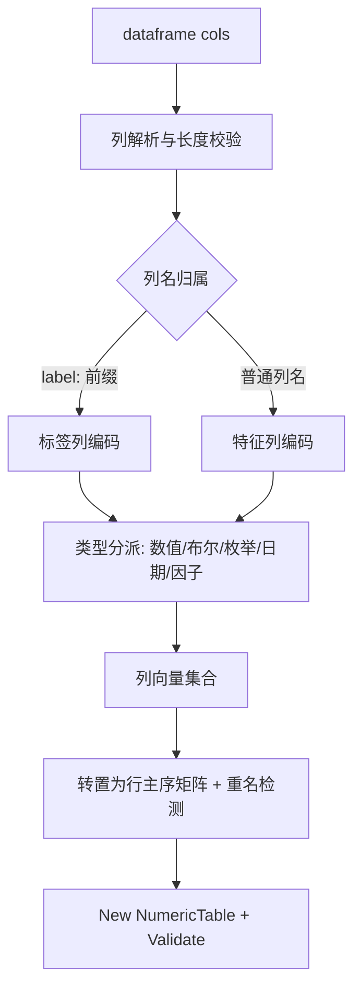

## 需求概述

实现 `Microsoft.VisualBasic.Core/src/Data/NumericTableExtensions.vb` 中当前为空的 `dataframe(ParamArray cols As ArgumentReference())` 函数：以「按列给出数据」的方式构建 `NumericTable` 对象，并对每一列自动完成数据类型转换。列名以 `label:` 前缀开头时归入标签矩阵（名称去掉前缀），其余列归入特征矩阵，行为与 `DataFrame/NumericTableIO.vb` 中的 `DefaultLabelPrefix = "label:"` 保持一致。

## 核心功能

- **按列构建**：以 `name("字段名") = 列数据` 的写法传入任意数量的列，列数据可以是数组、List 或 LINQ 可枚举序列，各列长度必须一致；行名不提供，自动生成 `1..n` 序号。
- **自动类型转换（逐列判定）**：数值类型转 `Double`；`Boolean` 映射为 `1/0`；枚举按底层基类型转 `Double`；`Date` 转为 **Unix 时间戳（秒）**；`TimeSpan` 转为总秒数；`String`/`Char` 作为分类因子做 one-hot 二进制展开（列名形如 `字段名:水平值`，水平值按字母序排序，输出稳定可复现）。
- **标签列识别**：列名以 `label:` 开头时去掉前缀，作为标签列写入标签矩阵；标签列同样应用上述类型转换规则。
- **结果形态**：返回填充了特征矩阵/特征列名、标签矩阵/标签列名的 `NumericTable`；无标签列时标签矩阵为 `Nothing`，与 `NumericTableIO` 读入结果一致。
- **边界与校验**：列长度不一致、列名为空、`label:` 后标签名为空、因子展开后出现重复列名等非法输入给出明确异常；空输入返回空表；`Nothing`/空值在数值列中记为 `NaN`，在因子列中作为一个独立缺失水平参与展开。

## Tech Stack

- 语言/框架：VB.NET（`Microsoft.VisualBasic.Core/src/Core.vbproj`，`TargetFramework=net10.0`，`AssemblyName=Microsoft.VisualBasic.Runtime`，`RootNamespace=Microsoft.VisualBasic`）。
- 复用既有类型与工具，不新增任何 NuGet/程序集依赖：
- `Microsoft.VisualBasic.Data.NumericTable`（行主序特征矩阵 + 标签矩阵）。
- `Microsoft.VisualBasic.Language.ArgumentReference`（`name()` 的返回类型，含 `.name` 与 `.Value As Object`）。
- `Microsoft.VisualBasic.ValueTypes.DateTimeHelper.UnixTimeStamp`（日期 → Unix 时间戳，秒；已存在于同程序集 `Extensions/ValueTypes/DateTimeHelper.vb`，需 `Imports Microsoft.VisualBasic.ValueTypes`）。
- `Microsoft.VisualBasic.Linq` 的 `AsObjectEnumerator`（把 `Array` 转为 `Object` 序列），以及既有 `SafeQuery`/`ToArray` 等扩展。
- 测试：`Microsoft.VisualBasic.Core/test/test.vbproj`（SDK 风格工程，`<ProjectReference Include="..\src\Core.vbproj" />`，控制台回归脚本式测试，无 xUnit/NUnit）。

## Implementation Approach

在目标模块内实现 `dataframe` 主体 + 少量私有辅助，采用「先逐列编码、再统一转置装配」的两段式策略：

1. **列解析与校验**

- 遍历 `cols`，校验 `col.name` 非空；以第一列的枚举长度作为样本数 `N`，其余列长度必须等于 `N`，否则抛 `InvalidConstraintException`（与 `NumericTable.Validate` 的异常风格一致）。
- `col.Value` 通过 `TryCast(..., IEnumerable)` 统一枚举为 `Object()`（数组、List、LINQ 序列通用），一次性物化以避免重复枚举。

2. **列名归属**

- 名称以本模块新增常量 `DefaultLabelPrefix = "label:"` 开头 → 去掉前缀作为标签列名；其余作为特征列名。前缀后为空则抛异常。

3. **逐列类型分派（取整列的运行时元素类型判定）**

- 数值类型（Byte/SByte/Short/UShort/Integer/UInteger/Long/ULong/Single/Double/Decimal）→ `CDbl`；`Nothing` → `Double.NaN`。
- `Boolean` → `1.0/0.0`。
- 枚举 → `[Enum].GetUnderlyingType(t)` 得到基类型后 `Convert.ChangeType` 再 `CDbl`（option 1，用户已确认）。
- `Date` → 复用既有扩展方法 `DateTimeHelper.UnixTimeStamp(d)`，转换为 **Unix 时间戳（秒，自 1970-01-01 UTC 起算）**，返回 `Double`；`Nothing` → `Double.NaN`。
- `TimeSpan` → `TotalSeconds`（与 `NumericTableIO.ParseValue` 保持一致，属合理补充）。
- `String`/`Char` → one-hot 因子展开：水平集合用 `StringComparer.Ordinal` 排序，生成列名 `{原列名}:{水平值}`，命中为 `1.0` 否则 `0.0`；`Nothing`/空串统一映射为缺失水平 `<NA>`（保证每行恰好一个 1）。
- 其它未知类型 → 按因子处理（`ToString` 作为水平），保证鲁棒性；该行为写入 XML 文档说明。

4. **装配与自检**

- 把每列编码结果（可能 1 列或多列）收集为列向量列表，一次性分配到行主序矩阵 `Double(N-1)()`，再 `New NumericTable(features, Nothing, featureNames)` 并填入 `.labels`/`.labelNames`；`rowNames` 传 `Nothing` 由 `RowNamesOrDefault()` 生成 `1..n`。
- 展开后若特征列名集合或标签列名集合内部出现重复，抛 `InvalidConstraintException`。
- 返回前调用 `table.Validate()` 做一致性自检。

5. **性能**

- 总复杂度 `O(total cells)`，因子列额外 `O(k log k)` 排序（`k` 为水平数）；转置为预分配矩形的 `O(N*M)`，无重复遍历、无 LINQ 多次物化。属于纯内存构建，无 I/O 开销。

### 关键设计决策与取舍

- **前缀常量本地定义**：`NumericTableIO.DefaultLabelPrefix` 位于另一个程序集 `Microsoft.VisualBasic.Data.Framework`，且 `Core.vbproj` 无任何 `<ProjectReference>`，Core 无法引用它；故在本模块定义值相同的 `Public Const DefaultLabelPrefix As String = "label:"`，并在 XML 注释中注明与 `NumericTableIO.DefaultLabelPrefix` 保持一致（不重构既有文件，控制影响面）。
- **字符串一律按因子处理**：遵循函数既有文档约定（不做「字符串尝试解析为数值」的回退），避免语义歧义。
- **日期一律按 Unix 时间戳处理**：直接复用同程序集既有的 `DateTimeHelper.UnixTimeStamp` 扩展，不自行实现 epoch 计算，保证与框架其它模块（如 `FeatureVector`）的单位/口径一致（秒、按 UTC 换算）。
- **不新增参数/不做行名支持**：保持 `ParamArray cols As ArgumentReference()` 签名不变，符合用户确认的枚举处理方式与文档示例。
- **不引入新架构模式**：与同模块既有的 `name()`、`NumericRows`、`LabelMatrix` 等保持一致的模块组织与中文 XML 文档风格。

## Implementation Notes

- 复用同模块已导入的 `Microsoft.VisualBasic.Linq`（`AsObjectEnumerator` 等），并新增 `Imports Microsoft.VisualBasic.ValueTypes` 以使用 `UnixTimeStamp` 扩展；不要新增对 `Data.Framework` 程序集的依赖。
- 枚举判定使用 `GetType(t).IsEnum`；`Convert.ChangeType` 到 `[Enum].GetUnderlyingType` 后再 `CDbl`，注意使用 `InvariantCulture`。
- 因子展开与列名拼接使用有序去重（`Distinct(StringComparer.Ordinal)` 后 `OrderBy`），保证输出可复现。
- `Nothing` 列（整体为 `Nothing`）按长度 0 处理：`N = 0` 时返回空表（`features = New Double()() {}`），不抛异常。
- 异常信息需可定位（包含列名），便于排查；不打印/记录大体积数据。
- 仅新增/修改本功能相关代码，不改动 `NumericTable.vb`、`NumericTableIO.vb` 等无关文件，避免回归。

## Architecture Design



## Directory Structure

```
Microsoft.VisualBasic.Core/
├── src/
│   └── Data/
│       └── NumericTableExtensions.vb        # [MODIFY] 在 NumericTableExtensions 模块内新增
│                                            #   Public Const DefaultLabelPrefix = "label:"；
│                                            #   实现 dataframe(ParamArray cols) 主体：列解析与长度校验、
│                                            #   label: 前缀拆分（去前缀后写入 labelNames/labels）、
│                                            #   标签列与特征列分别编码装配为行主序 NumericTable；
│                                            #   新增私有辅助：列元素类型判定与单列编码（数值/布尔/枚举/日期(Unix 时间戳)->double，
│                                            #   String/Char->one-hot，缺失水平 <NA>，水平按 Ordinal 排序，
│                                            #   展开后重复列名检测）；返回前调用 Validate()。
│                                            #   新增 Imports Microsoft.VisualBasic.ValueTypes 以复用 UnixTimeStamp。
│                                            #   保持中文 XML 注释风格，不引入新依赖。
└── test/
    ├── Program.vb                           # [MODIFY] 在 Sub Main 中新增一个命令行分支
    │                                        #   （例如 --numeric-table）调用新增回归测试的 Run()。
    └── test/
        └── NumericTableExtensionsTest.vb    # [NEW] 控制台回归测试（无测试框架，断言+输出）。
                                                 #   覆盖：文档示例（field1/field2/flags/factors/label:class
                                                 #   的特征与标签矩阵、factors:a/b/c 展开顺序与取值）；
                                                 #   枚举 option 1、char 因子、Date->Unix 时间戳、List/LINQ 输入、行名 1..n；
                                                 #   异常路径（列长不一致、空列名、label: 空后缀、重复列名）；
                                                 #   边界（空 cols、全 Nothing 列）。
```

## Key Code Structures

```
Namespace Data
    Public Module NumericTableExtensions

        ''' <summary>
        ''' 标签列的列名前缀，与 <c>NumericTableIO.DefaultLabelPrefix</c> 保持一致。
        ''' 本模块位于 Microsoft.VisualBasic.Runtime 程序集，无法引用 Data.Framework 程序集，
        ''' 因此在此本地定义相同的常量值。
        ''' </summary>
        Public Const DefaultLabelPrefix As String = "label:"

        Public Function dataframe(ParamArray cols As ArgumentReference()) As NumericTable

        ''' <summary>
        ''' 单列编码结果：一个因子列可能展开为多个数值列（一一对应的列名与列向量）。
        ''' </summary>
        Private Structure EncodedColumn
            Public ReadOnly names As String()
            Public ReadOnly columns As Double()()
        End Structure

        ''' <summary>
        ''' 按运行时元素类型把一列数据编码为数值列（可能展开为多列）。
        ''' </summary>
        Private Function EncodeColumn(columnName As String, values As Object()) As EncodedColumn

    End Module
End Namespace
```

## Agent Extensions

### SubAgent

- **code-explorer**
- Purpose: 在实现前做一次全仓库（多工程）影响面核对，确认是否已存在同名 `dataframe(...)`/`DataFrame(...)` 函数或既有因子 one-hot 编码工具，避免 VB.NET 大小写不敏感导致的命名冲突，并确认所有 `dataframe(` 调用点。
- Expected outcome: 给出明确结论（无冲突/需调整放置位置）与受影响文件清单，保证新增函数不会破坏既有调用点。