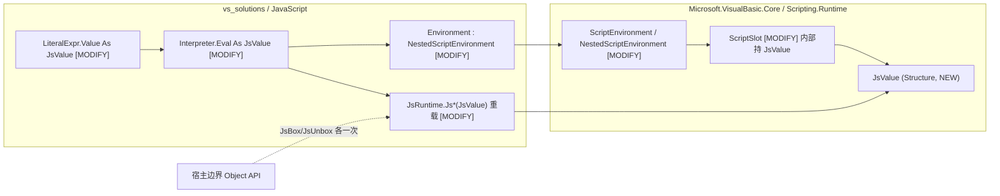

## 用户需求

重构 `vs_solutions\JavaScript`（LiteJs）VB.NET JavaScript 解释器的运行时环境，要求：

1. 删除 `Environment.vb:15-22` 中以 `Value As Object` 存储的私有 `Slot` 类；
2. 在复用 Core 库 `Microsoft.VisualBasic.Core\src\Scripting\Runtime\ScriptEnvironment`（含 `ScriptSlot`、`NestedScriptEnvironment`）代码的基础上进行重构，且**允许修改 Core 库中的这些对象**；
3. 核心目标：尽量消除 `Integer`/`Double`/`Single`/`Boolean` 等 CLR 基础类型在解释执行热路径上的 box/unbox 操作，提升脚本解释运行性能。

## 产品概述

一个纯 VB.NET 的树遍历式 JS 解释器（解析器、解释器、JS→VB 代码生成器）。本次重构保持全部 JS 语义与外部 API 不变，仅替换值的内部表示与环境实现。

## 核心功能（保持不变的语义约束）

- 作用域链变量查找/赋值；`var` 与函数提升允许同作用域重声明（覆盖，不抛错）
- `const` 重赋值抛 `JsRuntimeException.TypeError`，且可被 JS `try/catch`（捕获 `JsRuntimeException`）捕获
- 非严格模式下未声明变量赋值落到全局根作用域
- `null`（`Nothing`）与 `undefined`（`UndefinedMarker`）严格区分
- 宿主边界 API（`DefineGlobal`、`Func(Of Object(), Object)` 函数值、`ScriptIO`）保持 `Object` 签名，仅做一次边界转换

## 技术方案

### 核心决策：引入 `JsValue` 值类型（tagged union Structure）

上轮分析已确认：装箱瓶颈不在环境存储层，而在 `Eval(...) As Object`、`JsRuntime.Js*(As Object)`、`LiteralExpr.Value As Object` 的端到端 `Object` 值流。仅把 `Slot.Value` 换成 `ScriptSlot`（Class，`GetValue()` 读出即装箱）无法消除装箱。因此方案为：

1. **Core 新增 `JsValue` Structure**（参考 `ScriptSlot` 的 union 字段布局思想，但落地为值类型）：`TypeCode` 标签 + `Double/Int32/Boolean/String/Object` 字段，`Empty=undefined`、`DBNull=null`；工厂方法 + 强类型访问器，栈上传递、零装箱、零堆分配。
2. **`ScriptSlot` 内部存储改为 `JsValue`**（保留现有强类型 API 作为兼容层），环境字典变为 `Dictionary(Of String, ScriptSlot)`，槽位仅在变量声明时分配一次堆对象。
3. **LiteJs `Environment` 继承 `NestedScriptEnvironment`**，删除私有 `Slot`；`CheckReadOnly` 虚方法化后由 LiteJs 重写为抛 `JsRuntimeException.TypeError`（Core 不依赖 LiteJs，无法直接抛）；`DefineVariable` 增加覆盖语义参数（保持默认行为不变以兼容其他 Core 使用方）；暴露 `Parent/Root` 支持隐式全局赋值。
4. **`Eval`/二元运算/赋值/循环全链路切换为 `JsValue`**；`Runtime.vb` 新增 `JsValue` 重载（Double 快速路径按标签分发）；`JsGet/JsSet/JsInvoke/JsArray/JsObj` 等容器/函数调用仍走 `Object`（容器为引用类型，无装箱收益）。
5. 边界转换：LiteJs `Runtime.vb` 提供 `JsBox(JsValue)→Object`（`Empty→Undef` 标记、`DBNull→Nothing`）与 `JsUnbox(Object)→JsValue`，仅在宿主交互点各执行一次。

### 性能分析

- 热路径（数值运算、循环计数、变量读写、比较）零 box/unbox、零额外堆分配；`JsValue` 约 32 字节按值传递，成本远低于装箱。
- `ScriptSlot.ClearValues()` 每次 Set 写 7 个字段的开销随内部存储改为 `JsValue` 单字段赋值而消除。
- 语义风险点已识别并有对策：重声明、const 错误类型、隐式全局作用域、null/undefined 区分。

### 系统架构



### 关键代码结构

```
' Core: Scripting/Runtime/ScriptEnvironment/JsValue.vb
Public Structure JsValue
    Public ReadOnly VarType As TypeCode   ' Empty=undefined, DBNull=null, Double/Int32/Boolean/String/Object
    Friend ReadOnly _dbl As Double
    Friend ReadOnly _int As Integer
    Friend ReadOnly _bool As Boolean
    Friend ReadOnly _str As String
    Friend ReadOnly _obj As Object

    Public Shared ReadOnly Undef As JsValue
    Public Shared ReadOnly Null As JsValue
    Public Shared Function Number(d As Double) As JsValue
    Public Shared Function Int32(i As Integer) As JsValue
    Public Shared Function Boolean_(b As Boolean) As JsValue
    Public Shared Function Str(s As String) As JsValue
    Public Shared Function OfObject(o As Object) As JsValue   ' 含 Int32/Double/Boolean/String 分发
    Public Function AsDouble() As Double      ' Int32 标签时隐式转 Double
    Public Function AsInt32() As Integer
    Public Function Truthy() As Boolean
    Public Function IsNumber() As Boolean
End Structure
```

### 目录结构

```
Microsoft.VisualBasic.Core/src/Scripting/Runtime/ScriptEnvironment/
├── JsValue.vb             [NEW] tagged union 值类型：工厂/访问器/Truthy/标签分发
├── ScriptSlot.vb          [MODIFY] 内部存储改为 JsValue 单字段；保留 SetInteger/SetDouble 等
│                                   强类型 API 与 GetValue() 兼容层；新增 GetJsValue/SetJsValue
└── ScriptEnvironment.vb   [MODIFY] DefineVariable 增加 Optional overwrite 参数(默认保持原行为)；
                                    CheckReadOnly 改为 Protected Overridable；NestedScriptEnvironment
                                    暴露 Parent/Root 属性

vs_solutions/JavaScript/
├── Environment.vb         [MODIFY] 删除 Slot 类(15-22)；Environment 继承 NestedScriptEnvironment；
│                                   Define/Assign/TryGet/LookupOrThrow 改用 JsValue 热路径；
│                                   重写 CheckReadOnly 抛 JsRuntimeException.TypeError；
│                                   隐式全局赋值经 Root 落到根作用域
├── Runtime/Runtime.vb     [MODIFY] 新增 JsValue 版 JsTruthy/JsNum/JsStr/JsTypeOf/JsAdd/Sub/Mul/Div/
│                                   Mod/Pow/Neg/Not/Lt/Le/Gt/Ge/Eq/StrictEq；JsBox/JsUnbox 边界转换
├── AST/Ast.vb             [MODIFY] LiteralExpr.Value 类型改为 JsValue
├── Parser.vb              [MODIFY] 数字/字符串/布尔/null/undefined 字面量构造为 JsValue
├── CodeGenerator.vb       [MODIFY] 适配 LiteralExpr.Value 类型变化
├── Interpreter.vb         [MODIFY] Eval 返回 JsValue；BinaryExpr/UnaryExpr/AssignExpr/UpdateExpr/
│                                   LogicalExpr/循环条件切换 JsValue；MakeFunction 经 JsBox/JsUnbox
│                                   保持 Func(Of Object(), Object)；try/catch 参数经边界转换
└── test/LiteJsTests.vb    [VERIFY] 回归验证（test\** 不参与编译，按现有方式运行）
```

## Agent Extensions

### SubAgent

- **code-explorer**
- Purpose: 全面扫描 `Parser.vb`/`CodeGenerator.vb`/`Interpreter.vb`/`Runtime.vb` 中所有构造或消费 `LiteralExpr.Value`、`JsRuntime.*(As Object)` 的调用点，确认 JsValue 切换的完整影响面
- Expected outcome: 输出需要适配的精确调用点清单，避免遗漏编译错误