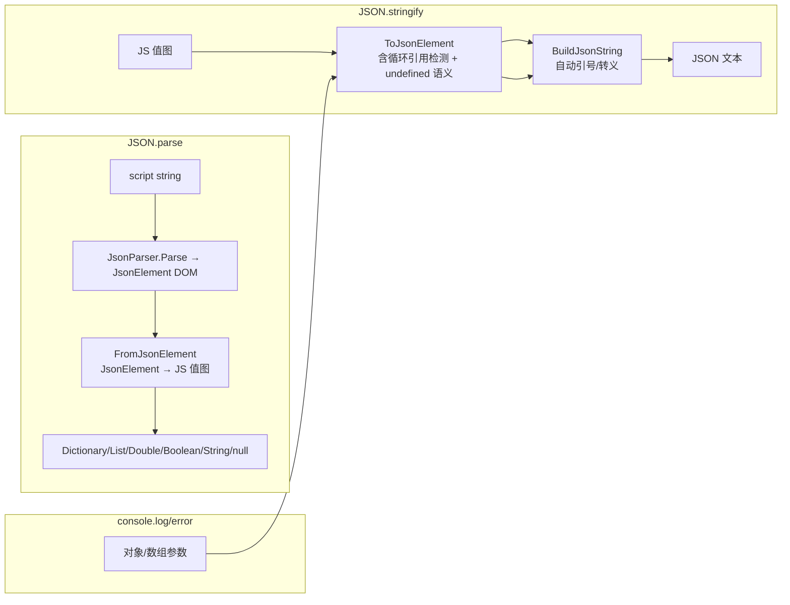

## 产品概述

基于 Core 库 `mime\application%json`（`JsonParser.Parse` + `JSONSerializer.BuildJsonString`）重构 LiteJs JavaScript 解释器的 JSON 能力，替换手写的序列化逻辑，并统一 console 输出格式。

## 核心功能

- **JSON.parse（补齐缺失实现）**：脚本调用 `JSON.parse(text)` 基于 `JsonParser.Parse` 解析为 `JsonElement` DOM，再转换为 JS 运行时值（对象→`Dictionary(Of String, Object)`、数组→`List(Of Object)`、数字→`Double`、布尔/字符串/null 原生还原）；语法错误抛 `JsRuntimeException`（新增 `SyntaxError` 工厂，可被 JS try/catch 捕获）
- **JSON.stringify（替换手写实现）**：JS 值图 → `JsonElement` DOM（`JsonObject`/`JsonArray`/`JsonValue`）→ `BuildJsonString` 输出；遵循 JS 标准语义：对象中 undefined/函数成员省略、数组中转 null、顶层 undefined/函数返回 undefined、NaN/±Infinity 转 null、循环引用抛 TypeError
- **console.log / console.error / console.warn（JSON 风格显示）**：对象与数组参数改用 `BuildJsonString` 紧凑 JSON 格式输出（如 `{"a": 1, "b": [1, 2]}`）；顶层字符串/数字/布尔/undefined/函数保持现有显示行为
- **回归保障**：现有 20 个测试全部通过，新增 JSON.parse/stringify 单元测试

## 技术方案

### 技术栈

- VB.NET / net10.0，LiteJs 已引用 `JSON-netcore5.vbproj`（LiteJs.vbproj:26）
- 复用 JSON 项目 API：`JsonParser.Parse(json) → JsonElement`、`JsonElement.BuildJsonString(opts)`（`JSONSerializerOptions`：`indent=False`、`unicodeEscape`、`unixTimestamp:=False` 使 Date 输出 ISO 字符串）

### 实现思路

所有改动收敛在 LiteJs 的 `Runtime.vb`（与现有 builtin 全部集中于 `JsRuntime` 模块的架构一致），采用**显式双向转换器**（不采用反射式 `GetJsonElement`，因对 `Object` 类型嵌套值行为不可控）：



### 关键设计点

1. **parse 侧类型还原**：`JsonValue.value` 为原始文本（字符串字面量含引号与转义）——带引号前缀 → `GetStripString(True)` 解码为 JS 字符串；`"true"/"false"` → Boolean；`"null"`/Nothing → null；其余数字文本 → Double（InvariantCulture 解析）
2. **stringify 侧**：直接向 `JsonValue` 存 .NET 原生值（String/Boolean/Double），`JSONWriter.jsonValueString` 按类型渲染（字符串自动加引号转义）；需在实现时验证 JSONWriter 对 Double/数值类型的渲染分支
3. **循环引用检测**：转换器携带祖先 `HashSet(Of Object)` 链，命中即抛 `JsRuntimeException.TypeError("Converting circular structure to JSON")`，避免无限递归
4. **错误处理**：`JsRuntimeException` 新增 `SyntaxError(message)` 工厂（模式同 TypeError/ReferenceError）；`JsonParser.Parse` 抛出的 `InvalidExpressionException`/`SyntaxErrorException` 等统一包装为 SyntaxError
5. **边界与 OptionStrict On**：`BuiltinJson(args As Object())` 参数经 `JsStr`/`DirectCast` 显式转换；stringify 结果经现有 Object 返回通道

### 目录结构

```
vs_solutions/JavaScript/
├── Runtime/JsRuntimeException.vb  # [MODIFY] 新增 SyntaxError 工厂
├── Runtime/Runtime.vb             # [MODIFY] BuiltinJson 增加 "parse" 分支；
│                                  #          JsonStringify 重写为 ToJsonElement+BuildJsonString；
│                                  #          新增 FromJsonElement 私有转换器；
│                                  #          JsDisplay 对象/数组改 JSON 风格
└── test/LiteJsTests.vb            # [MODIFY] 新增 JSON.parse/stringify/console 显示测试
```

## Agent Extensions

### SubAgent

- **code-explorer**
- Purpose: 实现前确认三处不确定点：① JSON 项目中 `JsonParser`/`JSONSerializer` 模块的完整命名空间与引用方式；② `JSONWriter.jsonValueString` 对 Double/整数等数值类型的渲染分支；③ `JsDisplay`/`JsonStringify` 在工作区的全部调用点（含 CodeGenerator 生成代码是否引用）
- Expected outcome: 输出精确的命名空间、数值渲染行为结论与完整调用点清单，避免实现遗漏