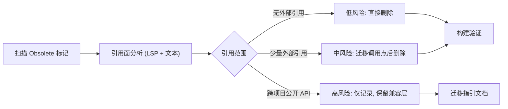

## 用户需求

在 `e:/codebuddy/GCModeller/src/runtime/sciBASIC#`（约 4800 个 `.vb` 文件、多项目 VB.NET 解决方案）中，列举所有被 `<Obsolete>` 标记的代码，并评估删除后可能造成的编译与运行影响。

## 产品概述

交付一份可执行、可复核的「Obsolete 代码审计与清理方案」：先形成全库清单与分层影响评估（低/中/高风险），再按引用爆炸半径分批次执行删除或迁移，并以构建验证收口。清单需落盘为文档，便于长期维护与后续增量清理。

## 核心功能

- 全库清点：扫描全部 `.vb` 中的 `<Obsolete>` 标记，逐一记录所属文件、行号、成员签名、弃用提示语与建议替代 API（当前共 26 文件、44 处）。
- 影响评估：按引用面划分为三类——无外部引用（可安全删除）、有少量外部引用（需先迁移调用点）、跨项目公开 API（暂缓删除，仅记录并保留兼容层）。
- 替代 API 校验：确认注释中建议的替代成员是否真实存在，标注提示语错误（如 `NumericTable.LinearRegression` 实为 `NumericTable.StandardCurveFit`）。
- 分批清理：低风险成员直接删除；中风险成员先迁移调用点再删除；高风险成员保留 `NoWarn` 兼容层并输出迁移指引。
- 构建验证：对受影响项目执行编译，确认无 BC40000/编译错误与行为回归。

## 技术栈

- 语言/平台：VB.NET（.NET 5 / netcore 多项目解决方案 `nuget.slnx`），沿用现有 `Directory.Build` 与项目级 `NoWarn` 约定，不引入任何新框架或新依赖。
- 分析手段：文本检索（精确匹配 `<Obsolete` 与成员名）+ LSP 语义引用查询，交叉验证调用点，避免误判同名符号。
- 验证手段：`dotnet build`（或 msbuild）针对受影响项目单独构建，利用编译警告/错误定位残留引用。

## 实现方案

以「先审计、后分层、按爆炸半径分批」为主线。先产出全量清单并做引用面分析，将每个成员归入低/中/高风险；低风险直接删除（仅改动定义文件），中风险先迁移调用点再删除，高风险因跨越项目边界且是下游公开 API 的数据载体，本次只记录并保留现有兼容层。

关键决策：

- **以引用面而非以文件为单位决策**：同一个文件里可能同时存在多种风险等级（如 `DoCluster.vb` 中 `RunVectorCluster` 无引用、`RunCluster` 有 3 处外部引用），必须逐成员判定。
- **保留同名非弃用重载**：`LinearRegression(Vector)`、`Circle` 三参构造、`AddSelectedCells`、`FieldGet/FieldSet/PropertyGet` 系列等必须保留，删除范围严格限定在被标记的成员。
- **防范同名符号误删**：`StyleRepository.AddStyle`（StyleRepository.vb:122）、`StyleManager.*`（StyleManager.vb:331/342/352/411）、`Cell.RemoveStyle`（Cell.vb:260）、Math2D 的 `Circle` 均非目标，需按命名空间与签名严格区分。
- **常量依赖先迁移**：`AnovaTest` 类本身无人实例化，但其 `P_FIVE_PERCENT`/`P_ONE_PERCENT` 常量被 3 个文件引用，须先迁移常量再删类。
- **旧包装器改写**：`NumericTable.AutoPointDeletion`（NumericTableRegressions.vb:442-470）直接转调弃用的 `DoubleLinear.AutoPointDeletion`，删除后必须重写包装器实现（或内联迁移），并移除 `#Disable/#Enable Warning BC40000`。

性能与可靠性：纯静态分析与编译期删除，无运行时开销；风险点为「删错同名符号」与「漏掉反射/字符串形式的间接引用」，通过 LSP 引用查询 + 全仓文本检索双通道校验，并在每批后构建验证来兜底。

## 实现要点

- 删除前对每个成员用 LSP `findReferences` 复核（含 `.vb` 之外的 `.md`/教程脚本引用），确认外部引用为零或已完成迁移。
- 对于跨项目公开 API（`ClusterEntity`、`EntityClusterModel`、`IntegerEntity`、`EntityBase(Of T)`），不得删除基座类型，因其是 BisectingKMeans/Canopy/CMeans/KNN/Kmedoids/Spectral/Density 等非弃用算法的数据载体。
- 保留 `DataMining.NET5.vbproj:32` 与 `UMAP.NET5.vbproj:30` 的 `<NoWarn>$(NoWarn);BC40000</NoWarn>` 兼容层，直至高风险批次真正落地。
- 文档同步：`ANOVA/README.md:40` 的 `DataSetHelper.CommonDataSet` 示例需改为 `table.AsStatisticsObject(...)`。
- 删除后若出现「第 4 个非弃用 `CommonDataSet` 重载失去全部调用者」等死代码，只记录、不在本批一并删除，避免扩大改动面。
- 修正错误的弃用提示（`LinearRegression` 提示的 `NumericTable.LinearRegression` 不存在，应改为 `NumericTable.StandardCurveFit`；`FakeAUCGenerator` 注释的 `Auc.RankAUC` 实为 `RocAuc.RankAUC`）。

## 架构设计

本任务为存量代码清理，不改变系统架构。处理流程如下：



## 目录结构

```
sciBASIC#/
├── docs/
│   └── Obsolete_Code_Audit.md                  # [NEW] 审计报告：全量清单、行号、签名、分层影响评估、替代 API 对照、迁移指引
├── Data_science/DataMining/DataMining/
│   ├── Evaluation/ROC.vb                        # [MODIFY] 低风险：删除弃用的 BestThreshold(TPR,FPR)（内部仅自委托到旧签名）
│   ├── Evaluation/Roc/Auc.vb                    # [MODIFY] 低风险：删除 RocAuc 中弃用的 BestThreshold(TPR,FPR) 旧签名，保留 IEnumerable(Of Validation) 重载
│   ├── Evaluation/LabelEvaluate/RankPair.vb     # [MODIFY] 低风险：删除 Obsolete 的 RankPair 类
│   ├── Evaluation/LabelEvaluate/PerformanceEvaluator.vb  # [MODIFY] 低风险：删除 Obsolete 类及其对 RankPair/ChangePoint 的引用
│   ├── Evaluation/LabelEvaluate/ChangePoint.vb  # [MODIFY] 低风险：删除 Friend ChangePoint 类（须与 PerformanceEvaluator 同批）
│   ├── Evaluation/LabelEvaluate/FakeAUCGenerator.vb  # [MODIFY] 低风险：删除 Obsolete 模块并修正注释中的替代 API 名
│   ├── ValueMapping.vb                          # [MODIFY] 低风险：删除 AsDataSet 两个弃用重载，保留模块其他成员
│   └── ComponentModel/EntityBase.vb             # [KEEP] 高风险：跨项目基座类型，仅记录不删除
│   └── ComponentModel/IntegerEntity.vb          # [KEEP] 高风险
│   └── ComponentModel/EntityModels/ClusterEntity.vb      # [KEEP] 高风险：约30处引用
│   └── ComponentModel/EntityModels/EntityClusterModel.vb # [KEEP] 高风险：约17处引用
│   └── ComponentModel/EntityModels/DataSetConvertor.vb   # [KEEP] 中高：项目内2处，后续批次
├── Data_science/DataMining/UMAP/Umap.vb         # [MODIFY] 低风险：删除 InitializeFit(IEnumerable(Of ClusterEntity)) 重载，保留 Double()() 重载
├── Data_science/DataMining/hierarchical-clustering/hierarchical-clustering/ClusteringAlgorithm/DoCluster.vb  # [MODIFY] 中风险：删 RunVectorCluster；迁移 RunCluster 的 3 处调用点后删除
├── Data_science/Mathematica/Math/DataFittings/Linear/Extensions.vb  # [MODIFY] 低风险：删除 PointF() 版 LinearRegression，保留 Vector 版；修正替代提示为 StandardCurveFit
├── Data_science/Mathematica/Math/DataFittings/Linear/DoubleLinear.vb # [MODIFY] 中风险：删除 AutoPointDeletion 前先改写包装器
├── Data_science/Mathematica/Math/DataFittings/NumericTableRegressions.vb  # [MODIFY] 中风险：重写 NumericTable.AutoPointDeletion 包装器，移除 #Disable Warning BC40000
├── Data_science/Mathematica/Math/DataFittings/LASSO/LassoFit.vb  # [MODIFY] 低风险：删除丢弃用的 toDataFrame，保留 toNumericTable
├── Data_science/Mathematica/Math/ANOVA/MultivariateAnalysis/PLSData.vb  # [MODIFY] 低风险：删除 GetPLSScore/GetPLSLoading
├── Data_science/Mathematica/Math/ANOVA/MultivariateAnalysis/PCAData.vb  # [MODIFY] 中风险：删除 GetPCAScore/GetPCALoading，先迁移 PC2.vb 取值逻辑
├── Data_science/Mathematica/Math/ANOVA/MultivariateAnalysis/DataSet.vb  # [MODIFY] 中风险：删除 3 个弃用 CommonDataSet 重载，保留底层实现（记录死代码）
├── Data_science/Mathematica/Math/ANOVA/ANOVA/Anova.vb          # [MODIFY] 中风险：迁移 P_* 常量后删除 AnovaTest 类
├── Data_science/Mathematica/Math/ANOVA/ANOVA/DistributionTable.vb  # [MODIFY] 中风险：改为引用迁移后的常量
├── Data_science/Mathematica/Math/ANOVA/ANOVA/TableOnepercent.vb    # [MODIFY] 中风险
├── Data_science/Mathematica/Math/ANOVA/ANOVA/TableFivepercent.vb   # [MODIFY] 中风险
├── Data_science/Mathematica/Math/ANOVA/README.md                  # [MODIFY] 中风险：更新 AsStatisticsObject 示例
├── Data_science/Visualization/Plots-statistics/PCA/PC2.vb         # [MODIFY] 中风险：GetPCAScore -> ScoreTable，改写 DataFrame 取值
├── Data_science/Visualization/Plots-statistics/Heatmap/HeatMapPlot.vb      # [MODIFY] 中风险：RunCluster -> distanceMatrix()+hca()/hcut()
├── Data_science/Visualization/Plots-statistics/HistStackedBarplot.vb       # [MODIFY] 中风险：同上
├── mime/application%vnd.openxmlformats-officedocument.spreadsheetml.sheet/Excel/XLSX/Writer/Worksheet/Worksheet.vb  # [MODIFY] 低风险：删除 3 个 SetSelectedCells，保留 AddSelectedCells
├── mime/application%vnd.openxmlformats-officedocument.spreadsheetml.sheet/Excel/XLSX/Writer/Workbook.vb             # [MODIFY] 低风险：删除 6 个 AddStyle/AddStyleComponent/RemoveStyle，勿动 StyleRepository/StyleManager/Cell 同名成员
├── gr/Microsoft.VisualBasic.Imaging/Drawing3D/Models/Paths/Circle.vb  # [MODIFY] 低风险：删除 2 参构造，保留 3 参构造
├── Microsoft.VisualBasic.Core/src/Extensions/Reflection/Delegate/DelegateFactory.vb  # [MODIFY] 低风险：删除 6 个弃用成员，保留 FieldGet/FieldSet/PropertyGet 系列
└── Microsoft.VisualBasic.Core/src/ApplicationServices/DynamicInterop/UnmanagedDll.vb # [MODIFY] 低风险：删除 Private createLdLibPathMsg 并清理注释残留
```

## Agent Extensions

### Skill

- **lsp-code-analysis**
- Purpose: 对每个 `<Obsolete>` 成员执行语义级引用查询（findReferences / workspaceSymbol / call hierarchy），区分同名非弃用重载，精确判定删除爆炸半径。
- Expected outcome: 每个待删除成员得到「引用为零 / 仅自引用 / 有 N 处外部引用」的确定性结论，避免误删 `StyleRepository.AddStyle`、`StyleManager.*`、Math2D `Circle` 等同名符号。

### SubAgent

- **code-explorer**
- Purpose: 批量扫描全库 `<Obsolete>` 标记，汇总文件、行号、签名与弃用提示，并跨项目核对替代 API 是否存在及调用点分布。
- Expected outcome: 产出完整、无遗漏且经交叉验证的 Obsolete 清单与影响评估原始数据，支撑审计报告与分批清理任务。