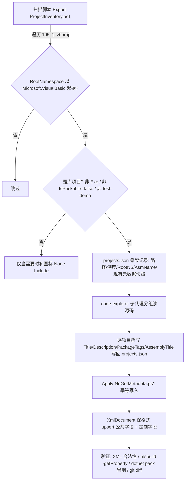

## 产品概述

对 `g:\pixelArtist\src\framework` 仓库中全部 `.vbproj` 项目文件做一次系统性的 NuGet 包元数据补全：找出所有 `RootNamespace` 以 `Microsoft.VisualBasic` 起始的项目，为其中**可打包的库项目**（约 85+ 个）补充 nuget 包的 `Title`、`Description`、`PackageTags`(keywords) 与 `AssemblyTitle`，并把协议、公司、作者、图标、仓库与项目 URL 等公共元数据统一为规定取值。

## 核心功能

1. **全仓扫描与分类**：递归扫描 195 个 vbproj，筛出 `RootNamespace` 以 `Microsoft.VisualBasic` 起始的约 110 个；按"是否为可打包库项目"二次分类，排除 `OutputType=Exe`、`IsPackable=false`、路径含 `test`/`demo`/`Demo`/`Example`/`_smoketest` 的项目，得到最终处理清单。
2. **统一公共元数据**（覆盖式，含已有值）：

- `Authors` = `xieguigang <I@xieguigang.me>`
- `Company` = `sciBASIC.NET Foundation`
- `PackageLicenseExpression` = `GPL-3.0-or-later`（含 `Core.vbproj` 由 `PackageLicenseFile=LICENSE` 改为表达式）
- `PackageIcon` = `logo-knot.png`，图标引用沿用既有约定 `vs_solutions\logo-knot.png`
- `PackageProjectUrl` = `http://scibasic.net/`
- `RepositoryUrl` = `https://github.com/xieguigang/sciBASIC`（去除已有 `.git` 后缀）

3. **逐项目定制元数据**：基于每个项目实际源码内容撰写 `Title`、`Description`、`PackageTags`（小写分号分隔）、`AssemblyTitle`，已有业务描述的项目在保留语义基础上增强，但 `Authors`/`Company` 一律覆盖（含 `FeatherFormat` 的第三方作者 Kevin Montrose）。
4. **图标引用修复**：补全 3 个只有 `PackageIcon` 而无 `<None Include>` 的项目（`gr\physics\test`、`Data_science\Mathematica\Math\ODE\test\test5`、`Data_science\MachineLearning\MachineLearning\test`），消除 pack 时的 NU5046 错误。
5. **可验证交付**：提供幂等脚本与清单文件，支持 XML 合法性校验、`msbuild` 属性回读与 `dotnet pack` 冒烟，并可通过 git 一键回滚。

## 技术栈选型

- **平台**：.NET SDK 风格 MSBuild 项目（VB.NET），目标框架 `net10.0` / `net10.0-windows`，仓库当前无 `Directory.Build.props`、无任何手写的集中式 MSBuild 属性文件（`obj\*.nuget.g.props` 均为构建产物，不可用）。
- **改造脚本**：PowerShell 7 + `[System.Xml.XmlDocument]`（`PreserveWhitespace = $true`），UTF-8 BOM 感知读写。
- **清单载体**：JSON 清单文件（`projects.json`），作为"逐项目语义分析"与"批量写入"之间的唯一契约。
- **验证**：`dotnet msbuild -getProperty:*`（.NET 8+ SDK 能力）、`[xml]` 类型强转换做 XML 合法性校验、`dotnet pack` 冒烟。
- **回滚**：工作区当前 `working tree clean`，可 `git checkout -- '*.vbproj'` 整体回滚。

## 实现思路

采用 **"清单驱动 + 幂等脚本批量改写"** 而非逐文件手工编辑、也非引入 `Directory.Build.props`：

1. **为何不用 `Directory.Build.props`**：MSBuild 中 `Directory.Build.props` 在**项目体之前**导入，项目内已有的 `Authors`/`Company` 会**覆盖** props 中的值，无法满足"统一覆盖已有作者（含 FeatherFormat 的 Kevin Montrose）"这一硬性要求；同时在根目录新增该文件会影响全部 195 个项目（含 test/demo 与 legacy 项目），爆炸半径过大且仓库无此先例。故排除。
2. **为何用脚本而非纯手工替换**：约 85 个文件 × 10 余个属性 ≈ 上千处编辑，手工替换不可控；脚本可保证所有项目的公共字段**取值与格式完全一致**，并支持重复执行（幂等）与一键回滚。
3. **为何 XmlDocument 而非正则**：vbproj 中存在同名元素、条件 PropertyGroup、多目标框架等结构，正则易误伤；`XmlDocument` 配合 `PreserveWhitespace` 可只在既有 PropertyGroup 内 upsert，新增元素时手工补缩进空白节点，从而把 diff 限制在真实变更行。
4. **改造对象判定**（脚本内统一实现）：

- **纳入**：`RootNamespace` 以 `Microsoft.VisualBasic` 起始 且 非 `OutputType=Exe` 且 非 `IsPackable=false` 且 路径不含 `test/`、`demo`、`Demo/`、`Example/`、`_smoketest` 的项目。
- **特殊处理**：`mime\application%rtf\RTF.vbproj` 为 legacy 非 SDK 格式（`ToolsVersion="12.0"`、`ProjectGuid`、`Microsoft.VisualBasic.targets`），`PackageIcon`/`PackageLicenseExpression`/`PackageTags` 对其无意义——仅写入 `AssemblyTitle`/`Title`/`Description`/`Authors`/`Company`/`Copyright`，跳过全部 NuGet pack 专有属性与图标 `<None>` 项。
- `nlp\KnowledgeGraph`、`docx\WordDocument` 等缺 `GeneratePackageOnBuild` 的项目仍纳入（补充元数据本身无害，且为后续发包做准备），但不擅自改动其打包开关。

## 统一元数据取值表（脚本常量）

| 属性 | 取值 | 处理策略 |
| --- | --- | --- |
| `Authors` | `xieguigang &lt;I@xieguigang.me&gt;` | 覆盖（XML 转义尖括号） |
| `Company` | `sciBASIC.NET Foundation` | 覆盖 |
| `PackageLicenseExpression` | `GPL-3.0-or-later` | 覆盖全部 `gpl`/`gpl3`/`GPL3`/`GPL` |
| `Copyright` | `Copyright (c) sciBASIC.NET Foundation` | 覆盖 `GPL3` 等异常值 |
| `PackageIcon` | `logo-knot.png` | 覆盖/补全 |
| `PackageProjectUrl` | `http://scibasic.net/` | 覆盖（含错误填写成 github 的 imaging 项目） |
| `RepositoryUrl` | `https://github.com/xieguigang/sciBASIC` | 覆盖并剥离 `.git` |
| `RepositoryType` | `git` | 缺失则补 |
| `Title` / `Description` / `PackageTags` / `AssemblyTitle` | 逐项目定制（来自 `projects.json`） | 覆盖/补全 |


## 关键实现细节

- **图标相对路径算法**：`<None Include>` 路径 = N 个 `..\` + `vs_solutions\logo-knot.png`，其中 **N = vbproj 所在目录相对 `framework\` 的层级深度**（深度 2 → `..\..\`，深度 3 → `..\..\..\`，深度 4 → `..\..\..\..\`）。子元素固定为 `<Pack>True</Pack>` 与 `<PackagePath>\</PackagePath>`。已存在该 Include 的项目**跳过**（大小写与 `\`/`/` 归一后再比对），绝不改动已有路径。
- **写入位置**：统一 upsert 进**第一个无条件 `PropertyGroup`**（即含 `RootNamespace` 的那个），避免条件 PropertyGroup 导致 Debug/Release 行为不一致。
- **缩进保持**：新插入元素前，克隆同 PropertyGroup 内相邻元素的 `XmlWhitespace` 前缀节点；文件级缩进（Tab / 2 空格 / 4 空格）不统一，按文件原样继承，避免产生"整文件重写"式 diff。
- **编码**：读取时检测 BOM 与行尾（CRLF/LF），写回时原样保留；禁用 `XmlDocument.Save` 的默认 BOM 改写行为。
- **幂等性**：脚本先读后写，值相同则跳过；重复执行产出零 diff，可安全分批多次运行。
- **XML 转义**：`Authors` 中的 `<`/`>` 必须写成 `&lt;`/`&gt;`；`Description` 中的 `&`、引号同理（用 `InnerText` 赋值由 XmlDocument 自动转义，勿用 `InnerXml`）。
- **`Core.vbproj` 专项**：删除 `<PackageLicenseFile>LICENSE</PackageLicenseFile>`，同步移除配套的 `<None Include="..\..\LICENSE" Pack="True" .../>`（若存在），否则会触发 NuGet 的 NU5034/"同时指定 LicenseFile 与 LicenseExpression" 冲突；同时为其补 `PackageTags`。
- **3 个 test 项目的图标修复**：`gr\physics\test\test.vbproj`（深度 3）补 `..\..\..\vs_solutions\logo-knot.png`；`Data_science\Mathematica\Math\ODE\test\test5.vbproj` 与 `Data_science\MachineLearning\MachineLearning\test\test.vbproj`（深度 4）补 `..\..\..\..\vs_solutions\logo-knot.png`。**仅补图标引用，不补其它元数据**（与"test 项目不纳入"的范围决策一致）。

## 架构设计



## 目录结构

```
g:/pixelArtist/src/framework/
├── vs_solutions/dev/NuGetMetadata/              # [NEW] 元数据治理工具目录（新增文件夹，不含 vbproj，不参与任何 .sln 编译，零构建影响）
│   ├── Export-ProjectInventory.ps1              # [NEW] 只读扫描器：递归枚举 *.vbproj，读取 RootNamespace/AssemblyName/OutputType/IsPackable/现有元数据快照，
│   │                                            #       计算目录深度与图标相对路径，判定库项目 vs test/demo/legacy，输出 projects.json 骨架。
│   │                                            #       必须排除 obj/、bin/、.git/ 目录，避免扫到 nuget.g.props 等产物。
│   ├── projects.json                            # [NEW] 唯一契约文件。每条记录：path / depth / rootNamespace / assemblyName / isLibrary /
│   │                                            #       isLegacy / iconRelPath / title / description / packageTags / assemblyTitle / notes。
│   │                                            #       title/description/packageTags/assemblyTitle 初值为空，由源码分析阶段填充。
│   └── Apply-NuGetMetadata.ps1                  # [NEW] 幂等写入器：以 projects.json 为输入，对库项目 upsert 全部公共元数据 + 定制元数据；
│                                                #       对 3 个 test 项目仅补图标 <None Include>；对 legacy 项目（RTF.vbproj）跳过 pack 专有属性。
│                                                #       支持 -WhatIf 预演与 -ProjectFilter 分批处理；写前自动备份到 .bak（或依赖 git 回滚）。
├── Microsoft.VisualBasic.Core/src/Core.vbproj   # [MODIFY] 核心库：PackageLicenseFile → PackageLicenseExpression；Authors/Company/Copyright 覆盖；补 PackageTags；
│                                                #          剥离 RepositoryUrl 的 .git；Title/Description/AssemblyTitle 沿用并强化为科学计算运行时语义。
├── mime/**/*.vbproj                             # [MODIFY] 10 个项目（json/xml/html/markdown/yaml/pdf/rdf_xml/xlsx/WordDocument/RTF）
│                                                #          补 Title/Description/PackageTags/AssemblyTitle；RTF.vbproj 按 legacy 规则只写程序集级字段。
├── nlp/**/*.vbproj                              # [MODIFY] 3 个项目（NLP.NET、word2vec、KnowledgeGraph）补元数据。
├── gr/**/*.vbproj                               # [MODIFY] 10 个库项目（Imaging、Drawing-net4.8、physics、avi、Landscape、network_layout、
│                                                #          Datavisualization.Network、Network.IO.Extensions、Visualizer、NetworkCanvas）；
│                                                #          imaging.NET5.vbproj 需修正 PackageProjectUrl（误填 github）。
├── vs_solutions/dev/**/*.vbproj                 # [MODIFY] 2 个项目（vs_PDB、VisualStudio.NET5）。
├── www/Microsoft.VisualBasic.Webservices.Bing/  # [MODIFY] Bing.NET5.vbproj 补元数据。
│   └── Bing.NET5.vbproj
├── Data/**/*.vbproj                             # [MODIFY] 13 个项目（Trinity、MyersDiff、GraphQuery、DataFrame、DataFrame.Extensions、
│                                                #          BinaryData/DataStorage/msgpack/HDF5/HDSPack/netCDF/SQLite3/FeatherFormat）；
│                                                #          FeatherFormat 的 Authors/Company 由 Kevin Montrose 覆盖为统一值。
├── Data_science/**/*.vbproj                     # [MODIFY] 49 个库项目（Visualization/Plots/Plots-statistics、Mathematica/{Math,SignalProcessing} 各子项目、
│                                                #          MachineLearning 各子项目、MachineVision/GaussianSplatting、Graph、DataMining 各子项目）。
└── gr/physics/test/test.vbproj, Data_science/Mathematica/Math/ODE/test/test5.vbproj,
    Data_science/MachineLearning/MachineLearning/test/test.vbproj   # [MODIFY] 仅补图标 <None Include>，不加其它元数据。
```

## 关键代码结构

`projects.json` 单条记录结构（脚本与人工分析之间的契约）：

```
{
  "path": "mime/application%json/JSON-netcore5.vbproj",
  "depth": 2,
  "rootNamespace": "Microsoft.VisualBasic.MIME.application.json",
  "assemblyName": "Microsoft.VisualBasic.MIME.application.json",
  "isLibrary": true,
  "isLegacy": false,
  "iconRelPath": "..\\..\\vs_solutions\\logo-knot.png",
  "title": "JSON serialization and LINQ query provider",
  "description": "...",
  "packageTags": "scibasic;mime;json;serialization;linq",
  "assemblyTitle": "Microsoft.VisualBasic.MIME.application.json"
}
```

`PackageTags` 命名约定：以 `scibasic` 开头，后接领域词（取自 RootNamespace 语义段，如 `mime`/`imaging`/`math`/`visualization`/`machine-learning`）与功能词（如 `parser`/`serializer`/`chart`/`layout`），全小写、分号分隔、3–6 个。

`AssemblyTitle` 约定：优先取 `AssemblyName`（即完整 RootNamespace 形式），已有更贴切英文描述的（如 Drawing-net4.8）保留并微调。

## Agent Extensions

### SubAgent

- **code-explorer**
- **用途**：分批读取约 85 个待处理项目的实际 `.vb` 源码（命名空间、顶层公共类/模块、核心算法或功能入口），据此逐个撰写 `Title`、`Description`、`PackageTags` 三个字段，杜绝"按项目名臆测"导致的千篇一律描述。按 `mime+nlp+gr+vs_solutions+www`、`Data+Core`、`Data_science` 三组并行执行。
- **预期产出**：每组返回结构化表格（vbproj 路径 → 建议 Title / Description / PackageTags / AssemblyTitle / 一句话功能依据），全部合并写入 `vs_solutions/dev/NuGetMetadata/projects.json`，覆盖率 100%（无空值、无重复文本）。