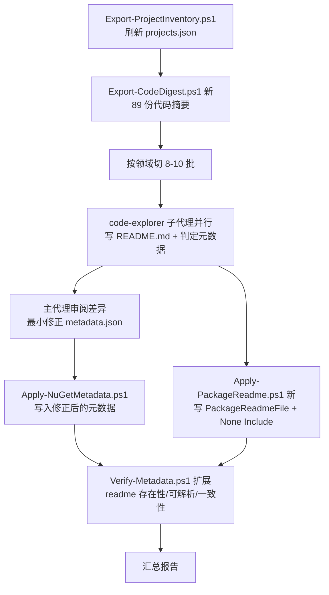

## 产品概述

对 sciBASIC# 仓库中 **89 个可打包库项目**（RootNamespace 以 `Microsoft.VisualBasic` 开头、非 test/demo/Exe、非 `IsPackable=false`）做一次"NuGet 描述性元数据复核 + 项目 README 补齐"：以每个项目的**真实源码内容**为依据，复核并按需修正 `vbproj` 中 NuGet 包的 `Title` / `Description` / `PackageTags` 等描述性信息；同时为每个项目在其所属文件夹产出**简短的英文 README.md**，并通过 `PackageReadmeFile` 节点把该文档挂到 NuGet 包上。

## 核心功能

1. **源码驱动的代码摘要抽取**：按项目扫描 `.vb` 源码（排除 `obj`/`bin`/`test`），抽取目录结构、命名空间、公共类型清单、XML 文档注释与核心入口 API，作为撰写与复核的依据，避免"凭项目名臆测"。
2. **元数据复核与最小修正**：逐项核对现有 89 条 `title`/`description`/`packageTags`/`assemblyTitle` 是否与实际代码吻合，**仅修正缺失、重复或明显文不对题的条目**，其余原样保留；修正前产出差异报告。
3. **README 生成与接线**：81 个缺失 README 的项目新建简短英文 `README.md`（项目文件夹内）；7 个已有 `README.md` 与 1 个 `PROJECT_SUMMARY.md` 的项目保留原文件、仅补齐 `PackageReadmeFile` 链接；把 2 个指向项目文件夹之外 readme 的工程（`Microsoft.VisualBasic.Core/src/Core.vbproj`、`gr/Microsoft.VisualBasic.Imaging/imaging.NET5.vbproj`）改为指向本文件夹内的 README。
4. **幂等写入与全量校验**：通过可重复执行、支持 `-WhatIf` 预览的脚本写入 `PackageReadmeFile` 属性与配套 `<None Include … Pack=True>` 项（编码/换行/Tab 缩进保真）；扩展校验脚本覆盖 readme 存在性、路径可解析性与文件名一致性。

## 边界

- 不处理 106 个非库 vbproj（test / demo / Exe / 其他命名空间）。
- 不重写质量合格的描述性元数据，不改动 `Authors`/`Company`/`Copyright`/`PackageIcon`/许可证等已统一的字段。

## 技术栈

- **Windows PowerShell 5.1**（实测 5.1.20348.4163）：沿用仓库现有脚本体系。禁用 `[System.IO.Path]::GetRelativePath`、空合并 `??` 等 .NET Core / PS7 语法。
- **System.Xml.XmlDocument（`PreserveWhitespace = $true`）**：结构化读写 vbproj，而非正则替换，保证 XML 合法与幂等。
- **VB.NET 源码静态抽取**：基于正则 + 行扫描，不引入 Roslyn 依赖。
- 复用 `vs_solutions/dev/NuGetMetadata/` 既有流水线（`Export-ProjectInventory.ps1` / `Apply-NuGetMetadata.ps1` / `Verify-Metadata.ps1`）。

## 实现方案

### 核心策略

"**先抽取代码事实 → 再并行产出内容 → 最后脚本化幂等落盘 → 校验**"四段式，与仓库既有流水线无缝衔接：

1. **刷新清单**：重跑 `Export-ProjectInventory.ps1` 生成 `projects.json`（现有快照为 2026-09-04，需刷新 `snapshot` 字段）。
2. **代码摘要**：新增 `Export-CodeDigest.ps1`，为每个库项目生成一份紧凑的 Markdown 摘要（目录树 + 命名空间 + 公共类型 + XML `<summary>` + 关键 `Public Function/Sub/Property` 签名 + `Imports`）。单项目约 1–3 KB，总计约 200 KB，按领域切分为 8–10 个批次文件，使后续并行处理不必通读 3400 个源码文件。
3. **并行产出**：按领域把 89 个项目切成 8–10 批，用 `code-explorer` 子代理并行处理；每批精读该批摘要 + 对核心文件做针对性 `read_file`，产出 README 并判定元数据是否有"明显问题"。
4. **落盘与校验**：新增 `Apply-PackageReadme.ps1` 写入 readme 接线；扩展 `Verify-Metadata.ps1` 做全量校验。

### 关键技术决策

- **新增独立脚本而非改动 `Apply-NuGetMetadata.ps1` 主流程**：`Apply-NuGetMetadata.ps1` 已稳定且刚完成 89 个项目的写入，改动它会扩大影响面（blast radius）。readme 接线是正交的新职责，独立脚本 + 内联复制既有辅助函数（与仓库"每个 ps1 自包含"的既有风格一致）风险最低。
- **摘要先行而非子代理直接翻源码**：89 个项目共约 3400 个 `.vb`，其中 `Core.vbproj` 单项目 914 个。直接探索会造成大量重复 I/O 与上下文浪费；一次性抽取摘要后按批分发，整体为 O(总文件数) 单次遍历。
- **README 文件由子代理直接落盘，主代理只收汇总报告**：81 份 README 若全部经由主代理上下文转写，会产生约 5 万 token 的无谓中转；子代理写文件、只回传"路径 + 状态 + 元数据判定"的紧凑报告，主代理聚焦差异审阅与脚本执行。
- **元数据"最小改动"策略**：已实测现有 89 条无重复 title/description/assemblyTitle、无泛化或过短条目，抽查 `MyersDiff`、`MLDataStorage`、`GaussianSplatting` 与代码完全吻合。因此默认 `verdict=ok` 不动，只有子代理给出明确"代码证据 + 原文问题"的条目才改写，并先出差异报告。
- **`PackageReadmeFile` 与 `<None Include>` 语义分离**：前者是**包内文件名**（`README.md`），后者是**相对工程目录的物理路径**。项目文件夹内的 readme 两者同名；`CVODE_Solver` 沿用既有 `PROJECT_SUMMARY.md`；`Core.vbproj` 与 `imaging.NET5.vbproj` 需要把 `Include` 从 `..\README.md` / `..\..\README.md` 改为项目文件夹内的 `README.md`（原父级 README 文件保留不删）。

### 性能与可靠性

- 复杂度：清单扫描 O(195 工程)、摘要抽取 O(3400 文件) 各一次；落盘阶段 O(89) 次 XML 解析并仅在内容变化时写盘。整体分钟级，无热点。
- `$ErrorActionPreference = 'Stop'` + 单项目 `try/catch`：坏文件仅 `Write-Warning` 并计入 `failed`，不中断全量。
- 幂等：数值相等即跳过、文件无实质变化不落盘，可安全重复运行；`-WhatIf` 走完整判定但跳过所有写盘。
- 路径安全：目录名含 `%`（`mime/application%json`、`mime/text%html`、`mime/application%rdf+xml`），所有路径操作一律 `-LiteralPath` / `.FullName`，禁止把路径当通配符传给 `-Path`；`Get-ChildItem -Recurse` 加 `-ErrorAction SilentlyContinue`。
- 编码保真：复用 `Save-XmlPreserving`（探测 BOM、探测 CRLF/LF、抑制 XmlWriter 自造的 `encoding="utf-16"` 声明并回填原声明）；`Get-Content` 一律显式 `-Encoding UTF8`；`Core.vbproj` 为 Tab 缩进，用 `Get-Indents` 推断，不硬编码空格。

## 实现备注（执行细节）

- 摘要抽取必须排除：`\obj\`、`\bin\`、`\test\`、`My Project\`；`obj` 下存在自动生成的 `*.AssemblyInfo.vb`，混入会污染摘要。
- VB 声明识别正则需覆盖 `Namespace`、`Public/Friend Module|Class|Structure|Interface|Enum`、`<summary>` XML 注释块、`Public Function|Sub|Property` 签名；只取签名行不取方法体，控制摘要体积。
- README 统一结构（简短，约 30–45 行）：`# 标题` → 一句话简介 → `## Overview` → `## Key Types / Namespaces`（`Namespace.Type` + 一句话职责）→ `## Quick Start`（一段可运行的 VB.NET 片段，取自项目自身 test 或公共 API）→ `## Package`（Assembly / TargetFramework / Tags）→ `## License`（GPL-3.0-or-later）。
- 已有 README 的 8 个项目：只写 `PackageReadmeFile` + `<None Include>`，不触碰文件内容；若其文件名非 `README.md`（`CVODE_Solver` 的 `PROJECT_SUMMARY.md`），`PackageReadmeFile` 取该实际文件名。
- 写 `<None Include>` 时先按 `Include` 属性判重（可能已存在指向父目录的同名项），存在则改写 `Include` + 补齐 `Pack`/`PackagePath` 子元素，避免产生重复项导致 NU5118 之类的打包告警。
- 脚本 `$Root` 默认值必须改为仓库根（`Split-Path` 上溯三级，与 `Export-ProjectInventory.ps1` 一致），现有 `Apply-NuGetMetadata.ps1` 与 `Verify-Metadata.ps1` 里写死的 `'g:\pixelArtist\src\framework'` 是错误路径，一并修正。

## 架构设计



数据流：`*.vbproj` → `projects.json`（清单）→ `digest/*.md`（代码事实）→ `README.md`（产物）+ `metadata.json`（差异）→ `*.vbproj`（写入）→ 校验报告。

## 目录结构

```
g:\GCModeller\src\runtime\sciBASIC#\
├── vs_solutions/dev/NuGetMetadata/
│   ├── Export-ProjectInventory.ps1   # [MODIFY] 保持扫描逻辑；按需微调（确认排除 package-install-cache 等目录），重新运行以刷新 projects.json
│   ├── Apply-NuGetMetadata.ps1       # [MODIFY] 修正 $Root 默认值为仓库根（现为错误的 g:\pixelArtist\src\framework）；主流程不变
│   ├── Verify-Metadata.ps1           # [MODIFY] 修正 $Root；新增 readme 校验：PackageReadmeFile 必填、
│   │                                #   <None Include> 可解析为真实文件、Include 文件名与 PackageReadmeFile 值一致、
│   │                                #   Pack=True 且 PackagePath=\；输出 readme 缺失/断链清单
│   ├── Export-CodeDigest.ps1         # [NEW] 按 projects.json 的 89 个库项目抽取代码摘要到 digest/ 下（按领域分文件）：
│   │                                #   目录树、Namespace、Public 类型清单+<summary>、公共成员签名、Imports
│   ├── Apply-PackageReadme.ps1       # [NEW] 幂等写入 readme 接线：主 PropertyGroup 加 <PackageReadmeFile>，
│   │                                #   ItemGroup 加/改 <None Include=readme><Pack>True</Pack><PackagePath>\</PackagePath></None>；
│   │                                #   内联复用 Test-WhitespaceNode/Get-Indents/Append-Element/Find-ChildElement/
│   │                                #   Set-Property/Save-XmlPreserving；支持 -WhatIf 与 SUMMARY
│   ├── metadata.json                 # [MODIFY] 仅修正被判定为"明显有问题"的条目（最小 diff）
│   ├── projects.json                 # [MODIFY-运行时] 重新生成
│   └── digest/                       # [NEW] Export-CodeDigest.ps1 的输出，按领域分片的 Markdown 摘要
├── <81 个项目文件夹>/README.md        # [NEW] 新建的简短英文项目文档
├── Microsoft.VisualBasic.Core/src/README.md          # [NEW] 供 Core.vbproj 使用（原 ..\README.md 保留不动）
├── gr/Microsoft.VisualBasic.Imaging/README.md        # [NEW] 供 imaging.NET5.vbproj 使用（原 ..\..\README.md 保留不动）
└── <89 个 *.vbproj>                  # [MODIFY] 新增/改写 PackageReadmeFile 与 readme 的 <None Include> 项
```

## 关键代码结构

`Apply-PackageReadme.ps1` 产出的目标形态（与 `Microsoft.VisualBasic.Core/src/Core.vbproj:39,984-987` 既有范式一致）：

```xml
<!-- 主 PropertyGroup（含 RootNamespace 的那个）内 -->
<PackageReadmeFile>README.md</PackageReadmeFile>

<!-- 任意无条件的 ItemGroup 内；Include 为相对工程目录的物理路径 -->
<None Include="README.md">
  <Pack>True</Pack>
  <PackagePath>\</PackagePath>
</None>
```

子代理回传的判定契约（紧凑，供主代理审阅）：

```
{
  "path": "Data/MyersDiff/MyersDiff.vbproj",
  "readme": "created",                 // created | kept-existing | repointed
  "readmeFile": "README.md",
  "metadata": { "verdict": "ok" }      // 或 { "verdict":"fix", "reason":"...", "field":"description", "old":"...", "new":"..." }
}
```

## Agent Extensions

### SubAgent

- **code-explorer**
- 用途：按领域分 8–10 批并行深入探索各库项目源码，核对现有 `title`/`description`/`packageTags` 是否与代码吻合，并在项目文件夹内写出简短英文 `README.md`
- 预期产出：81 份新建 README.md 落盘；每批回传紧凑 JSON 报告（路径 / readme 状态 / 元数据判定），其中 `verdict=fix` 的条目须附"代码证据 + 原文问题 + 建议值"