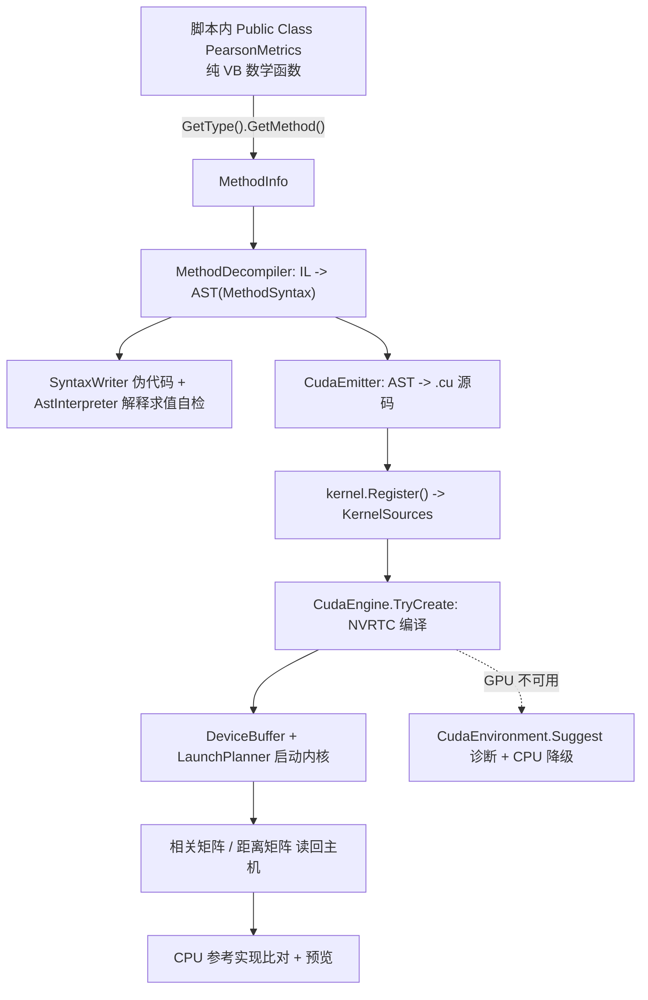

## 用户需求

在 `tutorials\VBS\cuda.vb` 中编写一个**教程用脚本**，展示如何利用 `cuda\ILCuda\ILCuda.vbproj` 把**脚本里定义的 VB.NET 数学计算函数**通过 IL 反编译成 AST、再翻译成 CUDA `.cu` 内核源码，并在 GPU 上完成：

- 行间**皮尔逊相关系数矩阵**计算
- 行间**欧氏距离矩阵**计算

依据来源（用户指定）：`cuda\ILCuda\README.md` 帮助文档、`cuda\ILCuda\test\test.vbproj` 与 `cuda\ILCuda\IL2Cuda\` 现有代码。

## 产品概述

脚本由 VBS 引擎（`vbs.exe`）以脚本方式运行：先预处理为合法 VB.NET，再 Roslyn 内存编译，最后反射执行。教程脚本自身即"教材"，运行后按步骤打印出反编译过程与 GPU 计算结果。

## 核心功能

1. **脚本内定义目标数学函数**：`Public Class PearsonMetrics` 中提供纯 VB.NET、零 CUDA 概念的度量函数（行求和、行平方和、Gram 点积、相关系数单元、距离单元、纯标量截断）。
2. **IL → AST → .cu 展示**：逐函数翻译，打印内核名/索引模式/设备函数名/IL 条数、AST 伪代码、生成的完整 CUDA 源码。
3. **反编译正确性自检**：用 AST 解释器在 CPU 上执行同一棵语法树，与直接调用原方法的结果比对（不需要 GPU）。
4. **GPU 流水线**：把生成的 `.cu` 注册进 `KernelSources`，创建 `CudaEngine`，依次启动 rowSum / rowSumSq / gramDot / correlation / distance 内核，读回相关矩阵与距离矩阵。
5. **结果校验与预览**：CPU 两遍算法参考实现（Double）+ 最大绝对误差对比 + 矩阵预览；并单独演示"纯标量函数 → 逐元素自动包裹"约定。
6. **优雅降级**：GPU/NVRTC 不可用时打印结构化诊断与修复建议，回退 CPU 参考实现后正常退出。

## 视觉/输出效果

控制台分节输出：标题分隔线 → 每一步的标题与缩进排版 → 伪代码块 → CUDA 源码块 → 自检/误差表格行（`OK` / `FAIL` 标记）→ 矩阵预览方阵 → 汇总结论。

## 技术栈

- 脚本宿主：VBS 脚本引擎 `vs_solutions\VBS\VBS.vbproj`（VB.NET / net10.0 / Roslyn `Microsoft.CodeAnalysis.VisualBasic` 内存编译）
- CUDA 框架：`cuda\ILCuda\ILCuda.vbproj`（零 NuGet，P/Invoke nvcuda + nvrtc），IL→CUDA 流水线在 `IL2Cuda\`
- 反编译基础设施：`vs_solutions\dev\VisualStudio\VisualStudio.NET5.vbproj` 的 `...VisualStudio.IL` 命名空间
- 目标文件：`tutorials\VBS\cuda.vb`（唯一需改动的交付物）

## 实现方案

整体策略：**脚本即教材，全部逻辑写在 `tutorials\VBS\cuda.vb` 内，不改引擎、不改框架**。严格照抄 `test\IlDecompile\` 已验证的调用方式，只把"目标函数从 demo 工程搬到脚本里"。

### 关键决策与权衡

| 决策 | 理由 |
| --- | --- |
| 目标函数放进脚本内的 `Public Class`，而非顶层 `Function` | VBS 会把顶层 `Function` 重写为匿名函数（`Dim f = Function()...`），拿不到 `Shared` 的 `MethodInfo`；而类型块会被原样输出为 `Module Program` 的嵌套类型，`GetType(X).GetMethod(...)` 可正常反射 |
| 顶层辅助函数一律"参数传值、不捕获顶层变量" | 引擎把 `funcBlocks` 排在 `mainBody` 之前输出，捕获后声明的 `Dim` 变量会触发 VB"变量在声明前被使用"编译错误 |
| 索引模式走"命名约定"（形参加 `i` / `i`+`j`）而非 `<CudaKernel>` 标注 | 约定是 README 主推的默认路径，脚本更短、可读性更好；同时用 `PearsonClamp` 演示"纯标量 → 逐元素自动包裹"第三条约定 |
| 必须显式 `#include` VisualStudio 程序集 | 脚本的编译引用 = `#include` + 固定几项 + **已加载** BCL；`MethodDecompiler`/`SyntaxWriter`/`AstInterpreter` 所在程序集不一定已加载。该文件已确认存在于 `.nuget\net10.0\`（即 `App.HOME` 解析根） |
| 不依赖 demo 的 `ConsoleReporter` | 它位于 `test\test.vbproj`（`ILCuda.Demo`），被 `ILCuda.vbproj` 的 `<Compile Remove="test\**" />` 排除，不在框架程序集内 |


### 依赖的已确认 API（源码核对，非推测）

```
' 翻译
IlCudaTranslator.Translate(method As MethodInfo, Optional kernelName As String = Nothing) As IlCudaKernel
' 产物：Name / Source / DeviceFunctionName / IndexMode / Syntax / MethodName
kernel.Register()                                   ' 必须在 CudaEngine.TryCreate 之前
kernel.Launch(engine, config, ParamArray args)      ' args = 方法参数去索引 + 输出数组 + 元素个数

' 反编译与自检
SyntaxWriter.WriteMethod(syntax) As String
New AstInterpreter(syntax).Invoke(args) As Object
New MethodBodyReader(method).Instructions.Count

' 引擎
CudaEngine.TryCreate(opts As EngineOptions) As CudaEngine   ' 失败返回 Nothing
opts.ErrorMessage / opts.Diagnostics                        ' 失败原因
LaunchPlanner.For1D(n, 256) / For2D(rows, cols, 16, 16)
New DeviceBuffer(Of Single)(n) : .Write(a) / .Read() / IDisposable
CudaEnvironment.Probe() / CudaEnvironment.Suggest(report)   ' 无 GPU 时的降级诊断
```

内核实参顺序（照抄 `IlCudaComparison.vb` 实测用例）：

```
RowSum          : (bufX, cols, out, rows)
RowSumSq        : (bufX, cols, out, rows)
GramDot         : (bufX, cols, out, rows, rows)
CorrelationCell : (bufDot, bufSum, bufSumSq, rows, cols, out, rows, rows)
DistanceCell    : (bufDot, bufSumSq, rows, out, rows, rows)
PearsonClamp    : (bufCov, bufDenom, out, cells)   ' 逐元素包裹，For1D
```

## 执行细节

- 规模取 `rows = 128`、`cols = 64`、`seed = 42`、`preview = 6`（对齐 README `il-compare` 默认规模，秒级出结果、结果可复现）。
- 公式与 README「demo 的算法说明」逐项一致：`mean=sum/n`、`var=sumSq-n·mean²`、`corr=(dot-n·meanI·meanJ)/sqrt(varI·varJ)`、`dist=sqrt(sumSqI+sumSqJ-2·dot)`；对角线按 README 数值注意点直接赋 `corr=1 / dist=0`，避免单精度灾难性抵消。
- 反编译失败用 `Try/Catch` 包住并打印 `ex.Message`（`DecompileException` 带 IL 偏移），不让脚本崩。
- `Using` 块管理 `CudaEngine` 与全部 `DeviceBuffer`，确保显存释放。
- 脚本内不使用 `ConsoleReporter`，统一 `Console.WriteLine` 排版。
- 复杂度：GPU 侧 `O(rows²·cols)`，与 demo 一致；CPU 参考仅用于校验，同样阶，128×64 规模下毫秒级。

## 架构设计

数据流（脚本视角）：



## 目录结构

```
tutorials/VBS/
├── cuda.vb     # [MODIFY] 整体重写为 IL -> CUDA 教程脚本
│               #   头部: #include ILCuda + VisualStudio 两个程序集, 3 条 imports
│               #   第 1 节: Public Class PearsonMetrics —— 6 个待反编译的纯 VB 目标函数
│               #   第 2 节: 顶层辅助函数(参数传值, 不捕获顶层变量)
│               #            ShowTranslate(method) / CheckByInterpreter(method, syntax)
│               #            MakeSampleArgs(method) / CpuReference(...) / MaxError(...) / PrintPreview(...)
│               #   第 3 节: 顶层主流程 —— 造矩阵 -> 逐个 Translate 并打印伪代码与 .cu
│               #            -> Register -> TryCreate -> GPU 五步流水线
│               #            -> 读回 -> CPU 比对 -> PearsonClamp 逐元素包裹演示 -> 汇总
├── kmeans.vb   # [验证] 回归验证，不改动
└── tuple.vb    # [验证] 回归验证，不改动
```

## 风险与兜底

| 风险 | 兜底 |
| --- | --- |
| `CompileScript` 默认 Release 优化，IL 形状可能让反编译器无法归约 | 先在脚本里用直白写法（简单 `For`/`If`）；若报 `DecompileException`，改 `Program.vb` 以 `debug:=True` 编译（IL 更直白），或把 `For` 改写成 `While` |
| 引入 VisualStudio 引用后编译报缺依赖 | 去掉伪代码打印与解释求值自检，只保留 `IlCudaTranslator.Translate` + `kernel.Source` |
| GPU / NVRTC 不可用 | 捕获后打印 `CudaEnvironment.Suggest`，用 CPU 参考实现跑出结果并以 0 退出 |
| 顶层函数捕获顶层变量导致编译失败 | 顶层函数一律参数传值，不引用顶层 `Dim` |


## Agent Extensions

### SubAgent

- **code-explorer**
- 用途：脚本运行报错（编译诊断、`DecompileException`、CUDA 加载失败）时，跨 `cuda/ILCuda/`、`vs_solutions/dev/VisualStudio/`、`vs_solutions/VBS/` 定位符号定义与真实签名，确认是脚本写法问题还是框架边界限制。
- 预期结果：得到报错符号/内核的准确定义位置与可用重载，据此修正脚本，避免"脚本引用了不存在的 API"或"误判框架能力"。