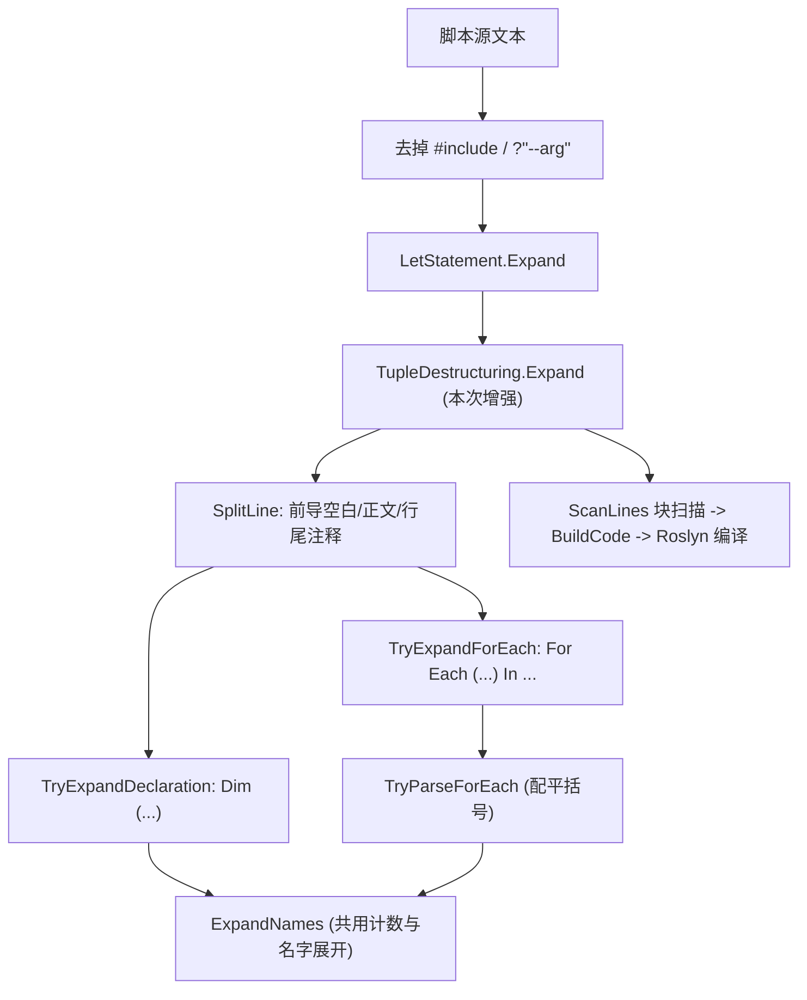

## 需求描述

完善 VBS 脚本引擎的元组解构预处理：目前 `Dim (a, b) = expr` 已可在预处理阶段被正确拆解，但 `For Each (...) In ...`（循环变量解构）尚未支持，导致脚本编译失败。

### 复现（实测）

运行 `vbs.exe tutorials\VBS\scripts\tuple\tuple.vb --verbose`，生成代码中：

```
Dim __tuple1 = (1, 2)
Dim  a = __tuple1.Item1
Dim b as double = __tuple1.Item2
...
for each (str as string, int) in tuples      ' 未展开, 原样进入 Main
    call console.writeline($"{str} => {int:F4}")
next
```

编译诊断：`BC30198: ')' expected`、`BC30455: Argument not specified for parameter 'Number' of 'Str'`、`BC30516: ... 'Int' ...` —— 即 `str` / `int` 被当作 VB 内建函数解析。

### 功能内容

1. `For Each (名字列表) In 表达式` 应被展开为「普通 For Each + 循环体内逐项解构赋值」，语义与 `Dim (...)` 解构保持一致（支持 `As Type`、`_` 跳过项、嵌套元组）。
2. 同一脚本内所有解构（含 `Dim (...)` 与 `For Each (...)`）生成的临时变量名必须互不冲突。
3. 不得误伤普通写法：`For Each x In list`、`For Each (x) In list`、`For Each kv As KeyValuePair(Of K, V) In dict`、以及 LINQ 查询中的 `For Each` 都必须原样保留。
4. 其余既有行为（`Dim (...)` 解构、行尾注释与前导空白保留）保持不变。

### 交付物

仅修改 `vs_solutions\VBS\src\VBScript\TupleDestructuring.vb`；重构为按职责拆分的小函数，保持与同目录 `LetStatement.vb`、`ScriptRefactor.vb` 一致的风格。

## 技术栈

- VB.NET / net10.0，SDK 风格工程 `vs_solutions\VBS\VBS.vbproj`（`RootNamespace VBScriptHost`、`LangVersion 16`）
- 文本级预处理：`System.Text.RegularExpressions` + 项目自有扩展 `String.LineTokens()`
- 目标文件：`vs_solutions\VBS\src\VBScript\TupleDestructuring.vb`（`Namespace Script` / `Public Module TupleDestructuring`）
- 调用链：`ScriptRefactor.PreprocessText` → `LetStatement.Expand` → **`TupleDestructuring.Expand`** → `ScanLines`（块扫描按 `^for\s` 识别为 `For` 块）→ `BuildCode` → Roslyn 内存编译

## 实现方案

整体策略：**在现有单行重写框架内新增一条模式分支，复用已有的名字展开逻辑**，不改动块扫描与组装阶段。

### 1. 修复临时变量计数器（前置必需）

第 74 行 `Dim i As i32 = 1` 与第 99 行 `$"__tuple{++i}"`：VB 没有前缀自增运算符，`++i` 被解析为一元 `+(+i)`，**不产生递增**。当前脚本只有一次解构所以未暴露；一旦加入 For Each 展开，会出现重复的 `__tuple1` 声明（`BC30288: Local variable is already declared in the current block`）。

修复：`Dim seq As Integer = 0`，取名前显式 `seq += 1`，再 `$"__tuple{seq}"`；`Dim (...)` 与 `For Each (...)` **共用同一个计数器实例**（`Expand` 内一个 `ByRef` 序号），保证全文件唯一。

### 2. 新增 `For Each (...)` 解构展开

识别（忽略大小写，允许前导空白与行尾注释）：

```
For Each (str as string, int) In tuples
```

展开为：

```
For Each __tuple2 In tuples
    Dim str as string = __tuple2.Item1
    Dim int = __tuple2.Item2
    call console.writeline($"{str} => {int:F4}")
next
```

关键决策与理由：

| 决策 | 理由 |
| --- | --- |
| 解构临时变量复用作**循环迭代变量**（`__tupleN`），而非在循环体内再声明 | 少一层嵌套、生成代码更直观；`ExpandNames` 可直接复用 |
| 括号定位用**深度计数配平扫描**，不用 `[^)]*` | 支持嵌套 `For Each ((a, b), c) In ...`；现有 `Dim` 分支同样存在该写法 |
| 要求配平括号之后必须紧跟 `In <表达式>` 才算命中 | 避免把 `For Each (a) In x` 之外的无关括号写法误判 |
| 仅当括号内存在**顶层逗号**（≥2 项）时才展开 | 防止误伤 `For Each (x) In list` 这类普通分组写法 |
| 仍使用 `.Item1` / `.Item2` | 与现有 `Dim (...)` 语义一致，面向 ValueTuple（`KeyValuePair` 的 `.Key/.Value` 不在本次范围） |
| 解构声明行缩进取 `lead + "    "` | 循环体内缩进，生成代码可读 |


### 3. 按职责拆分 `Expand` 并做小清理

`Expand` 目前既做拆行、又做注释提取、又做两种展开。按职责拆分为：

| 成员 | 职责 |
| --- | --- |
| `Public Function Expand(source)` | 只做编排：逐行 → `SplitLine` → 依次尝试两种展开 → 未命中则原样输出 |
| `Private Function TryExpandDeclaration(body, lead, comment, outLines, ByRef seq)` | 现有 `Dim (...)` 展开 |
| `Private Function TryExpandForEach(body, lead, comment, outLines, ByRef seq)` | 新增 `For Each (...)` 展开 |
| `Private Function TryParseForEach(body, ByRef names, ByRef expr)` | 配平括号解析 `For Each (names) In expr` |
| `Private Function NextTempName(ByRef seq)` | 生成 `__tupleN` |
| `Private Sub SplitLine(raw, ByRef lead, ByRef body, ByRef comment)` | 拆前导空白 / 正文 / 行尾注释 |
| `Private Function HasTopLevelComma(text)` | 判定是否为 ≥2 项的解构列表 |
| 保留 | `ExpandNames`、`SplitTopLevel`、`FindTopLevelAs`、`IndexOfComment` |


顺带修掉两处生成质量缺陷（都在本次改动路径上，代价极低）：

- 空 `typeClause` 导致 `Dim  a = ...` 双空格 → 拼装时对类型子句做条件拼接；
- 嵌套分支生成的 `Dim __tuple1._n0 = __tuple1.Item1` 不是合法 VB → 临时名改为合法标识符 `__tupleN_n0`（并同样走 `NextTempName` 计数）。

## 执行细节

- **先例不破坏**：`Expand` 的默认分支仍是"原样输出整行"，因此 `For Each x In list`、`For Each kv As KeyValuePair(Of String, Integer) In dict`、LINQ 查询里的 `For Each` 都不会被改动。
- **顺序无耦合**：`TupleDestructuring.Expand` 位于 `LetStatement.Expand` 之后、块扫描之前，作用对象是脚本源文本；展开出的 `For Each __tupleN In ...` 行由 `IsControlBlockStart` 的 `^for\s` 正常识别为 `For` 块，`Next` 由 `IsBlockEnd` 的 `^next\b` 正常闭合。
- **正则安全**：`As Type` 的类型名、`_` 跳过项、`alias:=name` 别名等既有能力全部由 `ExpandNames` 复用，无需在新分支重复实现。
- **性能**：仍是一次 O(n) 逐行遍历，每行常数条正则 + 一次线性括号扫描；脚本规模（几十至几千行）无压力，无额外内存拷贝。
- **异常与边界**：括号不配平、`In` 缺失、名字为空等情况一律判定为"未命中"，原样输出该行（与现有 `Dim` 分支的处理策略一致），绝不生成语义不明的代码。
- **已确认无其它调用点**：全仓库检索 `for each (` 只命中 `tutorials\VBS\scripts\tuple\tuple.vb`，无既有脚本依赖旧行为。

## 架构设计

保持既有分层不变，仅在预处理管线中增强一个 pass：



## 目录结构

```
vs_solutions/VBS/src/VBScript/
└── TupleDestructuring.vb   # [MODIFY] 唯一改动文件
                           #   - 修复 ++i 不递增: 改为 NextTempName(ByRef seq) + seq += 1
                           #   - 新增 TryExpandForEach / TryParseForEach / HasTopLevelComma
                           #   - 拆分 SplitLine / TryExpandDeclaration, Expand 只做编排
                           #   - ExpandNames: 修嵌套分支非法临时名, 修空 typeClause 双空格
                           #   - 保留 SplitTopLevel / FindTopLevelAs / IndexOfComment 不变

tutorials/VBS/scripts/
└── tuple/tuple.vb          # [验证] 主验证脚本 (--verbose + 实际运行)
    */ *.vb                 # [验证] 其余 9 个脚本回归, 确认无副作用
```

## 关键代码结构（转换契约）

```
' 输入
For Each (str as string, int) In tuples

' 输出
For Each __tuple2 In tuples
    Dim str as string = __tuple2.Item1
    Dim int = __tuple2.Item2
```

识别模式（概念性伪码，非最终实现）：

```
^ For \s+ Each \s+ \(  <names: 配平扫描得到>  \) \s+ In \s+ <expr> $
且 names 中存在顶层逗号
```

## 验证

1. `dotnet build vs_solutions/VBS/VBS.vbproj -c Release` → 0 error
2. `cd .nuget\net10.0; .\vbs.exe <abs>\tutorials\VBS\scripts\tuple\tuple.vb --verbose`

- 生成代码中应出现 `For Each __tuple2 In tuples`，随后两行 `Dim str as string = __tuple2.Item1` / `Dim int = __tuple2.Item2`，`next` 原样保留
- `Dim (...)` 展开的临时变量不得与 For Each 的临时变量重名

3. 去掉 `--verbose` 实际运行，期望输出：

```
demo test result of variable tuple deconstruct in vb:
a := 1
b := 2
(a+b) := 3
a => 123.0000
b => 456.0000
c => 789.0000
```

4. 回归 `tutorials\VBS\scripts` 下其余脚本（`kmeans`、`hola_layout`、`linear_regression`、`hierarchical_clustering`、`tf-idf`、`cuda` 等），确认元组展开未误伤其 `For Each` / `Dim` 语句、无新增编译诊断。

## 风险与兜底

| 风险 | 兜底 |
| --- | --- |
| `For Each (x) In list` 普通分组写法被误改写 | 要求括号内存在顶层逗号才展开 |
| 嵌套解构导致括号解析错误 | 深度计数配平扫描 + 要求紧跟 `In`；解析失败即原样输出 |
| 临时变量重名（现有 `++i` 缺陷） | 修复为显式递增，两种展开共用同一计数器 |
| 脚本里 `int` / `str` 与 VB 内建函数同名 | 局部变量可遮蔽内建函数，预期可编译；若实测报错，属脚本命名问题，验证阶段指出并给出改名建议 |
| 误伤既有脚本 | 只在整行命中两种模式时改写，其余行原样输出；用 scripts 目录全量回归 |


## Agent Extensions

### SubAgent

- **code-explorer**
- Purpose: 在回归验证阶段核查 `tutorials\VBS\scripts` 下其余 9 个脚本的 `For Each` / `Dim` 写法与外部数据依赖，确认元组展开不会误伤既有语句，并筛出可离线直接运行的回归样本。
- Expected outcome: 给出「每个脚本是否含可能受影响的语句 + 是否依赖缺失数据」的清单，据此确定回归范围与预期结果，避免回归阶段把环境问题误判为本次改动的副作用。