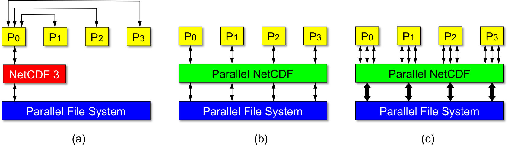

# PnetCDF

> http://cucis.ece.northwestern.edu/projects/PnetCDF/

PnetCDF (Parallel netCDF), a collaborative work of Argonne National Laboratory and Northwestern University, is a parallel I/O library for accessing NetCDF files in CDF-1, 2, and 5 formats. The CDF-5 file format, an extension of CDF-2, supports more data types and allows users to use 64-bit integers to define large dimensions, attributes, variables (> 2B array elements).
NetCDF supports parallel I/O starting from version 4. Prior to version 4.1, the file format for parallel I/O operations is restricted to HDF5. Starting from release of 4.1, NetCDF users can also perform parallel I/O on files in classic formats (CDF-1, 2, and 5) through PnetCDF library underneath.

## What is netCDF?

NetCDF (Network Common Data Form) is an I/O library that supports the creation, access, and sharing of scientific data.

+ File formats -- Self-describable, machine-independent file formats (CDF and HDF5) are used to store multi-dimensional array-oriented data together with its attributes (such as annotations.) The data layout in CDF files follows the canonical order of the arrays.
+ Application Programming Interfaces (APIs) -- Set of Fortran, C, C++, and Java functions are available in the netCDF software releases for accessing the data stored in the files (in CDF and HDF5 formats). The APIs are used to define dimensions, variables, attributes of variables, and perform data read/write to the files.

Unidata provides implementations of netCDF software. Prior to version 4, netCDF APIs do not support parallel I/O. Although concurrent read from multiple application clients on a shared file can be achieved using individual file pointers, there is no parallel file access semantics in the APIs. For parallel programs, write operations must be done by shipping data to a single process which then writes to the file. Thus, the communication contention on the writing process can make the I/O performance considerably slow.
Starting from versions 4.0 and 4.1, Unidata's netCDF supports parallel I/O through HDF5 and PnetCDF underneath, respectively. Through PnetCDF, netCDF-4 programs can access files in the classical CDF formats in parallel. Similarly, through HDF5, netCDF-4 programs can access files in HDF5 format.

## Design Strategy for Parallelizing NetCDF:

The goal of PnetCDF is to provide high-performance parallel I/O to the applications by enabling all client processes to access a shared file in parallel. To ensure the performance and portability, PnetCDF is built on top of MPI-IO. The PnetCDF APIs incorporate the parallel semantics following the MPI (Message Passing Interfaces) standard and provide backward compatibility with the classical netCDF file formats: CDF (or CDF-1), CDF-2, and CDF-5. Figure 1 compares the data access methods between the sequential netCDF and PnetCDF.



Figure 1. Comparison of data access between using sequential netCDF and PnetCDF. (a) Write operation is carried out through one of the clients when using the sequential netCDF prior to version 4.0. (b) PnetCDF enables concurrent write to parallel file systems. (c) Through nonblocking I/O, PnetCDF can aggregate multiple requests into large ones so a better performance can be achieved.
Below describes the design principle of PnetCDF.

+ Minimize the changes to the netCDF API syntax -- In order for easy code migration from sequential netCDF to PnetCDF, PnetCDF APIs mimic the syntax of the netCDF APIs with only minor changes to add parallel I/O concept. These changes are highlighted as follows.
All parallel APIs are named after the original netCDF APIs with "ncmpi_" prefix for C/C++, "nfmpi_" for Fortran 77, and "nf90mpi_" for Fortran 90. For example,

```c
int
ncmpi_put_vara_float(int               ncid,      /* dataset ID */
                     int               varid,     /* variable ID */
                     const MPI_Offset  start[],   /* [ndims] */
                     const MPI_Offset  count[],   /* [ndims] */
                     float            *buf)       /* user buffer */
```

An MPI communicator and an MPI_Info object are added to the argument list of the open/create APIs. The communicator defines the set of processes that will access the netCDF file in parallel. The info object allows users to provide I/O hints for PnetCDF and MPI-IO to further improve performance (e.g. file alignment for file header size and starting offsets for variables, and the MPI-IO hints.) An example is

```c
int
ncmpi_open(MPI_Comm    comm,   /* the group of MPI processes sharing the file */
           const char *path,
           int         omode,
           MPI_Info    info,   /* PnetCDF and MPI-IO hints */
           int        *ncidp)
```

PnetCDF defined two data modes, collective and independent, which correspond to MPI collective and independent I/O operations. Similar to MPI naming convention, all collective APIs carry an extra suffix "_all". The independent I/O mode is wrapped by the calls of ncmpi_begin_indep_data() and ncmpi_end_indep_data(). While in collective data mode, only calls to collective APIs are allowed. Similarly, only independent APIs are allowed in independent mode. The API ncmpi_put_vara_float() shown above is an independent API and the collective counterpart is:

```c
int
ncmpi_put_var_float_all(int               ncid,      /* dataset ID */
                        int               varid,     /* variable ID */
                        const MPI_Offset  start[],   /* [ndims] */
                        const MPI_Offset  count[],   /* [ndims] */
                        float            *buf)       /* user buffer */
```

For the API arguments related to variable sizes or their accesses that are of type size_t, PnetCDF replaces it with MPI_Offset. For example, the arguments start[] and count[] in the above APIs are of MPI_Offset data type vs. size_t in netCDF. Another example is the API defining a dimension, given below. The arguments of type ptrdiff_t are also changed to MPI_Offset, including arguments stride[] and imap[] in vars and varm API families.

```c
int
ncmpi_def_dim(int               ncid,   /* dataset ID */
              const char       *name,   /* dimension name string */
              const MPI_Offset  len,    /* length of dimension */
              int              *dimidp) /* returned dimension ID */
```

+ Support large files -- PnetCDF supports CDF-2 file format (by setting NC_64BIT_OFFSET flag when creating a new file). With CDF-2 format, even on 32-bit platforms one can create netCDF files of size greater than 2GB.