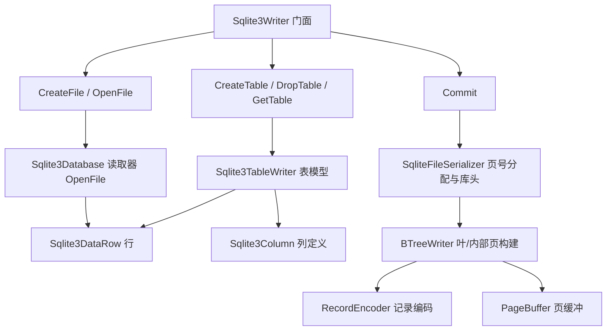

## Product Overview

在已修复的纯托管 SQLite3 读取模块基础上，新增一个写入模块，提供强类型的 Builder 链式编程接口，使调用方无需 SQL 解释器即可新建数据库文件、建表、插入/追加/更新/删除数据行，并可打开已有文件继续修改。随后在测试工程中新增"先写库、再读回"的往返测试，验证写入结果可被读取模块正确解析，并将结果写入测试报告。

## Core Features

- 新建库文件：从零创建结构合法的 SQLite3 数据库文件（含文件头与 sqlite_master）。
- 建表与删表：按列定义（列名、声明类型、非空、主键）创建表，或删除已有表。
- 行写入与追加：插入数据行（支持自增 rowid / `INTEGER PRIMARY KEY` 别名），并向已有表追加行。
- 行更新与删除：按 rowid 或主键定位并更新、删除指定数据行。
- 打开与提交：打开已有文件加载为内存模型，修改后提交回写；提交失败不损坏原文件，重复提交结果一致。
- 数据类型支持：NULL、整数、浮点、UTF-8 文本、BLOB、布尔，以及超过单页内联阈值的大字段（溢出页）。
- 往返测试：测试程序先写库再读回，逐表、逐行、逐列比对值与类型，并做文件格式自检，结果并入测试报告。

## Tech Stack Selection

- 语言/运行时：VB.NET + .NET 10（`net10.0`），与现有 `SQLite3.vbproj`、`test.vbproj` 保持一致。
- 依赖：纯托管实现，不新增第三方包或原生依赖；复用现有 `Microsoft.VisualBasic.Core` 与已引用的 `dataframework`、`binarydata`。
- 写入目标格式：SQLite 数据库文件格式 3（`https://www.sqlite.org/fileformat2.html`），页大小默认 4096、UTF-8、无空闲页。
- 测试形态：复用 `test` 控制台工程（`OutputType=Exe`），与现有读取用例共用断言与报告机制。

## Implementation Approach

核心策略：**内存模型 + 提交时整文件重建（load-modify-rebuild）**。

现有模块是"纯托管解析器"，若增量维护 B 树分裂、空闲页链表与页缓存，复杂度与出错概率极高。因此采用：

- `OpenFile`：复用现成读取器把目标库加载为内存模型（保留每张表的原始 `Sql`、列名/声明类型/主键、全部数据行与 rowid）。
- 内存中完成建表/插行/追加/更新/删除/删表。
- `Commit`：一次性把整个库重新序列化写出，先写临时文件再原子替换目标文件，保证失败不损坏原库；`Commit` 幂等。

该方案以"整文件重建"的 O(总字节数) 顺序写入换取实现简洁与正确性，是本任务在无原生引擎前提下实现完整 CRUD 的最优权衡；对超大库的内存压力作为已知限制在文档中标注。

与读取侧必须严格对齐的写入格式要点：

- 文件头：`magic="SQLite format 3\0"` + 100 字节头；写/读版本=1(Legacy，兼容性最好)；预留空间 0；payload 分数 64/32/32；SchemaFormat=4；TextEncoding=1(UTF8)；freelist=0；`DatabaseSizeInPages`=实际页数；页 1 前 100 字节为文件头，其 B 树页头紧随其后。
- 页与节点：页大小 4096；B 树自底向上构建，叶页填满后聚合成内部页，内部页 key 取左子树最大 rowid；`RightMostPointer` 指向最右子页；cell 指针数组按 rowid 升序存放。
- 页号分配：先构建节点树，再按 **pre-order（根先、深度优先）** 分配页号，使父页可引用已确定的子页号；`sqlite_master` 根页固定为 page 1；用户表从 page 2 起。
- cell 编码（沿用读取侧公式）：`U=PageSize-ReservedSpace`、`X=U-35`、`M=((U-12)*32/255)-23`、`K=M+((P-M) mod (U-4))`；叶 cell = `varint(P)+varint(rowid)+内联payload[+varint(溢出页)]`；内部 cell = `4字节左子页号 + varint(key)`；页头 = `type, firstFreeBlock=0, cellCount, cellContentBegin(小端), fragmentedFreeBytes=0, [rightMostPointer]`。
- 溢出页：每页 `4 字节下一页指针 + 数据`，不足补 0，末页指针为 0。
- 记录编码：`varint(headerSize) + 各列 serial type(varint) + 各列数据`；serial type：NULL=0、整数按最小宽度 1..6、Float=7、整数 0/1=8/9、BLOB=12+2n、TEXT=13+2n；`INTEGER PRIMARY KEY` 列在记录体写 serial 0(NULL)，实值作为 rowid（与读取侧 `FindRowIdAliasOrdinal` 回填逻辑对称）。
- 建表 SQL：生成的 `CREATE TABLE name (col TYPE [NOT NULL], ..., PRIMARY KEY (id))` 必须能被现有 `Schema.ParseColumns` 正确解析；含空格等特殊字符的标识符用 `[]` 转义；打开已有库时原样回写原始 `Sql` 以保证 schema 保真。

对外 API（Builder 链式）：

```
Using w = Sqlite3Writer.CreateFile(path)
    Dim t = w.CreateTable("demo", {
        New Sqlite3Column With {.Name="id",    .Type="INTEGER", .NotNull=True, .PrimaryKey=True},
        New Sqlite3Column With {.Name="name",  .Type="VARCHAR"},
        New Sqlite3Column With {.Name="mass",  .Type="FLOAT"},
        New Sqlite3Column With {.Name="data",  .Type="BLOB"},
        New Sqlite3Column With {.Name="flag",  .Type="BOOLEAN"}})
    Dim rid = t.AddRow({Nothing, "a", 1.5, bytes, True})   ' id 为空则自增 rowid
    t.UpdateRow(rid, {Nothing, "b", 2.5, Nothing, False})
    t.DeleteRow(rid)
    w.Commit()
End Using

Using w = Sqlite3Writer.OpenFile(path)                     ' 打开已有文件
    w.GetTable("demo").AddRow({Nothing, "c", 3.5, Nothing, True})
    w.Commit()
End Using
```

## Implementation Notes

- 命名空间与风格：新增类型置于 `Microsoft.VisualBasic.Data.IO.ManagedSqlite.Writer`，沿用现有 `Iterator`/`Using`、大端读写与中文 XML 注释风格；不修改现有读取公共 API 与行为（`Schema.PrimaryKeys` 已可直接复用）。
- 值→serial type 判定与读取侧 `ReadValue` 严格对称：布尔写 8/9、Float 写 7、整数按最小宽度、Text 写 UTF-8、Blob 原样。
- 大字段（>内联阈值）必须走溢出页，确保与读取侧 `SqliteDataStream` 拼接逻辑兼容。
- 原子提交：临时文件与目标同目录，写完 `Flush` 后替换；异常携带表名/rowid 上下文；文件句柄使用 `Using` 释放。
- 性能：Commit 顺序写、单表单次建树；避免逐行新建 `MemoryStream`，使用可复用的页缓冲。
- 已知限制（文档标注）：不支持二级索引/视图/触发器/带列排序的主键；打开含索引的库时索引条目被忽略（仅保留表数据）。

## Architecture Design



## Directory Structure

```
SQLite3/
├── Writer/
│   ├── Sqlite3Writer.vb                 # [NEW] 写模块门面：CreateFile/OpenFile/Commit/Dispose/CreateTable/DropTable/GetTable/GetTableNames。
│   │                                    #       维护库级内存模型与列/SQL，AutoCommitOnDispose 可配置；Commit 幂等。
│   ├── Sqlite3TableWriter.vb            # [NEW] 表级 CRUD：AddRow/AddRow(rowid)/UpdateRow/UpdateRowByPrimaryKey/DeleteRow/
│   │                                    #       GetRow/EnumerateRows/Clear/Columns/RowCount，链式返回 Me。
│   ├── Sqlite3Column.vb                 # [NEW] 列定义：Name/Type/NotNull/PrimaryKey + ToSql()，支持 With 初始化。
│   ├── Sqlite3DataRow.vb                # [NEW] 内存行：RowId + 按序号/列名取值（与读取侧 Sqlite3Row 取值语义一致）。
│   └── Internal/
│       ├── RecordEncoder.vb             # [NEW] VarInt 写入、值→serial type 判定、记录体编码、TEXT/BLOB 长度计算。
│       ├── PageBuffer.vb                # [NEW] 单页字节缓冲与 B 树页头/指针数组组装（大端写入工具方法）。
│       ├── BTreeWriter.vb               # [NEW] 自底向上构建表 B 树：叶页分裂、内部页聚合、cell 编码、溢出页链、页容量计算。
│       └── SqliteFileSerializer.vb      # [NEW] pre-order 页号分配、数据库头与 sqlite_master 写入、临时文件 + 原子替换。
├── README.md                            # [MODIFY] 补充写入模块概览、API 示例与限制说明。
└── test/
    ├── WriterTests.vb                   # [NEW] Partial Module Program 的写入/往返测试：新建→读回、边界值、多页/溢出页、
    │                                    #       打开已有文件追加/更新/删除/删表、文件格式自检；结果并入报告。
    ├── Program.vb                       # [MODIFY] Main 中调用 RunWriterTests()，报告新增"写入/往返测试"章节。
    └── TEST-REPORT.md                   # [MODIFY] 运行后重新生成（含写入/往返测试用例与结论）。
```

## Key Code Structures

```
Namespace Writer
    Public Class Sqlite3Writer : Implements IDisposable
        Public Shared Function CreateFile(path As String, Optional pageSize As Integer = 4096) As Sqlite3Writer
        Public Shared Function OpenFile(path As String) As Sqlite3Writer
        Public Function CreateTable(name As String, columns As IEnumerable(Of Sqlite3Column)) As Sqlite3TableWriter
        Public Function GetTable(name As String) As Sqlite3TableWriter
        Public Function GetTableNames() As IEnumerable(Of String)
        Public Function DropTable(name As String) As Boolean
        Public Property AutoCommitOnDispose As Boolean
        Public Sub Commit()
        Public Sub Dispose() Implements IDisposable.Dispose
    End Class
End Namespace
```

```
Public Class Sqlite3TableWriter
    Public ReadOnly Property TableName As String
    Public ReadOnly Property Columns As Sqlite3Column()
    Public ReadOnly Property RowCount As Integer
    Public Function AddRow(values As Object()) As Long
    Public Function AddRow(rowid As Long, values As Object()) As Long
    Public Function UpdateRow(rowid As Long, values As Object()) As Boolean
    Public Function UpdateRowByPrimaryKey(key As Object, values As Object()) As Boolean
    Public Function DeleteRow(rowid As Long) As Boolean
    Public Function GetRow(rowid As Long) As Sqlite3DataRow
    Public Function EnumerateRows() As IEnumerable(Of Sqlite3DataRow)
    Public Sub Clear()
End Class
```

```
Public Class Sqlite3Column
    Public Property Name As String
    Public Property Type As String        ' INTEGER / VARCHAR / FLOAT / BLOB / BOOLEAN / DATETIME ...
    Public Property NotNull As Boolean
    Public Property PrimaryKey As Boolean
    Public Function ToSql() As String
End Class
```

## Agent Extensions

### SubAgent

- **code-explorer**
- Purpose: 在编写底层字节/流写入代码前，核对 `binarydata`/`Microsoft.VisualBasic.Core` 中可复用的流打开与字节助手（如 `Stream.Open` 的读写用法、`TrimNull`、`AsList`、`Scan0`、`i32`）的确切签名与语义，并再次确认工程内当前不存在任何写入实现、明确可复用与需新增的边界。
- Expected outcome: 得到可复用助手的确切签名与调用方式清单，使新写入模块直接编译通过且与既有代码风格一致，不重复造轮子。