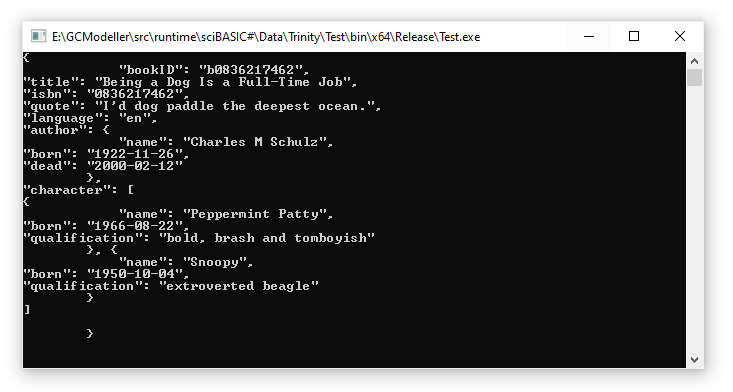
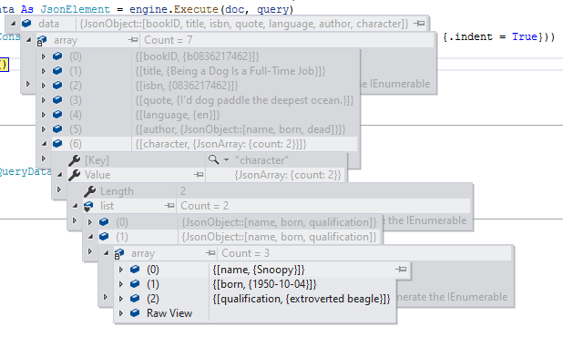

# 面向 HTML / XML 文档的图查询语言引擎

## 引言

从网页或 XML 文档里取数据，通常要组合几种手段：CSS 选择器找结构、XPath 定位路径、属性选择器筛值，再写几行代码做转换。

**GraphQuery** 把这些手段统一成**一条管道式查询语言**：

- 查询文本是**可书写、可复用**的（而不是散落在代码里的选择器字符串）；
- 结果统一输出为 **JSON**，便于后续处理；
- 引擎与文档来源解耦——只要能提供文档树即可。

## 设计目标

- **管道式组合**：查询由若干阶段（选择、筛选、取值、函数）串联，接近 Unix 管道的思路；
- **后端无关**：只要求实现 `IXmlDocumentTree`，因此 HTML 抓取结果与本地 XML 都能查询；
- **可调用 .NET 函数**：查询表达式中可以内嵌函数模型，把逻辑导出到代码。

## 核心特性

- **查询与执行分离**：`QueryParser.GetQuery` 解析查询文本为 `Query`，`Engine.Execute` 在文档上执行并返回结果；
- **多类选择器**：CSS 选择器、XPath 表达式、属性选择器与函数调用（`Query.Parser` 下的 `CSSSelector`、`XPathSelector`、`AttributeSelector`、`FunctionParser`）；
- **词法层**：`Language` 命名空间提供 `QueryToken`、`Token`、`TokenIcer` 与转义规则；
- **函数模型**：`TextParser` 命名空间解析表达式并提供自定义 / 内部 / HTML / LINQ 函数模型；
- **JSON 输出**：结果以 `JsonElement` 呈现，可直接序列化为缩进 JSON 便于调试。

## 命名空间地图

| 命名空间 | 职责 |
|---|---|
| `Microsoft.VisualBasic.Data.GraphQuery`（根） | `Engine`、`QueryParser`、`Query`、`AutoContext` |
| `....GraphQuery.Query.Parser` | 选择器解析器（CSS / XPath / 属性 / 函数） |
| `....GraphQuery.Language` | 查询词法分析：`QueryToken`、`Token`、`TokenIcer` |
| `....GraphQuery.TextParser`（+ `.FunctionModel`） | 表达式解析与函数模型 |

## 关键类型与 API

- `QueryParser.GetQuery` —— 把查询文本解析为 `Query`；
- `Engine.Execute(doc, query)` —— 在文档树上执行查询，返回 `JsonElement`；
- `Language.TokenIcer` / `QueryToken` —— 查询语言的词法层；
- `Query.Parser.CSSSelector` / `XPathSelector` / `AttributeSelector` / `FunctionParser` —— 各类选择器与函数解析器；
- `TextParser.FunctionModel.ParserFunction` / `CustomFunction` / `InternalInvoke` —— 查询可调用的函数模型。

## 快速上手

```vbnet
Imports Microsoft.VisualBasic.Data.GraphQuery
Imports Microsoft.VisualBasic.MIME.application.json
Imports Microsoft.VisualBasic.MIME.application.json.Javascript
Imports Microsoft.VisualBasic.MIME.HTML

' 在这里定义你的图查询
Dim queryText As String = "..."
Dim query As Query = QueryParser.GetQuery(queryText)
Dim engine As New Engine

' 从 Web 服务器或本地文件系统 HTTP GET 得到 html 文档文本
Dim url As String = "..."
Dim doc As HtmlDocument = HtmlDocument.LoadDocument(url)
Dim data As JsonElement = engine.Execute(doc, query)

' 图查询结果的调试视图
Dim json As String = data.BuildJsonString(New JSONSerializerOptions With {.indent = True})

Call Console.WriteLine(json)
```




## 实现要点

- **为什么要把查询语言独立出来**：把选择逻辑写在源码里，意味着每改一次取数规则就要重新编译；独立的查询文本可以由调用方提供，甚至从配置文件加载。
- **函数模型的意义**：真实取数往往需要「取属性后做一次字符串处理」这类操作；`FunctionModel` 允许在查询管道中插入 .NET 逻辑，避免为此写第二遍遍历代码。

## 包信息

- Assembly：`Microsoft.VisualBasic.Data.GraphQuery`
- TargetFramework：`net10.0`
- Tags：`scibasic;graph-query;query-language;html;css-selector;xpath;json;web-scraping`
- 许可：GPL-3.0-or-later
