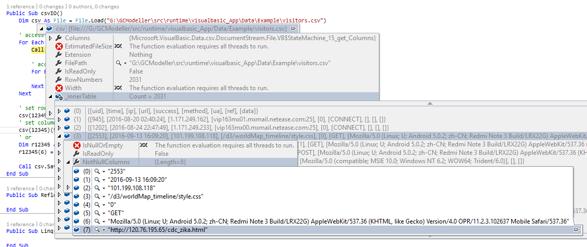
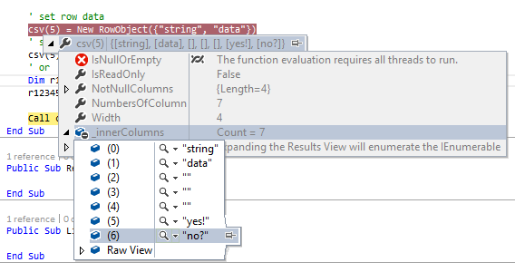

# DataFrame System for VisualBasic Data Science

Includes:

+ [./BinaryData](./BinaryData) : Binary I/O tools extensions
+ [./DataFrame](./DataFrame) : CSV data framework for data science
+ [./SearchEngine](./SearchEngine) : Data Object search engine

## Basic Usage

##### Read/Write csv Data

```vbnet
Dim csv As File = File.Load("./visitors.csv")

' access row data
For Each row As RowObject In csv
    Call row.__DEBUG_ECHO

    ' access columns in a row
    For Each col As String In row
        ' blablabla
    Next
Next

' set row data
csv(5) = New RowObject({"string", "data"})
' set column data in a row
csv(5)(5) = "yes!"
' or
Dim r12345 As RowObject = csv(5)
r12345(6) = "no?"

Call csv.Save("./visitors_updated.csv", Encodings.ASCII)
```

|Example code Screenshots    |
|----------------------------|
|  |
|  |
||


### Using Reflection

```vbnet
Imports Microsoft.VisualBasic.Data.csv
Imports Microsoft.VisualBasic.Data.csv.IO

Dim visitors As Visitor() = "../../../../Example/visitors.csv".LoadCsv(Of Visitor)
Dim dynamics As EntityObject() = EntityObject.LoadDataSet("../../../../Example/visitors.csv").ToArray

Call visitors.SaveTo("./test.csv")
Call dynamics.SaveTo("./test2.csv")

For Each visit In dynamics
    With visit
        Call println("%s visit %s at %s", !ip, !url, !time)
    End With
Next
```


