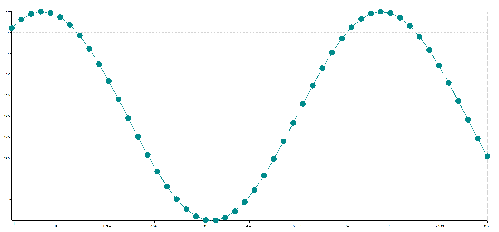

### VisualBasic Mathematics expression evaluation


If you are running on Linux platform, try start by mono:

> mono ./vbmath.exe

Or if you are running Ubuntu system, just using .NET application directly typing:

> ./vbmath.exe

If you are running on Windows, just double click on the program and then application running

Have a try of some test:

```R
> function f1(a,b,c,d) a*b*c+d
> f1(1,2,3,1)
> 1+2+3+1
> f1(1,2,3,sin(6))
> 1+2+3+sin(6)
> sin(6)
> PI
> sin(PI)
> PI*2
> PI^2
> PI*PI
> PI+E
> E
> E^3
> 2.7^3
```

### VisualBasic Data Science plot system

```vbnet
Imports Microsoft.VisualBasic.Imaging
Imports Microsoft.VisualBasic.Language
Imports Microsoft.VisualBasic.Mathematical
Imports Microsoft.VisualBasic.Mathematical.diffEq
Imports Microsoft.VisualBasic.Mathematical.Plots

Dim ode As New ODE With {
    .df = Function(x, y) Math.Cos(x),
    .y0 = 0.540302
}
Dim ode2 As New ODE With {
    .df = Function(x, y) Math.Sin(x),
    .y0 = Math.Sin(0)
}
Call ode.RK4(50, 1, 10)
Call ode2.RK4(50, 1, 10)

Dim serials = {
    ode.FromODE("red"),
    ode2.FromODE("lime", DashStyle.Solid)
}

Call Scatter.Plot(serials).SaveAs("./cos.png")
Call Histogram.Plot(Histogram.FromODE(ode, ode2)).SaveAs("./cos.hist.png")
```




### Simple PieChart

```vbnet
Call {
    New NamedValue(Of Integer)("s1", 123),
    New NamedValue(Of Integer)("s2", 235),
    New NamedValue(Of Integer)("s3", 99),
    New NamedValue(Of Integer)("s4", 499),
    New NamedValue(Of Integer)("s5", 499)
}.FromData().Plot().SaveAs("./pie_chart.png")
```

