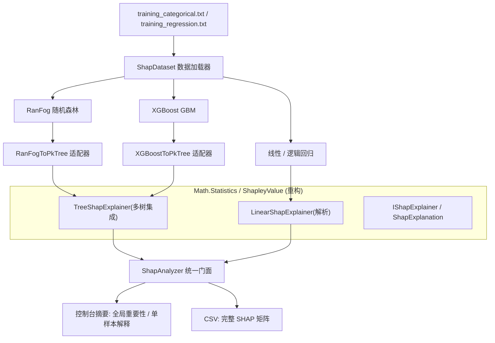

## 产品概述

在现有 sciBASIC# 数据科学仓库中，构建一套统一能力：对随机森林、XGBoost、线性/逻辑回归三类模型，在同一组训练数据上完成训练、分类/回归预测，并进行 SHAP 可解释性分析，最终以控制台摘要与 CSV 文件呈现结果。

## 核心功能

- 数据集读取：解析空格分隔的 `training_categorical.txt`（二分类标签 0/1）与 `training_regression.txt`（连续标签），得到特征矩阵、标签向量、样本 ID 与特征名。
- 三模型预测（两个数据集分别做分类与回归）：
- 随机森林（RanFog）：完成训练与预测，输出预测结果与误差指标（分类准确率、回归 RMSE/R²）。
- XGBoost（GBM）：分类用对数损失、回归用平方损失训练并预测。
- 线性模型：分类数据集用逻辑回归、回归数据集用线性回归，输出预测值与拟合优度。
- SHAP 可解释性分析：
- 树模型（随机森林、XGBoost）基于 TreeSHAP，计算每个样本每个特征的贡献值，并给出基线（期望值）。
- 线性/逻辑回归基于解析 SHAP，计算特征贡献。
- 汇总全局特征重要性（平均绝对 SHAP 值），并对单个样本给出逐特征解释。
- 结果以控制台摘要展示，同时将完整 SHAP 矩阵（样本 ID、各特征名对应贡献、基线值、预测值）导出为 CSV。
- 可复用模块：将 SHAP 计算重构为统一接口与解释器，供三类模型共用；随机森林新增可导出树结构与对新样本预测的能力。

## 技术栈选择

- 语言/框架：VB.NET（net10.0），沿用仓库现有 SDK 风格项目结构。
- 复用现有项目与算法：
- 随机森林：`MachineLearning/MachineLearning/machine_learning-netcore5.vbproj` 的 `RandomForests.RanFog`。
- XGBoost：`MachineLearning/xgboost/xgboost.vbproj` 的 `train.GBM`（另用 `XGBoostDataSet` 的 `Conversion` 构造训练数据）。
- 线性/逻辑回归：`Mathematica/Math/DataFittings/linear-netcore5.vbproj` 的 `NumericTableRegressions`（`LogisticRegression`、`LinearFit`/`MultipleLinearRegression`）。
- TreeSHAP：`Mathematica/Math/Math.Statistics/stats-netcore5.vbproj` 的 `ShapleyValue/TreeShap`（`PkNode`/`PkTree`/`ShapOptimized`/`ShapAlgo2`）。
- 不引入任何新第三方依赖，全部基于仓库内现有代码。

## 实现方案

核心策略：以 `PkTree`/`PkNode` 作为树模型的统一中间表示，新增“树集成级”TreeSHAP 封装；对线性/逻辑回归采用解析 SHAP；再用一个统一门面（`ShapAnalyzer`）把三类模型接入同一套输出流程。

关键决策与理由：

1. **随机森林改造**：`RanFog.Run` 结束后树被 GC 回收且 `Branch` 字段为 `Friend`。改造 `Branch.vb`（暴露 `Feature/Child1/Child2/mean_snp/status` 与叶值）与 `RanFog.vb`（把每棵树的 `branch` 数组存入实例字段，并新增 `Predict`）。这样既支持 TreeSHAP，也补齐了新样本预测能力；`Run` 的既有行为保持兼容。
2. **树模型统一表示**：在 `ML_SHAP` 中实现两个适配器，将 RanFog 的 `Branch()` 与 XGBoost 的 `Tree/TreeNode` 转换为 `PkNode`/`PkTree`。XGBoost 的 `TreeNode.leaf_score` 是 `Friend`，需在 xgboost 项目内新增 `Public ReadOnly` 访问器（xgboost 已引用 Math.Statistics，无需新增依赖）。
3. **TreeSHAP 引擎重构**：现有 `ShapOptimized` 只处理单棵树且结果末位附期望值。重构为 `IShapExplainer` 接口 + `TreeShapExplainer`（对多棵 `PkTree` 的贡献求和再叠加基线）+ `LinearShapExplainer`（解析）+ `ShapExplanation` 结果类型，同时把命名空间拼写 `TreeShape` 规范为 `TreeShap`。
4. **SHAP 计算选择**：树模型用精确 TreeSHAP（复杂度约 O(T·L·D²)，T 为树数、L 为叶子数、D 为深度）；线性模型 φi = βi·(xi − E[xi])；逻辑回归在 log-odds 线性预测子上做解析 SHAP（该空间下精确）。
5. **基线/期望值**：以训练集上的模型平均预测作为基线，保证 SHAP 加和守恒（Σφ + baseline ≈ 预测值）。
6. **性能**：数据集特征约 300 维、样本约 30 行。RanFog 默认 `max_tree=500/mtry=100` 偏慢，演示时下调（如 `max_tree=50`、`mtry≈√N`）；TreeSHAP 仅对少量样本计算，规模可控。

## 实现说明（执行要点）

- 数据格式为空格分隔 `label id f1 f2 ...`；用 `line.StringSplit("\s+")` 解析，`t(0)`=标签、`t(1)`=ID、`t.Skip(2).AsDouble`=特征（参考现有 `MachineLearning/MachineLearning/test/rf.vb`）。
- XGBoost 训练输入为 `TrainData`/`ValidationData`（`Single()()` 特征 + `Double()` 标签），必须通过 `XGBoostDataSet` 的 `Conversion` 扩展构造（内部字段为 `Friend`）；分类 `loss="logloss"`+`Metrics.auc`，回归 `loss="squareloss"`+`Metrics.mse`。
- 线性/逻辑回归需先构造 `NumericTable`（`Microsoft.VisualBasic.Data.NumericTable`，公开属性 `rowNames/featureNames/features/labels/labelNames`），再调用 `NumericTableRegressions` 扩展；统一用 `IFitted.GetY` 预测。
- RanFog 传入 `RandomForests.Data`（`ID/phenotype/Genotype/attributeNames`），分类与回归都可用默认 `LF_c.Mean_Squared_Error`（对 0/1 目标等价于方差下降）。
- 文件路径不要硬编码；从程序集位置向上查找仓库根目录定位 `MachineLearning/MachineLearning/RandomForests/training_*.txt`，或支持命令行参数覆盖，避免工作目录差异导致失败。
- 保持向后兼容：`RanFog.Run` 既有返回结构不变；仅在末尾追加树存储与 `Predict`。
- 输出 CSV 建议命名：`{dataset}_{model}_shap.csv`，列含样本 ID、各特征名、`baseline`、`prediction`。

## 架构设计



## 目录结构

```
Data_science/
├── MachineLearning/
│   ├── MachineLearning/
│   │   └── RandomForests/
│   │       ├── Branch.vb                      # [MODIFY] 暴露树节点字段(Feature/Child1/Child2/mean_snp/status)并新增叶值只读属性；保持 getMean 等既有 API。
│   │       └── RanFog.vb                      # [MODIFY] 将每棵树的 branch 数组保留到实例字段(如 Trees As List(Of Branch()))；记录训练标签/特征名；新增 Public Function Predict(Genotype As Double()()) As Double()；Run 行为保持兼容。
│   ├── xgboost/
│   │   └── TGBoost/
│   │       └── TreeNode.vb                    # [MODIFY] 为 leaf_score 增加 Public ReadOnly 访问器(如 leafValue)，供 ML_SHAP 读取叶值构建 PkTree。
│   └── ML_SHAP/
│       ├── ML_SHAP.vbproj                     # [MODIFY] 新增 ProjectReference：machine_learning、xgboost、XGBoostDataSet、linear-netcore5、DataMining、BinaryData。
│       ├── Class1.vb                          # [MODIFY] 移除占位类，替换为正式库代码入口。
│       ├── Data/
│       │   └── ShapDataset.vb                 # [NEW] 解析空格分隔数据文件，产出 features(id/label/featureNames) 容器；提供训练/预测所需的矩阵与标签视图。
│       ├── Models/
│       │   ├── RanFogShapModel.vb             # [NEW] 训练 RanFog + 预测；将 RanFog.Trees(Branch()) 转换为 PkTree 列表。
│       │   ├── XGBoostShapModel.vb            # [NEW] 用 Conversion 构造 TrainData/ValidationData，训练 GBM + 预测；将 Tree/TreeNode 转 PkTree(忽略 nan_child/分类型分裂，按数值阈值处理)。
│       │   └── LinearShapModel.vb             # [NEW] 构造 NumericTable，分类用 LogisticRegression、回归用 LinearFit，预测并导出系数供解析 SHAP。
│       ├── ShapAnalysis.vb                    # [NEW] 统一门面：build explainer、计算 SHAP 矩阵、全局重要性、单样本解释。
│       └── Report/
│           └── ShapCsvWriter.vb               # [NEW] 将 SHAP 矩阵/summary 写为 CSV。
│       └── test/
│           ├── test.vbproj                    # [MODIFY] 已引用全部模型项目与 ML_SHAP，无需新增引用（如需确保编译可按需微调）。
│           └── Program.vb                     # [MODIFY] 主程序：加载两数据集，分别训练 RF/XGBoost/线性(逻辑)模型并预测评估，随后对三模型执行 SHAP 分析，打印摘要并导出 CSV。
└── Mathematica/
    └── Math/
        └── Math.Statistics/
            └── ShapleyValue/
                ├── Core/
                │   ├── IShapExplainer.vb      # [NEW] 统一解释器契约：FeatureNames、Baseline、Explain(x)。
                │   ├── ShapExplanation.vb     # [NEW] 结果类型：FeatureNames/Baseline/Prediction/Contributions。
                │   ├── TreeShapExplainer.vb   # [NEW] 多棵 PkTree 的集成级 TreeSHAP：逐树求贡献并求和，叠加基线。
                │   └── LinearShapExplainer.vb # [NEW] 解析 SHAP：φi=βi·(xi-E[xi])；逻辑回归在 log-odds 上计算。
                └── TreeShap/
                    ├── PkNode.vb              # [MODIFY] 命名空间规范为 ShapleyValue.TreeShap，保持公开结构不变。
                    ├── PkTree.vb              # [MODIFY] 同上。
                    ├── ShapOptimized.vb       # [MODIFY] 同上；作为 TreeShapExplainer 的单树内核(去掉末位 baseline 硬耦合或加说明)。
                    ├── ShapAlgo2.vb           # [MODIFY] 同上。
                    ├── ShapAlgo1.vb           # [MODIFY] 同上(Friend)。
                    └── PathElement.vb         # [MODIFY] 同上。
```

## 关键代码结构

```
' Mathematica/Math/Math.Statistics/ShapleyValue/Core/IShapExplainer.vb
Namespace ShapleyValue
    ''' <summary> 统一的 SHAP 解释器契约 </summary>
    Public Interface IShapExplainer
        ReadOnly Property FeatureNames As String()
        ''' <summary> 期望值 / baseline </summary>
        ReadOnly Property Baseline As Double
        ''' <summary> 返回长度与 FeatureNames 一致的逐特征贡献(不含 baseline) </summary>
        Function Explain(x As Double()) As Double()
    End Interface
End Namespace

' Mathematica/Math/Math.Statistics/ShapleyValue/Core/ShapExplanation.vb
Namespace ShapleyValue
    Public Class ShapExplanation
        Public Property FeatureNames As String()
        Public Property Baseline As Double
        Public Property Prediction As Double
        Public Property Contributions As Double()
    End Class
End Namespace

' MachineLearning/ML_SHAP/Data/ShapDataset.vb
Namespace MachineLearning.SHAP
    Public Class ShapDataset
        Public Property IDs As String()
        Public Property Labels As Double()
        Public Property Features As Double()()
        Public Property FeatureNames As String()
        Public Property IsCategorical As Boolean
        Public Shared Function LoadFile(path As String, isCategorical As Boolean) As ShapDataset
    End Class
End Namespace
```

## Agent Extensions

### SubAgent

- **code-explorer**
- Purpose: 在实现前精确定位并核对 RanFog/Branch、XGBoost GBM/Tree/TreeNode、NumericTableRegressions/LogisticFit/MLRFit、PkTree/ShapOptimized 的真实签名与文件行号，避免基于猜测编码。
- Expected outcome: 输出一份精确的 API 契约清单（类全限定名、公开成员签名、命名空间拼写），作为三个适配器与重构的编码依据。