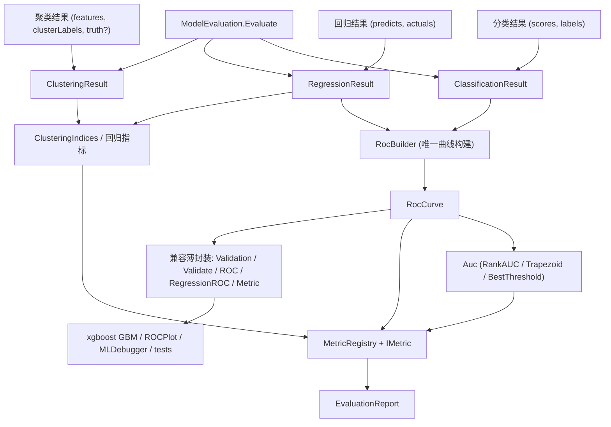

## 产品概述

对 `DataMining/DataMining/DataMining.NET5.vbproj` 的 `Evaluation` 模块做一次结构性重构：把当前分散在多个文件里的 4 套 ROC 曲线生成实现与 4 套 AUC 计算实现合并为一套唯一核心，并在此基础上为「聚类结果 / 机器学习分类结果 / 回归结果」三类结果数据建立统一的评估框架（统一入口 + 统一报告 + 可扩展指标注册表）。

## 核心功能

- **统一 ROC/AUC 核心**：唯一实现 ROC 曲线构建（支持分数排序扫描、通用阈值扫描、并列分数 ties 处理）与 AUC 计算（精确秩和 Mann–Whitney U，并保留曲线梯形面积法），删除其余重复实现。
- **三类结果适配器**：
- 分类结果：分数向量 + 0/1 标签，产出 ROC/AUC、准确率、错误率、F1 等。
- 回归结果：预测向量 + 连续真值，产出 MSE/RMSE/MAE/R²，并可经误差阈值扫描生成 ROC/AUC。
- 聚类结果：特征矩阵 + 簇标签，产出内部指标（Silhouette / Dunn / Davies–Bouldin / Calinski–Harabasz）；在提供真值标签时额外产出外部指标（Purity / ARI / NMI）。
- **统一评估报告与指标注册表**：单一 `Evaluate` 入口按结果类型返回统一 `EvaluationReport`（命名指标字典 + 可选 ROC 曲线），并支持通过注册表扩展自定义指标。
- **兼容与收敛**：`Metrics` 枚举、`IMetric` 委托、`Metric.GetMetric` 及 `Metric.acc/error/mse/mae/auc` 的签名保持不变并内部委托到新核心；`Validation`/`Validate`/`ROC`/`RegressionROC` 保留为薄封装入口；`PerformanceEvaluator`、`RankPair`、`ChangePoint`、`FakeAUCGenerator`、`ROC.BestThreshold` 的 ROC/AUC 能力并入新核心后保留（必要时标记 Obsolete）。
- **同步调用方**：更新 `ROCPlot.vb`、`ROCplotTest.vb`、`MLDebugger/ANN/ROC.vb`、`roc_test2.vb` 等调用方，使全部路径最终只经过唯一核心实现。

## 技术栈

- 语言/框架：VB.NET，`net10.0`（沿用 `DataMining.NET5.vbproj` SDK 风格项目，无显式 Compile Include，新增文件自动纳入编译）。
- 项目：`e:/codebuddy/GCModeller/src/runtime/sciBASIC#/Data_science/DataMining/DataMining/DataMining.NET5.vbproj`
- `RootNamespace = Microsoft.VisualBasic.DataMining`，所有 Evaluation 代码落在 `Namespace Evaluation`（= `Microsoft.VisualBasic.DataMining.Evaluation`）。
- 复用仓库既有类型：`Validation`（ROC 点）、`Validate`（多输出）、`Metric`/`Metrics`/`IMetric`、`Sequence`/`DoubleRange`、`Microsoft.VisualBasic.Math.LinearAlgebra.Vector`、`Microsoft.VisualBasic.Linq`、`Microsoft.VisualBasic.ComponentModel.Ranges.Model.DoubleRange`。
- 不引入任何新第三方依赖。

## 实现方案

核心策略：**一个核心 + 三个适配器 + 一个报告**。

1. **唯一 ROC/AUC 核心**（新建 `Evaluation/Roc/`）：

- `RocCurve`：ROC 曲线模型（有序 `Validation()` + `AUC` + `BestThreshold` + 正负样本数）。
- `RocBuilder`：唯一的曲线构建器，提供 `FromScores(scores, labels)`（按分数降序扫描，同一分数合并为一个阈值点，天然处理 ties）、`FromData(Of T)`（泛型回调）、`SweepThresholds(Of T)`（通用阈值扫描，替代原 `Validation.ROC`）。
- `Auc`：唯一的 AUC 算法模块，`RankAUC`（精确秩和 Mann–Whitney U，重复分数取平均秩）与 `Trapezoid`（曲线梯形面积）两条路径都只依赖同一 `RocCurve`/`Validation`，并统一 `BestThreshold`（到理想点 (0,1) 的欧氏距离最小）。
- 关键决策：AUC 保留**两种语义**（精确秩和 vs 曲线面积），因为分数型输入与阈值扫描型输入的等价性在离散化后会有差异；两者共用同一曲线模型，避免重复实现。复杂度：`FromScores`/`RankAUC` 为 O(n log n)，`SweepThresholds` 为 O(k·n)（k 为阈值个数）。

2. **三类结果适配器**（新建）：`ClassificationResult`、`RegressionResult`、`ClusteringResult`，只负责保存原始数据并转成核心所需的 `Double()`，各自实现 `Curve()` 与 `Report()`。
3. **聚类指标迁入**（新建 `ClusteringIndices`）：用**纯数值矩阵 + 整数簇标签**重写 Silhouette/Dunn/Davies–Bouldin/Calinski–Harabasz（标准定义，避免依赖已 Obsolete 的 `ClusterEntity`/`Bisecting.Cluster`），并新增 Purity/ARI/NMI；`KMeans.Evaluation` 与 `EvaluationScore.Evaluate` 改为委托（保留原签名作为兼容包装）。
4. **统一报告与注册表**：`EvaluationReport`（`Kind` + `Metrics As Dictionary(Of String, Double)` + `Curve`）、`MetricRegistry`（名称→`IMetric` 可扩展注册）、`ModelEvaluation.Evaluate(...)` 三个重载入口。`Metric`/`Metrics` 保留签名并委托到 `MetricRegistry`（保证 `xgboost/GBM.vb` 等零改动）。
5. **死代码收敛**：`PerformanceEvaluator.computeRoC` 改为调用 `RocBuilder`/`Auc`；`ROC.BestThreshold` 委托到 `Auc.BestThreshold`；`FakeAUCGenerator` 调用统一 `Auc.RankAUC`；三者与 `RankPair`/`ChangePoint` 保留并标注 `Obsolete`。
6. **调用方同步**：`ROCPlot.vb`（`Validation.AUC`、`Validation` 字段构造）、`ROCplotTest.vb`（`Validation.ROC`）、`MLDebugger/ANN/ROC.vb`（`Validation.ROC(Of Validate)`）、`roc_test2.vb`（`RegressionROC.ROC` + `.AUC`）全部改到新核心/薄封装上。

### 兼容与性能要点

- **必须保留的签名**（xgboost 依赖）：`Enum Metrics`、`Delegate Function IMetric`、`Metric.GetMetric/Metric.Parse`、`Metric.accuracy/error/mean_square_error/mean_absolute_error/auc`。
- **保留的薄封装**：`Validation.Calc/AUC/ROC(Of T)`、`ROC.AUC(...)`（含 `IEnumerable(Of Validation)` 与 `(predicts, actuals)` 重载）、`Validate.ROC/AUC`、`RegressionROC.ROC`。
- **可访问性修正**：`Validation` 的 `Specificity`/`Sensibility`/`Threshold`/`Accuracy`/`Precision`/`TP/FP/TN/FN` 由 `Dim`（Friend）改为 `Public`，使 `ROCPlot.vb` 等跨程序集构造成为可能。
- **性能**：`RankAUC` 必须排序一次并正确处理 ties（不得退化为 O(n²) 配对计数）；聚类 Silhouette 为 O(n²·d)，在 `ClusteringResult` 中提供可选采样上限与「样本数过大时自动降采样」提示。
- **副作用修复**：`Metric.crossEntropyLoss` 当前会就地修改传入的 `predictions` 数组，重构时改为不改动输入。

## 架构设计



## 目录结构

```
Data_science/DataMining/DataMining/Evaluation/
├── Roc/
│   ├── RocCurve.vb                 # [NEW] 统一 ROC 曲线模型：有序 Validation 点 + AUC + BestThreshold + 正负样本数 + Create()
│   ├── RocBuilder.vb               # [NEW] 唯一曲线构建器：FromScores/FromData/SweepThresholds（ties 合并，O(n log n)）
│   └── Auc.vb                      # [NEW] 唯一 AUC 模块：RankAUC（秩和 Mann-Whitney U，平均秩处理 ties）/ Trapezoid / BestThreshold
├── Results/
│   ├── ClassificationResult.vb     # [NEW] 分类结果模型：Scores/Labels/Cutoff；Curve() 与 Report()
│   ├── RegressionResult.vb         # [NEW] 回归结果模型：Predictions/Actuals/Eps；Curve()（阈值扫描）与 Report()
│   └── ClusteringResult.vb         # [NEW] 聚类结果模型：Features/ClusterLabels/GroundTruth?；Report()
├── ClusteringIndices.vb            # [NEW] 聚类指标（纯 Double()() + Integer() 标签）：Silhouette/Dunn/DaviesBouldin/CalinskiHarabasz + Purity/ARI/NMI
├── EvaluationReport.vb             # [NEW] 统一报告：Kind + Metrics(Dictionary(Of String,Double)) + Curve + Metric(name)
├── MetricRegistry.vb               # [NEW] 指标注册表：Get/Register/Names，内置分类/回归/聚类指标
├── ModelEvaluation.vb              # [NEW] 统一入口：Evaluate(ClassificationResult/RegressionResult/ClusteringResult) As EvaluationReport
├── Metric.vb                       # [MODIFY] 保留 Metrics/IMetric/Parse/GetMetric 与全部指标签名，内部委托 MetricRegistry；auc 委托 Auc.RankAUC；crossEntropyLoss 不再修改输入
├── Validation.vb                   # [MODIFY] 字段改为 Public；Calc 作为唯一点构造器；ROC(Of T) 委托 RocBuilder.SweepThresholds；AUC 委托 Auc.Trapezoid
├── ROC.vb                          # [MODIFY] 保留 Module 作为薄封装：AUC(validates) → Auc.Trapezoid；AUC(validates,names) → Auc.RankAUC；AUC(predicts,actuals) → Auc.RankAUC；SimpleAUC/BestThreshold → Auc
├── Validate.vb                     # [MODIFY] ROC/AUC 委托到 RocBuilder/Auc（多输出维度循环不变）
├── RegressionROC.vb                # [MODIFY] 重写为委托：回归结果 → RegressionResult.Curve()/RocBuilder
├── RegressionClassify.vb           # [MODIFY] 保留类型（作为 RegressionResult 的兼容输入），新增到 RegressionResult 的转换
├── NamespaceDoc.vb                 # [MODIFY] 补充统一评估框架说明
└── LabelEvaluate/
    ├── PerformanceEvaluator.vb     # [MODIFY] computeRoC/AuC 改为调用 RocBuilder/Auc；类型标注 Obsolete
    ├── RankPair.vb                 # [MODIFY] 保留并标注 Obsolete
    ├── ChangePoint.vb              # [MODIFY] 保留并标注 Obsolete
    └── FakeAUCGenerator.vb         # [MODIFY] 调用统一 Auc.RankAUC；保留并标注 Obsolete

Data_science/DataMining/DataMining/Clustering/KMeans/
├── Evaluation.vb                   # [MODIFY] Silhouette/Dunn/calcularDavidBouldin/CalinskiHarabasz 委托到 ClusteringIndices（保留原签名）
└── EvaluationScore.vb              # [MODIFY] Evaluate(...) 改为经 ClusteringIndices 计算

调用方同步（允许改动）
├── Visualization/Plots-statistics/ROCPlot.vb   # [MODIFY] 使用 Validation.AUC / RocCurve 新入口
├── Visualization/test/ROCplotTest.vb           # [MODIFY] 改用 RocBuilder. SweepThresholds（或保留 Validation.ROC 薄封装）
├── MachineLearning/MLDebugger/ANN/ROC.vb       # [MODIFY] 改用 RocBuilder
└── DataMining/DataMining/test/roc_test2.vb     # [MODIFY] 改用 RegressionResult + EvaluationReport
```

## 关键代码结构

```
' Evaluation/Roc/RocCurve.vb
Namespace Evaluation
    ''' <summary> 统一的 ROC 曲线模型（唯一的曲线结果载体） </summary>
    Public Class RocCurve
        Public Property Points As Validation()
        Public Property AUC As Double
        Public ReadOnly Property BestThreshold As Validation
        Public ReadOnly Property Positive As Integer
        Public ReadOnly Property Negative As Integer
        Public Shared Function Create(points As IEnumerable(Of Validation)) As RocCurve
    End Class
End Namespace

' Evaluation/Roc/Auc.vb
Namespace Evaluation
    Public Module Auc
        ''' <summary> 精确秩和 AUC（Mann-Whitney U，平均秩处理并列分数），O(n log n) </summary>
        Public Shared Function RankAUC(scores As Double(), labels As Boolean()) As Double
        Public Shared Function RankAUC(scores As Double(), labels As Double(), Optional cutoff As Double = 0.5) As Double
        ''' <summary> 曲线梯形面积 </summary>
        Public Shared Function Trapezoid(curve As IEnumerable(Of Validation)) As Double
        Public Shared Function BestThreshold(curve As IEnumerable(Of Validation)) As Integer
    End Module
End Namespace

' Evaluation/EvaluationReport.vb
Namespace Evaluation
    Public Enum ResultKinds
        classification
        regression
        clustering
    End Enum

    Public Class EvaluationReport
        Public Property Kind As ResultKinds
        Public Property Metrics As Dictionary(Of String, Double)
        Public Property Curve As RocCurve
        Public Function Metric(name As String) As Double
        Public Overrides Function ToString() As String
    End Class
End Namespace

' Evaluation/ModelEvaluation.vb
Namespace Evaluation
    Public Module ModelEvaluation
        Public Function Evaluate(result As ClassificationResult) As EvaluationReport
        Public Function Evaluate(result As RegressionResult) As EvaluationReport
        Public Function Evaluate(result As ClusteringResult) As EvaluationReport
    End Module
End Namespace

' Evaluation/MetricRegistry.vb
Namespace Evaluation
    Public NotInheritable Class MetricRegistry
        Public Shared Function [Get](name As String) As IMetric
        Public Shared Sub [Register](name As String, metric As IMetric)
        Public Shared ReadOnly Property Names As String()
    End Class
End Namespace
```

## 实现说明（执行要点）

- `Auc.RankAUC` 必须使用「正样本秩和」公式 `(Σ rank(pos) − n_pos(n_pos+1)/2) / (n_pos·n_neg)`，并列分数取平均秩；当 `n_pos = 0` 或 `n_neg = 0` 时返回 `Double.NaN` 并保持与原 `Metric.auc`（除 0 得 NaN/Inf）行为一致但更明确。
- `RocBuilder.FromScores` 需与 `Auc.RankAUC` 数值自洽：对同一输入，曲线梯形面积与秩和 AUC 应相等（不含 ties 时）；并列分数必须合并为一个阈值点。
- 保留 `Metric.GetMetric(Metrics.auc)` 返回 `AddressOf Metric.auc`，且 `Metric.auc` 内部调用 `Auc.RankAUC`，避免 xgboost 行为变化。
- `Validation` 字段可见性改为 `Public` 属兼容性修正，不改变数值语义。
- 聚类 Silhouette 采用标准定义（逐样本 `s(i) = (b−a)/max(a,b)` 后取均值）；若旧 `KMeans.Evaluation.Silhouette` 的簇级近似结果与新实现不同，需在 `NamespaceDoc` 中说明该语义修正，并让 `EvaluationScore` 采用标准定义。
- ARI 使用调整兰德指数（含期望项），NMI 使用 `2·I(U;V)/(H(U)+H(V))`，Purity 为 `Σ max_j |C_k ∩ T_j| / n`。
- 不改动 `.codebuddy`；不修改无关项目。
- 完成后必须编译通过：`DataMining.NET5.vbproj`、`xgboost.vbproj`、`plots_extensions-netcore5.vbproj`、`ML_debugger-netcore5.vbproj`、`ML_SHAP/test/test.vbproj`、`DataMining/DataMining/test/test.vbproj`。

## Agent Extensions

### SubAgent

- **code-explorer**
- Purpose: 在动手前精确定位并核对所有受影响符号的真实签名与文件行号（`Validation` 字段可见性、`Sequence`/`Variant` 用法、`Bisecting.Cluster` 与 `ClusterEntity` 的依赖、`KMeans.EvaluationScore` 的调用方、`ROCPlot`/`MLDebugger` 的实际可编译性），避免基于记忆编码。
- Expected outcome: 输出一份精确的"改造前基线清单"（每个待改文件 + 待改方法签名 + 全部调用点），作为唯一核心实现与薄封装改造的依据。
</subagent>