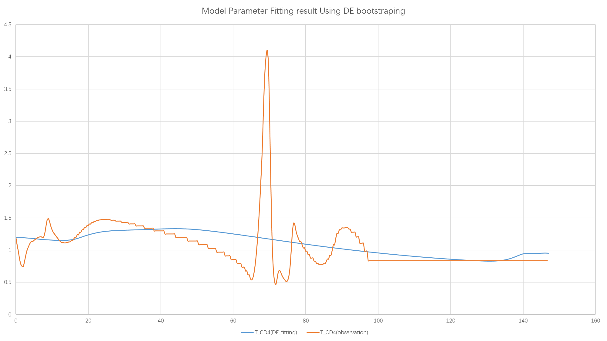

.jpg)
> Performance landscape showing how the basic DE performs in aggregate on the Sphere and Rosenbrock benchmark problems when varying the two DE parameters and , and keeping fixed =0.9.
>
> Pedersen, M.E.H., Tuning & Simplifying Heuristical Optimization, PhD Thesis, 2010, University of Southampton, School of Engineering Sciences, Computational Engineering and Design Group.
>
> Performance landscape showing how basic Differential Evolution (DE) performs in aggregate on the Sphere and Rosenbrock benchmark problems when varying the two DE parameters NP and F, and keeping fixed CR=0.9. Lower meta-fitness values means better DE performance. Such a performance landscape is very time-consuming to compute, especially for optimizers with several behavioural parameters, but it can be searched efficiently using the simple meta-optimization approach by Pedersen implemented in SwarmOps to uncover DE parameters with good performance.

###### Usage example in VB.NET

Usage reference to this bootstraping code:

```vbnet
Imports Microsoft.VisualBasic.Data.Bootstrapping.GAF
Imports Microsoft.VisualBasic.DataMining.Darwinism
Imports Microsoft.VisualBasic.DataMining.Darwinism.DifferentialEvolution
Imports Microsoft.VisualBasic.DataMining.Darwinism.GAF.Helper.ListenerHelper
Imports Microsoft.VisualBasic.Language
Imports Microsoft.VisualBasic.Linq
Imports Microsoft.VisualBasic.Mathematical.Calculus

Public Function Fitting(Of T As MonteCarlo.Model)(
                         observation As ODEsOut,
                         Optional F As Double = 1,
                         Optional CR As Double = 0.5,
                         Optional threshold# = 0.1,
                         Optional maxIterations% = 500000,
                         Optional PopulationSize% = 200,
                         Optional ByRef iteratePrints As List(Of outPrint) = Nothing,
                         Optional initOverrides As Dictionary(Of String, Double) = Nothing,
                         Optional isRefModel As Boolean = False,
                         Optional parallel As Boolean = False) As var()

    Dim model As Type = GetType(T)
    Dim vars As String() = MonteCarlo.Model.GetParameters(model).ToArray
    Dim [new] As [New](Of ParameterVector) =
        Function(seed)
            Dim out As New ParameterVector With {
                .vars = vars _
                .ToArray(Function(v) New var(v))
            }

            If seed Is Nothing Then
                Return out
            Else
                For Each x In out.vars
                    Dim power# = (
                        If(seed.Next > 0.5, 1, -1) * seed.Next(vars.Length)
                    )
                    x.value = 100 ^ power
                Next
            End If

            Return out
        End Function
    Dim fitness As New GAFFitness(model, observation, initOverrides, isRefModel)
    Dim iterates As New List(Of outPrint)
    Dim best = DifferentialEvolution.Evolution(
        AddressOf fitness.Calculate,
        [new],
        vars.Length,
        F, CR, threshold,
        maxIterations,
        PopulationSize,
        AddressOf iterates.Add,
        parallel)

    iteratePrints = iterates

    Return best.vars
End Function
```

###### Example
[Test_fitting.csv](./Test_fitting.csv)

