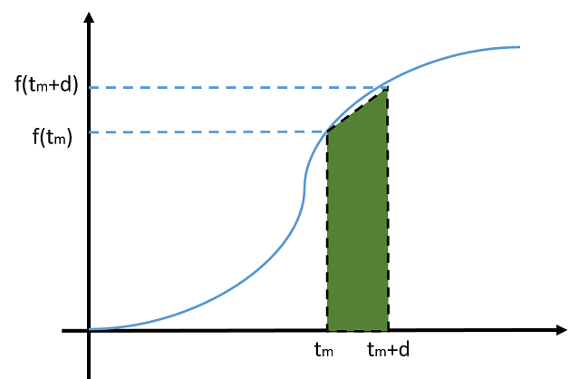
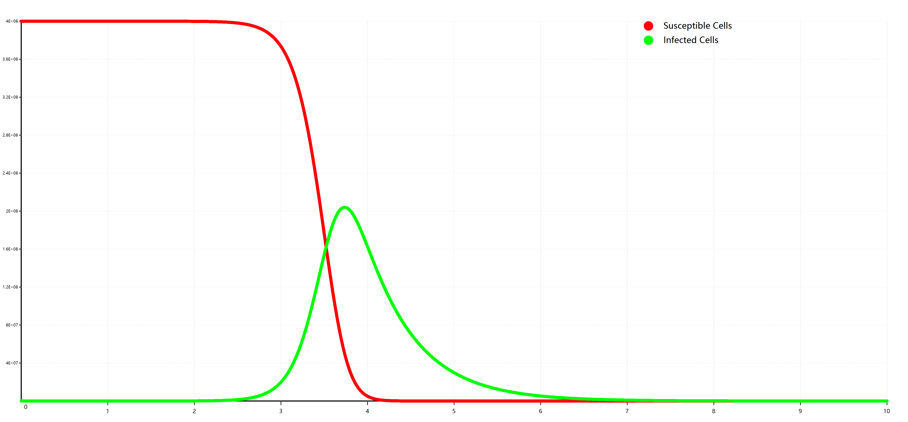
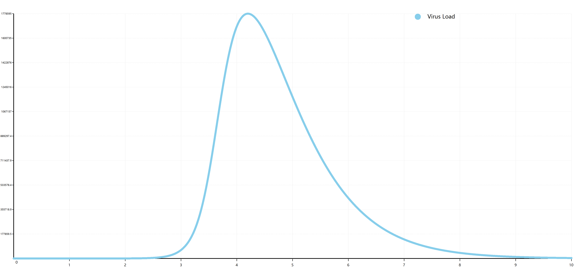
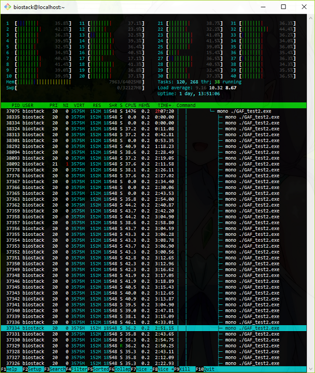

# Genetic Algorithm

> CodeProject KB: http://www.codeproject.com/Articles/1151926/Genetic-Algorithm-in-VisualBasic 
>
>
> Installing **sciBASIC#** package via nuget:
> ```
> PM> Install-Package sciBASIC -Pre
> ```
> and then add reference to these dll modules:
>
> + Microsoft.VisualBasic.Data.Csv.dll
> + Microsoft.VisualBasic.DataMining.Framework.dll
> + Microsoft.VisualBasic.Mathematical.dll
> + Microsoft.VisualBasic.Mathematical.ODEsSolver.dll
> + Microsoft.VisualBasic.Architecture.Framework_v3.0_22.0.76.201__8da45dcd8060cc9a.dll
> + Microsoft.VisualBasic.Data.Bootstrapping.dll

## Background

In computer science and operations research, a genetic algorithm (GA) is a metaheuristic inspired by the process of natural selection that belongs to the larger class of evolutionary algorithms (EA). Genetic algorithms are commonly used to generate high-quality solutions to optimization and search problems by relying on bio-inspired operators such as mutation, crossover and selection.

Recently, I was working on an research of modelling the virus infection dynamic with the details of human IR, the dynamics parameter in the equation was going to estimates from the clinical data of some human patients. As the description in others' previous scientific work paper, the genetics algorithm was chosen for this parameter estimates. In this post I will introduce how to using the genetic algorithm for the parameter estimates using the code that I construct for my research.

### RK4 ODEs solver in VisualBasic

Before the parameter estimates, I needs a ODEs solver for calculate the dynamics model that I've created in the research, and after search the Wikipedia, here is the algorithm implementation that I used for solveing an ODEs in numeric method.



```
y(tm+1) =y(tm)  + (k1 + 2k2 +2k3 + k4) / 6 * h     (1)
k1 =f( y(tm), tm)                                  (2)
k2 =f( y(tm)  + k1 / 2 * h, tm + h / 2)            (3)
k3 =f( y(tm)  + k2 / 2 * h, tm + h / 2)            (4)
k4 =f( y(tm) + h * k3, tm + h)                     (5)
```

Here is the code that implements the Runge-Kutta method for solving an ODEs in VisualBasic, for more technical details you can viewing the Runge-Kutta wiki page: [https://en.wikipedia.org/wiki/Runge-Kutta](https://en.wikipedia.org/wiki/Runge-Kutta)

```vbnet
''' <summary>
''' RK4 ODEs solver
''' </summary>
''' <param name="dxn">The x initial value.(x初值)</param>
''' <param name="dyn">The y initial value.(初值y(n))</param>
''' <param name="dh">Steps delta.(步长)</param>
''' <param name="dynext">
''' Returns the y(n+1) result from this parameter.(下一步的值y(n+1))
''' </param>
Private Sub __rungeKutta(dxn As Double,
                         ByRef dyn As Vector,
                         dh As Double,
                         ByRef dynext As Vector)
    Call ODEs(dxn, dyn, K1)                             ' 求解K1
    Call ODEs(dxn + dh / 2, dyn + dh / 2 * K1, K2)      ' 求解K2
    Call ODEs(dxn + dh / 2, dyn + dh / 2 * K2, K3)      ' 求解K3
    Call ODEs(dxn + dh, dyn + dh * K3, K4)              ' 求解K4

    dynext = dyn + (K1 + K2 + K3 + K4) * dh / 6.0  ' 求解下一步的值y(n+1)
End Sub
```

#### RK4 solver Code Usage

Here is the brief introduce of how to using the ODEs solver in VisualBasic:

1. Inherits the abstract ODEs model: ``Microsoft.VisualBasic.Mathematical.Calculus.ODEs``
2. Declaring of the y variables: ``Dim <y_name> As var``
3. Other parameter just declared as constant or normal fields: ``Const param# = value``
4. Specific the ``y0`` by using inline value assign: ``var = value``
5. Then at last, you can using ``ODEs.Solve(Integer, Double, Double, Boolean) As Microsoft.VisualBasic.Mathematical.Calculus.ODEsOut`` to solve your equations.

Here represents a simple example of construct an ODEs model in VisualBasic:

```vbnet
''' <summary>
''' ##### Kinetics of influenza A virus infection in humans
'''
''' > **DOI** 10.3390/v7102875
''' </summary>
''' <remarks>假设为实验观测数据</remarks>
Public Class Kinetics_of_influenza_A_virus_infection_in_humans : Inherits ODEs

    Dim T As var
    Dim I As var
    Dim V As var

    Const p# = 3 * 10 ^ -2
    Const c# = 2
    Const beta# = 8.8 * 10 ^ -6
    Const delta# = 2.6

    Protected Overrides Sub func(dx As Double, ByRef dy As Vector)
        dy(T) = -beta * T * V
        dy(I) = beta * T * V - delta * I
        dy(V) = p * I - c * V
    End Sub

    Protected Overrides Function y0() As var()
        Return {
            V = 1.4 * 10 ^ -2,
            T = 4 * 10 ^ 8,
            I = 0
        }
    End Function
End Class
```

Running the solver and plotting the numerics result of your equations:

```vbnet
Dim model As New Kinetics_of_influenza_A_virus_infection_in_humans
Dim result As ODEsOut = model.Solve(10000, 0, 10)

Call result.DataFrame("#TIME") _
    .Save("./Kinetics_of_influenza_A_virus_infection_in_humans.csv", Encodings.ASCII)

Dim sT = result.y("T").x.SeqIterator.ToArray(Function(i) New PointF(result.x(i), +i))
Dim sI = result.y("I").x.SeqIterator.ToArray(Function(i) New PointF(result.x(i), +i))
Dim sV = result.y("V").x.SeqIterator.ToArray(Function(i) New PointF(result.x(i), +i))

Call {
    Scatter.FromPoints(sT, "red", "Susceptible Cells"),
    Scatter.FromPoints(sI, "lime", "Infected Cells")
}.Plot(fill:=False) _
 .SaveAs("./Kinetics_of_influenza_A_virus_infection_in_humans-TI.png")

Call {
    Scatter.FromPoints(sV, "skyblue", "Virus Load")
}.Plot(fill:=False) _
 .SaveAs("./Kinetics_of_influenza_A_virus_infection_in_humans-V.png")
```




## Using the Code

### GAF Core

As the [Genetic Algorithm](https://en.wikipedia.org/wiki/Genetic_algorithm) described, the genetic algorithm should contains the individual mutation, crossover between the individual chromosomes, and the fitness sort for population selection. Then I concluded the points that may be useful in the coding of your own GAF implementation, you can implements the genetics algorithm by yourself from following these steps:

1. Initialized a population with specific population size, and each chromosome in this population is the candidate solution for your problem
2. Then you are going to use a while loop in your function for the genetic iteration, loop until the best fitness in of your solution meets the threshold
3. As the algorithm described, each iteration, each chromosomes has the chance to mutate it self a bit, and the mutate will creates a new clone of the chromosomes itself
4. In each iteration, each chromosomes or its mutation have the chance to crossover with other chromosomes(random in the population, crossover means swap some elements in the chromosomes)
5. At last, these new mutation join the original population to creates a new population.
6. Then you can calculate the fitness for each chromosome in this new population and then sort these chromosomes by their fitness.
7. By takes the first population size number of chromosomes from the new population after the fitness sort step, then you may get a better solution for your problem.
8. Loop until the first element(best solution) in the population its fitness meets the threshold.

``Microsoft.VisualBasic.DataMining.Darwinism.GAF.GeneticAlgorithm(Of C, T)``, for using the genetic algorithm, you must implements these interface for your model:

###### 1. The GAF core needs the information to knowns how to calculates the fitness for your chromesome model

```vbnet
' Microsoft.VisualBasic.DataMining.Darwinism.GAF.Fitness(Of C, T)

Public Interface Fitness(Of C As Chromosome(Of C), T As IComparable(Of T))

    ''' <summary>
    ''' Assume that chromosome1 is better than chromosome2 <br/>
    ''' fit1 = calculate(chromosome1) <br/>
    ''' fit2 = calculate(chromosome2) <br/>
    ''' So the following condition must be true <br/>
    ''' fit1.compareTo(fit2) &lt;= 0 <br/>
    ''' (假若是并行模式的之下，还要求这个函数是线程安全的)
    ''' </summary>
    Function Calculate(chromosome As C) As T
End Interface
```

###### 2. The GAF core requird of information to knowns how to mutate and corssover itself

```vbnet
' Microsoft.VisualBasic.DataMining.Darwinism.Models.Chromosome(Of C)

Public Interface Chromosome(Of C As Chromosome(Of C))

    ''' <summary>
    ''' In genetic algorithms, crossover is a genetic operator used to vary the programming 
    ''' of a chromosome or chromosomes from one generation to the next. It is analogous to 
    ''' reproduction and biological crossover, upon which genetic algorithms are based. 
    ''' Cross over is a process of taking more than one parent solutions and producing a 
    ''' child solution from them. There are methods for selection of the chromosomes.
    ''' </summary>
    ''' <param name="anotherChromosome"></param>
    ''' <returns></returns>
    Function Crossover(anotherChromosome As C) As IList(Of C)
    ''' <summary>
    ''' Mutation is a genetic operator used to maintain genetic diversity from one generation 
    ''' of a population of genetic algorithm chromosomes to the next. It is analogous to 
    ''' biological mutation. Mutation alters one or more gene values in a chromosome from its 
    ''' initial state. In mutation, the solution may change entirely from the previous solution. 
    ''' Hence GA can come to better solution by using mutation. Mutation occurs during evolution 
    ''' according to a user-definable mutation probability. This probability should be set low. 
    ''' If it is set too high, the search will turn into a primitive random search.
    '''
    ''' The classic example Of a mutation Operator involves a probability that an arbitrary bit 
    ''' In a genetic sequence will be changed from its original state. A common method Of 
    ''' implementing the mutation Operator involves generating a random variable For Each bit 
    ''' In a sequence. This random variable tells whether Or Not a particular bit will be modified. 
    ''' This mutation procedure, based On the biological point mutation, Is called Single point 
    ''' mutation. Other types are inversion And floating point mutation. When the gene encoding 
    ''' Is restrictive As In permutation problems, mutations are swaps, inversions, And scrambles.
    '''
    ''' The purpose Of mutation In GAs Is preserving And introducing diversity. Mutation should 
    ''' allow the algorithm To avoid local minima by preventing the population Of chromosomes 
    ''' from becoming too similar To Each other, thus slowing Or even stopping evolution. This 
    ''' reasoning also explains the fact that most GA systems avoid only taking the fittest Of 
    ''' the population In generating the Next but rather a random (Or semi-random) selection 
    ''' With a weighting toward those that are fitter.
    ''' </summary>
    ''' <returns></returns>
    Function Mutate() As C
End Interface
```

### GAF Parallel computing

Enable the GAF parallel computing is super easy, just needs specific the Parallel property its value to ``TRUE``, And then before the fitness sorts, A parallel Linq will be call to boost the entire ODEs fitness evaluation process.

```vbnet
Population(Of chr).Parallel As Boolean

LQuery = From x As NamedValue(Of chr)
         In source.AsParallel
         Let fit As T = GA._fitnessFunc.Calculate(x.x)
         Select New NamedValue(Of T) With {
             .Name = x.Name,
             .x = fit
         }
```

## Parameter estimates

### Chromosome: ParameterVector

The chromosomes in a population can evolve better fitting to the environment due to the reason of mutation and environment selection. Here is the utility functions that can produce a bit of mutation in a chromosome and the crossover function can provides the elements swap between two chromosomes:

```vbnet
''' <summary>
''' Mutate a bit in an array.
''' </summary>
''' <param name="array#">The abstraction of a chromosome(parameter list).
''' (需要被拟合的参数列表，在这个函数里面会被修改一点产生突变)
''' </param>
''' <param name="rnd"></param>
<Extension> Public Sub Mutate(ByRef array#(), rnd As Random)
    Dim i% = rnd.Next(array.Length)  ' 得到需要被突变的位点在数组中的下标
    Dim n# = Math.Abs(array(i))      ' 得到元素值，由于负数取位数的时候回出错，所以这里取绝对值，因为只需要取位数
    Dim power# = Math.Log10(n#) - 1  ' 取位数
    Dim sign% =
        If(rnd.NextBoolean, 1, -1)

    n += sign * (rnd.NextDouble * 10 * (10 ^ power))
    If n.IsNaNImaginary Then
        n = Short.MaxValue
    End If

    array(i) = n
End Sub

''' <summary>
''' Returns list of siblings
''' Siblings are actually new chromosomes,
''' created using any of crossover strategy
''' </summary>
''' <param name="random"></param>
''' <param name="v1#"></param>
''' <param name="v2#"></param>
<Extension>
Public Sub Crossover(Of T)(random As Random, ByRef v1 As T(), ByRef v2 As T())
    Dim index As Integer = random.Next(v1.Length - 1)
    Dim tmp As T

    ' one point crossover
    For i As Integer = index To v1.Length - 1
        tmp = v1(i)
        v1(i) = v2(i)
        v2(i) = tmp
    Next
End Sub
```

As you can see on the Mutate and Crossover utility functions, the chromosomes was abstracted as an array, so that we needs a model to translates our fitted parameter list as an array that can be proceeded by these two utility function:

```vbnet
Namespace Darwinism.GAF

    ''' <summary>
    ''' Parameters that wait for bootstrapping estimates
    ''' </summary>
    Public Class ParameterVector
        Implements Chromosome(Of ParameterVector), ICloneable
        Implements IIndividual

        ''' <summary>
        ''' The function variable parameter that needs to fit, not includes the ``y0``.
        ''' (只需要在这里调整参数就行了，y0初始值不需要)
        ''' </summary>
        ''' <returns></returns>
        Public Property vars As var()

        ''' <summary>
        ''' Transform as a vector for the mutation and crossover function.
        ''' </summary>
        ''' <returns></returns>
        <ScriptIgnore>
        Public ReadOnly Property Vector As Double()
            Get
                Return vars _
                    .Select(Function(var) var.value) _
                    .ToArray
            End Get
        End Property

        ''' <summary>
        ''' Clone and crossover and last assign the vector value.(结果是按值复制的)
        ''' </summary>
        ''' <param name="anotherChromosome"></param>
        ''' <returns></returns>
        Public Function Crossover(anotherChromosome As ParameterVector) As IList(Of ParameterVector) Implements Chromosome(Of ParameterVector).Crossover
            Dim thisClone As ParameterVector = DirectCast(Clone(), ParameterVector)
            Dim otherClone As ParameterVector = DirectCast(anotherChromosome.Clone, ParameterVector)
            Dim array1#() = thisClone.Vector
            Dim array2#() = otherClone.Vector

            Call seeds() _
                .Crossover(array1, array2)
            thisClone.__setValues(array1)
            otherClone.__setValues(array2)

            Return {thisClone, otherClone}.ToList
        End Function

        ''' <summary>
        ''' Clone and mutation a bit and last assign the vector value.(会按值复制)
        ''' </summary>
        ''' <returns></returns>
        Public Function Mutate() As ParameterVector Implements Chromosome(Of ParameterVector).Mutate
            Dim m As ParameterVector = DirectCast(Clone(), ParameterVector)
            Dim random As Random = seeds()

            For i As Integer = 0 To 2
                Dim array#() = m.Vector

                Call array.Mutate(random)
                Call m.__setValues(array)
            Next

            Return m
        End Function
    End Class
End Namespace
```

### GAF fitness

Each variable in the function of ODEs its calculated value was compared with the observation value through RMS value:


And then using the average value of these RMS value as the final fitness of the current parameter value.

```vbnet
Public Function Calculate(chromosome As ParameterVector) As Double Implements Fitness(Of ParameterVector, Double).Calculate
    Dim vars As Dictionary(Of String, Double) =
        chromosome _
            .vars _
            .ToDictionary(Function(var) var.Name,
                          Function(var) var.value)
    Dim out As ODEsOut = ' y0使用实验观测值，而非突变的随机值
        MonteCarlo.Model.RunTest(Model, y0, vars, n, a, b, ref)  ' 通过拟合的参数得到具体的计算数据
    Dim fit As New List(Of Double)
    Dim NaN%

    ' 再计算出fitness
    For Each y$ In modelVariables _
        .Where(Function(v)
                   Return Array.IndexOf(Ignores, v) = -1
               End Function)

        Dim a#() = observation.y(y$).x
        Dim b#() = out.y(y$).x

        If log10Fitness Then
            a = a.ToArray(Function(x) log10(x))
            b = b.ToArray(Function(x) log10(x))
        End If

        NaN% = b.Where(AddressOf IsNaNImaginary).Count
        fit += Math.Sqrt(FitnessHelper.Calculate(a#, b#))
    Next

    ' Return fit.Average
    Dim fitness# = fit.Average

    If fitness.IsNaNImaginary Then
        fitness = Integer.MaxValue * 100.0R
        fitness += NaN% * 10
    End If

    Return fitness
End Function

Public Shared Function log10(x#) As Double
    If x = 0R Then
        Return -1000
    ElseIf x.IsNaNImaginary Then
        Return Double.NaN
    Else
        ' 假若不乘以符号，则相同指数级别的正数和负数之间的差异就会为0，
        ' 所以在这里需要乘以符号值
        Return Math.Sign(x) * Math.Log10(Math.Abs(x))
    End If
End Function
```

## Testing

##### Problem &amp; Goal

A virus infection dynamics model of Influenza was used in this testing for the GAF method demo:

> 
>
> 
>
> 

Original definition and fitting parameter values can be found in this scientific paper:

> Kinetics of Influenza A Virus Infection in Humans. 
> **DOI: 10.1128/JVI.01623-05**

##### ODEs Model

We want to estimates the kinetics parameters (p, c, beta and delta) in the equations using GAF method, so that we just define a ODEs model and leaves the parameter blank or assign any value, wait for the estimates, and here is the code example:

```vbnet
Public Class Kinetics_of_influenza_A_virus_infection_in_humans_Model : Inherits GAF.Model

    Dim T As var
    Dim I As var
    Dim V As var

    Dim p As Double = Integer.MaxValue
    Dim c As Double = Integer.MaxValue
    Dim beta As Double = Integer.MaxValue
    Dim delta As Double = Integer.MaxValue

    Protected Overrides Sub func(dx As Double, ByRef dy As Vector)
        dy(T) = -beta * T * V
        dy(I) = beta * T * V - delta * I
        dy(V) = p * I - c * V
    End Sub
End Class
```

##### Observation Data Example

For this testing demo, I using the exists model output as the biological experiment observation reference for the GAF estimates' fitness calculation. And using this method to creates a fake experiment data:

```vbnet
Public Sub BuildFakeObservationForTest()
    Dim result As ODEsOut = ODEsOut _
        .LoadFromDataFrame("./Kinetics_of_influenza_A_virus_infection_in_humans.csv")
    Dim sampleSize% = 100
    Dim xlabels#() = result.x.Split(sampleSize).ToArray(Function(block) block.Average)
    Dim samples As NamedValue(Of Double())() =
        LinqAPI.Exec(Of NamedValue(Of Double())) <=
 _
        From y As NamedValue(Of Double())
        In result.y.Values
        Let sample As Double() = y.x _
            .Split(sampleSize) _
            .ToArray(Function(block) block.Average)
        Select New NamedValue(Of Double()) With {
            .Name = y.Name,
            .x = sample
        }

    Call samples.SaveTo(
        path:="./Kinetics_of_influenza_A_virus_infection_in_humans-fake-observation.csv",
        xlabels:=xlabels)
End Sub
```

##### Interpolation Preprocessing

If the experiments data is too small for the GAF based parameter estimates, then you can using the curve interpolation method for increasing the data points in your sample data. There are two curve Interpolation method that available in VisualBasic: **B-spline** method and **Cubic spline** in namespace ``Microsoft.VisualBasic.Mathematical.Interpolation``. Here is an example of Cubic spline for the experiment datas' curve Interpolation processing:

```vbnet
Dim samples = "./Kinetics_of_influenza_A_virus_infection_in_humans-fake-observation.csv" _
    .LoadData _
    .ToDictionary
Dim x As Double() = samples("X").x
Dim observations As NamedValue(Of Double())() =
    LinqAPI.Exec(Of NamedValue(Of Double())) <=
 _
    From sample As NamedValue(Of Double())
    In samples.Values
    Let raw As PointF() = x _
        .SeqIterator _
        .ToArray(Function(xi) New PointF(+xi, y:=sample.x(xi)))
    Let cubicInterplots = CubicSpline.RecalcSpline(raw, 10).ToArray
    Let newData As Double() = cubicInterplots _
        .ToArray(Function(pt) CDbl(pt.Y))
    Select New NamedValue(Of Double()) With {
        .Name = sample.Name,
        .x = newData,
        .Description = cubicInterplots _
            .ToArray(Function(pt) pt.X) _
            .GetJson  ' just needs the x value for the test
    }

Call observations _
    .SaveTo("./Kinetics_of_influenza_A_virus_infection_in_humans-samples.csv")
```

##### GAF Estimates

All of the method protocol are avaliable in the namespace: ``Microsoft.VisualBasic.Data.Bootstrapping.Darwinism.GAF.Protocol``, and using ``Fitting`` function for invoke this GAF parameter estimates:

```vbnet
Public Shared Function Fitting(Of T As Microsoft.VisualBasic.Data.Bootstrapping.MonteCarlo.Model)(
                        observation As System.Collections.Generic.IEnumerable(Of Microsoft.VisualBasic.ComponentModel.DataSourceModel.NamedValue(Of Double())),
                                  x As Double(),
                   Optional popSize As Integer = 100,
                   Optional evolIterations As Integer = 2147483647,
                   Optional ByRef outPrint As Microsoft.VisualBasic.Language.List(Of Microsoft.VisualBasic.DataMining.Darwinism.GAF.Helper.ListenerHelper.outPrint) = Nothing,
                   Optional threshold As Double = 0.5,
                   Optional log10Fit As Boolean = True,
                   Optional ignores As String() = Nothing,
                   Optional initOverrides As System.Collections.Generic.Dictionary(Of String, Double) = Nothing,
                   Optional estArgsBase As System.Collections.Generic.Dictionary(Of String, Double) = Nothing,
                   Optional isRefModel As Boolean = False,
                   Optional randomGenerator As Microsoft.VisualBasic.Mathematical.IRandomSeeds = Nothing) As Microsoft.VisualBasic.Mathematical.Calculus.var()
    ' Member of Microsoft.VisualBasic.Data.Bootstrapping.Darwinism.GAF.Protocol
```
Here is the example code of invoke the GAF method and save the result into a csv file:
```vbnet
Dim prints As List(Of outPrint) = Nothing
Dim estimates As var() = observations _
    .Fitting(Of Kinetics_of_influenza_A_virus_infection_in_humans_Model)(
    x#:=observations.First.Description.LoadObject(Of Double()),
    popSize:=1000,
    outPrint:=prints)

Call prints _
    .SaveTo("./Kinetics_of_influenza_A_virus_infection_in_humans-iterations.csv")

Dim result = MonteCarlo.Model.RunTest(
    GetType(Kinetics_of_influenza_A_virus_infection_in_humans_Model),
    observations.y0,
    estimates,
    10000, 0, 10)

Call result.DataFrame("#TIME") _
    .Save("./Kinetics_of_influenza_A_virus_infection_in_humans-GAF_estimates.csv", Encodings.ASCII)
```

## Testing On Linux and Super Computer
This demo was build with VisualStudio 2015 and has been tested successfully on a Dell 40 CPU core server(running CentOS 7) and China TianHe 1 Super Computer.


