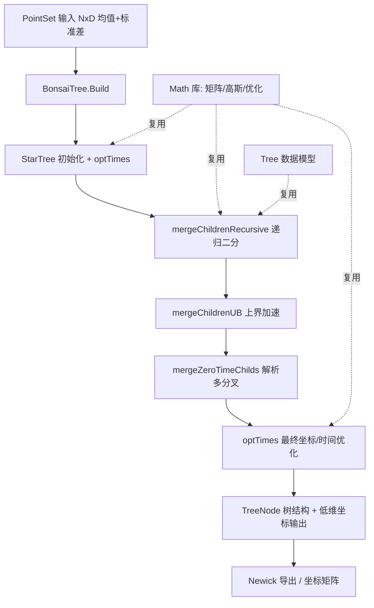

## 用户需求

依据 Bonsai 论文（Bonsai.md 与 s41587-026-03220-2.pdf）及原版 Python 参考实现（bonsai_py/），使用 VB.NET 在 Bonsai/ 文件夹内复现 Bonsai 算法的核心降维功能，构建高维数据（N×D 点集）的树状结构可视化表示。

## 产品概述

一套 VB.NET 实现的高维数据树状重建（Bonsai）算法库：输入为通用高维点集矩阵（N 个样本、D 维特征）及每维不确定性（标准差），输出为树结构（Newick 含义的树拓扑 + 各节点位置均值/方差）以及每样本的低维树坐标，可用于无损、无扭曲的高维数据可视化。剥离所有单细胞生物学特异性逻辑（marker 基因、cluster 注释、pseudotime 语义等）。

## 核心功能

- 数据模型：承载高维点集（均值 + 标准差）、树节点（位置均值 coords、协方差/精度矩阵 W、分支时间 t）的纯数值结构
- 星状树初始化：所有样本直连根节点，并对分支时间做初步优化
- 似然计算：基于连续 Felsenstein 剪枝思想的递归高斯似然（calcLogLComplete），解析积分所有内部节点
- 树构建：递归二分合并子节点（mergeChildrenRecursive）与上界加速合并（mergeChildrenUB），迭代提升对数似然直至收敛
- 多分叉解析：对未二分化的星状节点递归拆分（mergeZeroTimeChilds）
- 坐标与时间优化：基于梯度的约束优化（optTimes），精调所有分支长度与内部节点位置
- 低维输出：将最终树结构映射为每样本的低维坐标，用于可视化；支持基本 Newick 树导出

## 技术栈选择

- 语言：VB.NET（net10.0），与现有 `Bonsai.vbproj` 一致
- 数学与线性代数：复用 `Mathematica\Math\Math`（矩阵、高斯、概率）、`Tensor.vb` 张量模块、`Microsoft.VisualBasic.Core` 的 `Tree` 数据模型
- 优化器：基于 `Math` 库现有数值优化组件实现带边界约束的 L-BFGS-B 风格优化器（若无现成则手写带梯度的有限内存 BFGS + 投影边界）
- 近似最近邻：暂用暴力欧氏/余弦距离实现（对标 bonsai_approxNN.getNNsBruteForce），保证正确性优先，后续可优化
- 工程引用：复用 Bonsai.vbproj 中已配置的 Math/DataFrame/Core/Graph/TensorFlow 等 ProjectReference

## 实现方法

核心策略是把 Python 参考实现中的 `TreeNode`（树构建/剪枝/合并逻辑）与 `Tree`（似然/优化）两个类翻译为纯数值 VB.NET 类，剥离 cell/gene 概念，用通用 `Vector`/`Matrix`（`Tensor.vb`）表达高维坐标与精度矩阵。

关键技术决策：

1. **数据结构剥离语义**：用 `PointSet`（均值矩阵 + 标准差矩阵，N×D）替代 `SCData`；`TreeNode` 保留 `childs/pars/time/coords/ltqs/W_g`，但 `ltqs` 直接为高维均值向量、`W_g` 为精度（协方差逆）。
2. **似然核心**：复现连续 Felsenstein 剪枝——对每棵子树递归合并为"等效叶节点"（均值 + 精度），解析高斯积分。复杂度随节点数线性递归，单次 calcLogLComplete 为 O(N·D²) 量级（D 维矩阵求逆），通过缓存子树等效节点避免重复计算。
3. **优化器**：`optTimes` 在 Python 用 scipy L-BFGS-B 优化所有 `time` 及内部节点 `coords`。VB 侧基于 Math 库的梯度优化组件（必要时扩展）实现带非负边界的 L-BFGS-B；梯度由解析推导（对照 Python `optTimes_single_scalar` 的梯度公式）提供。
4. **树搜索**：`mergeChildrenRecursive` 对当前节点的子节点两两尝试插入祖先节点并选择最大 dLogL；`mergeChildrenUB` 用椭圆上界提前剪枝候选对。初期用全配对或 kNN（暴力）候选，保证正确性。
5. **性能**：合并阶段瓶颈在 dLogL 计算（每次需对子树剪枝）；通过上界估计与 kNN 候选限制配对数量，复杂度接近原版 O(C^1.45)；矩阵求逆用 Math 库 Cholesky/LU。

## 实现注意事项

- 严格对齐 Python 数值逻辑（尤其精度矩阵合并、对数似然常数偏移允许差异，但相对值需一致），保证可在小数据集上复现与原版接近的树似然与拓扑
- 复用 `Microsoft.VisualBasic.Core` 的 `Tree` 基类/接口做节点遍历，但 Bonsai 树为多叉树且需存储 W_g/coords，建议新建 `BonsaiNode` 继承或组合现有 `TreeNodeBase`，避免破坏现有 Tree 模型
- 优化器调用处复用现有 Math 日志与异常模式，避免 log 刷屏；高维矩阵运算注意数值稳定性（加小量对角正则）
- 不动 bonsai_py/ 与 test/ 目录，新增 .vb 文件加入 Bonsai.vbproj 编译（当前已排除 bonsai_py/test）
- 不引入 MPI/并行、不移植 SPR/NNI 重排与生物模块，聚焦核心降维算法

## 架构设计



## 目录结构

```
Data_science/DataMining/Bonsai/
├── Bonsai.vbproj                                  # [MODIFY] 已存在，确认新增 .vb 编译包含（当前已排除 bonsai_py/test，新增文件默认包含）
├── PointSet.vb                                   # [NEW] 高维点集数据模型。承载 N×D 均值矩阵、D×N 标准差矩阵、样本名；提供协方差/精度构造与维度访问。纯数值，无生物语义。
├── BonsaiNode.vb                                 # [NEW] 树节点类。继承/组合 Microsoft.VisualBasic.Core Tree 基模型；字段 childs、pars(父)、time(分支时间)、coords(高维均值向量)、ltqs(位置)、W_g(精度矩阵)、等效叶节点缓存。实现子节点遍历、等效合并（高斯精度合并）。
├── BonsaiTree.vb                                 # [NEW] 树与算法主类。实现 Build(星状初始化→递归合并→解析多分叉→optTimes)、calcLogLComplete(连续 Felsenstein 剪枝递归似然)、mergeChildrenRecursive、mergeChildrenUB、mergeZeroTimeChilds、optTimes(约束优化)、ToNewick、GetLowDimCoords。
├── Likelihood.vb                                 # [NEW] 似然与梯度工具。实现单子树等效节点计算、dLogL 评估、optTimes 单变量梯度（对标 optTimes_single_scalar），供 BonsaiTree 调用。
├── Optimizer.vb                                  # [NEW] 边界约束 L-BFGS-B 优化器封装。基于 Math 库数值优化组件实现（或扩展）带非负边界的有限内存 BFGS，供 optTimes 使用。
└── BonsaiApi.vb                                 # [NEW] 对外 API 入口。接收 PointSet/矩阵，串联 Build 与输出，对齐 UMAP/t-SNE 的调用风格（如 Fit/Transform 方法）。
```

## 关键技术结构

```
Public Class PointSet
    Public means As Tensor          ' N x D 均值矩阵
    Public stds As Tensor           ' D x N 或 N x D 标准差
    Public names As String()        ' N 个样本名
End Class

Public Class BonsaiNode
    Inherits TreeNodeBase
    Public time As Double           ' 分支时间（沿边扩散长度）
    Public coords As Tensor         ' 高维位置均值向量 (D,)
    Public W_g As Tensor            ' 精度矩阵 (D x D)
    Public childs As List(Of BonsaiNode)
    Public pars As BonsaiNode
    Public Function EquivalentLeaf() As (mu As Tensor, W As Tensor)
End Class

Public Class BonsaiTree
    Public Function calcLogLComplete() As Double
    Public Function mergeChildrenRecursive(parentLtqs As Tensor, parentW As Tensor, sequential As Boolean) As Double
    Public Function mergeChildrenUB(xr As Tensor, W As Tensor, ellipsoidSize As Double?) As Double
    Public Function optTimes(maxiter As Integer) As Tensor
    Public Function ToNewick() As String
    Public Function GetLowDimCoords() As Tensor
End Class
```

## Agent Extensions

### SubAgent

- **code-explorer**
- 用途：在规划与实现阶段深入探索 bonsai_treeHelpers.py（5543 行核心算法）、Math 库矩阵/优化组件、Microsoft.VisualBasic.Core Tree 模型，提取精确的函数签名、梯度公式与可复用符号
- 预期结果：定位 calcLogLComplete/mergeChildrenRecursive/optTimes 的精确数值逻辑与 Math 库中对应的矩阵求逆/约束优化实现，确保 VB 翻译的准确性与复用正确