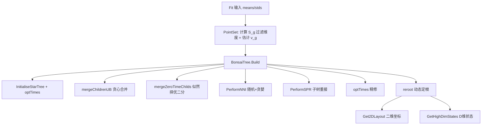

## 用户需求

基于论文与算法文档对 Bonsai 项目现有实现的代码审查，针对 6 处与论文不一致的实现缺陷做针对性修正，使算法达到论文声明的精度与可视化效果。

## 产品概述

在现有 Bonsai 高维数据树重建库基础上，补齐树搜索的局部重排能力、修正多分歧点解析策略、提供真正的二维可视化输出、增加低信噪比特征自动过滤、实现动态重新定根，并以可选方式引入全局基因方差先验缩放。默认行为保持与现有数值结果兼容。

## 核心特性

- 新增 SPR 子树修剪重接与 NNI 最近邻交换（随机阶段 + 贪婪阶段）的局部重排搜索，集成进 `Build` 主流程。
- 修正多分歧点解析：将度数大于 2 的节点视为局部根，枚举子节点配对并选择使似然增益最大的组合进行二分。
- 新增树布局算法 `Get2DLayout()`，将拓扑结构与分支长度映射为二维坐标；`Transform` 返回二维坐标，原高维 `ltqs` 暴露为 `GetHighDimStates()`。
- 在 `Fit` 阶段计算每个维度的信噪比 S_g，剔除 S_g < 1 的低质量维度。
- 在 `Build` 末尾实现动态重新定根：寻找使两棵子树内部距离之和最小的那条边，将虚拟根移到该边。
- 新增全局基因方差 v_g 的估计与可选扩散系数缩放（默认关闭，开启后按 v_g × tParent 缩放转移方差）。

## 技术栈选择

- 语言：VB.NET（sciBASIC# 运行时），与现有项目完全一致。
- 数值优化：复用现有 `Optimizer`（L-BFGS / Brent 求根），不引入新依赖。
- 评分核心：复用 `Likelihood.NLL` / `calcLogLComplete` 作为 NNI/SPR/多分歧点选择的统一评分函数。
- 布局算法：新增纯几何的 dendrogram（矩形树布局）或径向布局，仅依赖拓扑与 `tParent`，不引入图形库。

## 实现方案

整体策略：在保持现有 `completeLtqs` 高斯积分与 `optTimes` 优化不变的前提下，于 `BonsaiTree.Build` 中插入三个阶段（多分歧点优化、NNI+SPR、重新定根），并在外围 `PointSet`/`Bonsai` 层补充特征过滤、v_g 估计和 2D 布局导出。

### 关键决策与权衡

1. **NNI/SPR 评分复用 NLL**：每次候选重排后计算 `NLL`，仅接受严格增益（带微小 epsilon 容差）的改动，避免无谓震荡。SPR 复杂度 O(C^2·内部边数)，NNI 复杂度 O(内部边数)；受现有 C^2 合并规模约束，可接受。
2. **多分歧点二分改为似然择优**：原 `splitZeroTime` 盲目取前两个子节点，改为对子节点集合枚举所有两两配对，选出使 `NLL` 最小的配对建中间节点，递归直至全为二分。
3. **2D 布局独立于概率模型**：`Get2DLayout` 仅用 `childs` 与 `tParent` 做坐标递推（x=祖先累计分支长度，y=叶子槽均分），与 `ltqs` 完全解耦，保证 `GetHighDimStates` 仍返回 D 维高维状态。
4. **v_g 可选缩放**：在 `PointSet` 新增 `geneVariance As Double()`（每维全局方差）与 `useGlobalVariance As Boolean`；`Likelihood` 计算 `wbar = 1/(vars(g) + scale*g.tParent)` 时传入 `scale`（默认 1，开启后 = v_g(g)）。默认关闭，不破坏现有结果。
5. **S_g 过滤在 Fit 层**：`Bonsai.Fit` 先构造临时 `PointSet` 计算每维 `S_g = (1/C)Σ_i (x*_gi − x_g)² / ε²_gi`，剔除 S_g<1 的维度后再建树；保留原始完整数据供 `GetHighDimStates` 对齐。
6. **重新定根**：遍历每条非根边，将边中点设为新根，计算两子树内部距离和，选最小者执行重根（仅调整拓扑指针与根标记，不动 `ltqs`/`tParent` 数值语义）。

### 性能与可靠性

- NNI/SPR 在每次接受改动后调用 `optTimes` 精修，但限制总轮数（默认 3 轮随机 + 贪婪至收敛）防止爆炸。
- 多分歧点枚举配对为 O(k^2)（k=子节点数），规模小，安全。
- 所有新增重排均保留 `verbose` 日志，复用现有 `Console.WriteLine` 风格，避免日志刷屏（仅输出接受的动作）。
- 重新定根仅改指针，O(边数) 且每边 O(叶子数)，安全。

## 实现备注

- 严格复用 `BonsaiNode` 现有字段（`par`/`childs`/`tParent`/`ltqs`/`isRoot`），不新增核心字段以免破坏序列化。
- `Transform` 改为调用 `Tree.Get2DLayout()`；保留 `GetLowDimCoords`/`GetHighDimStates` 双接口以兼容旧调用。
- v_g 缩放通过 `PointSet` 透传 `scale` 数组到 `Likelihood` 相关函数签名（新增可选参数，默认行为不变）。
- 重新定根后需重置 `isRoot` 标记并刷新 `root` 引用。

## 架构设计



## 目录结构

```
Bonsai/
├── BonsaiTree.vb      # [MODIFY] Build 流程插入 NNI/SPR/reroot；重写 mergeZeroTimeChilds 为似然择优二分；新增 PerformNNI/PerformSPR/Reroot 方法
├── BonsaiNode.vb      # [MODIFY] 新增 reroot 辅助（调整 par/childs/isRoot 的拓扑重建方法），保持现有字段
├── Likelihood.vb      # [MODIFY] 转移方差计算支持可选 scale 数组（v_g 缩放）；新增SPR/NNI 评分辅助
├── PointSet.vb        # [MODIFY] 新增 geneVariance/v_g 估计、S_g 过滤、useGlobalVariance 开关
├── BonsaiApi.vb       # [MODIFY] Fit 接入 S_g 过滤与 v_g；Transform 改返 Get2DLayout；新增 GetHighDimStates/Get2DLayout 透传
└── Layout.vb          # [NEW] 树 2D 布局算法（dendrogram/径向），输入 BonsaiNode 根，输出每叶 (x,y)
```

## 关键代码结构

```
' BonsaiTree.vb 新增接口（签名级）
Public Sub PerformNNI(Optional randomPhase As Boolean = True, Optional maxRounds As Integer = 3)
Public Sub PerformSPR(Optional maxRounds As Integer = 2)
Private Sub RerootToMinInternalDist()
Public Function Get2DLayout() As Double()()  ' 透传 Layout 模块

' PointSet.vb 新增
Public ReadOnly geneVariance As Double()        ' 每维全局方差 v_g
Public Property useGlobalVariance As Boolean = False
Public Shared Function FilterBySNR(means, stds, names, Optional threshold As Double = 1.0) As PointSet
```

## 可用扩展

### SubAgent

- **code-explorer**
- 用途：在生成详细实现前，跨文件核查 `Likelihood.NLL`、`addNode`、`optTimes` 的确切签名与调用链，确认 NNI/SPR/多分歧点枚举可安全插入而不破坏现有 `calcLogLComplete` 流程。
- 预期结果：输出受影响函数清单与精确调用点，保证计划落到真实代码路径上。