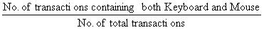
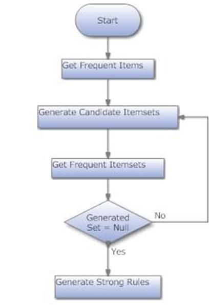
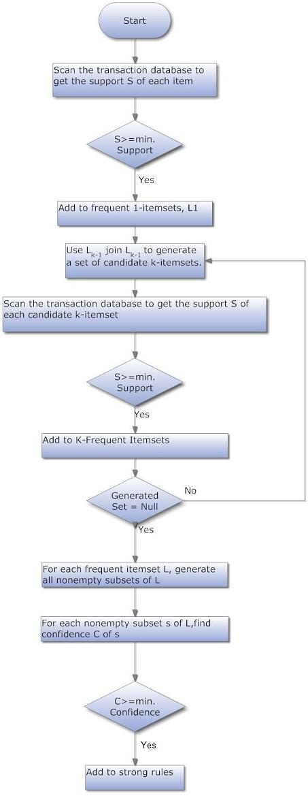
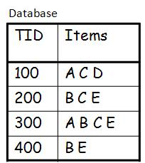
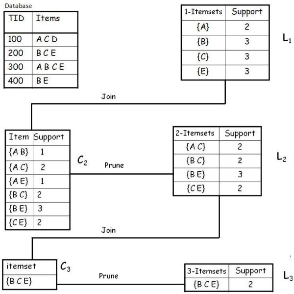
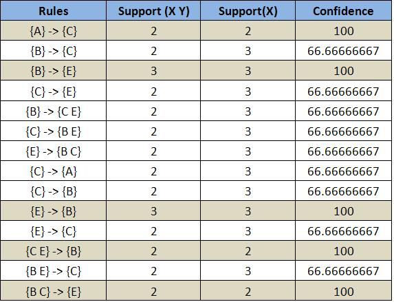
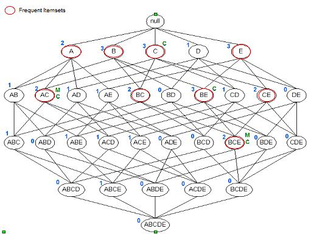

# Apriori Algorithm

> http://www.codeproject.com/Articles/70371/Apriori-Algorithm

## Introduction

In data mining, Apriori is a classic algorithm for learning association rules. Apriori is designed to operate on databases containing transactions (for example, collections of items bought by customers, or details of a website frequentation).
Other algorithms are designed for finding association rules in data having no transactions (Winepi and Minepi), or having no timestamps (DNA sequencing).

## Overview

The whole point of the algorithm (and data mining, in general) is to extract useful information from large amounts of data. For example, the information that a customer who purchases a keyboard also tends to buy a mouse at the same time is acquired from the association rule below:

+ Support: The percentage of task-relevant data transactions for which the pattern is true.
    + ``Support (Keyboard -> Mouse)`` = 
+ Confidence: The measure of certainty or trustworthiness associated with each discovered pattern.
    + ``Confidence (Keyboard -> Mouse)`` = 

The algorithm aims to find the rules which satisfy both a minimum support threshold and a minimum confidence threshold (Strong Rules).

+ Item: article in the basket.
+ Itemset: a group of items purchased together in a single transaction.

## How Apriori Works

+ Find all frequent itemsets:
    + Get frequent items:
        + Items whose occurrence in database is greater than or equal to the min.support threshold.
    + Get frequent itemsets:
        + Generate candidates from frequent items.
        + Prune the results to find the frequent itemsets.
+ Generate strong association rules from frequent itemsets
    + Rules which satisfy the min.support and min.confidence threshold.

## High Level Design



## Low Level Design



## Example 

A database has five transactions. Let the min sup = 50% and min con f = 80%.



## Solution 

### Step 1: Find all Frequent Itemsets



###### Frequent Itemsets

```
{A}   {B}   {C}   {E}   {A C}   {B C}   {B E}   {C E}   {B C E}
```

### Step 2: Generate strong association rules from the frequent itemsets



## Lattice

+ Closed Itemset: support of all parents are not equal to the support of the itemset.
+ Maximal Itemset: all parents of that itemset must be infrequent.
+ Keep in mind: 




Itemset ``{c}`` is closed as support of parents (supersets) ``{A C}:2``, ``{B C}:2``, ``{C D}:1``, ``{C E}:2`` not equal support of ``{c}:3``.

And the same for ``{A C}``, ``{B E}`` and ``{B C E}``.

Itemset ``{A C}`` is maximal as all parents (supersets) ``{A B C}``, ``{A C D}``, ``{A C E}`` are infrequent.

And the same for ``{B C E}``.