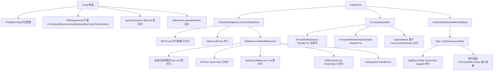

## 产品概述

对 `Microsoft.VisualBasic.DataMining.UMAP` 模块（VB.NET / net10.0，位于 `g:/pixelArtist/src/framework/Data_science/DataMining/UMAP`）做两件事：全链路并行化改造以提升大规模数据集降维的计算性能；把当前代码中硬编码或未接线的算法参数实现为可配置项。

## 核心需求

1. **全阶段并行化**（用户已确认，接受 SGD 结果非逐位可复现）

- KNN 近邻搜索阶段：NN-Descent 初始化采样循环、RP-Forest 叶数组构建、候选邻居堆构建 `BuildCandidates`、堆排序 `DeHeapSort`
- 模糊单纯形集阶段：模糊 KNN 距离 `SmoothKNNDistance`、隶属度强度 `ComputeMembershipStrengths`、稀疏矩阵算子（`Transpose` / `PairwiseMultiply` / `Map` / `ElementWiseWith`）
- SGD 布局优化阶段：`OptimizeLayoutStep` 采用 Hogwild 式并行
- 统一并行度入口（可配置，默认 `App.CPUCoreNumbers`），小规模输入自动退化为串行避免调度开销

2. **硬编码参数实现**（用户已确认"全部暴露"）

- `negativeSampleRate`（当前固定 5，构造器无参数）
- `spread` / `minDist`：当前非 `(1, 0.1)` 组合直接抛异常，需实现与 python `curve_fit` 等价的曲线拟合求 `(a, b)`
- `KnnIter`：当前只作用于 SmoothKNN 的 sigma 二分，需额外接线 NN-Descent 迭代数
- NN-Descent 隐藏参数：`maxCandidates`(50) / `delta`(0.001) / `rho`(0.5) / `rpTreeInit`(True) / `nTrees` / `leafSize`
- 内部魔术数字：`clipValue`(4.0)、初始嵌入范围(10)、`MoveOther`(True)、`GetNEpochs` 的阈值与 epoch 数

3. **兼容性约束**

- 所有新参数追加在构造器末尾、`Optional`、默认值与现状一致，现有调用代码（`test/Program.vb:79` 的两参数调用）无需改动
- `spread=1 / minDist=0.1` 走既有快速路径，保持原有数值结果完全一致
- 不新增项目引用（`DataFittings` 的 `LmSolver` 属独立项目，LM 拟合在模块内自实现）

## 技术栈

- 语言/框架：VB.NET，`UMAP.NET5.vbproj`（`TargetFrameworks=net10.0`，RootNamespace `Microsoft.VisualBasic.DataMining.UMAP`）
- 既有并行基础设施（复用，不引入新范式）：
- `Microsoft.VisualBasic.Parallel.VectorTask`（`Sub New(nsize, verbose, workers)` + `Protected MustOverride Sub Solve(start, ends, cpu_id)` + `Run()`），`RPTree` / `NNDescentLoop` 已继承此模式 → 新增的 SGD 任务沿用同一模式
- `System.Threading.Tasks.Parallel.For` / `Partitioner.Create`（无竞态的行级循环）
- `App.CPUCoreNumbers`（`App.vb:192` → `LQuerySchedule.CPU_NUMBER`）
- `IProvideRandomValues.IsThreadSafe` 作为"能否并行"的运行时门控（`DefaultRandomGenerator.Instance` 为 True，`DisableThreading` 为 False）
- 不新增 NuGet / 项目引用；LM 曲线拟合模块内自实现（2 参数解析 Jacobian + 阻尼高斯-牛顿）

## 实现方案

### 总体策略

"先建配置底座 → 再逐阶段并行 → 最后接线参数"，每阶段都保留串行回退分支，由统一开关 + 最小工作规模阈值控制，保证小数据集不因并行调度而变慢。

### 关键技术决策与权衡

| 决策 | 理由 / 权衡 |
| --- | --- |
| 新增 `ParallelConfig` 统一并行度，而非改全局 `VectorTask.n_threads` | 改全局静态会影响同进程内其他模块（t-SNE 等），属跨模块副作用；改为构造时通过 `workers:=` 注入（VectorTask 已支持该参数），既复用既有模式又隔离影响 |
| NN-Descent 初始化循环与 `BuildCandidates` 用 **per-row 锁数组**（`Object()`，长度 nVertices，按行号升序加锁避免死锁） | 两处 `HeapPush` 都会写**两个不同行**（`i` 与 `indices(j)`），直接并行会破坏堆结构。两阶段方案（并行算距离 + 串行 push）需额外 O(n·k) 内存（60000×15×2 ≈ 30MB）且 push 仍是串行瓶颈；per-row 锁内存仅 O(n)（480KB）且能并行掉主要成本（拒绝采样 + 距离计算） |
| `DeHeapSort` / `ComputeMembershipStrengths` 直接 `Parallel.For`，无锁 | 每行（每个样本）只访问自己的 `indices(i)` / `weights(i)`，天然无竞态，零风险高收益 |
| `SmoothKNNDistance` 去掉 `.OrderBy(Function(d) d.i)` | 当前 PLINQ 后接 O(n log n) 排序再回填，纯属浪费；改为 `Parallel.For` 直接写 `rho(i)` / `result(i)` |
| SGD 用 Hogwild 并行，门控为 `parallelism.Enabled AndAlso _random.IsThreadSafe AndAlso 边数 ≥ 阈值` | 与官方 UMAP 并行实现一致；`IsThreadSafe=False` 或小规模时自动退回串行，保证可复现性与既有行为 |
| `Iterate` 中 `Dim embeddingSpan As Span(Of Double) = _embedding` 改为**在线程内创建 Span 并作为参数传递** | `Span(Of T)` 是 ref struct，不能跨线程持有或进闭包；但作为方法参数传递合法（现有 `DistanceMethods.SquareDistance(current, other)` 已证明）。在 `Solve` 内每线程各自创建 Span 是最小改动且正确 |
| `FindABParams` 快速路径保留 `(1.56947052F, 0.8941996F)` | 满足"默认行为不变"；其他 `(spread, minDist)` 组合走 LM 拟合并做结果缓存（同一组合只拟合一次） |
| `nnDescentIters` 独立新增为 `Integer?`（`Nothing` = 沿用现有自适应公式 `Max(5, Floor(Round(Log2(n))))`）而非复用 `KnnIter` | `KnnIter` 默认 64，而自适应公式对 60000 样本仅得 16；直接复用会把默认迭代数放大 4 倍，改变现有默认行为与耗时。独立参数兼顾"暴露"与"默认不变" |
| `SparseMatrix` 用 `ConcurrentDictionary` 并行化 `Transpose` / `PairwiseMultiply` | 两算子为纯 Dictionary 遍历，规模 O(n·k)（60000×15 ≈ 90 万条），是当前图构建的主要串行开销之一 |


### 性能预期与瓶颈

- 主要瓶颈排序（降维 60000 样本量级）：NN-Descent 迭代 > 初始化采样循环 > 候选堆构建 > DeHeapSort > SGD epoch > 稀疏矩阵算子
- 期望：确定性阶段（KNN + 图构建）在多核上接近线性加速；SGD 阶段受 Hogwild 冲突影响，加速比随边密度下降，但边数 ≥ 10 万时收益明显
- 复杂度不变（算法等价），仅降低墙钟时间；额外空间：per-row 锁 O(n)、并行度相关缓冲区 O(cores)

## 执行要点（防回归）

1. **`Span` 跨线程**：`Umap.Iterate` 必须改为接收 `Span(Of Double)` 参数；串行分支在 `OptimizeLayoutStep` 内创建，并行分支在 `SgdEpochTask.Solve` 内创建。禁止把 Span 存为字段或进 lambda。
2. **随机数线程安全**：RP-Forest 构建（既有多线程共用 `_random`）与新增的 SGD 并行，都必须以 `IProvideRandomValues.IsThreadSafe` 为前提；不满足则强制串行。
3. **进度上报**：`Tqdm.Range` / `App.EnableTqdm` 不能用于并行分支。并行路径改为 `Interlocked` 计数 + 节流后调用 `_progressReporter`；`_progressReporter` 为 `Nothing` 时全程短路（现有代码已有该判断）。
4. **日志**：沿用 `VBDebugger.EchoLine`（现有风格），仅在阶段入口/结束各打一条，禁止在并行体内逐次打印；错误信息不含数据内容。
5. **XML 文档注释**：项目开启 `GenerateDocumentationFile` 且 `GeneratePackageOnBuild`，新增 `Public` 成员必须补 XML 注释，否则产生 CS1591 警告。
6. **不要动 `Components/DistanceCalculation.vb`**（0 字节空文件，委托定义在其他项目）。
7. **`OptimizationState.A/B` 默认值**（`1.57694352F` / `0.8950609F`）与 `FindABParams` 返回值不一致 → 统一改为由 `FindABParams(1, 0.1)` 常量初始化，`InitializeOptimization` 中再赋值。
8. **验收基线**：`test/Program.vb:79` 的两参数 `New Umap(distance:=..., progressReporter:=...)` 必须零改动编译通过；`spread=1/minDist=0.1` 默认配置下的输出应保持与改造前一致（SGD 并行带来的位级差异除外）。

## 架构设计



### 模块职责

- **`Components/ParallelConfig.vb`**：并行开关、最大并行度、最小工作规模阈值；提供 `Sequential` 单例与 `EffectiveDegree(workSize)` 判定
- **`Components/ABParams.vb`**：`(spread, minDist) → (a, b)`；快速路径 + LM 曲线拟合 + 静态缓存
- **`Components/EpochSchedule.vb`**：nEpochs 启发式的阈值表，可配置，默认等价现状
- **`Components/SgdEpochTask.vb`**：继承 `VectorTask`，封装单 epoch 的 `RunIterate` 区间并行
- **`NNDescent/`、`KNN/`、`Components/Heaps/`**：在既有 `VectorTask` / PLINQ 模式上补齐并行分支

## 目录结构

本次改造共涉及 3 个新增文件、12 个修改文件，全部位于 `g:/pixelArtist/src/framework/Data_science/DataMining/UMAP/`。

```
UMAP/
├── Umap.vb                              [MODIFY] 主类。构造器末尾追加 negativeSampleRate / gradientClipValue / initialEmbeddingRange / moveOther / nTrees / leafSize / maxCandidates / nnDescentDelta / nnDescentRho / rpTreeInit / nnDescentIters / epochsSchedule / parallelism 等 Optional 参数（默认值等同现状）；FindABParams 改为调用 ABParams；GetNEpochs 走 EpochSchedule；Iterate 签名改为接收 Span(Of Double)；OptimizeLayoutStep 增加并行/串行双分支；GetEmbedding 用 Array.Copy 替代 SpanSlice().ToArray()
├── OptimizationState.vb                 [MODIFY] A/B 默认值与 FindABParams(1, 0.1) 对齐；新增 MoveOther 来源说明注释
├── Components/
│   ├── ParallelConfig.vb                [NEW] 统一并行配置类：Enabled / MaxDegreeOfParallelism / MinWorkSize、Sequential 单例、EffectiveDegree(workSize) 判定；默认 MaxDegreeOfParallelism = App.CPUCoreNumbers
│   ├── EpochSchedule.vb                 [NEW] nEpochs 启发式配置：阈值数组 {2500,5000,7500} 与 epoch 数组 {500,400,300,200}，提供 Default 实例与 GetEpochs(n) 方法
│   ├── ABParams.vb                      [NEW] (spread,minDist)→(a,b)。快速路径返回 (1.56947052, 0.8941996)；通用路径实现 300 点采样的 LM 阻尼高斯-牛顿拟合 1/(1+a·x^(2b))，解析 Jacobian，结果用 ConcurrentDictionary 缓存
│   ├── SgdEpochTask.vb                  [NEW] Inherits VectorTask。Solve(start,ends,cpu_id) 内逐 i 调用 Umap 的内部迭代方法；线程内创建 Span(Of Double)；构造时通过 workers 注入并行度
│   ├── Utils.vb                         [MODIFY] RejectionSample 改为 HashSet 去重的 O(k) 版本（保留 maxItrs 与告警语义）；新增 NewRowLocks(n) 辅助函数供 per-row 锁使用
│   ├── Heaps/
│   │   └── Heaps.vb                     [MODIFY] MakeHeap 改为循环填充替代逐元素 LINQ；BuildCandidates 增加 per-row 锁并行分支（含串行回退）；DeHeapSort 改为 Parallel.For（行间无竞态）；新增接受锁数组的批量 HeapPush 入口
│   └── SparseMatrix/
│       └── SparseMatrix.vb              [MODIFY] Transpose / PairwiseMultiply 改用 ConcurrentDictionary 并行；Map / ElementWiseWith 用 Partitioner 切块直写结果（去掉 Iterator yield + 事后合并），并新增小规模串行回退阈值
├── KNN/
│   ├── KNNArguments.vb                  [MODIFY] 结构扩展：新增 nTrees / leafSize / maxCandidates / delta / rho / rpTreeInit / parallelism 字段，构造器带默认值；ToString 的 JSON 序列化保持不变
│   ├── KNearestNeighbour.vb             [MODIFY] 将 KNNArguments 扩展项一路透传给 MakeNNDescent；nIters 支持外部覆盖（Nothing 时沿用现有 Log2 自适应公式）；MakeLeafArray 改为预分配数组 + 并行填充
│   └── SmoothKNN.vb                     [MODIFY] SmoothKNNDistance 去掉 .OrderBy，改 Parallel.For 直写结果数组；ComputeMembershipStrengths 外层 i 改 Parallel.For（下标 i*nNeighbors+j 唯一，无竞态）
└── NNDescent/
    ├── Abstract.vb                      [MODIFY] NNDescentFn.NNDescent 签名新增 parallelism 参数
    ├── NNDescent.vb                     [MODIFY] 初始化采样循环改 per-row 锁并行（按行号升序加锁）；完整透传 maxCandidates/delta/rho/rpTreeInit/nIters/parallelism；沿用 Tqdm 的分支改为 Interlocked 进度计数
    ├── NNDescentLoop.vb                 [MODIFY] 构造函数接收 workers 参数并传给 MyBase.New；保持既有并行语义
    └── RPTree.vb                        [MODIFY] 构造函数接收 workers 参数并传给 MyBase.New
```

## 关键代码结构

```
' Components/ParallelConfig.vb —— 全模块统一的并行度入口（默认行为等价现状）
Public Class ParallelConfig
    Public Property Enabled As Boolean = True
    Public Property MaxDegreeOfParallelism As Integer = App.CPUCoreNumbers
    ''' <summary>工作规模小于该值时退化为串行，避免调度开销反噬</summary>
    Public Property MinWorkSize As Integer = 1024

    Public Shared ReadOnly Property Sequential As ParallelConfig

    ''' <summary>返回本次调用实际使用的并行度；&lt;=1 表示走串行分支</summary>
    Public Function EffectiveDegree(workSize As Integer) As Integer
End Class
```

```
' Components/ABParams.vb —— 替代当前直接抛异常的 FindABParams
Public Module ABParams
    ''' <summary>默认组合 (spread=1, minDist=0.1) 的既有硬编码结果，保证默认行为逐位一致</summary>
    Public ReadOnly Property DefaultAB As (a As Double, b As Double)

    ''' <summary>
    ''' 与 python umap.umap_.find_ab_params 等价：
    ''' 对 y(x)=1 时取 1、x>=min_dist 时取 exp(-(x-min_dist)/spread) 的 300 点采样，
    ''' 用 Levenberg-Marquardt 拟合 f(x)=1/(1+a*x^(2b))，初值 (1,1)。
    ''' 结果按 (spread, minDist) 缓存。
    ''' </summary>
    Public Function FindABParams(spread As Double, minDist As Double) As (a As Double, b As Double)

    ''' <summary>阻尼高斯-牛顿（LM）最小二乘：仅 2 参数，Jacobian 解析给出</summary>
    Private Function LevenbergMarquardt(x As Double(), y As Double(),
                                        ByRef a As Double, ByRef b As Double,
                                        Optional maxIter As Integer = 200) As Boolean
End Module
```

## Agent Extensions

### SubAgent

- **code-explorer**
- Purpose：在改造前/后对 `New Umap(`、`Heaps.BuildCandidates`、`Heaps.DeHeapSort`、`SmoothKNN`、`NNDescent.MakeNNDescent`、`SparseMatrix` 等符号做全仓（含 `mzkit`、`R-sharp`、`Visualization`、`DataMining` 等下游项目）调用点与引用点扫描，确认改动的影响面，避免漏改或破坏下游编译
- Expected outcome：输出完整的调用点清单与受影响项目列表，作为回归验证的核对依据

### Skill

- **lsp-code-analysis**
- Purpose：在修改 `NNDescentFn` 接口签名、`SmoothKNN` 方法签名、`Umap.Iterate` 签名时，用语义级导航（查找定义 / 查找引用 / 调用层次）精确定位所有实现与调用位置，避免文本搜索的漏检与误检
- Expected outcome：所有签名变更的实现类与调用点被完整识别并同步修改，无悬空引用