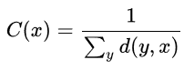

测定中心度方法的不同，可以分为度中心度（Degree centrality），接近中心度（或紧密中心度，Closeness centrality），中介中心度（或间距中心度，Betweenness centrality）等。

## 1. 度中心度，（也可以理解为"连接中心度"），顾名思义就是一个点与其他点直接连接的总和。

比如，想知道某个人在网络社交圈中处于哪种程度的凝聚力，就可以通过中心性的概念进行分析。拿26个英文字母来代表一个由26个人组成的微博圈为例，想知道在这个26人的微博圈中，哪个人跟其圈中他人的连接最多，通过这个来判断谁具有最大的中心性，这就需要知道这个人和多少人有链接，这就是度中心度能够进行判断的。有时也用节点的大小（Size）来表达，一个节点的size越大，就说明其所占据的中心性越高。比如在上面的26个人的微博圈中，A和15个人有连接，B和10个人有连接，就可以知道A比B的度中心性高，A比B在这个26个人的微博圈中的社交面要广。

但是在实际情况中，可能出现连接有方向的情况，比如，如果A连接的15个人中有10个人是A关注（follow）了其他人，2个人是其他人关注（follow）了A，3个人是A与其他人互相关注，也就是说A有13个人following，有5个follower；但是B有8个是与其他人互相关注的，2个是被关注的，也就是说B有8个following，10个follower。这种情况下，就给连接加入了向量的概念，也就是说连接是有方向的。于是便有了点入中心度（或入度，in-degree）和点出中心度（或出度，out-degree）。

+ 入度表现一个人的被关注程度。点入中心度高的人（B）是其他人都想与其形成关联的对象，也就是在这个网络中，B被很多人认为很有必要与其取得关联，也就可以理解成B在这个网络中具有很高的声望（prestige），体现了一个人的吸引力。入度高的人有可能会引导这个网络圈交流的内容、视角、深度、广度等问题。

+ 出度表现一个人关注他人的程度。点出中心度高的人（A）是在这个网络中，很努力并活跃地与他人取得关联的人，可以理解成A在这个网络中具有较强的交际性，体现了一个人的积极性。出度高的人，在网络中能够从很多的其他成员那里获得丰富的信息information。在学习网络中可能就是知识、方法等；在娱乐圈中或许就是八卦新闻。

## 2. 接近中心度，计算的是一个点到其他所有点的距离的总和，这个总和越小就说明这个点到其他所有点的路径越短，也就说明这个点距离其他所有点越近。

接近中心度体现的是一个点（node）与其他点的近邻程度。Bavelas（1950）将接近中心性定义为距离的倒数：

一个具有高接近中心度的点，说明这个点距离任何其他点都最近，在空间上也体现在中心位置上。

一个点与其他点的最短距离之和，归一化处理之后（Normalization）得到一个（0，1）之间的数字，这个数字越大就说明这个点的接近中心度越高。可以想象一下，当公式中的分子趋于无限大∞时，C的值就趋于0，因此当一个点距离其他所有点的距离非常大的时候，也就是说这个点不在中心位置上，那么它的接近中心性就趋于0。

但是对中心性进行分析的时候，在有方向的社交网络（directional social networking）中对接近中心度（Closeness centrality）的分析结果，会得出入接近中心度（In-closeness centrality）和出接近中心度（Out-closeness centrality），

### 入接近中心度（In-closeness centrality）

入接近中心度是通过计算走向一个点的边来测量出其他点（nodes）到达这个点（node）的容易程度，一个点的入接近中心度越高，说明其他点到这个点越容易。

### 出接近中心度（Out-closeness centrality）

出接近中心度指的是一个点到达其他点的容易程度，通过一个点到其他点的最短距离的和的倒数，接近中心度越大，这个点到其他点越容易。

因此入接近中心度表达的是整合力（integration），出接近中心度表达的是辐射力（radiality）。

## 3. 中介中心度，计算经过一个点的最短路径的数量。经过一个点的最短路径的数量越多，就说明它的中介中心度越高。

假设想知道的人是A。但是后来我们发现在这个26人的圈子里面，度中心性最高的人A，却不一定是活跃的，这里就需要用到中介中心度（betweenness centrality）来进行计算。很多节点之间的最短路径都经过C这个点，那么就说C有高的中介中心度。也就是说这个点处在其他点对相互之间的捷径上。

如果一个大的社交网络中包含了几个小组，那么中介中心度高的人就起到将这些小组连接起来的作用。比如在男生女生共同存在的网上学习网络中，比较常见的现象是女生之间互动紧密同时男生之间互动紧密，但是中介中心度高的学生将会打破这种男生女生小组织的边界，在网络中，将男生女生连接在一起，使之形成一个整体的大网络。