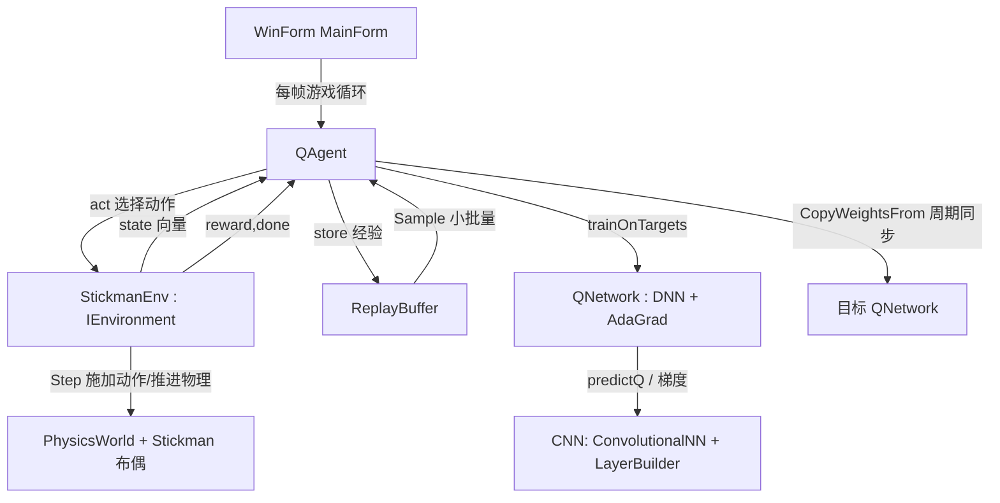

## 用户需求概述

基于 `DeepLearning\CNN` 中已有的通用神经网络（`LayerBuilder` 链式构建、`ConvolutionalNN` 前向/反向、`AdaGradTrainer` 优化器、`RegressionLayer` 回归输出）实现一个「基于 QTable 思想的强化学习框架」，代码落于 `DeepQNetwork` 项目；并构建一个可运行的 WinForm 可视化 Demo：让一个由 `gr\physics` 物理引擎搭建的火柴棍小人通过强化学习自主学会**跑步前进、上下台阶、跳跃跨越障碍物**。

## 核心功能

- 完善 `DeepQNetwork` 强化学习框架：在 `QNetwork`（神经网络 Q 函数 / DQN）基础上补齐预测、单步训练、克隆、权重拷贝等接口；提供 `ReplayBuffer` 经验回放、`QAgent` 智能体（ε-贪心、经验回放、TD 目标、可选目标网络）与字面量 `QTable`（离散查表，用于对照/小环境）。
- 定义通用 `IEnvironment` 接口（Reset/Step/StateSize/ActionCount），使框架可复用于任意环境。
- 用 `gr\physics` 的 `RigidBody` + `RevoluteJoint` + `PhysicsWorld` 搭建双足火柴人布偶（头/躯干/双臂/双腿/脚，含颈、肩、肘、髋、膝、踝关节），脚高摩擦抓地。
- 实现 `StickmanEnv` 环境：平地 → 台阶 → 障碍块 → 终点地形；离散动作集（约 8 个：Idle/左髋前/左髋后/右髋前/右髋后/双膝屈/跳跃/前倾）；奖励 = 前进位移 + 上台阶增益 + 越障/到终点奖励 − 摔倒惩罚 − 能量/时间惩罚；done = 摔倒/超时/到终点。
- WinForm 可视化：GDI+ 渲染地形与火柴人（关节连线段）、相机跟随、HUD（回合/累计奖励/步数/ε/前进距离）、学习曲线图（每回合奖励与距离），并提供开始/暂停/重置/速度滑块/贪心演示控件。

## 技术栈选择

- 语言/框架：VB.NET，强化学习库 `DeepQNetwork` 目标 `net10.0`（复用 DeepLearning/ML/Core/Math 引用，无需新增）；可视化 Demo 为 WinForms 桌面程序，目标 `net10.0-windows`、`UseWindowsForms=True`、`OutputType=WinExe`，镜像 `gr\physics\test\test.vbproj` 配置。
- 神经网络：直接复用 `Microsoft.VisualBasic.MachineLearning.CNN` 的 `ConvolutionalNN` + `LayerBuilder` + `AdaGradTrainer`，不重复造轮子。
- 物理引擎：复用 `Microsoft.VisualBasic.Imaging.Physics` 的 `PhysicsWorld`、`RigidBody`、`RevoluteJoint`、`PhysicsMaterial`、`PolygonCollider`/`CircleCollider`。
- 渲染：System.Drawing / GDI+（与 `DemoRigidBody.vb` 一致的顶点旋转渲染范式）。

## 实现方案

**总体策略**：在已搭好结构的 `QNetwork`（DNN + AdaGrad）之上，补齐 RL 闭环所需接口与组件，使「环境 → 智能体 → 网络」形成标准 Q-learning 数据流；Demo 用物理引擎驱动小人，把状态编码为定长向量喂给 `QNetwork`，把离散动作映射为关节电机扭矩/跳跃冲量。

**关键技术决策**

1. **输入编码一致性**：`ConvolutionalNN.predict(v)` 内部用 `addImageData(v,1.0)` 会把输入做 `w=v-0.5` 偏移。为避免偏差且保持 predict 与 train 一致，在 `QNetwork` 内自实现 `predictQ`/`trainOnTargets`：直接 `New DataBlock(1,1,statSize,0)` 并将原始 state 拷入 `w`，再 `DNN.forward(db, Nothing)` 读 `DNN.output.OutAct.Weights`；训练用 `ada.train(db, targetQ, Nothing)`。
2. **在线单步更新**：将 `AdaGradTrainer` 的 `batch_size` 改为 1（每步即时更新权重），`learning_rate` 可调（~0.005），避免原 `batch_size=5` 的累积延迟影响 RL 在线学习。
3. **TD 目标与训练技巧**：DQN 回归拟合——构造 `targetQ = 当前 Q 向量`，仅把 `targetQ[action] = r + γ·max_a' Q(s')`（done 时 `= r`），其余分量保持当前预测值使其梯度为零，符合 `RegressionLayer.backward` 的 `(x_i - y_i)` 监督范式。
4. **目标网络稳定性**：`QNetwork` 增加 `CopyWeightsFrom(q)`，通过 `BackPropagationResult.Weights`（即为权重数组引用）`Array.Copy` 周期同步；`QAgent` 维护在线网 + 目标网，提升收敛稳定性（可选，默认开启）。
5. **动作执行**：离散动作在 `actionRepeat≈4` 个物理子步内对对应关节施加恒定扭矩（电机发力），跳跃动作对躯干施加向上冲量；每决策帧 `world.Step(1/60)` 一次。
6. **QTable 并存**：额外实现字面量 `QTable`（状态离散化查表）以契合「QTable」字面要求，并可作为小环境基线/对照，不影响 DQN 主线。

**性能与可靠性**

- 状态向量定长（约 24 维），前向/反向为 O(网络参数量)，对小型全连接网络开销极小，每帧可承受数百次 `learn` 采样。
- ReplayBuffer 用定长环形数组，采样 O(batch) 防止内存膨胀；`Sample` 返回小批量（如 32）用于批量 `trainOnTargets`。
- 渲染与训练解耦：Timer 驱动渲染（~60Hz），训练在每帧步进内完成，避免阻塞 UI；双缓冲 `DoubleBuffered=True` 防闪烁。

## 实现注意事项

- 复用既有模式：`PhysicsWorld.Box/Circle` 工厂、`RevoluteJoint(A,B,anchorA,anchorB)` 锚点用相对质心局部坐标；渲染复用 `b.Position + Rotate(poly.vertices(i), b.Rotation)` 取世界顶点。
- 避免回归偏差：predict 与 train 必须共用同一套 `DataBlock` 构造逻辑（原始 state 直拷，不经 `addImageData`）。
- 权重同步：`CopyWeightsFrom` 仅拷贝数值，不新建层，保证在线网与目标网层结构一致。
- 工程接入：新建 Demo 工程加入 `DeepQNetwork.sln`，引用 `DeepQNetwork.vbproj`、`physics-netcore5.vbproj`、`Microsoft.VisualBasic.Core\src\Core.vbproj`、`Mathematica\Math\Math\Math.NET5.vbproj`、`DeepLearning.NET6.vbproj`、`machine_learning-netcore5.vbproj`。
- 向后兼容：仅扩展 `QNetwork` 公共方法，不改其现有构造器语义；不改动 CNN/物理引擎源码。

## 架构设计



## 目录结构

```
DeepQNetwork/
├── QNetwork.vb            # [MODIFY] 补接口：getStateSize/getActionCount/getActions、predictQ(state)、
│                          #          argmaxAction(state)、trainOnTargets(state,targetQ)、Clone()、
│                          #          CopyWeightsFrom(q)、可配置 lr/batch_size（AdaGrad）。
├── ReplayBuffer.vb        # [NEW] 经验回放：环形缓冲存储 (s,a,r,s',done)，Sample(minibatch) 随机抽取。
├── QAgent.vb              # [NEW] DQN 智能体：ε-贪心选动作、Store、Learn（TD 目标+回放+目标网）、
│                          #          统计 episodeReward/epsilon/distance。
├── QTable.vb              # [NEW] 字面量离散 Q 表：离散状态分桶查表 Q(s,a)，用于小环境/对照。
├── IEnvironment.vb        # [NEW] RL 环境通用接口：Reset()、Step(action)、StateSize、ActionCount、
│                          #          Actions、CurrentState、LastReward、IsDone。
├── Demo/
│   ├── DeepQNetwork.Demo.vbproj  # [NEW] WinForms net10.0-windows，引用上述工程（见注意事项）。
│   ├── Stickman.vb        # [NEW] 火柴人布偶：用 RigidBody+RevoluteJoint 构建头/躯干/四肢/脚；
│   │                     #          ApplyAction(idx)、GetJointsState()、IsFallen()、GetState()。
│   ├── StickmanEnv.vb     # [NEW] 实现 IEnvironment：地形(平地/台阶/障碍/终点)、Reset/Step、
│   │                     #          reward shaping、done 判定、状态编码(~24维)、动作枚举(8个)。
│   ├── MainForm.vb        # [NEW] 游戏循环(Timer)、agent.act→env.step→store→learn→渲染；
│   │                     #          GDI+ 画地形与火柴人、相机跟随、HUD、学习曲线、控件逻辑。
│   └── MainForm.Designer.vb # [NEW] 窗体控件布局（按钮/滑块/画布/曲线 Panel）。
└── DeepQNetwork.sln       # [MODIFY] 加入 Demo 工程节点。
```

## 关键代码结构（接口级）

```
' QNetwork 关键新增接口（保持现有构造器不变）
Public Function predictQ(state As Double()) As Double()
Public Function argmaxAction(state As Double()) As Integer
Public Sub trainOnTargets(state As Double(), targetQ As Double())
Public Function Clone() As QNetwork
Public Sub CopyWeightsFrom(src As QNetwork)

' IEnvironment 通用环境接口
Public Interface IEnvironment
    Function Reset() As Double()
    Function Step(action As Integer) As (state As Double(), reward As Double, done As Boolean)
    ReadOnly Property StateSize As Integer
    ReadOnly Property ActionCount As Integer
    ReadOnly Property Actions As Array
End Interface

' QAgent 核心方法
Public Function act(state As Double()) As Integer      ' ε-贪心
Public Sub Store(s As Double(), a As Integer, r As Double, s2 As Double(), done As Boolean)
Public Sub Learn()                                      ' 回放采样 + TD 目标 + trainOnTargets
```

## 设计风格

采用深色科技感仪表盘风格（Dark Dashboard），以高对比霓虹强调色突出「学习中的火柴人」与实时学习曲线。整体布局：左侧为物理世界画布（相机水平跟随小人），右侧为训练控制面板与统计图表。交互以按钮/滑块为主，实时刷新无卡顿。

## 页面区块（单窗体，自上而下、自左至右）

1. 顶部标题栏：项目名「DQN Stickman Runner」+ 实时状态徽标（训练中/暂停/演示）。
2. 主画布区（左侧大块，Dock 填充）：GDI+ 渲染地形（地面/台阶/障碍/终点旗）、火柴人（关节线段+头部圆+脚掌）、相机随躯干 x 平移；落地/越障时高亮描边。
3. 右侧控制面板：

- 控制按钮组：开始训练 / 暂停 / 重置 / 贪心演示。
- 速度滑块：仿真倍速（1×–8×）。
- HUD 文本：回合 Episode、累计奖励、步数、ε、当前前进距离、当前动作。

4. 底部学习曲线 Panel：双折线图——每回合累计奖励（青色）与每回合前进距离（橙色），随训练增长直观展示「学会跑/上台阶/跳跃」。
5. 状态提示条：当前所处关卡阶段（平地/上台阶/下台阶/越障/到达终点）。

## 交互与动画

- 火柴人各关节随物理实时摆动；相机平滑插值跟随（避免抖动）。
- 按钮 hover 高亮、启用/禁用态切换；曲线图每回合追加一个点并自动缩放。
- 演示模式（贪心）下关闭学习，仅回放已学策略，便于观察成果。

## 响应式

窗体可缩放，画布与客户区绑定（Resize 重算相机视口），控件用 Anchor/Dock 保持排版稳定。