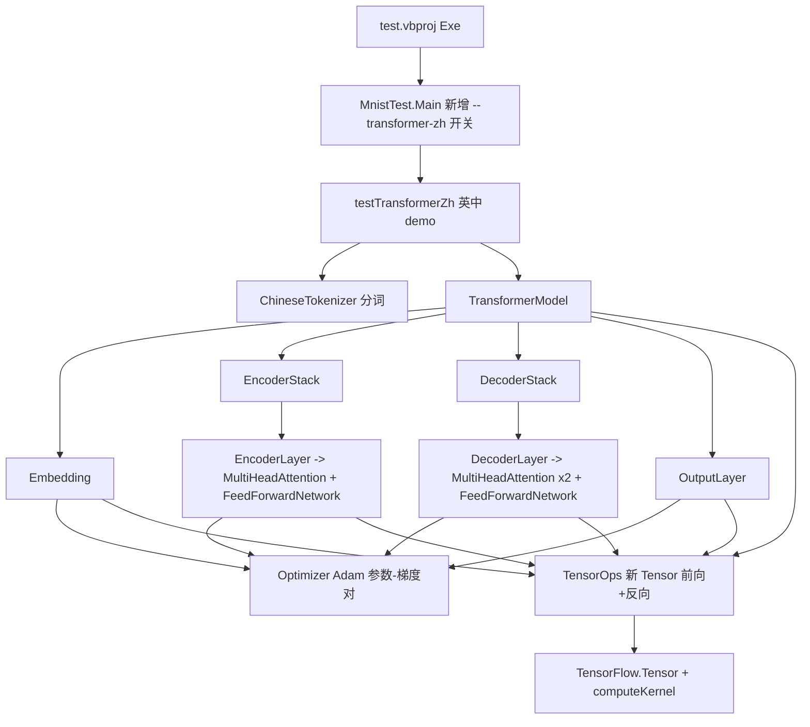

## 产品概述

将 `DeepLearning/Transformer` 模块对 `TensorFlow/AutomaticDifferentiation/Tensor.vb`（自动微分张量）的使用，整体迁移到 `TensorFlow/Tensor.vb`（Double 数值张量），随后删除 `TensorFlow/AutomaticDifferentiation` 目录；并基于迁移后的模型构建一个英译中翻译 demo。

## 核心功能

- Transformer 全链路（Embedding、MultiHeadAttention、FeedForwardNetwork、Encoder/Decoder Layer 与 Stack、OutputLayer、Optimizer、TransformerModel）改用新 `Tensor`，不再引用 `AutomaticDifferentiation` 命名空间。
- 因新 `Tensor` 无自动微分能力，需为网络手写前向缓存与反向传播（含 MatMul、Transpose、Softmax、Mask、Concat、Flatten、VecAdd、AddNorm、Dropout 及交叉熵梯度），并维持 Adam 优化器训练流程。
- 保持 `TransformerModel` 公开 API（构造、`Train`、`Infer()`、`Infer(words)`）与 `TextProcessing` 不变，使现有英西翻译 demo 继续可编译运行。
- 删除 `TensorFlow/AutomaticDifferentiation` 整目录（含 `Parallel` 子目录）。
- 新增内置英中平行语料 `Transformer/TrainingData/english-chinese.txt`（约 300~500 条简单日常句对），保留原 `english-spanish.txt`。
- 中文侧使用 `Microsoft.VisualBasic.Data.NLP.ChineseTokenizer`（词典最大匹配 + HMM 混合分词）切词。
- 在 `DeepLearning/test` 下新增 `testTransformerZh.vb`，从 test 工程入口（`MnistTest.Main` 的启动开关，参照现有 `--baseline`/`--gpu`）调用：读语料、分词、训练并打印 loss 曲线，再对若干英文句子输出中文译文与参考译文对照。

## 视觉与交互效果

纯控制台程序：训练过程按 epoch/batch/step 打印 loss，训练后打印英文输入、模型译文、参考译文三者对照，并输出最终 loss 与示例翻译结果，用于验证迁移后的模型可正常收敛并完成翻译任务。

## 技术栈

- 语言/框架：VB.NET、.NET 10（沿用现有工程，无新增第三方依赖）。
- 张量运行时：`Microsoft.VisualBasic.MachineLearning.TensorFlow.Tensor`（Double 存储 + `Compute.ITensorCompute` SIMD 后端，默认 `SIMDTensor.Default`），辅以 `nn` / `Math` / `NumPy` 模块。
- 中文分词：`nlp/NLP/NLP.NET.vbproj`（`AssemblyName=Microsoft.VisualBasic.Data.NLP`，命名空间 `Microsoft.VisualBasic.Data.NLP.ChineseTokenizer`）。
- 反向传播范式：复用仓库既有「手写 Forward/Backward + 参数-梯度对 + Adam」范式（`GNN/Layers/Layer.vb`、`GNN/Layers/LinearLayer.vb`、`GNN/Trainer/AdamOptimizer.vb`、`LNN/LiquidLayer.vb`）。注意 GNN/LNN 为独立工程，`DeepLearning.NET6.vbproj` 未引用它们，因此所需算子与优化器必须在 DeepLearning 工程内部实现（不得跨工程引用）。

## 实现方案

核心策略：把「AD 反向图」替换为「显式缓存 + 手写反向」，在 DeepLearning 工程内新增一个算子层 `Transformer/TensorOps.vb` 承载新 `Tensor` 缺失的 N 维算子（前向 + 反向），上层各组件只负责组织前向缓存与梯度累加。

关键决策与理由：

1. **新增 `TensorOps.vb` 而非改动 `TensorFlow` 工程**：这些算子（ND 批量矩阵乘、上三角掩码、最后一维 Concat 等）是 Transformer 专属语义，放在 TensorFlow 工程会污染通用张量库；放在 DeepLearning 工程可把改动面限制在 `Transformer` 目录内。
2. **ND 矩阵乘按 block 委托给 2D `Tensor.MatMul`**：新 `Tensor` 的 `MatMul`/`Transpose` 仅支持 2D，但后端已 SIMD 加速；实现时把 `[batch, seq, …]` 按 block 切片后调用 2D `MatMul`，避免重写 SIMD 内核，同时保持与旧 `SIMDMatMul.Solve` 一致的语义（B 为 2D 时在所有 block 上广播）。
3. **交叉熵梯度用 `softmax − onehot`**：直接沿用 `GNN/Trainer/Trainer.vb` 已验证写法，避免对 log/softmax 做链式求导。
4. **跨解码步累加 encoder 输出梯度实现 BPTT**：旧实现靠 `Checkpoints` 记录整图；迁移后需在解码循环中逐 step 缓存中间量，反向时先逆序回传各解码步并累加对 `encoderOutput` 的梯度，再统一回传 encoder 与两侧 Embedding。
5. **Adam 改为参数-梯度对更新**：不再使用 `GetDerivatives/ClearDerivatives/MatAdd`，改为持有 `(参数张量, 同形梯度张量)` 并原地更新，语义与原 `Optimizer`（β1=0.9、β2=0.999、eps=1e-8）保持一致。

性能与复杂度：ND 矩阵乘代价 O(blocks·i·j·k)，与旧实现同阶，但通过复用 SIMD 后端获取加速；前向需缓存中间量以支持反向，内存随 `batchSize × sequenceLength` 线性增长，demo 规模（batch 100 以内、seq 数十）无压力。反向中所有梯度写回均为原地 `+=` 累加，避免重复分配。

## 实现要点（执行注意）

- **运算符语义陷阱**：新 `Tensor` 的 `Operator *(Tensor, Tensor)` 是 2D 矩阵乘（AD 版本是逐元素乘）；逐元素乘必须用 `ElementwiseMultiply` 或 `computeKernel.Multiply`。`Operator +/−` 要求形状完全一致，仅在「2D 且某维为 1」时才有广播特例。原 `Optimizer` 中 `New Tensor(T) * 0` 需改写为 `New Tensor(T.Shape)`。
- **ReLU 反向**：使用 `computeKernel.Heaviside`（接口注释明确其为 `(x>0)?dy:0` 掩码用途）与上游梯度逐元素相乘。
- **Softmax 前向**：复用 `computeKernel.Softmax(t, axis)` / `nn.softmax`；反向手写 `dx = y ⊙ (dy − Σ(dy ⊙ y))`。
- **AddNorm 反向**：无 γ/β，参考 `LiquidLayer.BackwardLayerNorm` 去掉 γ 后的形式；`eps=0.001` 与旧实现一致。
- **Mask 语义**：仅对 `[batch, seq, seq]` 的注意力分数矩阵把上三角（j > i）置 `Double.NegativeInfinity`，须在 Softmax 之前、且为原地操作。
- **分词一致性**：中文分词需两遍法稳定词典——第一遍用 `Tokenizer.CreateDefault()` 混合分词，收集长度 ≥ 2 的 token 加入 `WordDictionary`，第二遍用增强词典重新切分；英文侧统一 `ToLower()`，与 `Embedding.Embed`/`AllWordsInDictionary` 的行为对齐。
- **保持兼容**：不改 `TextProcessing.vb`、不改 `TransformerModel` 公开签名，确保 `test/testTransformer.vb`（英西）无需修改即可编译；删除 AD 后不得残留任何 `Imports ...AutomaticDifferentiation`。
- **影响面控制**：改动限于 `DeepLearning/Transformer/*`、`DeepLearning/test/*`、删除 `TensorFlow/AutomaticDifferentiation/*`，以及 `TensorFlow.vbproj`/`README.md` 中已失真的 AD 描述文本（低风险文档更新）。

## 架构设计



## 目录结构

```
Data_science/MachineLearning/
├── TensorFlow/
│   ├── AutomaticDifferentiation/                     # [DELETE] 整目录删除（8 个文件：Tensor.vb、Rev.vb、
│   │                                                 #   Checkpoints.vb、AutomaticDifferentiation.vb、
│   │                                                 #   NamespaceDoc.vb、Parallel/MatMul.vb、
│   │                                                 #   Parallel/Multiply.vb、Parallel/NamespaceDoc.vb）
│   ├── Tensor.vb                                     # 不改动，作为迁移目标类型
│   ├── TensorFlow.vbproj                             # [MODIFY] PackageReleaseNotes 中删除已失真的自动微分描述
│   └── README.md                                     # [MODIFY] 同步移除 AutomaticDifferentiation 相关说明
└── DeepLearning/
    ├── Transformer/
    │   ├── TensorOps.vb                              # [NEW] 迁移核心算子层。实现 ND 批量矩阵乘及其反向
    │   │                                             #   （B 为 2D 时对 block 广播）、TransposeLastTwo、
    │   │                                             #   ConcatLastDim/SplitLastDim、MaskUpperTriangular、
    │   │                                             #   SoftmaxLastDim + 反向、AddNorm 前向/反向（eps=0.001，
    │   │                                             #   无 γ/β）、VecAdd + 反向、FlattenLastTwo/Unflatten、
    │   │                                             #   Dropout(mask,rate) + 反向。实现须按 block 复用
    │   │                                             #   2D Tensor.MatMul 以利用 SIMD 后端；梯度累加用原地 +=
    │   ├── Optimizer.vb                              # [MODIFY] Adam 改为 (参数,梯度) 对更新，原地写回参数；
    │   │                                             #   提供 ZeroGrad/Step，移除 Rev 与 GetDerivatives 依赖
    │   ├── Embedding.vb                              # [MODIFY] embeddingLayer 改用新 Tensor + He 初始化，缓存
    │   │                                             #   每个 batch 的前向结果；实现反向（按 pos 散射累加梯度）、
    │   │                                             #   位置编码、dropout 反向；loss 计算改为返回标量双重损失
    │   │                                             #   与梯度（softmax−onehot，含 1/(seqLen*batch) 缩放）
    │   ├── MultiHeadAttention.vb                     # [MODIFY] Qm/Km/Vm/Wo 改新 Tensor；Forward 缓存 Qf/Kf/Vf/
    │   │                                             #   attention 概率/各 head 输出；Backward 逆序完成
    │   │                                             #   Concat→Wo→各 head→Q/K/V 投影，累加参数梯度并返回输入梯度
    │   ├── FeedForwardNetwork.vb                     # [MODIFY] W1/W2/b1/b2 改新 Tensor；Forward 缓存 FFN1 与其
    │   │                                             #   ReLU 输入；Backward 用 Heaviside 做 ReLU 反向，累加 W/b 梯度
    │   ├── EncoderLayer.vb                           # [MODIFY] 缓存 mha/ff 输出与 AddNorm 统计量；实现
    │   │                                             #   AddNorm→dropout→ff→AddNorm 的逆序回传
    │   ├── DecoderLayer.vb                           # [MODIFY] 三段子层（masked-mha、cross-mha、ff）缓存与逆序
    │   │                                             #   回传，返回对 encoderOutput 与 decoderInput 的梯度
    │   ├── EncoderStack.vb                           # [MODIFY] 逐层前向缓存 + 逆序回传；GatherParameters/
    │   │                                             #   ZeroGradients/MakeTrainingStep 转发到各层
    │   ├── DecoderStack.vb                           # [MODIFY] 同上；额外负责把各解码步对 encoderOutput 的
    │   │                                             #   梯度累加后统一返回
    │   ├── OutputLayer.vb                            # [MODIFY] Wo 改新 Tensor；Forward = Flatten→MatMul→Softmax；
    │   │                                             #   Backward 从 softmax 梯度回传至扁平输入并反 Flatten
    │   ├── TransformerModel.vb                       # [MODIFY] 移除 Rev/Checkpoints；训练改为 forward→算 loss 与
    │   │                                             #   初始梯度→逆序回传解码步并累加 encoder 梯度→回传 encoder
    │   │                                             #   与 Embedding→各组件 Adam 更新；保持构造/Train/Infer 签名
    │   ├── Utils/TextProcessing.vb                   # 不改动
    │   └── TrainingData/
    │       ├── english-spanish.txt                   # 不改动（保留英西 demo）
    │       └── english-chinese.txt                   # [NEW] 约 300~500 条简单日常英中平行句对，
    │                                                 #   制表符分隔「English sentence.<TAB>中文句子。」
    └── test/
        ├── test.vbproj                               # [MODIFY] 新增 ProjectReference：
        │                                             #   ..\..\..\..\nlp\NLP\NLP.NET.vbproj
        ├── MnistTest.vb                              # [MODIFY] Main 中新增 --transformer-zh 开关（早返回），
        │                                             #   参照现有 --baseline/--gpu 写法
        ├── Program.vb                                # [MODIFY] 可选：在 Sub Main 中附带调用 testTransformerZh.run()
        ├── testTransformerZh.vb                      # [NEW] 英中翻译 demo：定位语料文件（不存在时明确报错）、
        │                                             #   两遍法构建中文词典并分词、构造两组
        │                                             #   List(Of List(Of String))、创建 TransformerModel、Train、
        │                                             #   打印每次 loss，再用 Infer(words) 输出译文与参考译文对照
        └── testTransformer.vb                        # 不改动（保证英西 demo 仍可编译运行）
```

## 关键代码结构

`Transformer/TensorOps.vb` 是本次迁移的算子契约，被 6 个上层模块共同依赖，需先固定其签名：

```
Namespace Transformer
    ''' <summary>ND 张量算子集合：补齐新 Tensor 相对旧 AD Tensor 的能力缺口（含前向与反向）。</summary>
    Public Module TensorOps
        ' 最后两维矩阵乘；B 为 2D 时在所有 block 上广播（对齐旧 SIMDMatMul.Solve 语义）
        Function BatchedMatMul(A As Tensor, B As Tensor) As Tensor
        ' 反向：dA = dC·Bᵀ；dB = Σ_block Aᵀ·dC（B 为 2D 时为各 block 之和）
        Sub BatchedMatMulBackward(dC As Tensor, A As Tensor, B As Tensor, ByRef dA As Tensor, ByRef dB As Tensor)

        Function TransposeLastTwo(T As Tensor) As Tensor
        Function ConcatLastDim(parts As Tensor()) As Tensor
        Function SplitLastDim(T As Tensor, nrParts As Integer) As Tensor()

        ' 最后两维上三角（j > i）原地置 Double.NegativeInfinity
        Sub MaskUpperTriangular(T As Tensor)

        Function SoftmaxLastDim(T As Tensor) As Tensor
        ' dx = y ⊙ (dy - Σ(dy ⊙ y))，y 为前向 softmax 输出
        Function SoftmaxBackward(y As Tensor, dy As Tensor) As Tensor

        ' 残差 + LayerNorm（eps = 0.001，无 γ/β）；均值与逆标准差按最后一维逐 slice 缓存
        Function AddNormForward(A As Tensor, B As Tensor, ByRef mean As Double(), ByRef invStd As Double()) As Tensor
        Function AddNormBackward(dOut As Tensor, A As Tensor, B As Tensor, mean As Double(), invStd As Double(),
                                 ByRef dA As Tensor, ByRef dB As Tensor) As Tensor

        Function VecAdd(T As Tensor, v As Tensor) As Tensor          ' 1D 向量加到最后一维
        Function VecAddBackward(dOut As Tensor) As Tensor            ' 对偏置：沿其它维求和

        Function FlattenLastTwo(T As Tensor) As Tensor
        Function UnflattenLastTwo(dOut As Tensor, originalShape As Integer()) As Tensor

        Function DropoutMask(T As Tensor, mask As Boolean(), rate As Double) As Tensor
        Function DropoutMaskBackward(dOut As Tensor, mask As Boolean()) As Tensor
    End Module
End Namespace
```

## Agent Extensions

### SubAgent

- **code-explorer**
- Purpose: 在完成迁移与删除后，对整个 `sciBASIC#` 源码树做一次彻底的依赖扫描，确认已无任何文件引用 `AutomaticDifferentiation` / `Rev` / `Checkpoints` / `SIMDMatMul` / `MultiplyScale`，并核对 Transformer 各文件的 `Imports` 与公开签名是否完整正确。
- Expected outcome: 输出一份「残留引用清单 + 相关文件与行号」，若清单为空则证明删除安全、迁移完整；若存在残留则定位到具体文件以便修复。

### Skill

- **lsp-code-analysis**
- Purpose: 利用语义级分析验证迁移后的符号正确性——检查 `Microsoft.VisualBasic.MachineLearning.TensorFlow.Tensor` 的引用、`Transformer` 命名空间下各类型的定义与调用关系（如 `TensorOps` 的算子被哪些模块调用），并确认不存在指向已删除类型的悬空符号。
- Expected outcome: 给出关键符号的定义位置、引用列表与调用层级，验证类型解析正确、无编译期悬空引用，作为迁移正确性的语义层证据。