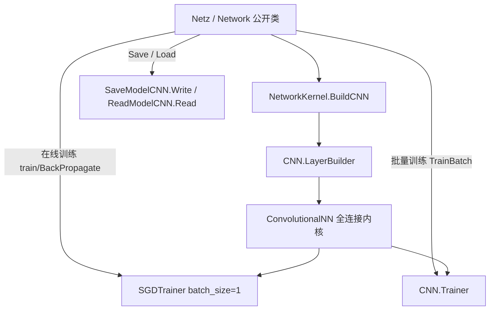

## 用户需求

重构 NeuralNetwork 模块，用 CNN 文件夹中的全连接网络完全替代 NeuralNetwork 内部旧的计算代码，作为统一的计算内核；保留 NeuralNetwork 原有的对外公开接口；彻底清理旧计算代码；并以 CNN 的持久化方式保存与加载模型；CNN 网络通过 CNN\LayerBuilder.vb 辅助创建。

## 产品概述

NeuralNetwork 命名空间对外仅保留 `Netz` 与 `Network` 两个类，二者均以 CNN 全连接网络（经 `CNN\LayerBuilder.vb` 构建）为内部计算内核，并以 CNN 二进制格式进行模型保存与加载；原有的手动前向/反向/权重更新计算代码（Layer/Neuron/Synapse 等）及其依赖的快照、训练、重要性分析子系统被彻底移除。

## 核心特性

- **Netz（回归分析神经网络）**：保留 `run`/`predict`/`train`、只读属性 `Output`/`Weights`/`Neurons`/`Bias`/`HiddenLayerCount`/`InputNeuronCount`/`HiddenNeuronCount`/`OutputNeuronCount`/`MaxOutputNeuronIndex`/`TotalError`、`Save`/`Load` 接口；内部前向/反向训练与误差计算均由 CNN 内核完成。
- **Network（通用人工神经网络）**：保留 `LearnRate`/`Momentum`/`Truncate`/`InputLayer`/`HiddenLayer`/`OutputLayer`/`Activations`、`ForwardPropagate`/`BackPropagate`/`Compute`/`TrainBatch`/`DoDropOut`、`Save`/`Load`/`ToString` 接口；内部计算与参数更新全部由 CNN 内核完成。
- **模型持久化**：Netz 与 Network 均使用 CNN 的 `SaveModelCNN.Write` / `ReadModelCNN.Read` 二进制格式保存与加载，保证保存/加载往返一致。
- **网络构建**：二者均通过 `CNN\LayerBuilder.vb` 以「输入层 → 全连接层+激活层（×隐藏层）→ 全连接层+激活层 → 回归/Softmax 层」的结构构建全连接网络。

## 技术栈

- 语言/框架：VB.NET（SDK 风格项目 `DeepLearning.NET6.vbproj`，目标 `net10.0`），GPL3。
- 复用现有基础设施（不引入新 ML 库）：
- `CNN.ConvolutionalNN`：统一计算内核（前向/反向传播、参数）。
- `CNN.LayerBuilder`：按用户要求辅助创建网络（输入层/全连接层/激活层/回归或 Softmax 层）。
- `CNN.trainers.SGDTrainer`：在线逐样本 SGD（batch_size=1，复现旧在线训练语义）。
- `CNN.Trainer`：批量 SGD（`TrainBatch`）。
- `CNN.SaveModelCNN` / `CNN.ReadModelCNN`：二进制模型持久化。

## 实现方案

### 总体策略

将 `Netz` 与 `Network` 都改造为 `CNN.ConvolutionalNN` 全连接网络的薄封装（facade）。网络构建统一收口到 `NetworkKernel.BuildCNN`，其内部使用 `CNN.LayerBuilder` 按 dims 组装 FC+激活+回归/Softmax 层，完全满足用户「CNN 网络通过 `CNN\LayerBuilder.vb` 辅助创建」的要求。训练：`train`/`BackPropagate` 走 `SGDTrainer`(batch_size=1)；`TrainBatch` 走 `CNN.Trainer`。持久化：`SaveModelCNN.Write` / `ReadModelCNN.Read`。

### 关键技术决策

1. **彻底删除而非适配**：按用户「彻底删除遗留子系统」决策，手工前向/反向/权重更新代码整体移除，不留双实现路径，避免维护旧计算与 CNN 内核两套语义。
2. **解决 Network 公开接口冲突**：`Network.InputLayer As Layer`、`HiddenLayer As HiddenLayers`、`OutputLayer As Layer` 当前返回即将删除的遗留类型。方案是引入**轻量只读视图类型**（不依赖任何遗留类），从 CNN 内核的层参数/输出派生 `.Count`、输出向量等信息，保留属性名称与 `.Count` 等公开成员，使 `ToString` 与 `_smoketest` 继续可用，但不再引用旧计算类。
3. **兼容性属性简化**：`Activations` 由 `IReadOnlyDictionary(Of String, ActiveFunction)`（依赖 `LayerActives`）简化为激活类型名配置（`IReadOnlyDictionary(Of String, String)`，键 input/hiddens/output）；`DoDropOut` 改为仅记录 dropout 比率标记（可选在构建期插入 `DropoutLayer`），不再操作遗留神经元；`TrainBatch` 参数由 `TrainingSample()` 改为 `(input As Double(), target As Double())()` 元组数组，方法名与训练语义保持不变。
4. **NetworkKernel 精简**：保留 `BuildCNN`（基于 LayerBuilder）与 `BuildDataBlock`；删除随遗留类失效的 `SyncFromCNN`/`SyncOutput`，以及仅服务于遗留激活对象的 `CNNLayer`（Network 改为按激活名直接构造 CNN 激活层）。该模块继续作为两个公开类共用的构建门面。

### 性能与可靠性

- CNN 内核本身为向量化前向/反向，性能优于手工循环；视图类型在访问时从内核参数惰性派生（O(参数量)），不额外存储、不引入热路径重复遍历。
- 在线 SGD 采用 batch_size=1，与旧 Netz/Network 的在线训练语义一致；`TotalError`/`Output` 反映最近一次前向/训练结果，保持旧接口语义。
- 删除后项目仍按 SDK 默认 glob 编译，无需逐文件登记。

## 实现要点（防回归）

- **爆炸半径控制**：工作区之外的 R#/GCModeller 等包若消费旧的 `NeuralNetwork.Network`/`StoreProcedure`/`Trainings` API 将受影响——此为用户明确决策范围内的已知影响，需在上层另行适配；本工作区内部保持一致。
- **保留非计算资产**：`NeuralNetwork/Demo/`、`ReadMe.txt`、`data.txt` 等为数据与文档，非计算代码，保持不动。
- **Netz 几乎不动**：仅确认其在 `NetworkKernel` 精简后仍可编译（Netz 仅依赖 `BuildCNN`/`BuildDataBlock` 与 CNN 持久化，自身无遗留引用）。
- **删除后引用扫描**：删除遗留文件后，必须确认 `.vbproj` 无显式 `<Compile Include>` 指向已删路径，并扫描全仓是否存在对删除类型/成员的悬空引用。

## 架构设计

两个公开 facade 共享同一个 CNN 计算内核类型，构建门面统一收口到 `NetworkKernel.BuildCNN`（底层用 `CNN.LayerBuilder`）。



## 目录结构

本重构涉及删除遗留子系统、新增视图类型、改写 Network 与 NetworkKernel、更新冒烟测试。

```
NeuralNetwork/
├── Models/
│   ├── Layer.vb          # [DELETE] 旧计算类（CalculateValue/UpdateWeights 等），死代码，随遗留子系统移除
│   ├── Neuron.vb         # [DELETE] 旧神经元计算类，移除
│   ├── Synapse.vb        # [DELETE] 旧突触计算类，移除
│   ├── HiddenLayers.vb   # [DELETE] 旧隐藏层容器与计算，移除
│   ├── LayerActives.vb   # [DELETE] 旧激活配置类，Network 改为字符串配置后不再需要
│   ├── SoftmaxLayer.vb   # [DELETE] 旧 Softmax 计算，CNN 内核已内置，移除
│   └── Network.vb       # [MODIFY] Network 类本体：移除 m_graph/BuildGraph/SyncFromCNN/SyncOutput/LayerActives，
│                          #           InputLayer/HiddenLayer/OutputLayer 改用视图类型，Activations 改为字符串配置，
│                          #           DoDropOut 改为 dropout 比率标记，TrainBatch 改元组样本，保留 Compute/
│                          #           ForwardPropagate/BackPropagate/Save/Load/ToString 及 Friend Sub New(kernel)
├── StoreProcedure/       # [DELETE] 整个目录（Snapshot.vb/CreateSnapshot.vb/NamespaceDoc.vb/Formats//Models/），依赖遗留 Layer/Neuron
├── Trainings/           # [DELETE] 整个目录（ANNTrainer/Helpers/IndividualParallelTraining/Reporter/TrainingSample/
│                       #           TrainingUtils/DarwinismHybrid/），依赖遗留 Network 镜像与 TrainingSample
├── Importance.vb        # [DELETE] 依赖 StoreProcedure.NeuralNetwork 快照，移除
├── NetworkKernel.vb     # [MODIFY] 保留 BuildCNN(基于 LayerBuilder) 与 BuildDataBlock；删除 SyncFromCNN/SyncOutput/CNNLayer
├── Netz.vb              # [MODIFY] 基本保持；仅确认在 NetworkKernel 精简后仍可编译，清理未用遗留引用（如有）
└── NetworkViews.vb     # [NEW] 轻量只读视图类型（NetworkLayerView / HiddenLayersView），从 CNN 内核派生层规模与
                         #        输出，支撑 Network 的 InputLayer/HiddenLayer/OutputLayer 属性名与 .Count/ToString，不依赖遗留类

_smoketest/
└── Program.vb          # [MODIFY] 改写 TestNetwork：去除 ANNTrainer/TrainingSample 依赖，直接驱动 Network 的
                        #           ForwardPropagate/BackPropagate/Compute/TrainBatch/Save/Load 与视图 .Count 验证
```

## 关键代码结构（核心契约）

仅给出解决公开接口冲突所必须的新增/变更契约（无实现体）。

```
' [NEW] NeuralNetwork/NetworkViews.vb —— 不依赖任何遗留计算类
Namespace NeuralNetwork
    Public Class NetworkLayerView
        Public ReadOnly Property Count As Integer          ' 该层神经元数量（供 .Count 与 ToString 使用）
        Public ReadOnly Property Output As Double()        ' 该层最近一次前向输出
        Public Overrides Function ToString() As String
    End Class

    Public Class HiddenLayersView
        Implements IEnumerable(Of NetworkLayerView)
        Public ReadOnly Property Count As Integer
        Public ReadOnly Property Layers As NetworkLayerView()
        Default Public ReadOnly Property Item(index%) As NetworkLayerView
    End Class
End Namespace

' [MODIFY] Network 类（NeuralNetwork/Models/Network.vb）关键签名变更
Public Class Network : Inherits Model
    Public Property InputLayer As NetworkLayerView
    Public Property HiddenLayer As HiddenLayersView
    Public Property OutputLayer As NetworkLayerView
    Public Property Activations As IReadOnlyDictionary(Of String, String)   ' 原为 ActiveFunction 字典，改为激活类型名
    Public Function ForwardPropagate(inputs As Double(), parallel As Boolean) As NetworkLayerView
    Public Sub TrainBatch(samples As (input As Double(), target As Double())(,), maxLoops As Integer)
    ' 保留：LearnRate/Momentum/Truncate/LearnRateDecay、BackPropagate、Compute、DoDropOut、
    '       Save/Load、ToString、Friend Sub New(kernel As ConvolutionalNN)
End Class
```

## Agent Extensions

### SubAgent

- **code-explorer**
- Purpose: 在删除遗留子系统（Models 旧类、StoreProcedure、Trainings、Importance）后，扫描整个工作区确认不存在对已删除类型/成员的悬空引用（如 `NeuralNetwork.Network` 旧成员、`ANNTrainer`、`LayerActives`、`Neuron`/`Synapse` 等），并核实 `DeepLearning.NET6.vbproj` 无显式 `<Compile Include>` 指向已删除文件。
- Expected outcome: 输出「无残留引用 / 发现 N 处需处理引用」的报告，确保删除后 `DeepLearning` 项目可成功编译。