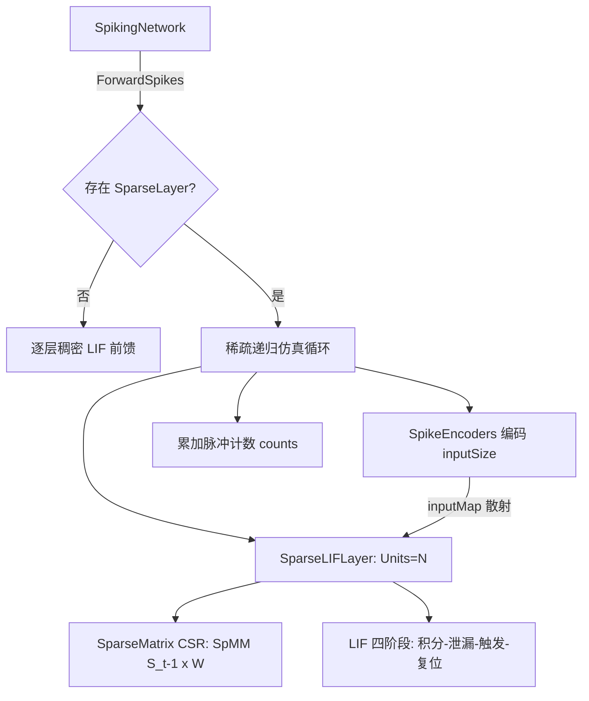

## 用户需求

当前 SNN 模型的 `SpikingNetwork.AddLayer()` 只能构建全连接的 LIF 层，无法加载 FlyWire（果蝇脑）等真实突触连接矩阵。需要让现有网络模型支持"稀疏自定义连接"的输入，从而能用真实突触连接（以 `(pre[], post[], weight[])` 三元组提供）驱动脉冲动力学仿真。

## 产品概述

在现有 SNN 库中新增稀疏连接能力：神经元之间不再默认全连接，而由用户给定的稀疏突触矩阵决定连接关系与强度；网络可在同一层的神经元之间（含循环连接与自反馈）按生物突触结构逐时间步传播脉冲。

## 核心功能

- 稀疏连接构建：接收 `(pre[], post[], weight[])` 三元组与神经元规模，构建稀疏突触矩阵；相同 `(pre, post)` 的边按权重累加合并。
- 单层稀疏递归仿真：全部神经元处于同一层、共用一个大稀疏连接矩阵；每个时间步输入电流 = 外部注入 + 前一时刻脉冲经稀疏矩阵回灌（支持循环连接与自反馈）。
- LIF 动态：复用现有积分-泄漏-触发-复位机制，`β`、阈值、复位模式可配置。
- 权重归一化：可配置为原始计数、按扇入归一化、按扇出归一化或全局最大值缩放。
- 输入映射：可将编码后的输入特征映射注入到指定的神经元子集。
- 规模：可承载 FlyWire 量级（十万级神经元、千万级突触）的稀疏连接，不得使用稠密矩阵。
- 结果输出：输出各神经元在仿真窗内的脉冲计数/脉冲序列，用于观察与解码。
- 兼容性：现有全连接多层网络的构建、训练、推理行为完全保持不变。

## 技术栈选择

- 语言/框架：VB.NET（.NET 10），复用现有 `SNN/` 工程，不引入任何第三方依赖。
- 复用组件：`Microsoft.VisualBasic.MachineLearning.TensorFlow.Tensor`、`Surrogate.Spike`、`LIFResetMode`、`SpikeEncoders`（频率/时延编码）、`TensorHelper`。
- 稀疏结构：工程内无现成 CSR/COO 实现，需自建（已确认 `TensorFlow` 与 `SNN` 工程均无稀疏矩阵类型）。
- 工程为 SDK 风格（`Microsoft.NET.Sdk`），新增 `.vb` 文件自动纳入编译，无需改 `.vbproj`。

## 实现方案

采用"稀疏矩阵 + 稀疏 LIF 层 + 网络前向分发"三层策略，最小化对现有稠密路径的改动：

1. **稀疏矩阵（CSR）**：约定行=突触前（pre）、列=突触后（post），存储 `rowPtr/colIdx/values`。`FromTriplets` 用计数排序 O(nnz) 建 CSR 并合并重复边；`SpMM(dense)` 实现 `[batch,N]·W[N,N] → [batch,N]`。
2. **稀疏 LIF 层**：复用 LIF 四阶段，前向改为 `I = I_ext + SpMM(S[t-1], W)` → `U = β·H + I` → `S = Θ(U−θ)` → 复位；`S[t-1]` 作为跨步状态，天然支持循环连接与自反馈。
3. **网络分发**：`SpikingNetwork` 新增 `SparseLayer` 属性与 `AddSparseLayer(...)`；`ForwardSpikes` 在存在稀疏层时走稀疏仿真循环（编码→逐步 SpMM→累加计数），否则保持原全连接逻辑。

**关键决策与取舍**：

- 行=pre 方向存储：SpMM 按行连续遍历，缓存友好、实现直观。
- 仅支持前向仿真（用户已确认）：稀疏层不保存 BPTT 反向缓存，显著降低内存；`ComputeGradients/TrainStep` 遇到稀疏层抛明确异常而非静默错误。
- 不修改 `Layers As List(Of LIFLayer)` 类型，新增独立 `SparseLayer` 属性，避免破坏现有测试与调用点（`Layers(0).UHistory`、`TrainStep` 等）。
- 权重归一化实现为独立方法 + 枚举，默认按扇入（列）归一化以适配突触计数尺度。

**性能与可靠性**：

- SpMM 复杂度 O(nnz × batch)/步，总 O(T × nnz × batch)；内存 O(nnz + 逐步中间张量)。FlyWire 量级下稠密矩阵不可行，CSR 为必要选择。
- 热路径直接操作 `Tensor.Data` 底层数组并预分配结果张量，避免 Default 索引器的版本自增与边界检查开销（与 `SpikeEncoders` 既有写法一致）。
- CS​R 构建一次完成，重复边合并避免权重重复计入；对非法索引（越界、负值）做校验。

## 实现注意事项

- 向后兼容：`AddLayer`、稠密前向、BPTT、STDP 及 `test1/test2/self_test` 演示均不得改变行为。
- 训练守卫：`TrainStep`/`ComputeGradients` 在稀疏模式下抛出 `NotSupportedException`，错误信息说明"稀疏连接层当前仅支持前向仿真"。
- 输入维度：`AddSparseLayer` 接受可选 `inputMap`（特征→神经元索引的散射映射）；为 Nothing 时要求网络 `inputSize = Units` 采用 1:1 映射。
- 编码器复用：稀疏模式复用 `Encode`（Rate/Latency 编码），外部注入电流按 `inputMap` 散射到 `[batch, Units]`。
- 复用既有张量算子（`+`、`Apply`、`ElementwiseMultiply`）保证与稠密路径数值一致，避免另起一套运算实现。

## 系统架构



## 目录结构

本方案在现有 SNN 工程上新增稀疏连接能力，改动集中在网络层与前向仿真路径，不触碰稠密训练逻辑。

```
SNN/
├── SparseMatrix.vb          # [NEW] CSR 稀疏矩阵。实现 FromTriplets(pre,post,weight,rows,cols)（计数排序建索引+合并重复边）、SpMM(dense Tensor)（[batch,N]·W→[batch,N]）、扇入/扇出/全局最大值归一化、ToDense（小规模校验用）、NonZeros/Rows/Columns 属性，以及 SparseNormalization 枚举。热路径直接操作底层数组。
├── SparseLIFLayer.vb        # [NEW] 稀疏递归 LIF 层。属性: Name/Units/InputSize/Synapses(CSR)/Beta/Threshold/ResetMode/UHistory/SHistory。状态: _H(膜电位[batch,N])、_S_prev(前一步脉冲)、_S/_U(轨迹)。ForwardStep(externalCurrent [batch,N]) 执行 I=I_ext+SpMM(S_prev,W) → U=βH+I → S=Θ(U−θ) → 复位 → 更新 S_prev。ResetState(batch) 清零状态。
├── Network.vb               # [MODIFY] SpikingNetwork 新增 SparseLayer 属性、AddSparseLayer(SparseMatrix) 与 AddSparseLayer(pre,post,weight,units,normalization,...) 重载；ForwardSpikes 分派到 ForwardSparse（编码→散射 inputMap→逐 T 步 ForwardStep→累加 counts）；ComputeGradients/TrainStep 对稀疏模式抛 NotSupportedException。保留原稠密路径不变。
├── readme.md                # [MODIFY] 新增"稀疏自定义连接"章节：三元组构建、归一化选项、inputMap 注入、前向仿真示例与性能/内存说明。
└── test/
    ├── test3.vb             # [NEW] SparseDemo：用小规模随机三元组（如 N=64、约 10% 连接、含自反馈）构建稀疏层并跑前向仿真，打印脉冲栅格与发放率；并做 SparseMatrix.SpMM 与稠密 MatMul 的对拍自检（小矩阵逐元素比对）。
    └── Program.vb           # [MODIFY] 在 Main 中调用 SparseDemo()（稀疏演示仅前向仿真，无训练）。
```

## 关键代码结构

```
' SparseMatrix.vb —— 稀疏连接矩阵核心接口
Public Enum SparseNormalization
    None        ' 原始突触计数
    FanIn       ' 按列（突触后）归一化
    FanOut      ' 按行（突触前）归一化
    GlobalMax   ' 全局最大值缩放
End Enum

Public Class SparseMatrix
    Public ReadOnly Property Rows As Integer       ' 突触前神经元数
    Public ReadOnly Property Columns As Integer    ' 突触后神经元数
    Public ReadOnly Property NonZeros As Integer
    ' pre/post 为神经元索引，weight 为权重；重复 (pre,post) 累加合并
    Public Shared Function FromTriplets(pre As Integer(), post As Integer(),
                                        weight As Double(), rows As Integer, columns As Integer) As SparseMatrix
    Public Sub Normalize(mode As SparseNormalization)
    ' dense: [batch, Rows]（突触前脉冲）→ 返回 [batch, Columns]（突触后电流）
    Public Function SpMM(dense As Tensor) As Tensor
End Class
```

```
' SparseLIFLayer.vb —— 单层稀疏递归 LIF 前向语义
' externalCurrent: [batch, Units] 外部注入电流（可为 Nothing）
Public Function ForwardStep(externalCurrent As Tensor) As Tensor
'   I = (externalCurrent) + SpMM(_S_prev, Synapses)   ' 含循环/自反馈
'   U = β·H + I ; S = Θ(U − Threshold) ; H = Reset(U, S)
'   _S_prev = S ; Return S
End Function
```

## Agent Extensions

### SubAgent

- **code-explorer**
- Purpose：在改动前排查整个 GCModeller 仓库是否已存在可复用的稀疏矩阵/连接组实现，并定位 `SpikingNetwork`、`Layers`、`AddLayer` 的全部调用点以评估改动影响范围。
- Expected outcome：确认无现成稀疏实现（需自建 CSR），输出 `SpikingNetwork` 相关调用点清单，确保只新增稀疏能力而不破坏现有调用方。

### Skill

- **lsp-code-analysis**
- Purpose：在修改 `Network.vb` 前后进行符号级引用分析，确认 `SpikingNetwork.Layers`、`ForwardSpikes`、`TrainStep` 等成员的所有使用位置。
- Expected outcome：给出精确的引用/实现位置列表，验证新增 `SparseLayer` 分支不会遗漏需同步处理的调用点。