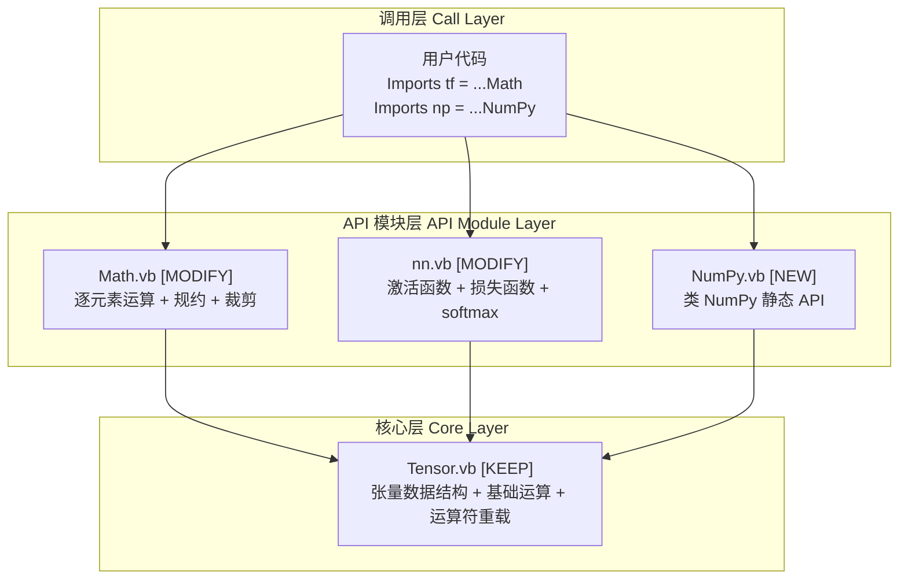

## 用户需求

基于已有的 Tensor 类（Tensor.vb），使用 VB.NET 复现 TensorFlow 和 NumPy 的常用 API。

### 核心要求

1. **忽略 AutomaticDifferentiation 文件夹**中的所有内容，不参与本次实现
2. **Math.vb 重写**：当前依赖外部 Vector 类型（reduce_sum、reduce_mean、clip_by_value、square、exp、log），需要改为基于 Tensor 实现
3. **nn.vb 重写**：当前依赖外部 Vector 类型（sigmoid_cross_entropy_with_logits、log_softmax），需要改为基于 Tensor 实现
4. **NumPy.vb 新建**：提供类 NumPy 的静态 API 模块（np.array、np.zeros、np.arange、np.dot、np.concatenate 等）
5. 所有 API 以 Module 中的静态方法形式提供，与现有 Tensor 类配合使用

### 产品概述

为一个自研 VB.NET 张量计算库添加完整的 TensorFlow/numpy 风格 API 层，使开发者能以熟悉的范式进行张量运算。Tensor 类作为底层核心，上层模块提供按功能域组织的静态方法集合。

### 核心功能模块

- **tf.Math 模块**（重写 Math.vb）：逐元素数学运算（exp、log、sqrt、square、abs、sin、cos、power）、规约操作（reduce_sum、reduce_mean、reduce_max、reduce_min、argmax、argmin）、裁剪（clip_by_value、clip_by_norm）
- **tf.NN 模块**（重写 nn.vb）：激活函数（relu、sigmoid、tanh、softmax、log_softmax）、损失函数（sigmoid_cross_entropy_with_logits、softmax_cross_entropy_with_logits、mse_loss、l2_loss）
- **NumPy 模块**（新建 NumPy.vb）：类 numpy API（zeros、ones、arange、linspace、dot、concatenate、stack、split、reshape、transpose、argmax、argmin、clip、abs、power、where、eye、random、randomn）

## 技术栈

- **语言**：VB.NET
- **目标框架**：.NET 10.0
- **核心类型**：Double() 一维数组（行优先存储）
- **命名空间**：`Microsoft.VisualBasic.MachineLearning.TensorFlow`

## 实现方案

### 整体策略

采用**模块化分层架构**：Tensor 类是底层数据容器和基础运算，各功能模块（Math、NN、NumPy）作为上层静态 API，全部操作返回新 Tensor 实例。所有方法遵循函数式无副作用的设计原则。

### 关键设计决策

1. **模块命名与调用方式**

- `Module Math` → 用户通过 `Math.exp(tensor)` 调用，或 `Imports tf = Microsoft.VisualBasic.MachineLearning.TensorFlow.Math` 后 `tf.exp(tensor)`
- `Module nn` → `nn.relu(tensor)`，配合 `Imports tf = Microsoft.VisualBasic.MachineLearning.TensorFlow.nn`
- `Module NumPy` → `NumPy.array(...)`，配合 `Imports np = Microsoft.VisualBasic.MachineLearning.TensorFlow.NumPy`

2. **数据类型统一**：所有内部运算使用 `Double` 类型，与 Tensor 类内部 `_Data As Double()` 保持一致，避免 Single/Double 之间的隐式转换损失。

3. **错误处理策略**：沿用 Tensor 类现有的 `ArgumentException` / `InvalidOperationException` 模式，在维度不匹配时抛出明确错误信息。

4. **性能考量**：

- 逐元素运算使用 `For` 循环直接操作 `_Data` 数组，避免 LINQ 开销
- 规约操作单次遍历完成，时间复杂度 O(n)
- Softmax 采用 `max - shift` 技巧防止数值溢出

5. **API 设计原则**：

- 不使用 `Optional` 参数造成歧义，关键参数显式传递
- 每个方法返回新 Tensor，不修改输入（不可变性）
- 方法签名与 TensorFlow/numpy 保持语义一致

### 现有 Tensor 类已有 API（直接复用，无需重复实现）

| 分类 | 已有 API |
| --- | --- |
| 工厂方法 | `Zeros`、`Ones`、`Filled`、`Identity`、`Random`、`RandomNormal`、`Range`、`Scalar`、`Variable` |
| 形状操作 | `Reshape`、`Clone`、`Shape` 属性 |
| 矩阵运算 | `MatMul`、`Transpose`、`ElementwiseMultiply` |
| 规约操作 | `Sum(axis)`、`TotalSum`、`Mean`、`Mean(axis)`、`L2Norm` |
| 逐元素应用 | `Apply(Func(Of Double, Double))` |
| 运算符 | `+`（含广播）、`-`、`*`（矩阵乘法）、`/` |
| 数据转换 | `ToArray`、`ToDoubleArray`、`To2DArray`、`GetRow`、`GetColumn` |


### 架构设计



### 数据流

用户调用模块方法 → 方法从输入 Tensor 读取 `_Data` → 创建新 Tensor → 逐元素/规约计算 → 返回结果 Tensor

## 实现细节

### 执行注意事项

1. **Blast radius**：Math.vb 和 nn.vb 是完整重写，旧代码完全替换。Tensor.vb **不做任何修改**（已是完整实现）。linear.vb 保持不动。
2. **性能热路径**：逐元素运算（exp、log、relu 等）是高频调用，使用直接数组索引循环，避免中间临时对象。
3. **数值稳定性**：`softmax` 和 `log_softmax` 必须使用 `max-subtract` 技巧；`sigmoid_cross_entropy_with_logits` 使用稳定的数学等价公式避免 log(0)。
4. **向后兼容**：重写 Math.vb 和 nn.vb 时，保持方法名不变（reduce_sum、clip_by_value 等），但参数类型从 `Vector` 改为 `Tensor`。

## 目录结构

```
g:/pixelArtist/src/framework/Data_science/MachineLearning/TensorFlow/
├── Tensor.vb                          # [KEEP] 现有 Tensor 类，不做修改
├── Math.vb                            # [MODIFY] 重写为基于 Tensor 的数学运算模块
│   │                                   #   提供: exp, log, sqrt, square, abs, pow,
│   │                                   #   sin, cos, tanh(逐元素), reduce_sum, reduce_mean,
│   │                                   #   reduce_max, reduce_min, argmax, argmin,
│   │                                   #   clip_by_value, clip_by_norm, reduce_all, reduce_any
│   │                                   #   所有参数/返回值全部改为 Tensor 类型
├── nn.vb                              # [MODIFY] 重写为基于 Tensor 的神经网络模块
│   │                                   #   提供: relu, sigmoid, tanh, softmax, log_softmax,
│   │                                   #   sigmoid_cross_entropy_with_logits,
│   │                                   #   softmax_cross_entropy_with_logits,
│   │                                   #   sparse_softmax_cross_entropy_with_logits,
│   │                                   #   mse_loss, l2_loss, dropout, leaky_relu, elu
│   │                                   #   所有参数/返回值全部改为 Tensor 类型
├── NumPy.vb                           # [NEW] NumPy 兼容 API 模块
│   │                                   #   提供: array, zeros, ones, full, eye, identity,
│   │                                   #   arange, linspace, reshape, transpose,
│   │                                   #   dot, matmul, concatenate, stack, vstack, hstack,
│   │                                   #   split, sum, mean, max, min, argmax, argmin,
│   │                                   #   exp, log, sqrt, square, abs, power, clip,
│   │                                   #   where, random.rand, random.randn,
│   │                                   #   expand_dims, squeeze
├── linear.vb                          # [KEEP] 保持现有占位代码不变
├── TensorFlow.vbproj                  # [KEEP] 项目文件，SDK 格式自动包含 .vb 文件
└── AutomaticDifferentiation/          # [IGNORE] 整个文件夹忽略
```

## 关键代码结构

### Math 模块核心接口（重写后）

```vb.net
' 逐元素一元运算 - 全部返回新 Tensor
Public Function exp(t As Tensor) As Tensor
Public Function log(t As Tensor) As Tensor
Public Function sqrt(t As Tensor) As Tensor
Public Function square(t As Tensor) As Tensor
Public Function abs(t As Tensor) As Tensor
Public Function sin(t As Tensor) As Tensor
Public Function cos(t As Tensor) As Tensor
Public Function tanh(t As Tensor) As Tensor
Public Function sigmoid(t As Tensor) As Tensor

' 规约操作 - 返回标量 Tensor 或沿轴降维的 Tensor
Public Function reduce_sum(t As Tensor, Optional axis As Integer? = Nothing, Optional keepdims As Boolean = False) As Tensor
Public Function reduce_mean(t As Tensor, Optional axis As Integer? = Nothing, Optional keepdims As Boolean = False) As Tensor
Public Function reduce_max(t As Tensor, Optional axis As Integer? = Nothing, Optional keepdims As Boolean = False) As Tensor
Public Function reduce_min(t As Tensor, Optional axis As Integer? = Nothing, Optional keepdims As Boolean = False) As Tensor
Public Function argmax(t As Tensor, Optional axis As Integer? = Nothing) As Tensor
Public Function argmin(t As Tensor, Optional axis As Integer? = Nothing) As Tensor

' 裁剪与条件
Public Function clip_by_value(t As Tensor, minValue As Double, maxValue As Double) As Tensor
Public Function clip_by_norm(t As Tensor, clipNorm As Double) As Tensor

```

### NN 模块核心接口（重写后）

```vb.net
' 激活函数
Public Function relu(t As Tensor) As Tensor
Public Function leaky_relu(t As Tensor, Optional alpha As Double = 0.01) As Tensor
Public Function elu(t As Tensor, Optional alpha As Double = 1.0) As Tensor
Public Function sigmoid(t As Tensor) As Tensor
Public Function tanh(t As Tensor) As Tensor
Public Function softmax(logits As Tensor, Optional axis As Integer = -1) As Tensor
Public Function log_softmax(logits As Tensor, Optional axis As Integer = -1) As Tensor

' 损失函数
Public Function sigmoid_cross_entropy_with_logits(labels As Tensor, logits As Tensor) As Tensor
Public Function softmax_cross_entropy_with_logits(labels As Tensor, logits As Tensor, Optional axis As Integer = -1) As Tensor
Public Function sparse_softmax_cross_entropy_with_logits(labels As Tensor, logits As Tensor) As Tensor
Public Function mse_loss(predictions As Tensor, targets As Tensor) As Tensor
Public Function l2_loss(t As Tensor) As Tensor

' 正则化
Public Function dropout(t As Tensor, keepProb As Double, Optional seed As Integer? = Nothing) As Tensor
```

### NumPy 模块核心接口（新建）

```vb.net
' 数组创建
Public Function array(data As Double(), ParamArray shape As Integer()) As Tensor
Public Function zeros(ParamArray shape As Integer()) As Tensor
Public Function ones(ParamArray shape As Integer()) As Tensor
Public Function full(shape As Integer(), value As Double) As Tensor
Public Function eye(size As Integer, Optional m As Integer? = Nothing) As Tensor
Public Function identity(size As Integer) As Tensor
Public Function arange(start As Double, [stop] As Double, Optional [step] As Double = 1) As Tensor
Public Function linspace(start As Double, [stop] As Double, Optional num As Integer = 50) As Tensor

' 形状操作
Public Function reshape(t As Tensor, ParamArray shape As Integer()) As Tensor
Public Function transpose(t As Tensor) As Tensor
Public Function expand_dims(t As Tensor, axis As Integer) As Tensor
Public Function squeeze(t As Tensor, Optional axis As Integer? = Nothing) As Tensor

' 矩阵运算
Public Function dot(a As Tensor, b As Tensor) As Tensor
Public Function matmul(a As Tensor, b As Tensor) As Tensor

' 拼接与分割
Public Function concatenate(tensors As Tensor(), Optional axis As Integer = 0) As Tensor
Public Function stack(tensors As Tensor(), Optional axis As Integer = 0) As Tensor
Public Function vstack(tensors As Tensor()) As Tensor
Public Function hstack(tensors As Tensor()) As Tensor
Public Function split(t As Tensor, numSplits As Integer, Optional axis As Integer = 0) As Tensor()

' 统计函数
Public Function sum(t As Tensor, Optional axis As Integer? = Nothing) As Tensor
Public Function mean(t As Tensor, Optional axis As Integer? = Nothing) As Tensor
Public Function max(t As Tensor, Optional axis As Integer? = Nothing) As Tensor
Public Function min(t As Tensor, Optional axis As Integer? = Nothing) As Tensor
Public Function argmax(t As Tensor, Optional axis As Integer? = Nothing) As Tensor
Public Function argmin(t As Tensor, Optional axis As Integer? = Nothing) As Tensor

' 数学函数
Public Function exp(t As Tensor) As Tensor
Public Function log(t As Tensor) As Tensor
Public Function sqrt(t As Tensor) As Tensor
Public Function square(t As Tensor) As Tensor
Public Function abs(t As Tensor) As Tensor
Public Function power(t As Tensor, exponent As Double) As Tensor
Public Function clip(t As Tensor, min As Double, max As Double) As Tensor

' 逻辑与条件
Public Function where(condition As Tensor, x As Tensor, y As Tensor) As Tensor
```