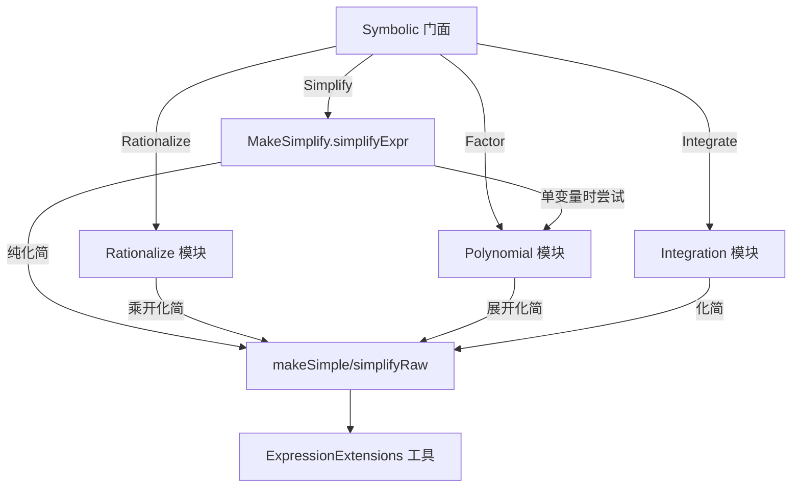

## 用户需求概述

在现有 MathLambda 符号运算项目基础上，补齐需求列表中尚未完成（或仅部分完成）的四个功能，保持函数式/不可变风格并复用现有 `ExpressionExtensions` 工具，不修改 `Math/Scripting` 解析器。

## 核心特性

- **有理化（Rationalization）**：消除分母中的根式与复数。支持 `1/(a+√b) → (a-√b)/(a²-b)`、`1/(√a+√b) → (√a-√b)/(a-b)`、`1/(a+b·i) → (a-b·i)/(a²+b²)` 等二项式/根式分母，并递归直到分母无根式。
- **Simplify 自动因式分解**：让 `Symbolic.Simplify` 在代数化简后，对「单变量多项式」自动尝试因式分解，使 `x²+2x+1` 直接得到 `(x+1)²`；多元表达式不触发以避免异常，且保证不与 `Factor` 形成递归死循环。
- **增强符号积分**：清理 `Integration.vb` 调试输出；在现有启发式积分上补充：一般幂形式 `(ax+b)^n` 积分、更多三角函数积分（sec/csc/cot、奇偶次幂 `sinⁿcosᵐ`）、有理函数 `1/(x²-a²)` 及换元启发式，扩大可积范围。
- **多元多项式因式分解**：扩展当前仅支持单变量的 `Factor`，新增多元表示与因式分解（数值公因式 content 提取、公共表达式因子提取、平方差 `A²-B²→(A-B)(A+B)`、按主元递归 univariate-over-符号系数），并保持展开（已有 `Expands`）能力。

## 技术栈

- 语言/运行时：VB.NET（.NET，与现有 MathLambda 项目一致）。
- 表达式树：复用 `Microsoft.VisualBasic.Math.Scripting.MathExpression.Impl`（`Expression`/`Literal`/`SymbolExpression`/`BinaryExpression`/`FunctionInvoke`/`UnaryExpression`/`UnaryNot`），字符串入口 `ScriptEngine.ParseExpression`。
- 基础设施：全部复用 `Symbolic.ExpressionExtensions`（`Clone`/`ExprEquals`/`GetSymbols`/`IsConstant`/`DependsOn`/`MakeLiteral`/`Add`/`Subt`/`Mul`/`Div`/`Pow`/`Negate`/`Reciprocal`/`FlattenSum`/`FlattenProduct`/`SplitCoefficient`/`NumericValue`/`ExpressionRewriter`）。

## 实现方案

### 1. 有理化 Rationalize.vb（新增）

- 思路：定义 `Rationalize(expr)` 门面（字符串/表达式双重载，仿 `Factor`）。核心是 `rationalizeQuotient(num, den)`：若 `den` 不含量 `sqrt(...)` 或虚部符号 `i` 则返回原商；否则对 `FlattenSum(den)` 中的「含无理部分」项取共轭（翻转该项符号，其余不变）得到乘子 `g`，返回 `Simplify((num*g)/(den*g))` 并递归直到分母无根式/复数。
- 共轭构造：`getConjugate(den)` 在扁平化求和中识别含 `sqrt` 或 `i` 的项并翻转其符号；二项式 `a+√b`/`√a+√b`/`a+b·i` 均一次共轭即可化为有理式；更复杂情形靠递归收敛。
- 顶层递归带最大深度（如 8）防止死循环；复用 `makeSimple`（非 `Factor`）做乘开化简，避免与因式分解耦合。

### 2. Simplify 自动因式分解（改 MakeSimplify.vb / Symbolic.vb）

- 在 `Symbolic.Simplify(raw As Expression)` 中：`simple = MakeSimplify.simplifyExpr(raw)`；若 `GetSymbols(simple).Length = 1` 且为多项之和，尝试 `Polynomial.Factor(simple)`，结果与原式不同则采用。
- 防递归：新增 `Friend Function simplifyRaw(raw)` = 当前 `makeSimple` 纯化简（不含因式分解）；`Polynomial.Factor` 内部对展开式调用 `simplifyRaw` 而非 `simplifyExpr`，从而 `Simplify→Factor→simplifyRaw` 不会回环触发 `Factor`。
- 不改动 Derivative/Integration/Limit/Taylor 内部已有的 `simplifyExpr` 调用语义，仅在公共 `Simplify` 门面追加因式分解后处理。

### 3. 增强符号积分（改 Integration.vb）

- 删除第 36、48 行 `Console.WriteLine("[INTDBG]...")` 调试输出。
- 推广 `integratePower`：当 `left` 为 `ax+b` 线性形式且 `right` 为任意实数 `n≠-1` 时返回 `(ax+b)^(n+1)/(a(n+1))`；`n=-1` 保留 `ln`。
- 扩充 `integrateFunction`/新增 `integrateTrig`：`∫sec = ln|sec+tan|`、`∫csc = ln|csc-cot|`、`∫cot = ln|sin|`、`∫tan`（已有）、`∫sinⁿcosᵐ`（奇次幂降次）、`∫sec²/ csc²` 等；有理函数新增 `∫1/(x²-a²) = (1/2a) ln|(x-a)/(x+a)|`、`∫1/(a²-x²)`。
- 换元启发式 `trySubstitution`：检测 `f(g(x))·g'(x)` 形态（f∈{exp,sin,cos,ln,power}，g' 可由 `decomposeLinear`/导数识别），应用 `∫f(g)g'dx = F(g)`。
- 所有新增均为模式匹配分支，沿用现有 `decomposeLinear`/`isPolynomial` 等 helper，未命中时保留 `integrate(...)` 未求值标记。

### 4. 多元多项式因式分解（改 Polynomial.vb）

- 新增多元表示：`MultivariatePoly`（主变量 `vars()` + 稀疏项 `Dictionary(Of key, coeff)`，key 为各变量指数向量拼接串）。`parseMv`/`toExprMv` 复用 `FlattenSum`/`FlattenProduct`。
- 因式分解分层启发（命中即应用并递归，否则回退原式）：

1. 数值 content：系数的数值 GCD 提出。
2. 公共表达式因子：对各项求最大公共表达式因子（基于 `ExprEquals` 与化简），提出后递归。
3. 平方差：识别 `A²-B²`（符号相反的两平方项）→ `(A-B)(A+B)`。
4. 主元递归：选定主变量，按 univariate-over-符号系数处理，对整式系数用 `ExprEquals` 判定整除的简化欧几里得除法尝试。

- 新增 `Factor(expr, vars())` 与 `Factor(expr)`（当变量数>1 时走多元路径）重载；保持原有单变量路径不变。

## 实现注意

- **复用与一致性**：所有节点构建走 `ExpressionExtensions` 的 `Add/Subt/Mul/Div/Pow/Negate` 与 `Clone`；不新增表达式类型。
- **防回归**：有理化与自动因式分解均使用纯 `makeSimple` 化简而非 `Factor`，杜绝递归死循环；多元 `Factor` 仅在变量数>1 时启用，单变量行为保持不变。
- **性能**：有理化/积分递归均设最大深度；多元因式分解为启发式，未命中直接返回展开式，避免指数爆炸。
- **日志**：`Integration.vb` 移除调试 `Console.WriteLine`，不再向 stdout 泄漏中间过程。

## 架构设计

在现有「统一门面 `Symbolic` + 各专项 `Module` + 共享 `ExpressionExtensions`」架构上扩展，不引入新分层。新增 `Rationalize` 模块并对 `Symbolic`/`MakeSimplify`/`Polynomial`/`Integration` 做增量修改。



## 目录结构

```
MathLambda/Symbolic/
├── Rationalize.vb        # [NEW] 有理化模块。实现 getConjugate/rationalizeQuotient，处理根式与复数分母，
│                         #        递归至分母有理化；提供 Friend 级入口供 Symbolic 门面调用。
├── Symbolic.vb           # [MODIFY] 新增 Rationalize 公共 API（字符串+表达式重载）；
│                         #          Simplify(Expression) 增加单变量自动因式分解后处理；
│                         #          新增多元 Factor 重载接入。
├── MakeSimplify.vb       # [MODIFY] 新增 Friend simplifyRaw（纯 makeSimple，不含因式分解）；
│                         #          Simplify 路径通过 simplifyExpr→makeSimple 保持不变，自动因式分解在门面完成。
├── Polynomial.vb         # [MODIFY] 新增 MultivariatePoly 表示与 parseMv/toExprMv、多元 Factor 重载及
│                         #          分层启发式（content/公共因子/平方差/主元递归）；
│                         #          Factor 内部展开化简改用 simplifyRaw 以防递归；保留单变量逻辑。
├── Integration.vb        # [MODIFY] 删除调试输出；扩展 integratePower/integrateFunction，
│                         #          新增 integrateTrig 与 trySubstitution 换元启发式，扩大可积范围。
└── ExpressionExtensions.vb # [不变/复用] 共享不可变工具，全部复用，不修改。

MathLambda/test/
└── SymbolicTest.vb       # [MODIFY] 在 Main 中增加 test_Rationalize/test_AutoFactor/test_EnhancedIntegration/
│                         #          test_MultivariateFactor，仿现有格式补充验证样例。
```

## 关键代码结构

```
' Rationalize.vb —— 门面级入口（由 Symbolic 调用）
Friend Module Rationalize
    Friend Function rationalize(expr As Expression) As Expression
    ' 对整个表达式递归：若遇 Div 且分母含 sqrt/i 则取共轭相乘并化简，直至分母有理
End Module

' Polynomial.vb —— 多元表示与入口
Friend Class MultivariatePoly
    Public vars As String()
    Public terms As Dictionary(Of String, Double)  ' key=指数向量串, value=系数
End Class
' Public Function Factor(expr As Expression, vars As String()) As Expression  ' 多元重载
```