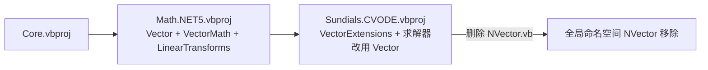

## 产品概述

将 CVODE_Solver 项目中的 NVector 向量对象合并进入 Math 基础数学函数库的 Vector 类，实现向量对象的统一。合并后 Vector 类成为功能完备的通用数学向量类，Sundials.CVODE 项目（纯托管实现，无 P/Invoke）全面改用 Math 库中的 Vector。

## 核心功能

- **向量运算（运算符重载）**：所有向量间/向量-标量的加减乘除运算通过 `+` `-` `*` `/` 运算符重载实现，每次运算生成新向量对象，不修改参与运算的原向量（Vector 已具备 21 处运算符重载，需确认覆盖 NVector 全部运算语义）。
- **原地操作（函数方法）**：在 Vector 中新增就地更新内部数据的方法，包括 `LinearSumInPlace`、`AddInPlace`、`SubtractInPlace`、`ScaleInPlace`、`AddConstant`、`MultiplyElementWiseInPlace`、`DivideElementWiseInPlace`、`SetConstant`、`CopyFrom` 等，满足 CVODE 求解器对历史缓冲、临时向量的高性能就地更新需求。
- **通用数学 API 合并**：将 NVector 中通用的静态工厂（Zeros/Ones/Constant/LinSpace）、范数（L1/L2/InfinityNorm）、LinearSum、Negate、Sqrt、Max/Min/MaxAbs、EqualsApprox 等合并进 Vector 成为通用 API。
- **数学辅助函数**：新增点积（已有，统一 API）、叉积（3 维）、外积（复用 Xor/GeneralMatrix）、投影（向量 a 在 b 上的投影）、Gram-Schmidt 正交化/正交分解（一组向量 → 正交基）、线性变换（旋转、平移、缩放、反射的变换矩阵工厂方法，通过 GeneralMatrix 的矩阵×向量乘法施加于 Vector）。
- **CVODE 专用方法**：WRMSNorm、WRMSNormSquare 等求解器特有范数以扩展方法形式保留在 Sundials.CVODE 项目内。
- **NVector 移除**：彻底删除 NVector.vb，Func.vb 委托签名（RHSFunction/JacobianFunction/RootFunction）、CVODESolver.vb 求解器内部状态、LinearSolver、DenseMatrix 等所有 NVector 引用全部替换为 `Microsoft.VisualBasic.Math.LinearAlgebra.Vector`。

## 技术方案

### 技术栈

- 语言：VB.NET（.NET 10.0，两项目 TargetFramework 均为 net10.0）
- 项目：Math.NET5.vbproj（RootNamespace=`Microsoft.VisualBasic.Math`）与 Sundials.CVODE.vbproj（RootNamespace=`Microsoft.VisualBasic.Math.Sundials.CVODE`）
- 依赖方向：Sundials.CVODE → Math.NET5 → Core（单向，无循环引用，合并方案无架构障碍）

### 实现思路

1. **Vector 增强分三个文件承载**（遵循 Math 项目现有的按职责拆分模式）：

- `Vector.vb`：补充原地操作方法与通用静态 API（LinearSum、范数、工厂方法等）。原地方法直接操作内部 `Double()` 存储；需先确认基类 `GenericVector(Of Double)` 的数据存取方式与构造函数克隆语义（NVector 的 `New(data)` 是克隆数组，Vector 对应构造必须语义一致，否则会改变 CVODE 缓冲更新行为）。
- `Vector.vb` 或同目录新文件（如 `VectorMath.vb` 模块/扩展）：叉积 `Cross`、投影 `Project`、Gram-Schmidt 正交化 `GramSchmidt`/`Orthonormalize`、外积（确认 `Xor` 运算符已返回 GeneralMatrix，统一为显式 `OuterProduct` 方法）。
- 线性变换辅助（如 `LinearTransforms.vb` 模块）：`Rotation(angle)`、`Translation(v)`、`Scaling(sx,sy,sz)`、`Reflection(axis/plane)` 等工厂方法返回 GeneralMatrix，配合 GeneralMatrix 现有的矩阵×向量乘法施加于 Vector。

2. **CVODE 侧替换**：

- 在 CVODE 项目内新建 `VectorExtensions.vb` 模块，实现 `WRMSNorm`、`WRMSNormSquare` 等扩展方法。
- 建立成员映射表后全局替换：`NVector` → `Vector`；`NVector.Add(a,b)` → `a + b`；`Subtract` → `-`；`Scale(a,s)` → `a * s`；`MultiplyElementWise` → `a * b`（语义核对：Vector 的 `*` 对 Vector×Vector 是元素乘）；`Dot` → `Vector.DotProduct`/`dot`；`Negate` → 一元 `-`；`Abs`/`Sqrt` → 对应实例方法或新补充的元素级运算。
- 原地方法（`ScaleInPlace`、`LinearSumInPlace`、`CopyFrom` 等）在 Vector 中提供同名或语义等价方法，保证求解器热路径零额外分配。
- `Data` 属性：Vector 需提供返回内部 `Double()` 的访问方式以兼容 CVODE 中对底层数组的直接使用。

3. **删除与清理**：从 Sundials.CVODE.vbproj 移除 NVector.vb（vbproj 为显式 Compile 列表时需同步删除条目），确认无残留引用。

### 架构图

### 性能与可靠性要点

- CVODE 求解循环为热路径：所有原地操作直接写入内部数组，避免每步产生新 Vector 分配；比较运算符（返回 BooleanVector）与 CVODE 中的标量比较需求区分开，CVODE 内部用 `EqualsApprox`/逐元素比较扩展方法。
- 运算符重载保持纯函数语义（不改原向量），原地方法命名为显式 `*InPlace`/`Add`/`Subtract` Sub，API 语义清晰防误用。
- 数组边界检查沿用 NVector 现有风格（索引器带边界校验）；Gram-Schmidt 等新增函数对零向量、维度不匹配做防御性处理。
- 爆炸半径控制：不改动 Vector 现有 21 处运算符与 10 处 CType 转换的行为，只做增量补充；CVODE 内部重构限于类型替换与调用点映射，不触及求解算法逻辑。

## Agent Extensions

### SubAgent

- **code-explorer**
- Purpose：在替换前精确定位 CVODE 项目中所有 NVector 引用点与调用方式（静态方法/原地方法/属性访问），并确认 Vector 基类 GenericVector(Of Double) 的数据存储与构造克隆语义。
- Expected outcome：输出完整的 NVector 使用清单与成员映射表，作为全局替换依据；替换后用于校验无残留 NVector 引用。