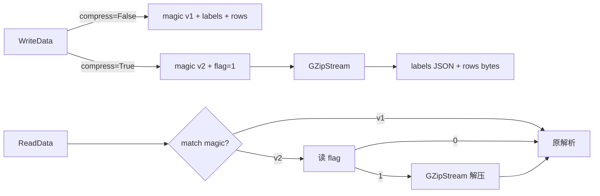

## 用户需求

优化 `MatrixMarket\MatrixFormat.vb` 中二进制矩阵文件的读写代码，增加对矩阵数据的 gzip 压缩支持。

## 产品概述

当前 `MatrixFormat.vb` 使用纯二进制的网络字节序方式保存 `DataMatrix`：magic 头 + JSON 标签 + 逐行 Double 字节。本次优化在保持原有未压缩文件可读取（向后兼容）的前提下，新增可选的 gzip 压缩写入能力，读端自动识别压缩标志并解压。

## 核心特性

- 在二进制文件头部增加 1 字节压缩标志位（0=未压缩，1=gzip），置于 magic 头之后、标签数据之前。
- 新增带压缩开关的 `WriteData` 重载：启用时通过 `GZipStream` 包装底层流，对「标签 JSON + 矩阵字节」整体进行 gzip 压缩后写入。
- `ReadData` 读取压缩标志：为 1 时先用 `GZipStream` 解压剩余流再按原逻辑解析；为 0 时沿用原有未压缩解析路径，保证旧文件兼容。
- 矩阵字节依旧采用 `NetworkByteOrderBuffer`（hostBuf）的网络字节序编码，仅在字节流外层叠加 gzip 压缩，不改动数值编码方式。
- 仅修改 `MatrixFormat.vb`，不改动 `DataMatrix.vb` 与 `NetworkByteOrderBuffer.vb`。

## 技术栈

- 语言：Visual Basic (.NET, sciBASIC# 项目)
- 压缩：`System.IO.Compression.GZipStream`（项目中已有 gzip 相关辅助，如 `UnGzipStream`/`GZipAsBase64`，可直接用框架原生 GZipStream）
- 字节序：`Microsoft.VisualBasic.Serialization.BinaryDumping.NetworkByteOrderBuffer`（既有 hostBuf 实例）

## 实现方案

### 总体策略

在不改变数值编码（network byte order）的前提下，于文件头引入一个 1 字节 `compression flag`，把「标签 JSON + 矩阵行字节」作为一个连续数据块，用 `GZipStream` 在 Stream 层做可选压缩。读端先读 magic 校验，再读 1 字节 flag，依据 flag 决定是否用 `GZipStream` 包裹后续流进行解压，随后复用现有逐行 `ParseDouble` 解析逻辑。

### 关键技术决策

1. **新增标志位而非新 magic**：保留原 magic 字符串 `"scibasic.net/data-matrix"`，在 magic 之后追加 1 字节 flag。这样旧文件（magic 后紧跟 JSON 文本首字符 `{`）读 flag 时会把首字符当作 flag 而误判——因此采用**新 magic 字符串**方案更安全：`"scibasic.net/data-matrix/v2"`。读端若读到旧 magic 则走原未压缩分支（完全向后兼容），读到 v2 magic 则按 flag 决定压缩与否。此方案零歧义、易维护。
2. **压缩作用范围**：压缩标签 JSON 与矩阵字节整体，避免分别压缩带来的碎片与额外头部开销；整体 gzip 对数值型矩阵通常有较好压缩率。
3. **压缩开关设计**：新增重载 `WriteData(m As DataMatrix, file As Stream, Optional compress As Boolean = False)`，保留原无参重载（默认不压缩，写旧 magic 以兼容现有产出）；新重载写 v2 magic + flag。
4. **性能**：矩阵可能很大，使用 `GZipStream` 流式读写避免整块 `ToArray` 复制；行写入仍逐行 `hostBuf.GetBytes` 并直接写入压缩流，控制内存峰值。压缩为 IO 密集型，瓶颈在磁盘/CPU，采用默认压缩级别即可。

## 实现注意事项

- 向后兼容：读端先尝试旧 magic（原逻辑），不匹配再尝试 v2 magic，任一匹配即正确解析，避免破坏既有文件。
- 资源释放：`GZipStream` 必须 `Using` 包裹，确保 flush 与 dispose，否则尾部数据丢失。
- 日志/错误：magic 不匹配仍抛 `InvalidDataException`，错误信息保持原风格。
- 爆炸半径控制：仅修改单文件，不引入新依赖（GZipStream 属框架原生），不改动 DataMatrix 与 NetworkByteOrderBuffer。

## 架构设计



## 目录结构

```
Data_science/Mathematica/Math/DataFrame/MatrixMarket/
└── MatrixFormat.vb   # [MODIFY] 增加 v2 magic 常量、压缩标志写入与读取逻辑；新增 WriteData 压缩重载；ReadData 支持按 magic/flag 选择解压路径；ReadMatrix 增加可接收已解压 Stream 的解析入口。
```

## 关键代码结构

```
' 新增常量
Const magicV1 As String = "scibasic.net/data-matrix"
Const magicV2 As String = "scibasic.net/data-matrix/v2"

' 新增重载（压缩开关）
<Extension>
Public Function WriteData(m As DataMatrix, file As Stream, Optional compress As Boolean = False) As Boolean

' 读端入口（兼容 v1/v2）
Public Function ReadData(file As Stream) As DataMatrix
```