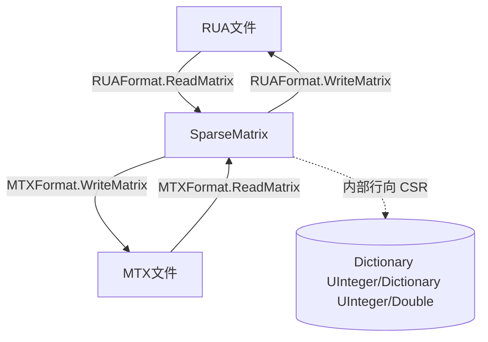

## 用户需求

在 DataFrame 项目的 MatrixMarket 模块中，实现稀疏矩阵在 RUA（Harwell-Boeing real unsymmetric assembled）与 MTX（Matrix Market coordinate）两种文本格式间的完整读写能力，统一以 `SparseMatrix` 对象作为核心数据载体。

## 产品概述

为 `MatrixMarket/RUAFormat.vb` 填充 RUA 格式矩阵的读取与写入逻辑，使其能从 RUA 文件解析出 `SparseMatrix`，也能将 `SparseMatrix` 按标准 HB 列向格式写出。同时为现有的 `MTXFormat.vb` 补齐 MTX 写入能力，使其与已有 MTX 读取方法形成双向闭环。最终支持 `SparseMatrix` 在 MTX 与 RUA 两种格式之间的任意转换与持久化。

## 核心功能

- RUA 文件读取：解析 Harwell-Boeing 头部四行（title、card counts、matrix type RUA、N/M/NZ）及列指针/行索引/数值三块数据，重建 `SparseMatrix`（需做列向到行向的索引映射）。
- RUA 文件写入：将 `SparseMatrix` 的按行存储结构转换为标准 HB 列向 CSC 表示，输出固定列宽的 colptr(I8)、rowind(I8)、values(E20.12) 三块数据及头部。
- MTX 文件写入：输出 `%%MatrixMarket matrix coordinate real general` 头部、`M N nnz` 维度行及 1-based 三元组（i, j, value），与现有 `ReadMatrix` 完全互补。
- 提供 filepath / Stream / TextWriter 多种重载，与现有 `MTXFormat` 风格保持一致。

## 技术栈选择

- 语言：Visual Basic (.NET)，沿用项目现有约定（`Imports Microsoft.VisualBasic.Language`、`Microsoft.VisualBasic.Math.LinearAlgebra.Matrix`）。
- 核心类型：`Microsoft.VisualBasic.Math.LinearAlgebra.Matrix.SparseMatrix`（行向字典存储 `Dictionary(Of UInteger, Dictionary(Of UInteger, Double))`，0-based 整数索引，提供 `RowDimension`、`ColumnDimension`、`nnz`、`[Get]`、`[Set]`、`ArrayPack`）。
- I/O：复用 `System.IO`（StreamReader/StreamWriter），遵循 `MTXFormat.vb` 中已有的 filepath/Stream/StreamReader 重载风格。

## 实现方案

### 总体策略

在 `RUAFormat` 中补齐读取与写入方法；在 `MTXFormat` 中补齐写入方法。RUA 采用标准 Harwell-Boeing 列向（CSC）存储以兼容外部工具；由于 `SparseMatrix` 内部为行向（CSR）存储，读取 RUA 时需将（列指针区间 -> 行号）映射回 `matrix(row, col) = value`，写入 RUA 时需将行向数据转为列向 CSC（colptr/rowind/values）。MTX 保持 coordinate（三元组）格式，直接与 `SparseMatrix` 的 `(i,j,v)` 三元组对应，无需转置。

### 关键决策与权衡

- **RUA 列向 vs 行向**：外部 RUA 工具（如 west0655.rua 样例）均为列向。写入时按列遍历生成 colptr，保证文件可被 MATLAB/scipy 等识别；读取时按 colptr 区间取每列非零行。这是 HB 格式事实标准，不引入自定义变体，避免破坏互操作性。
- **固定列宽格式**：RUA 数值用 `E20.12`（如 `.100000000000E+01`），索引/指针用 `I8`（右对齐宽度 8）。使用 `String.Format("{0,8}", x)` / `String.Format("{0,20:E12}", v)` 保证固定宽，避免偏移错位。
- **MTX 写入格式**：头部 `%%MatrixMarket matrix coordinate real general`，维度行 `M N nnz`，三元组使用 1-based 索引（`i+1, j+1, value`），与 `MTXFormat.ReadMatrix` 中读取时减 1 严格互补。数值输出采用与样例一致的科学计数法（如 `1.0000000000000e+00`），可用固定格式保证可逆解析。
- **性能**：RUA 读取/写入均为 O(nnz) 遍历一次；MTX 写入 O(nnz)。通过 `ArrayPack()` 或逐行字典遍历收集非零三元组，避免重复遍历和 N+1 查询。大矩阵（nnz 数千）下 StringBuilder 批量拼接后一次性写入，减少 I/O 次数。

### 避免技术债务

- 复用 `SparseMatrix` 现有 API（`[Get]`/`[Set]`/`nnz`/`RowDimension`/`ColumnDimension`），不修改 `SparseMatrix` 内部实现。
- 方法签名与 `MTXFormat.ReadMatrix` 重载族（filepath / Stream / StreamReader）保持一致，命名统一 `ReadMatrix` / `WriteMatrix`。
- 提供私有 helper 方法（如 `ToColumnMajor(matrix)` / `WriteHeader`）降低方法体复杂度，便于维护。

## 实现注意

- **索引一致性**：RUA 内部使用 1-based Fortran 索引（colptr 从 1 开始），写入 colptr 时须 +1；读取 colptr 时须 -1 还原为 0-based 再访问 `SparseMatrix`。MTX 同理。
- **稀疏边界**：当某行/列为空时，CSC 的 colptr 连续相等，需在写入时正确处理；读取时 `colptr(col+1) - colptr(col)` 可能为 0，跳过即可。
- **日志/容错**：读取时对头部 token 解析做基本校验（N/M/NZ 与数据块行数匹配），异常用 `ArgumentException`/友好提示；不 dump 整文件内容，避免日志膨胀。
- **向后兼容**：仅新增方法，不改动现有 `MTXFormat.ReadMatrix` 与 `SparseMatrix`，blast radius 可控。

## 架构设计



- `SparseMatrix` 为唯一数据中枢；RUA 读写负责行向<->列向转换，MTX 读写直接映射三元组。

## 目录结构

```
g:/GCModeller/src/runtime/sciBASIC#/Data_science/Mathematica/Math/DataFrame/MatrixMarket/
├── RUAFormat.vb   # [MODIFY] 实现 RUA 读取(ReadMatrix ×3 重载)与写入(WriteMatrix ×2 重载)，含列向/行向转换 helper，生成 SparseMatrix
└── MTXFormat.vb   # [MODIFY] 在现有 ReadMatrix 基础上补充 WriteMatrix(matrix, filepath) 与 WriteMatrix(matrix, writer)，输出标准 MTX coordinate 文本
```

（无需新建文件，沿用现有模块与 `SparseMatrix` 类型，保持最小改动面。）

## 关键代码结构

```
' RUAFormat.vb
Namespace MatrixMarket
    Public Class RUAFormat
        Public Shared Function ReadMatrix(filepath As String) As SparseMatrix
        Public Shared Function ReadMatrix(file As Stream) As SparseMatrix
        Public Shared Function ReadMatrix(reader As StreamReader) As SparseMatrix
        Public Shared Sub WriteMatrix(matrix As SparseMatrix, filepath As String)
        Public Shared Sub WriteMatrix(matrix As SparseMatrix, writer As StreamWriter)
    End Class
End Namespace

' MTXFormat.vb (新增)
Public Shared Sub WriteMatrix(matrix As SparseMatrix, filepath As String)
Public Shared Sub WriteMatrix(matrix As SparseMatrix, writer As StreamWriter)
```