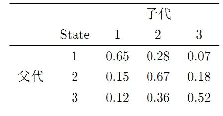
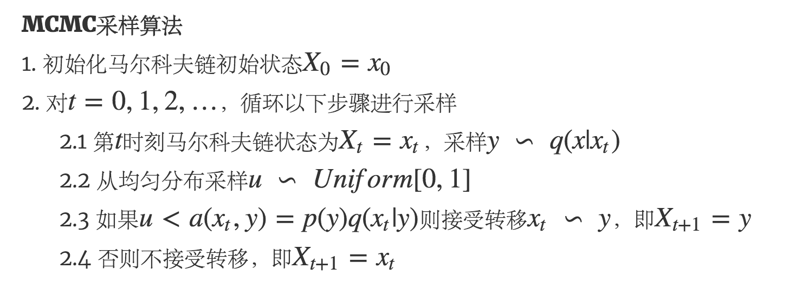
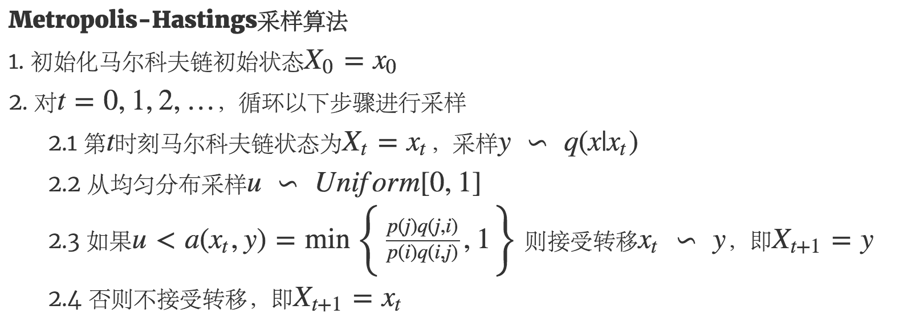
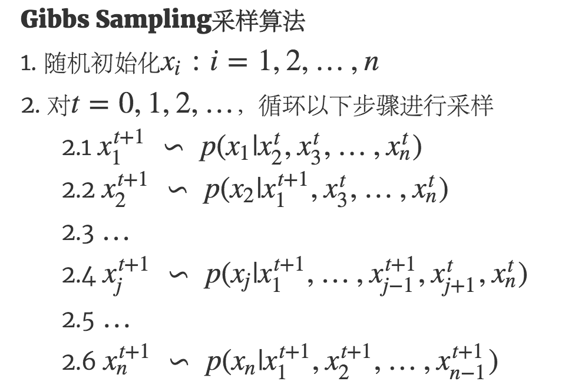

# 蒙特卡罗方法采样算法

> https://github.com/endymecy/MCMC-sampling

&emsp;&emsp;蒙特卡罗方法(`Monte Carlo Simulation`)是一种随机模拟(或者统计模拟)方法。

&emsp;&emsp;给定统计样本集，如何估计产生这个样本集的随机变量概率密度函数,是我们比较熟悉的概率密度估计问题。
求解概率密度估计问题的常用方法是最大似然估计、最大后验估计等。但是，我们思考概率密度估计问题的逆问题:给定一个概率分布`p(x)`，如何让计算机生成满足这个概率分布的样本。
这个问题就是统计模拟中研究的重要问题–采样(`Sampling`)。本文将重点介绍其中两种重要的采样算法：`MCMC(Markov Chain Monte Carlo)`算法和`Gibbs Sampling`算法。

## Sampling

&emsp;&emsp;一般而言均匀分布`Uniform(0,1)`的样本是相对容易生成的。 通过线性同余发生器可以生成伪随机数，我们用确定性算法生成`[0,1]`之间的伪随机数序列后，
这些序列的各种统计指标和均匀分布`Uniform(0,1)`的理论计算结果非常接近。这样的伪随机序列就有比较好的统计性质，可以被当成真实的随机数使用。线性同余随机数生成器如下:

$$x_{n+1}=(ax_n+c)~\textrm{mod}~m$$

&emsp;&emsp;式中`a`，`c`，`m`是数学推导出的合适的常数。这种算法产生的下一个随机数完全依赖当前的随机数，当随机数序列足够大的时候，随机数会出现重复子序列的情况。
当然，也有很多更加先进的随机数产生算法出现，比如`numpy`用的是 `Mersenne Twister` 等。根据上面的算法现在我们有了均匀分布的随机数，但是如何产生满足其他分布下的随机数呢？

&emsp;&emsp;首先我们来看一个简单的例子，假设我们想对下面的二项分布进行采样:

$$P(X=0)=0.5 , P(X=1)=0.5$$

&emsp;&emsp;我们如何采样得到$X$的值。我们会很毫不费力地想到“抛硬币”，如果硬币正面朝上，则$X=1$，否则，$X=0$。那计算机怎么做，使用随机数生成器生成0到1之间的随机数$r$，
如果$r<0.5$，则$X=1$，否则，$X=0$。当分布是多项式分布时:

$$P(X=i)=1/6 , i\in{1,2,...,6}$$

&emsp;&emsp;这也很简单，让算机生成0到1之间的随机数$r$，把0到1等分成6个子区间，$r$落在哪个区间，$X$就取值为那个区间的编号。我们再考虑更复杂的情况，假设分布是多元随机变量分布:

$$P(X_1,X_2,...,X_n)$$

&emsp;&emsp;当然这种情况下也有容易解决的例子，比如随机变量都是独立的情形:

$$P(X_1,X_2,...,X_n)=P(X_1)P(X_2)...P(X_n)$$

&emsp;&emsp;我们可以利用前面的算法对每个变量单独进行采样。但是问题并不总是这么简单，当$P(X)$的形式很复杂，或者$P(X)$是个高维的分布且不能分解的时候，样本的生成就可能很困难了。
此时就需要使用一些更加复杂的随机模拟的方法来生成样本。而本节中将要重点介绍的 `MCMC` 算法和 `Gibbs Sampling` 算法就是最常用的两种，这两个方法在现代贝叶斯分析中被广泛使用。
要了解这两个算法，我们首先要对马尔科夫链的平稳分布的性质有基本的认识。

## 马尔科夫链及其平稳分布

&emsp;&emsp;马尔科夫链的数学定义如下:

$$P(X_{t+1}=x|X_t,X_{t-1},...)=P(X_{t+1}=x|X_t)$$

&emsp;&emsp;也就是说前一个状态只与当前状态有关，而与其他状态无关，马尔科夫链体现的是状态空间的转换关系，下一个状态只决定于当前的状态。

&emsp;&emsp;下面举一个例子。

&emsp;&emsp;社会学家经常把人按其经济状况分成3类：下层(`lower-class`)、中层(`middle-class`)、上层(`upper-class`)，我们用 1, 2, 3 分别代表这三个阶层。
社会学家们发现决定一个人的收入阶层的最重要的因素就是其父母的收入阶层。如果一个人的收入属于下层类别，那么他的孩子属于下层收入的概率是 0.65, 属于中层收入的概率是 0.28,
属于上层收入的概率是 0.07。事实上，从父代到子代，收入阶层的变化的转移概率如下

<div  align="center"></div>

<div  align="center"></div>

&emsp;&emsp;使用矩阵的表示方式，转移概率矩阵记为

$$P=\begin{bmatrix}
  0.65 &  0.28 & 0.07 \\\
  0.15 & 0.67 & 0.18 \\\
  0.12 & 0.36 & 0.52
  \end{bmatrix}$$

&emsp;&emsp;假设当前这一代人处在下层、中层、上层的人的比例是概率分布向量$\pi_0=[\pi_0(1),\pi_0(2),\pi_0(3)]$,那么他们的子女的分布比例将是$\pi_1=\pi_0P$,
他们的孙子代的分布比例将是$\pi_2=\pi_1P=\pi_0P^{2}$ ，第n代子孙的收入分布比例将是$\pi_n=\pi_{n-1}P=\pi_0P^{n}$。

&emsp;&emsp;假设初始概率分布为$\pi_0=(0.2,0.3,0.5)$则我们可以计算前$n$代人的分布状况。

&emsp;&emsp;代码如下：

```R
p<-matrix(c(0.65,0.15,0.12,
            + 0.28,0.67,0.36,
            + 0.07,0.18,0.52),nrow = 3, ncol = 3);
a<-c(0.2,0.3,0.5);
result = a;
for (i in 1:10){
  a=a%*%p;
  result = rbind(result,a);
}
show(result);
```

&emsp;&emsp;结果如下：

```
0.2000000 0.3000000 0.5000000
0.2350000 0.4370000 0.3280000
0.2576600 0.4766700 0.2656700
0.2708599 0.4871549 0.2419852
0.2781704 0.4893492 0.2324804
0.2821108 0.4894446 0.2284446
0.2842021 0.4891590 0.2266390
0.2853019 0.4889031 0.2257950
0.2858771 0.4887358 0.2253871
0.2861769 0.4886379 0.2251851
0.2863329 0.4885836 0.2250835
```

&emsp;&emsp;我们发现，最终会趋于稳定值。我们把初始分布改为$\pi_0=(0.5,0.4,0.1)$,继续迭代：

```
0.5000000 0.4000000 0.1000000
0.3970000 0.4440000 0.1590000
0.3437300 0.4658800 0.1903900
0.3161533 0.4769244 0.2069223
0.3018690 0.4825543 0.2155767
0.2944672 0.4854423 0.2200905
0.2906309 0.4869297 0.2224394
0.2886423 0.4876977 0.2236600
0.2876113 0.4880949 0.2242937
0.2870769 0.4883005 0.2246226
0.2867997 0.4884070 0.2247932
```
最终还是收敛于相同的值。即这个最终分布于初始状态无关。我们迭代转移矩阵$P$，得到：

$$P^{100}=
  \left[
  \begin{array}{ccc}
      0.2865014 & 0.4885216 & 0.224977\\\
  0.2865014 & 0.4885216 & 0.224977\\\
  0.2865014 & 0.4885216 & 0.224977\\\
  \end{array}
  \right]$$


&emsp;&emsp;于是引出如下定理：

&emsp;&emsp; **马尔科夫链定理:** 如果一个非周期马尔科夫链具有转移概率矩阵$P$，且它的任何两个状态是连通的，那么$\lim_{n \rightarrow \infty}P_{ij}^{n}$存在且与$i$无关，
记$\lim_{n \rightarrow \infty}P_{ij}^{n} = \pi(j)$,有

**1** $$\lim_{n \rightarrow \infty}P^{n} =\left(
   \begin{align}
   \pi(1)  \pi(2) \ldots \pi(j) \ldots \\\
   \pi(1) \pi(2)  \ldots \pi(j) \ldots \\\
   \vdots \vdots \vdots \vdots \vdots \\\
   \end{align}
   \right)$$

**2** $\pi(j) = \sum_{i=0}^{\infty}\pi(i)P_{ij}$

&emsp;&emsp;$\pi$是方程$\pi P=\pi$的唯一非负解,其中$\pi=[\pi(1),\pi(2),\ldots,\pi(j),\ldots],\sum_{i=0}^{\infty}\pi(i)=1$,$\pi$称为马尔科夫链的平稳分布。

&emsp;&emsp;马尔科夫链定理非常重要，所有的`MCMC`方法都是以这个定理作为理论基础的。定理内容有一些需要解释说明的地方:

- 该定理中马氏链的状态不要求有限，可以是有无穷多个的；

- 定理中的“非周期“这个概念不解释，因为我们遇到的绝大多数马氏链都是非周期的；

- 两个状态$i$,$j$是连通并非指$i$可以直接一步转移到$j(P_ij>0)$ ，而是指$i$可以通过有限的$n$步转移到达$j(P_{ij}^{n}>0)$。
马氏链的任何两个状态是连通的含义是指存在一个$n$ ，使得矩阵$P^{n}$中任何一个元素的值大于零。

- 我们用$X_i$表示在马氏链上跳转第$i$步所处的状态，如果$\lim_{n \rightarrow \infty}P_{ij}^{n} = \pi(j)$存在,很容易证明定理第二个结论。

$$P(X_{n+1}=j) = \sum_{i=1}^{\infty}P(X_{n}=i)P(X_{n+1}=j\mid x_{n}=i)=\sum_{i=1}^{\infty}P(X_{n}=i) p_{ij}$$

## MCMC采样算法

&emsp;&emsp;对于给定的概率分布$p(x)$ ，我们希望能有便捷的方式生成它对应的样本。由于马尔科夫链能收敛到平稳分布，于是一个很的漂亮想法是：
如果我们能构造一个转移矩阵为$P$的马尔科夫链，使得该马尔科夫链的平稳分布恰好是$p(x)$，那么我们从任何一个初始状态$x_0$出发沿着马尔科夫链转移，
得到一个转移序列$x_0,x_1,x_2,\ldots,x_n,x_{n+1},\ldots$ ，如果马尔科夫在第n步已经收敛了，于是我们就得到了$p(x)$的样本$x_n,x_{n+1},\ldots$。

&emsp;&emsp;这个想法在1953 年被`Metropolis`想到的，首次提出了基于马氏链的蒙特卡罗方法，即`Metropolis`算法，并在最早的计算机上编程实现。
`Metropolis` 算法是首个普适的采样方法，并启发了一系列`MCMC`方法。`Metropolis` 的这篇论文被收录在《统计学中的重大突破》中，Metropolis算法也被遴选为二十世纪的十个最重要的算法之一。

&emsp;&emsp;由上一节定理我们看到了，马尔科夫链的收敛性质主要由转移矩阵$P$决定， 所以基于马尔科夫链做采样的关键问题是如何构造转移矩阵$P$，使得平稳分布恰好是我们要的分布$p(x)$。
如何能做到这一点呢？我们主要使用如下的定理。

&emsp;&emsp; **细致平稳条件** : 如果非周期马尔科夫链的转移矩阵$P$和分布$\pi(x)$满足

$$\pi(i)P_{ij}=\pi(j)P_{ji} \qquad \textrm{for all}~i,j$$

&emsp;&emsp;则$\pi(x)$是马尔科夫链的平稳分布，上式被称为细致平稳条件(`detailed balance condition`)。 其实这个定理是显而易见的，因为细致平稳条件的物理含义就是对于任何两个状态$i,j$,
从$i$转移出去到$j$而丢失的概率质量，恰好会被从$j$转移回$i$的概率质量补充回来，所以状态ii上的概率质量$\pi(i)$是稳定的，从而$\pi(x)$是马尔科夫链的平稳分布。

&emsp;&emsp;假设我们已经有一个转移矩阵为$Q$的马尔科夫链,$q(i,j)$表示从状态$i$转移到状态$j$的概率，也可以表示为$q(j|i)$。显然，通常情况下:

$$p(i)q(i,j)\not=p(j)q(j,i)$$

&emsp;&emsp;也就是细致平稳条件不成立，所以$p(x)$不太可能是这个马尔科夫链的平稳分布。我们对马尔科夫链做一个改造，使得细致平稳条件成立。引入一个$\alpha$，我们希望

$$p(i)q(i,j)\alpha(i,j)=p(j)q(j,i)\alpha(j,i)$$

&emsp;&emsp;取什么样的$\alpha$以上等式能成立呢？最简单的，按照对称性，我们可以取:

$$\alpha(i,j) = p(j)q(j,i) , \alpha(j,i) = p(i)q(i,j)$$

&emsp;&emsp;于是上述式成立了。 在改造$Q$的过程中引入的$\alpha(i,j)$称为接受率，物理意义可以理解为在原来的马尔科夫链上，从状态 $i$ 以$q(i,j)$的概率转跳转到状态$j$的时候，
我们以$\alpha(i,j)$的概率接受这个转移，于是得到新的马尔科夫链的转移概率为$q(i,j)\alpha(i,j)$。假设我们已经有一个转移矩阵$Q$，对应元素为$q(i,j)$，整理上述过程就得到了如下的用于采样概率分布$p(x)$的算法。

<div  align="center"></div>

&emsp;&emsp;以上的`MCMC`采样算法已经能很漂亮的工作了，不过它有一个小的问题：马尔科夫链$Q$在转移的过程中的接受率$\alpha(i,j)$可能偏小，这样采样过程中容易原地踏步，拒绝大量的跳转，使得马尔科夫链收敛到平稳分布$p(x)$的速度太慢。

&emsp;&emsp;假设$\alpha(i,j)=0.1,\alpha(j,i)=0.2$此时满足细致平稳条件，于是

$$p(i)q(i,j) \cdot 0.1=p(j)q(j,i) \cdot 0.2$$

&emsp;&emsp;上式两边同时扩大5倍，等式变为

$$p(i)q(i,j) \cdot 0.5=p(j)q(j,i) \cdot 1$$

&emsp;&emsp;我们提高了接受率，而细致平稳条件并没有打破。这启发我们可以把细致平稳条件中$\alpha(i,j),\alpha(j,i)$等比例放大，使得两数中较大的一个放大到1，如此提高了采样中的跳转接受率。
故可以$\alpha(i,j)=min\left\{\frac{p(j)q(j,i)}{p(i)q(i,j)},1\right\}$。于是，经过对上述`MCMC`采样算法中接受率的改造，我们就得到了最常见的`Metropolis-Hastings`算法。

<div  align="center"></div>

## Gibbs Sampling

&emsp;&emsp;对于高维的情形，由于接受率$\alpha$的存在，以上`Metropolis-Hastings`算法的效率不够高。能否找到一个转移矩阵$Q$使得接受率$\alpha=1$呢？
我们先看看二维的情形，假设有一个概率分布$p(x,y)$ ，考察$x$坐标相同的两个点$A(x_1,y_1), B(x_1,y_2)$,我们发现:

$$p(x_1,y_1)p(y_2|x_1) = p(x_1)p(y_1|x_1)p(y_2|x_1)$$

$$p(x_1,y_2)p(y_1|x_1) = p(x_1)p(y_2|x_1)p(y_1|x_1)$$

&emsp;&emsp;所以得到

$$p(x_1,y_1)p(y_2|x_1) = p(x_1,y_2)p(y_1|x_1) $$

&emsp;&emsp;即:

$$p(A)p(y_2|x_1) = p(B)p(y_1|x_1)$$

&emsp;&emsp;基于以上等式，我们发现，在$x=x_1$这条平行于y轴的直线上，如果使用条件分布$p(y|x_1)$做为任何两个点之间的转移概率，那么任何两个点之间的转移满足细致平稳条件。
同样的，如果我们在$y=y_1$这条直线上任意取两个点$A(x_1,y_1),C(x_2,y_1)$ ，也有如下等式

$$p(A)p(x_2|y_1) = p(C)p(x_1|y_1).$$

<div  align="center"></div>

&emsp;&emsp;于是这个二维空间上的马氏链将收敛到平稳分布$p(x,y)$ ，而这个算法就称为 `Gibbs Sampling` 算法,是`Stuart Geman` 和`Donald Geman` 这两兄弟于1984年提出来的，
之所以叫做`Gibbs Sampling`是因为他们研究了`Gibbs random field` ， 这个算法在现代贝叶斯分析中占据重要位置。


&emsp;&emsp;如果当前状态为$x_1,x_2,\ldots,x_n$转移的过程中，只能沿着坐标轴做转移。沿着$x_i$坐标轴做转移的时候，转移概率由条件概率$p(x_i|x_1,x_2,\ldots,x_{i-1},x_{i+1},\ldots,x_n)$定义。
其它无法沿着单根坐标轴进行的跳转，转移概率都设置为0。 于是`Gibbs Smapling`算法可以描述为:

<div  align="center"></div>

## 参考文献

【1】[蒙特卡洛方法采样算法](http://imbinwang.github.io/blog/mcmc-and-gibbs-sampling)

【2】[随机采样方法整理与讲解（MCMC、Gibbs Sampling等）](http://www.cnblogs.com/xbinworld/p/4266146.html)


