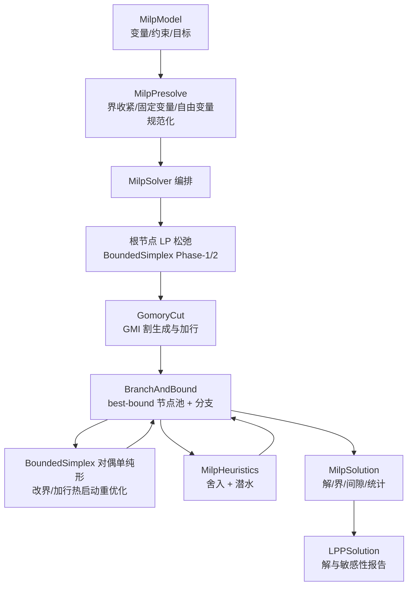

## 用户需求

在 `Algebra\MILP` 目录下，依据 `readme.txt` 所述思路（MILP = 线性代数支撑的 LP 松弛 + 分支定界/割平面/启发式等组合优化机制），复用当前项目中已有的线性规划求解基础设施，实现一个较为完善的混合整数线性规划（MILP）求解器；完成后在 test 工程中提供可运行的演示与自检，展示开发结果。

## 产品概述

一个内置的 MILP 求解内核。输入包含连续变量、一般整数变量、二进制（0/1）变量的线性目标函数与线性约束（支持 ≤、≥、= 以及变量上下界、最小化/最大化）。输出问题空间的最优解与目标值、最优界与相对间隙，以及求解过程统计（节点数、LP 求解次数、割平面数、启发式可行解次数、耗时、搜索日志）。控制台演示以统一格式打印模型定义、求解结果、约束满足情况与性能统计。

## 核心功能

- 完整求解流水线：预处理（presolve）→ 根节点 LP 松弛 → Gomory 割平面收紧 → 分支定界（节点 LP 热启动重优化）→ 整数舍入/潜水（diving）启发式
- 变量语义：连续 / 一般整数 / 二进制，支持任意上下界、自由变量的规范化处理与模型合法性校验
- 目标与约束：最小化与最大化；约束支持 ≤、≥、=，系数可用稀疏字典描述
- 求解状态：最优、不可行、无界、达到时间上限 / 节点上限 / 间隙上限、数值异常，并给出可读的判定说明与证书依据
- 结果报告：解向量、原始方向目标值、最优界、相对间隙、节点数、LP 次数、割平面数、启发式命中次数、耗时与逐阶段日志
- 演示与自检：0/1 背包、一般整数背包、选址/指派、连续与整数混合、不可行与无界等示例；用已知最优值与暴力枚举对拍，验证最优性、整数可行性与状态判定

## 技术栈

- 语言/框架：VB.NET，目标框架 net10.0，复用现有 `Math.NET5.vbproj`（`Microsoft.VisualBasic.Math.Core`），无第三方依赖（仅 BCL 与工程内既有代码）
- 复用现有 LP 设施（已验证存在，直接调用，不重写）：
- `Microsoft.VisualBasic.Math.LinearAlgebra.LinearProgramming`：`LppVariable`（含 `LowerBound`/`UpperBound`）、`LPPSolution`、`OptimizationType`、`LpSparseMatrix`
- `Microsoft.VisualBasic.Math.LinearAlgebra.LinearProgramming.IPMCrossover`：`LppProblem`、`LppConstraint`、`StandardForm`、`LppSolver`、`SimplexSolver`（含 `Public LoopPhase2`）、`InteriorPointSolver`、`CrossoverSolver`、`LinAlg`/`LuFactorization`、`ILpMatrix`
- 新增命名空间：`LinearAlgebra.LinearProgramming.MILP`（完整名 `Microsoft.VisualBasic.Math.LinearAlgebra.LinearProgramming.MILP`）

## 实现方式

**总体策略**：MILP 分为“连续层（LP 松弛）+ 组合层（分支、割平面、启发式）”。LP 松弛引擎采用新增的**有界变量修订单纯形** `BoundedSimplex`，工作形式为 `min cᵀx, Ax=b, l ≤ x ≤ u`（界原生表达，不做平移）。它提供：Phase-1 人造基 → Phase-2 原始单纯形 → **对偶单纯形重优化 + 翻界（bound flip）**。由此，分支（只改 l/u）与加割（只加行、新松弛列入基）都是廉价热启动，满足“中等规模 + 节点热启动”的定位。线性代数全部复用 `LinAlg`；定价/比率检验/Bland 防循环等约定与既有 `SimplexSolver` 保持一致，避免引入新范式。

**关键技术与决策**：

1. **模型复用**：`MilpVariable : Inherits LppVariable` 扩展整数类型字段，约束直接复用 `IPMCrossover.LppConstraint`，最大化/最小化复用 `OptimizationType` 语义，最终报告复用 `LPPSolution` 承载解与敏感性信息。
2. **界原生节点 LP（不使用下界平移）**：分支 `v_j ≤ k` / `v_j ≥ k` 仅修改节点内 `u_j` / `l_j`，A、b、c 保持不变，基结构可直接复用；对偶单纯形在改界后重新达到最优。这规避了 `StandardForm` 下界平移与分支改界之间的映射风险（本实现最大正确性风险点）。
3. **变量规范化**：预处理器统一使每个变量具有有限下界（必要时符号翻转；自由变量拆分为两个非负分量），整数变量的无限界通过约束界传播收紧，无法收紧时给出明确诊断。
4. **割平面（GMI）**：由最优基 tableau 行导出——`rho = B⁻ᵀe_i` 由 `LinAlg.LuSolveT(fac, e_i)` 得到，行系数为 `rhoᵀA`、行右端为 `rhoᵀb`；按分数部分生成 Gomory 混合整数割，变换回原始变量空间后作为新行追加（新松弛变量作为基变量，此时解原始不可行但对偶可行），再以对偶单纯形重优化。
5. **启发式**：舍入（rounding）+ 潜水（diving，逐变量定界并热启动重解），用于尽早获得 incumbent、显著削减搜索树。
6. **分支定界**：best-bound 节点优先队列，most-fractional 分支变量选择（伪成本可选），维护全局下界/上界与相对间隙，支持时间/节点/间隙三重终止条件；根节点可选用既有 `InteriorPointSolver`/`LppSolver` 做松弛值交叉校验（不作为基来源）。
7. **性能与复杂度**：每次对偶单纯形主元的矩阵-向量代价为 O(nnz)，基改变后按既有约定做一次 O(m³) 的 LU 重构；热点在于节点 LU 重构次数。缓解手段：翻界对偶单纯形减少主元、割平面仅在有增益时加入并限制轮数与密度、启发式尽早剪枝、best-bound 减少无效节点。以节点/时间上限兜底，避免病态实例无界增长。

**代码设计**：单一职责分层（模型/预处理/单纯形/割/启发式/搜索/编排），复用优先、DRY；不修改既有 LP 文件，功能以新增模块扩展，保持向后兼容与低爆炸半径。

## 实施注意事项

- **严格复用既有公开成员**：`LinAlg.LuFactor/LuSolve/LuSolveT/EchelonRank/Dot/Norm2`、`SimplexSolver.LoopPhase2(keepRows, basis, maxIter)` 等；实现前先核对签名，禁止臆造 API 或路径。
- **不修改既有 LP 实现**：`InteriorPoint.vb`、`Simplex.vb`、`Crossover.vb`、`LppSolver.vb`、`LinAlg.vb`、`LppProblem.vb` 均不改动，MILP 层只做增量扩展。
- **数值容差**：沿用既有约定（IPM 1e-8、单纯形 1e-9、slack 相对 1e-9）；整数判定容差约 1e-6 且与可行性容差一致；割平面需做有效性/数值尺度校验。
- **正确性不变量**：仅对整数/二进制变量强制整数性；输出解必须满足全部原始约束、变量界与整数性；不可行/无界须有明确判定路径（Phase-1 人造目标、无阻挡下降射线）。
- **日志**：沿用现有 `List(Of String)` 日志 + `VBDebugger.EchoLine`/`Console.WriteLine` 风格，verbose 可关闭；不打印敏感信息，控制高频日志量。
- **编译与接入**：`Algebra/MILP/**` 会被 `Math.NET5.vbproj` 自动 glob 编译；`test/test.vbproj` 将 `StartupObject` 指向新的 `test.ProgramMilp`，保持 `ProgramLpp` 仍可编译（可在 `ProgramMilp.Main` 中保留按参数分发 LP 演示的向后兼容路径）。

## 架构设计



## 目录结构

```
Math/
├── Algebra/
│   └── MILP/
│       ├── readme.txt            # [EXISTING] 需求与算法背景说明，保持不变
│       ├── MilpModel.vb          # [NEW] MILP 数据模型。定义 MilpVarType(Continuous/Integer/Binary)、MilpVariable(继承 LppVariable，增加类型字段)、复用 LppConstraint 的约束集合、MilpModel(目标方向、变量、约束、校验)；提供 ToLppProblem/构建稠密 A,b,c,l,u 的转换与变量名索引映射。
│       ├── MilpOptions.vb        # [NEW] 求解选项。时间上限、节点上限、相对间隙容差、割平面轮数/新增上限、分支与节点选择规则、presolve/启发式开关、verbose 日志级别、整数与可行性容差。
│       ├── MilpSolution.vb       # [NEW] 结果类型。MilpStatus 枚举(Optimal/Infeasible/Unbounded/TimeLimit/NodeLimit/GapLimit/Error)与 MilpSolution(解向量、原始方向目标值、最优界、相对间隙、节点数、LP 次数、割数、启发式命中、耗时、日志、失败消息、可选内嵌 LPPSolution)；实现 ToString 统一报告格式。
│       ├── MilpPresolve.vb       # [NEW] 预处理。二进制界规范、约束界传播收紧、固定变量消元与目标常数补偿、空行/单变量行/冗余行处理、自由变量拆分与符号归一、不可行/无界快速检测，输出统计与化简后模型。
│       ├── BoundedSimplex.vb     # [NEW] 有界变量修订单纯形（节点 LP 引擎）。工作形式 min cᵀx, Ax=b, l≤x≤u；Phase-1 人造基、Phase-2 原始单纯形、对偶单纯形重优化与翻界；维护基(Basis)、非基变量的界状态、解/对偶/reduced cost 与 tableau 行导出接口；复用 LinAlg 的 LU 分解与既有定价/比率/Bland 约定。是分支改界与加割热启动的核心。
│       ├── GomoryCut.vb          # [NEW] Gomory 混合整数(GMI)割平面。基于最优基的 tableau 行(经 LuSolveT 得到 B⁻ᵀe_i)生成割，区分非基处于下界/上界两种形态，变换回原始变量空间并以新行+新松弛列追加；含有效性校验、系数尺度过滤、密度限制与轮次管理。
│       ├── MilpHeuristics.vb     # [NEW] 原启发式。整数舍入 + 潜水(diving)：逐步固定分数变量并热启动重解，快速获得可行 incumbent；含可行性修复与目标改进尝试，返回可行解或 Nothing。
│       ├── BranchAndBound.vb     # [NEW] 分支定界搜索。节点结构(变量界修改栈)、best-bound 优先队列、most-fractional/伪成本分支变量选择、节点 LP 热启动、割平面轮次调度、incumbent 与上下界/间隙维护、剪枝、时间/节点/间隙终止、搜索统计与日志。
│       ├── MilpSolver.vb         # [NEW] 顶层入口。编排 presolve → 根 LP 松弛 → 根割平面 → 分支定界(含启发式) → 结果映射与统计汇总；对外暴露 Solve(model, options) As MilpSolution。
│       └── README.md             # [NEW] 文档：readme.txt 概念 → 代码映射表、算法流程、调用示例、容差与已知边界（仿 IPMCrossover/README.md 风格）。
└── test/
    ├── test.vbproj               # [MODIFY] 将 StartupObject 由 test.ProgramLpp 改为 test.ProgramMilp；其余保持不变
    └── milp/
        ├── ProgramMilp.vb        # [NEW] 演示入口。Main(args) 支持 demo/selftest 分发；RunDemos 展示 0/1 背包(max)、一般整数背包、设施选址/指派(二进制)、连续+整数混合、不可行与无界边界等，按统一格式打印模型、解、约束满足情况与统计报告。
        └── MilpSelfTest.vb       # [NEW] 自检模块。仿 test/lpp/SelfTest.vb 的 Check 模式与失败计数返回；覆盖小规模实例与暴力枚举/已知最优对拍、三类变量混合、上下界、≤/≥/= 约束、不可行与无界状态、整数可行性与约束满足、gap/界报告一致性、presolve 不改变最优值、以及割平面/启发式/热启动的生效性指标。
```

## 关键代码结构（拟定义，接口级）

```
Namespace LinearAlgebra.LinearProgramming.MILP

    Public Enum MilpVarType
        Continuous
        Integer
        Binary
    End Enum

    ' 复用 LPPSolution / LppVariable / LppConstraint / OptimizationType
    Public Class MilpVariable : Inherits LppVariable
        Public Property VarType As MilpVarType = MilpVarType.Continuous
    End Class

    Public Class MilpModel
        Public Property ObjectiveSense As String = "min"          ' "min" / "max"
        Public ReadOnly Property Variables As List(Of MilpVariable)
        Public ReadOnly Property Constraints As List(Of LppConstraint)   ' 复用 IPMCrossover.LppConstraint
    End Class

    Public Enum MilpStatus
        Optimal
        Infeasible
        Unbounded
        TimeLimit
        NodeLimit
        GapLimit
        [Error]
    End Enum

    Public Module MilpSolver
        ' 顶层入口：presolve → 根松弛 → 割平面 → 分支定界 → 结果映射
        Public Function Solve(model As MilpModel, Optional options As MilpOptions = Nothing) As MilpSolution
        End Function
    End Module

End Namespace
```

## Agent Extensions

### SubAgent

- **code-explorer**
- Purpose: 在实现前定位并确认所有可复用的公开 API（`LinAlg`、`SimplexSolver`、`StandardForm`、`ILpMatrix`、`LPPSolution` 等）的精确签名与调用约定，避免臆造接口
- Expected outcome: 产出一份“既有 API 清单 + 调用点”，作为 MILP 模块实现的可靠依据

### Skill

- **lsp-code-analysis**
- Purpose: 对有界变量单纯形与热启动实现所依赖的既有符号做语义级核对（定义、引用、类型、调用关系），确保复用准确、无命名冲突
- Expected outcome: 确认 `LinAlg`/`SimplexSolver`/`StandardForm` 关键成员的精确类型与可见性，降低实现返工