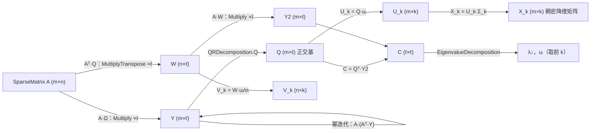

## 产品概述

在数学库的矩阵分解模块（Algebra\Matrix.NET\Decomposition）中新增 TruncatedSVD（截断奇异值分解）功能，面向高维稀疏矩阵的降维场景，整合并复用库内已有的数学函数。

## 核心功能

- 对输入的 m×n 高维稀疏矩阵执行截断 SVD：只计算并保留前 k 个最大奇异值及其对应的左、右奇异向量，不计算完整分解
- 输出降维结果：将稀疏矩阵投影为 m×k 的稠密（非稀疏）矩阵
- 同时提供标准分解产物：前 k 个奇异值（降序）、左奇异向量 U（m×k）、右奇异向量 V（n×k）、Components（k×n）
- 提供一步式便捷入口：输入稀疏矩阵与目标维度 k，直接返回降维后的稠密矩阵
- 支持可调的过采样（oversampling）与幂迭代（powerIterations）次数，在精度与计算量之间权衡
- 全流程保持稀疏存储与稀疏运算，不将原高维矩阵稠密化
- 复用库内现有组件：稀疏矩阵乘法、QR 分解、特征值分解、高斯随机数生成

## Tech Stack

- 语言/平台：VB.NET（Math.NET5.vbproj，SDK 风格，net10.0；新 .vb 文件自动参与编译，无需修改工程文件）
- 命名空间：`LinearAlgebra.Matrix`（与同目录 CholeskyDecomposition、QRDecomposition、LargeScaleEigenSolver 等保持一致）
- 复用组件（均已确认 API）：
- `SparseMatrix.Multiply(x As Double()) As Double()`（已实现，O(nnz) 计算 A·x）
- `QRDecomposition.New(Arg As GeneralMatrix)` + `ReadOnly Property Q As GeneralMatrix`（Householder QR，economy 尺寸）
- `EigenvalueDecomposition`（对称矩阵走 tred2/tql2，属性 V / RealEigenvalues）
- `Microsoft.VisualBasic.Math.RandomExtensions.NextGaussian`（LargeScaleEigenSolver.vb 中已有 `Imports _rand = ...` 引用先例）
- `NumericMatrix(m, n)` + `ArrayPack()`、`RectangularArray.Matrix(Of Double)(m, n)`

## Implementation Approach

采用**随机化 SVD（Halko et al. 2009）**，即 sklearn `TruncatedSVD(solver="randomized")` 的默认算法。方案选择理由：

- 现有 `SingularValueDecomposition` 为 LINPACK 稠密算法，需将稀疏矩阵完全稠密化（O(mn) 内存），高维场景不可行
- 现有 `LargeScaleEigenSolver` 仅支持对称矩阵（Lanczos），TruncatedSVD 输入为任意稀疏矩阵
- 随机化 SVD 只需"矩阵-向量乘"黑盒接口（A·x 与 Aᵀ·y），两者均 O(nnz)，与"整合现有稀疏函数"的要求精确匹配

算法流程（m×n 稀疏矩阵 A，目标秩 k，采样维度 ℓ = min(k + oversampling, min(m,n))）：

1. 生成 n×ℓ 高斯随机测试矩阵 Ω（`NextGaussian`）
2. 范围子空间采样：Y = A·Ω（ℓ 次 `SparseMatrix.Multiply`）→ m×ℓ
3. 幂迭代 q 次（默认 1）：Y ← A·(Aᵀ·Y)（逐列 `MultiplyTranspose` + `Multiply`），改善谱衰减慢时的子空间精度
4. Q = `QRDecomposition(Y).Q`（m×ℓ 正交基）
5. W = Aᵀ·Q（n×ℓ）、Y2 = A·W（m×ℓ）；C = Qᵀ·Y2 ≈ B·Bᵀ（ℓ×ℓ 对称半正定，B = Qᵀ·A）——只构造 ℓ×ℓ 小矩阵，避免 n×n 稠密化
6. `EigenvalueDecomposition(C)`：特征值降序取前 k 个 λᵢ，σᵢ = √max(λᵢ, 0)，对应 ℓ 维特征向量 uᵢ
7. U_k = Q·[u₁..u_k]（m×k）
8. V_k = W·[u₁..u_k]，第 i 列除以 σᵢ（n×k，用已算出的 W 做小矩阵稠密乘，O(n·ℓ·k)，省去 k 次额外稀疏 matvec）
9. 降维输出 X_k = U_k·Σ_k（m×k 稠密，X_k[i][j] = U_k[i][j]·σ_j）

### Performance & Reliability

- 时间复杂度 O(nnz·ℓ·(2q+3) + (m+n)·ℓ² + ℓ³)；空间 O(nnz + (m+n)·ℓ)；全程无 m×n 稠密化
- 瓶颈为稀疏 matvec（(2q+3)·ℓ 次、每次 O(nnz)），已为该算法最优量级；ℓ 默认 k+10 与 sklearn 默认一致
- 随机算法结果有微小波动属正常；幂迭代 q=1 保证对一般谱衰减的稳健性

### Implementation Notes

- `SparseMatrix.vb` 仅**新增** Public 方法 `MultiplyTranspose(y)`（遍历内部 rows 字典：result(j) += A(i,j)·y(i)，O(nnz)），不改动任何现有成员，blast radius 最小
- C 构造后对称化 (C+Cᵀ)/2，确保 `EigenvalueDecomposition` 走对称路径并得实特征值
- `EigenvalueDecomposition` 不保证降序输出：按特征值降序排序后再截断取前 k；σ=√max(λ,0) 防数值负值
- 参数校验：k ∈ [1, min(m,n)]、oversampling ≥ 0、powerIterations ≥ 0；m 或 n 为 0 时直接返回空结果
- 新文件遵循库内既有风格：GPL3 文件头注释块、`#Region` 分区、中文 XML 文档（参照 LargeScaleEigenSolver.vb）
- 循环内复用缓冲数组，避免重复分配；纯数值库无需日志

## Architecture Design

数据流（复用组件加粗）：



## Directory Structure

```
Math/ (g:/pixelArtist/src/framework/Data_science/Mathematica/Math/Math/)
├── Algebra/Matrix.NET/
│   ├── SparseMatrix.vb        # [MODIFY] 新增 Public Function MultiplyTranspose(y As Double()) As Double()
│   │                          # 计算 Aᵀ·y：遍历内部 rows 字典（row→{col→value}），
│   │                          # 对每个非零元 A(i,j)=a 执行 result(j) += a*y(i)，O(nnz)；
│   │                          # 带长度校验（y.Length 必须等于 RowDimension），风格与现有 Multiply 一致；
│   │                          # 不改动任何现有成员
│   └── Decomposition/
│       └── TruncatedSVD.vb    # [NEW] 随机化截断 SVD（Halko 2009）
│                              # GPL3 文件头 + #Region 分区 + 中文 XML 文档（参照 LargeScaleEigenSolver.vb）
│                              # 构造函数执行完整流程：高斯采样→A·Ω→幂迭代→QR→ℓ×ℓ 特征分解→U/V/σ 恢复
│                              # 属性：U(m×k)、SingularValues(k 个降序)、V(n×k)、Components(k×n)、ReducedMatrix(m×k)
│                              # Shared 便捷方法 Reduce(A, k, ...) 直接返回 m×k 稠密降维矩阵
│                              # 参数校验与空矩阵边界处理；内部复用缓冲数组避免重复分配
```

（test/ 目录被 vbproj 的 `Compile Remove="test\**"` 排除，数值自测以临时验证代码 + `dotnet build` 方式进行，不新增测试工程文件）

## Key Code Structures

```
Namespace LinearAlgebra.Matrix

    ''' <summary>
    ''' 随机化截断奇异值分解（Truncated SVD, Halko et al. 2009）：
    ''' 对高维稀疏矩阵只保留前 k 个最大奇异值分量，输出 m×k 稠密降维矩阵。
    ''' </summary>
    Public Class TruncatedSVD

        ''' <param name="A">m×n 稀疏矩阵（可为任意非对称矩阵）</param>
        ''' <param name="k">保留的分量数，1 ≤ k ≤ min(m,n)</param>
        ''' <param name="oversampling">过采样维度，默认 10</param>
        ''' <param name="powerIterations">幂迭代次数，默认 1（0 表示不迭代）</param>
        Public Sub New(A As SparseMatrix, k As Integer,
                       Optional oversampling As Integer = 10,
                       Optional powerIterations As Integer = 1)

        Public ReadOnly Property U As Double()()             ' m×k 左奇异向量
        Public ReadOnly Property SingularValues As Double()  ' 前 k 个奇异值（降序）
        Public ReadOnly Property V As Double()()             ' n×k 右奇异向量
        Public ReadOnly Property Components As Double()()    ' k×n（V 的转置）
        Public ReadOnly Property ReducedMatrix As Double()() ' m×k = U·Σ（降维结果，稠密）

        Public Shared Function Reduce(A As SparseMatrix, k As Integer,
                                       Optional oversampling As Integer = 10,
                                       Optional powerIterations As Integer = 1) As Double()()
    End Class
End Namespace
```