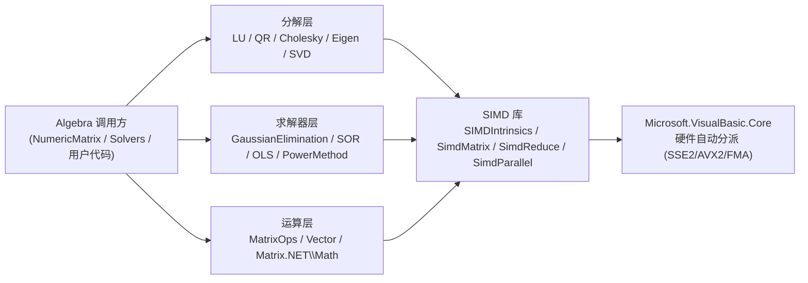

## 产品概述

对 sciBASIC# 数学函数库中的 Algebra 线性代数模块（矩阵/向量/分解/求解器核心数值代码）进行两项改造：其一，审查全部数学计算函数的实现准确度并修正数值缺陷；其二，将手写标量循环替换为底层核心库 Microsoft.VisualBasic.Core 的 SIMD 向量化 API，实现计算加速。

## 已确认的范围与决策

- 范围：仅核心数值代码（Matrix.NET、Vector、Solvers、分解算法）；LP、MILP、Polynomial 子模块本次不动。
- 历史缺陷：彻底修正语义，并全仓库排查、修正所有受影响的调用点（接受破坏性变更）。
- 重复实现：根 SVD.vb 重写为对 JAMA 版 SingularValueDecomposition 的薄封装，消除两套 SVD 行为不一致。

## 核心功能

- 准确度修正：
- 修复 PowerMethod 点积跳步累加错误与死循环风险（迭代上限、有效收敛阈值）
- GaussianElimination 增加部分主元选取与零主元检查；SOR 增加对角零元素守卫；OLS 奇异性处理
- MatrixOps.Inverse 移除固定 eps 主元替换的静默降级；Determinant 改用尺度相对的奇异判定；JacobiEigen 增加不收敛失败信号
- JAMA 版 SVD 增加迭代上限与 Condition 零分母守卫；EigenvalueDecomposition 的 tql2/hqr2 增加迭代上限、cdiv 增加除零守卫
- 修正 NumericMatrix `Operator *(matrix, vector)` 与 RowSubtraction 的历史缺陷语义，并同步更新全仓库调用点
- 根 SVD.vb 统一为 JAMA 版薄封装（奇异值降序等行为一致）
- 性能优化：将 QR/SVD/特征值/Cholesky 分解内环、MatrixOps 矩形数组运算、OLS/SOR 累加、向量范数与逐元素运算等手写循环替换为 DotFma/AxpyInPlace/SimdMatrix/SimdReduce 等 SIMD 调用，保持结果数值等价
- 验证：补充正确性对照测试（修正前后基准、SIMD 与标量一致性、分解重构误差），确认无回归

## 技术栈

- 语言/平台：VB.NET（net10.0），项目 Math.NET5.vbproj（程序集 Microsoft.VisualBasic.Math.Core）
- 加速依赖：Microsoft.VisualBasic.Core（Math.NET5.vbproj 已有 ProjectReference，无需新增引用）
- 测试：复用 test 目录既有可执行测试先例（VectorMatrixSimdTest.vb、SimdBenchmark.vb 模式）

## 实现方案

1. **准确度优先，性能其次**：先修正算法语义（缺陷修复会改变数值结果，须在 SIMD 替换前完成，避免两种改动耦合导致回归难定位），再统一做 SIMD 替换。
2. **SIMD 替换原则（沿用项目既有惯例）**：

- 行连续的点积/AXPY 内环 → `SIMDIntrinsics.DotFma` / `AxpyInPlace`（与 LUDecomposition/CholeskyDecomposition 现有用法一致）
- 矩阵×矩阵 / 矩阵×向量 → `SimdMatrix.Dot` / `SimdMatrix.MatrixVector`（大矩阵自动走 `SimdParallel.MatrixDot`）
- 归约（求和/范数/平方和）→ `SimdReduce` / `SimdParallel`
- 逐元素与标量运算 → `SimdEngine`（注意：逐元素内核不校验长度，调用方保证；Givens 旋转等按列访问的内环先抽取列数组再 SIMD，或评估后保留标量）
- 对 n 极小的内环（n<8）保留标量以避免打包开销

3. **行为兼容控制**：历史缺陷修正属破坏性变更，用全仓库调用点排查界定影响面；JAMA SVD 补迭代上限时上限取保守值（如 100 次，超限抛异常而非静默），Condition 零分母返回 `Double.PositiveInfinity` 并文档化。
4. **性能与可靠性**：分解内环均为 O(n²)~O(n³) 热点，SIMD 化预期主要收益；避免为 SIMD 引入额外数组分配（优先 InPlace 变体）；所有修正点补注释说明数值依据。

## 架构

## 实施要点

- 修改集中于 Algebra 下既有文件，不新增架构层次；根 SVD.vb 由独立实现变为封装层
- 调用点排查覆盖整个 g:\GCModeller\src\runtime\sciBASIC# 仓库（Operator *(matrix, vector) 与 RowSubtraction）
- 编译验证：dotnet build Math.NET5.vbproj；测试：test 目录独立运行

## Agent Extensions

### SubAgent

- **code-explorer**
- Purpose：全仓库排查 `Operator *(matrix, vector)`（NumericMatrix 逐元素乘运算符）与 `RowSubtraction` 的所有调用点，评估修正历史缺陷后的影响面
- Expected outcome：获得完整调用点清单（文件+行号），指导受影响代码的同步修正，避免破坏下游功能