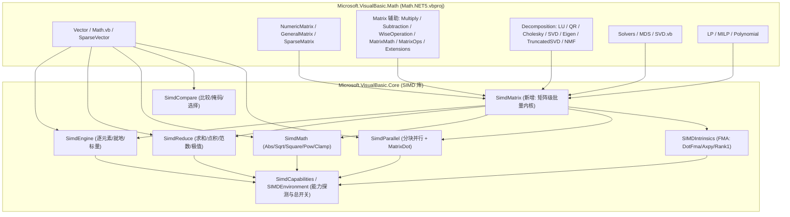

## 需求概述

将 `Algebra` 目录中向量（`LinearAlgebra.Vector`）与矩阵（`NumericMatrix` / `GeneralMatrix`，含 Decomposition、SVD、Solvers、MDS、LP/MILP、Polynomial）的数值运算，从当前的手写标量循环与 LINQ 逐元素实现，重构为调用 `Microsoft.VisualBasic.Core/src/Math/SIMD/` 中已有的 SIMD 计算内核；对现有内核未覆盖的场景，在 Core 中按需新增最小必要内核。

## 核心功能

- **向量运算 SIMD 化**：加减乘除、数乘/数加、一元取负、幂运算、点积（FMA）、平方和/模/单位化、逐元素 Abs/Sqrt/Clamp、比较与掩码、就地累加。
- **矩阵运算 SIMD 化**：逐元素加减乘除、数乘/数加、矩阵加/减与其就地版本、矩阵乘法（转置 + 行并行 + FMA 点积）、转置、范数（1/∞/F）、迹、行/列归约（sum/mean/max/min）、按行广播乘除、行列索引抽取。
- **分解与求解器热点**：LU/QR/Cholesky/SVD/特征值/截断 SVD/NMF 的秩一更新、列内积、列范数、AXPY 与缩放操作；Solvers 与 MDS 的迭代步长更新。
- **稀疏与 LP/MILP**：仅对其中稠密行向量/表更新的点积、AXPY、缩放做向量化，分支与枢轴逻辑保持原样。
- **行为兼容与回退**：公共 API 签名、异常类型与消息、`Length=1` 广播、`ArrayRightDivide` 的“分子为 0 则结果为 0”语义、`<Out> ByRef` 参数全部保持；`SIMDEnvironment.config = disable` 时整体退回标量路径。
- **数值一致性**：允许 FMA 与分块并行归约带来的 ULP 级差异（性能优先）。
- **验证手段**：新增运算正确性等价断言与性能基准（加速比、耗时、处理器能力描述输出）。

## 视觉/交互

无界面变更，纯计算内核重构，对外表现为结果不变、耗时下降。

## 技术栈

- 语言/运行时：VB.NET，`net10.0`（`Math.NET5.vbproj` 为唯一目标框架）
- 加速来源（不引入任何新第三方依赖）：`Microsoft.VisualBasic.Core` 的 `Microsoft.VisualBasic.Math.SIMD` 命名空间
- `System.Numerics.Vector(Of T)`（跨平台自动映射 SSE2/AVX/AVX2 或 ARM64 AdvSIMD）
- `System.Runtime.Intrinsics.X86`（FMA 融合乘加，运行期能力探测）
- `System.Threading.Tasks.Parallel`（大数组分块并行）
- 现有测试工程：`test/test.vbproj`（`net10.0`、控制台断言风格）
- 命名空间可达性：`Math.NET5.vbproj` 的 `RootNamespace` 为 `Microsoft.VisualBasic.Math`，故工程内可直接用 `SIMD.SimdEngine.Add(...)` / `SIMD.SimdReduce.Dot(...)` 前缀（与现有 `Vector.vb`、`SteepestDescentFit.vb` 用法一致）；也可显式 `Imports Microsoft.VisualBasic.Math.SIMD`

## 实现方式

### 总体策略

采用「新增矩阵级内核层 → 自底向上替换调用点 → 分层验证」的改造路径。Core 侧只补充确实缺失的内核（矩阵级批量操作、按行 AXPY/秩一更新、批量转置、行/列归约），业务侧只把循环体替换为内核调用，不动算法结构与并行策略决策。

关键决策与理由：

1. **统一走 `SIMDEnvironment.IsEnabled` 分派，而不是在调用点手写 `Vector(Of T)` 循环**：否则 `SIMDConfiguration.disable` 逃生开关失效，也会绕开现有内核的尾块重叠、未初始化分配等优化。
2. **矩阵按行（row-major 连续内存）向量化，而不是列**：`NumericMatrix` 内部为 `Double()()`，行是连续数组，可直接传给 `SimdEngine`/`SimdReduce`；列操作需先抽取成连续数组，故新增 `SimdMatrix.ExtractColumn`（分批拷贝）而非在热路径上做跨行 strided 访问。
3. **矩阵乘法改用 `SimdParallel.MatrixDot`**：它已实现「预转置右矩阵 + 行方向并行 + 行内 `SIMDIntrinsics.DotFma`」，比现有 `MatrixDotProduct`（逐列标量拷贝 + 无 FMA 的 `SimdReduce.Dot`）更优；保留 `MatrixDotProduct.Resolve` 作为兼容入口但内部委托。
4. **新增 `SimdMatrix` 作为矩阵级唯一门面**，避免在 `NumericMatrix` 中散落 `For Each row` + 手选内核的重复代码（DRY），也让 Decomposition/LP 等模块共享同一批内核（可复用性）。
5. **保留特殊语义与稳定性算法**：`DivideZeroSafe`、`Hypot` 缩放式 `NormF`、`ArrayRightDivideEquals` 的“直接除”差异不改语义；仅将实现替换为等价内核或保持标量并注明原因。
6. **FMA/并行归约导致的结果差异**：仅体现在浮点末位，属于预期取舍。

### 性能与可靠性

- 逐元素内核复杂度 O(n)，吞吐受内存带宽约束；4 路累加器 + 向量宽度（f64 通常 4 通道）使归约取得近似 4x 单通道提升；`SimdParallel` 仅在 `len >= 131072` 时启用，避免小数组调度开销反向劣化。
- 矩阵乘法由 O(m·n·p) 的「逐列拷贝 + 标量内积」变为「转置 + 行并行 FMA 点积」，避免每次内积前重复拷贝列；转置为一次性额外 O(n·p) 内存流量。
- 关键规避：`SimdEngine` 逐元素内核**不校验长度**，矩阵逐行调用前必须保证行长一致（`NumericMatrix` 构造函数已校验）；`SimdReduce` 的 Min/Max/Mean 对空输入抛异常，矩阵空行需在调用前短路。
- `SimdEngine.NewArray(Of T)` 为 `Friend`，Math 侧不可用；如需未初始化分配，需在 Core 侧新增公开入口（本次按需新增）。

## 实现注意事项

- **公共 API 冻结**：所有 `Public`/`Shared Operator`/`Implements` 成员签名、`Optional` 默认值、`<Out> ByRef`、异常类型与消息文本保持不变；只替换方法体。
- **禁止引入行为回归**：`Vector./`、`NumericMatrix.ArrayRightDivide` 必须继续使用 `SimdEngine.DivideZeroSafe`；`Vector` 的 `Length = 1` 广播分支必须保留（标量走 `AddScalar`/`MultiplyScalar` 路径）。
- **既有可疑实现需先确认再改**：`Matrix/Subtraction.vb` 的 `RowSubtraction` 内层 `For j = 0 To buffer.Length - 1` 反复写 `x(i)`；`NumericMatrix.Operator *(m As NumericMatrix, v As Vector)` 结果未写回 `y`。改造前先写断言固定当前可观察行为，再决定修正或保持。
- **日志**：仅在基准/诊断输出中打印 `SimdCapabilities.Description` 与 `SIMDEnvironment.IsEnabled`，不新增热路径日志，不输出矩阵原始数据。
- **爆炸半径控制**：按 Vector → NumericMatrix → 辅助模块 → 分解/求解 → LP/MILP 顺序提交，每层完成后立即编译并跑该层测试，避免一次性大范围改动。
- **编译矩阵**：至少保证 `Debug|AnyCPU` 与 `Release|AnyCPU` 通过（`Math.NET5.vbproj` 配置组合众多，改动不得依赖特定 Configuration）。

## 架构设计



### 模块职责

- **`SimdMatrix`（新增，Core）**：矩阵级唯一门面。按行适配 `Double()()` 与逐元素内核；提供矩阵加减/逐元素乘除、数乘/数加、转置、行/列归约、列抽取、秩一更新、AXPY 就地版；统一处理空矩阵、行长不一致、`SIMDEnvironment.disable` 回退。
- **`SimdMath`（扩展，Core）**：补 `Floor`/`Ceiling`/`Truncate`/`Round`/`Sign` 等可硬件映射的一元内核（若 `Vector(Of T)` 无对应原语则保持标量并注明）；`Log(x, base)` 用 `SimdMath.Log` + `DivideScalar(ln(base))` 组合。
- **`SIMDIntrinsics`（扩展，Core）**：补按行就地 AXPY（`out += alpha * x`）、秩一更新（`A -= x ⊗ y`）、`ScaleInPlace` 的 FMA 变体。
- **`SimdReduce`（扩展，Core）**：补 `SumSquares` 的 FMA 路径衔接、区间 `ArgMax/ArgMin`、列范数/行范数组合入口。
- **Math 侧各模块**：只替换循环体为 `SIMD.*` 调用，保持算法、并行判定与 API 不变。

### 数据流

用户调用 `Vector`/`NumericMatrix` 运算 → Math 侧方法体改为调用 `SIMD.SimdMatrix` / `SIMD.SimdEngine` / `SIMD.SimdReduce` → 内核读取 `SIMDEnvironment.IsEnabled` 与 `SimdCapabilities` → 走 `Vector(Of T)` 向量化路径或标量回退 → 返回与原实现结构一致的结果对象（`Vector` / `NumericMatrix` / `GeneralMatrix`）。

## 目录结构

```
Math/                                                    # 工作区根（Math.NET5.vbproj）
├── Algebra/
│   ├── Vector/
│   │   ├── Class/
│   │   │   ├── Vector.vb            # [MODIFY] 运算符/点积/模/单位化/比较/CopyTo 改走 SIMD；
│   │   │   │                        #   Or 内积与 dot() 改 SimdParallel.Dot / SIMDIntrinsics.DotFma；
│   │   │   │                        #   [Mod] 改 SimdParallel.SumSquares；Unit 改 MultiplyScalar；
│   │   │   │                        #   比较运算符改 SimdCompare；CopyTo/CopyFrom 改 Array.ConstrainedCopy
│   │   │   ├── Math.vb              # [MODIFY] Sqrt/Abs/Max/Min/Trunc/floor/round/Sign/Sinh 改 SimdMath/SimdEngine；
│   │   │   │                        #   幂运算改 SimdMath.PowScalar/Pow；Exp/Log 改数组版 SimdMath（保持标量内核）
│   │   │   ├── SparseVector.vb      # [MODIFY] 稠密段运算走 SIMD，稀疏结构逻辑不变
│   │   │   ├── HalfVector.vb        # [MODIFY] 逐元素运算走 SIMD
│   │   │   └── DoCall.vb            # [MODIFY] 仅在必要时复用向量化路径（低优先）
│   │   ├── Extensions.vb            # [MODIFY] Top/rand/RangeTransform 走 SIMD 归约与逐元素内核
│   │   ├── NumericsVector.vb        # [MODIFY] AsInteger/AsLong/AsSingle 等转换改向量化转换（如可行）
│   │   └── VectorEqualityComparer.vb# [MODIFY] 等值比较走 SimdCompare.Equal
│   ├── Matrix.NET/
│   │   ├── NumericMatrix.vb         # [MODIFY] 主目标：Abs/Copy/Transpose/Norm1/NormInf/NormF/±/Add/Subtract/
│   │   │                            #   ArrayMultiply/ArrayRightDivide(ZeroSafe)/ArrayLeftDivide/Multiply(s)/
│   │   │                            #   MultiplyEquals/Power/Log/Max/Min/Trace/DotMultiply/max(axis)/DotProduct
│   │   │                            #   DotProduct 改 SimdParallel.MatrixDot；保留维度校验与 zero-safe 语义
│   │   ├── GeneralMatrix.vb         # [MODIFY] 接口默认实现中的向量化入口对齐
│   │   ├── SparseMatrix.vb          # [MODIFY] 稠密行运算走 SIMD
│   │   ├── IndexVector.vb           # [MODIFY] 归约/比较走 SIMD
│   │   ├── Math/
│   │   │   ├── Multiply.vb          # [MODIFY] RowMultiply 改 SimdEngine.MultiplyScalar 按行；ColumnMultiply 复用 Vector 运算符
│   │   │   ├── Subtraction.vb       # [MODIFY] RowSubtraction 重写为按行 SIMD 减法（先固定现有语义断言）
│   │   │   └── WiseOperation.vb     # [MODIFY] Sum/ScaleX 改 SimdReduce/SimdEngine
│   │   ├── Extensions/
│   │   │   ├── Extensions.vb        # [MODIFY] CenterNormalize/Covariance/Sum/Mean/Std/ColumnVector 走 SIMD
│   │   │   ├── MatrixOps.vb         # [MODIFY] Double(,) 版 Multiply/Transpose/Add/Subtract/Scale/MultiplyVec/
│   │   │   │                        #   Trace 改行列拷贝 + SimdMatrix（含 Inverse/JacobiEigen 内层 AXPY）
│   │   │   ├── MatrixMath.vb        # [MODIFY] 3257 行，先出热点清单，再批量替换 14 处归约与逐元素循环
│   │   │   └── Serialization.vb     # [MODIFY] 大批量数值读写改块拷贝（低优先）
│   │   ├── Decomposition/
│   │   │   ├── LUDecomposition.vb           # [MODIFY] 列内积/列 AXPY/列范数走 FMA 内核
│   │   │   ├── QRDecomposition.vb           # [MODIFY] 列内积、列正交化（AXPY）走 SIMD
│   │   │   ├── CholeskyDecomposition.vb     # [MODIFY] 对角线/秩一更新走 SIMD
│   │   │   ├── SingularValueDecomposition.vb# [MODIFY] 43 处循环中的内积/缩放/旋转走 SIMD
│   │   │   ├── EigenvalueDecomposition.vb   # [MODIFY] 68 处循环中的内积/缩放/正交化走 SIMD
│   │   │   ├── TruncatedSVD.vb              # [MODIFY] 幂迭代/内积走 SIMD
│   │   │   ├── NMF.vb                       # [MODIFY] 矩阵乘与逐元素除走 SIMD
│   │   │   └── LargeScaleEigenSolver.vb     # [MODIFY] 稀疏/稠密混合步走 SIMD
│   │   ├── MDS/
│   │   │   ├── SMACOF.vb            # [MODIFY] 距离矩阵与应力计算走 SIMD
│   │   │   ├── LandmarkMDS.vb       # [MODIFY] 距离/均值走 SIMD
│   │   │   ├── MDS.vb               # [MODIFY] 矩阵运算走 SIMD
│   │   │   └── Data.vb              # [MODIFY] 数据矩阵归约走 SIMD
│   │   ├── SVD.vb                   # [MODIFY] 10 处归约累加循环走 SimdReduce；与 Decomposition/SVD 的关系先确认再统一
│   │   └── Extensions.vb (Algebra/)# [MODIFY] 逐元素/归约走 SIMD
│   ├── Solvers/
│   │   ├── GaussianElimination.vb   # [MODIFY] 行消元（AXPY）与主元搜索走 SIMD
│   │   ├── OLS.vb                   # [MODIFY] 正规方程点积与残差走 SIMD
│   │   ├── PowerMethod.vb           # [MODIFY] 矩阵向量乘与范数走 SIMD
│   │   ├── SOR.vb                   # [MODIFY] 行点积与残差走 SIMD
│   │   └── ISolver.vb               # [MODIFY] 接口默认实现对齐（如有数值逻辑）
│   ├── Polynomial/
│   │   ├── Polynomial.vb            # [MODIFY] 多项式求值/乘法卷积走 SIMD
│   │   ├── MultivariatePolynomial.vb# [MODIFY] 稠密系数运算走 SIMD
│   │   └── Formula.vb               # [MODIFY] 系数向量运算走 SIMD
│   ├── LP/
│   │   ├── LPPSolver.vb             # [MODIFY] 单纯形表行更新（AXPY/缩放）与行点积走 SIMD
│   │   ├── LPPSolverTwoPhased.vb    # [MODIFY] 同上
│   │   ├── LPP.vb / LPPModel.vb     # [MODIFY] 目标函数与约束系数点积走 SIMD
│   │   ├── LpSparseMatrix.vb        # [MODIFY] 稠密段运算走 SIMD（稀疏结构不变）
│   │   ├── LPPDebugView.vb          # [MODIFY] 仅输出层，低优先
│   │   ├── Extensions.vb            # [MODIFY] 数值工具走 SIMD
│   │   └── IPMCrossover/            # [MODIFY] InteriorPoint/LpMatrix/LinAlg/SparseNormal 的稠密线性代数走 SIMD
│   └── MILP/
│       ├── BoundedSimplex.vb        # [MODIFY] 表行更新与点积走 SIMD（35 处循环）
│       ├── MilpPresolve.vb          # [MODIFY] 系数归约/缩放走 SIMD（27 处循环）
│       ├── GomoryCut.vb             # [MODIFY] 割平面系数点积走 SIMD
│       ├── BranchAndBound.vb        # [MODIFY] 界计算点积走 SIMD
│       ├── MilpHeuristics.vb        # [MODIFY] 目标值计算走 SIMD
│       └── MilpModel.vb / MilpSolution.vb # [MODIFY] 归约与缩放走 SIMD
└── test/
    ├── test.vbproj                  # [MODIFY] 纳入新增测试/基准文件
    ├── Program.vb                   # [MODIFY] 挂载 SIMD 正确性测试与基准入口
    ├── VectorMatrixSimdTest.vb      # [NEW] Vector/NumericMatrix 各运算与旧标量实现的等价断言；
    │                                #   覆盖空数组、长度 1 广播、非整向量宽度尾块、zero-safe 除法、
    │                                #   SIMDEnvironment.disable 回退路径
    └── SimdBenchmark.vb             # [NEW] 逐元素/点积/矩阵乘/转置/范数/分解的标量 vs SIMD 耗时与加速比；
                                     #   输出 SimdCapabilities.Description 与 IsEnabled

# 基础算法库（Core，允许按需扩展）
Microsoft.VisualBasic.Core/src/Math/SIMD/
├── Engine/
│   ├── SimdMatrix.vb                # [NEW] 矩阵级批量内核门面（唯一新增文件）
│   ├── SimdEngine.vb                # [MODIFY] 按需补 single 版 DivideZeroSafe 等对称入口
│   ├── SimdReduce.vb                # [MODIFY] 补区间 ArgMax/ArgMin、SumSquares(FMA 衔接)、行/列归约组合
│   ├── SimdMath.vb                  # [MODIFY] 补 Floor/Ceiling/Truncate/Round/Sign 等可映射一元内核
│   └── SimdCompare.vb               # [MODIFY] 按需补 Equal/NotEqual 的标量广播重载
├── Intrinsics.vb                    # [MODIFY] 补按行就地 AXPY、秩一更新、ScaleInPlace
├── SimdExtensions.vb                # [MODIFY] 新增门面方法（SimdMatrix 相关与新增一元内核）
└── Parallel/SimdParallel.vb         # [MODIFY] 复用 MatrixDot；按需补 MatrixDot 的行分块与空矩阵边界
Microsoft.VisualBasic.Core/src/Math/Parallel/
└── MatrixDotProduct.vb              # [MODIFY] Resolve 内部委托 SimdParallel.MatrixDot，保留旧入口兼容
```

## 关键代码结构

```
' [NEW] Microsoft.VisualBasic.Core/src/Math/SIMD/Engine/SimdMatrix.vb
Namespace Math.SIMD

    ''' <summary>
    ''' 矩阵级（行主序 Double()()）批量内核门面。
    ''' 所有函数按行适配 SimdEngine/SimdReduce/SimdMath，并统一遵循
    ''' SIMDEnvironment.IsEnabled 分派约定；空矩阵返回空结果，
    ''' 维度不一致抛出 ArgumentException（消息与 NumericMatrix.CheckMatrixDimensions 保持一致）。
    ''' </summary>
    Public NotInheritable Class SimdMatrix

        ' ---- 逐元素二元（行列严格一致）----
        Public Shared Function Add(a As Double()(), b As Double()()) As Double()()
        Public Shared Function Subtract(a As Double()(), b As Double()()) As Double()()
        Public Shared Function Multiply(a As Double()(), b As Double()()) As Double()()
        Public Shared Function DivideZeroSafe(a As Double()(), b As Double()()) As Double()()
        Public Shared Function Divide(a As Double()(), b As Double()()) As Double()()

        ' ---- 就地二元（原地更新 a 并返回 a）----
        Public Shared Function AddInPlace(a As Double()(), b As Double()()) As Double()()
        Public Shared Function SubtractInPlace(a As Double()(), b As Double()()) As Double()()
        Public Shared Function MultiplyInPlace(a As Double()(), b As Double()()) As Double()()
        Public Shared Function DivideZeroSafeInPlace(a As Double()(), b As Double()()) As Double()()

        ' ---- 标量广播（逐行 SimdEngine.*Scalar）----
        Public Shared Function AddScalar(a As Double()(), scalar As Double) As Double()()
        Public Shared Function SubtractScalar(a As Double()(), scalar As Double) As Double()()
        Public Shared Function ScalarSubtract(scalar As Double, a As Double()()) As Double()()
        Public Shared Function MultiplyScalar(a As Double()(), scalar As Double) As Double()()
        Public Shared Function DivideScalar(a As Double()(), scalar As Double) As Double()()
        Public Shared Function ScalarDivide(scalar As Double, a As Double()()) As Double()()
        Public Shared Function MultiplyScalarInPlace(a As Double()(), scalar As Double) As Double()()

        ' ---- 一元 ----
        Public Shared Function Negate(a As Double()()) As Double()()
        Public Shared Function Abs(a As Double()()) As Double()()
        Public Shared Function PowScalar(a As Double()(), exponent As Double) As Double()()
        Public Shared Function Pow(a As Double()(), b As Double()()) As Double()()
        Public Shared Function Log(a As Double()(), Optional base As Double = System.Math.E) As Double()()
        Public Shared Function Sqrt(a As Double()()) As Double()()

        ' ---- 结构操作 ----
        Public Shared Function Transpose(a As Double()()) As Double()()          ' 分块转置，降低 cache miss
        Public Shared Function ExtractColumn(a As Double()(), col As Integer) As Double()
        Public Shared Function ExtractRow(a As Double()(), row As Integer) As Double()
        Public Shared Function BroadcastMultiplyColumn(a As Double()(), v As Double()) As Double()()' 行 i *= v(i)
        Public Shared Function BroadcastMultiplyRow(a As Double()(), v As Double()) As Double()()  ' 列 j *= v(j)

        ' ---- 归约 ----
        Public Shared Function RowSums(a As Double()()) As Double()
        Public Shared Function ColumnSums(a As Double()()) As Double()
        Public Shared Function RowMaxes(a As Double()()) As Double()
        Public Shared Function ColumnMaxes(a As Double()()) As Double()
        Public Shared Function Norm1(a As Double()()) As Double()                ' max 列绝对值和
        Public Shared Function NormInf(a As Double()()) As Double()              ' max 行绝对值和
        Public Shared Function NormF(a As Double()()) As Double()                ' 保留 Hypot 缩放语义
        Public Shared Function Trace(a As Double()()) As Double()
        Public Shared Function MaxIndex(a As Double()(), ByRef row As Integer, ByRef col As Integer) As Double
        Public Shared Function MinIndex(a As Double()(), ByRef row As Integer, ByRef col As Integer) As Double

        ' ---- BLAS 级 ----
        Public Shared Function Dot(a As Double()(), b As Double()()) As Double()()   ' 委托 SimdParallel.MatrixDot
        Public Shared Function MatrixVector(a As Double()(), x As Double()) As Double()
        Public Shared Sub AxpyInPlace(alpha As Double, x As Double(), y As Double())          ' y += alpha * x
        Public Shared Sub Rank1Update(a As Double()(), x As Double(), y As Double(), alpha As Double) ' a -= alpha * x ⊗ y
        Public Shared Function ScaleInPlace(a As Double()(), scalar As Double) As Double()()
    End Class
End Namespace
```

## Agent Extensions

### SubAgent

- **code-explorer**
- Purpose: 在 `MatrixMath.vb`（3257 行）、`EigenvalueDecomposition.vb`（68 处循环）、`SingularValueDecomposition.vb`（43 处）、`BoundedSimplex.vb`（35 处）、`MilpPresolve.vb`（27 处）等大文件中批量盘点「标量数值热点」清单（文件、方法、循环行号、可用的 SIMD 内核映射），供分层改造按清单推进。
- Expected outcome: 产出结构化的热点清单（文件路径 + 方法名 + 循环规模 + 建议内核），避免遗漏与重复改造，并作为改造进度核对依据。

### Skill

- **lsp-code-analysis**
- Purpose: 对即将改签名的内部方法（尤其是 Core 侧新增/调整的 `SimdMatrix`、`SimdMath`、`SIMDIntrinsics` 成员）执行引用查找与实现跳转，确认所有调用点均已同步，并对 `Vector` / `NumericMatrix` 的公共成员做「谁在使用」影响分析，确保公共 API 未被破坏。
- Expected outcome: 得到准确的调用点/引用清单与影响范围结论，验证公共 API 保持不变、Core 新增成员的调用点全部覆盖，防止编译断裂与下游回归。