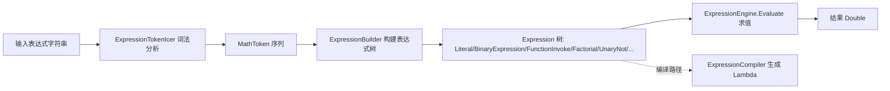

## 用户需求

审查并修复 `Scripting` 文件夹下全部代码文件中潜在的缺陷，核心目标是修正数学表达式解析与求值链路（词法分析 → 表达式树构建 → 求值）中的正确性问题，并顺带修正若干 API 行为缺陷。

## 产品概述

`Scripting` 是一个数学表达式解析与计算库：可将字符串形式的数学表达式（如 `f(x)`）解析为表达式树并求值；同时提供脚本引擎、`func` 用户自定义函数、R 风格向量/基础统计函数等能力。本次任务不改变对外能力，只修复内部缺陷。

## 核心特性（待修复问题）

- 词法分析器正确识别整数除 `\` 运算符，并在带空格时正确切分 `<`、`>` 与 `<>`（不等于）比较运算符，避免污染相邻符号。
- 阶乘 `5!` 正确解析为 `Factorial` 节点，不再因尾部 `!` 触发无限递归/栈溢出。
- `<>` 不等于运算符在 `BinaryExpression` 中正确求值（返回 0/1），与 `LogicalLiteral`/`UnaryNot` 的布尔即双精度约定一致。
- 用户自定义函数 `func add(x, y) x+y` 被正确解析，lambda 体不再误包含参数列表；`ParseExpression` 的 `throwEx` 参数生效。
- 用户自定义函数之间可相互调用（内层求值环境共享外层函数表）。
- 表达式编译器正确支持 `pow`/`log` 多参数函数；缺失符号时显式抛 `EntryPointNotFoundException` 而非用 Levenshtein 静默替换。
- 修正 `processOperators` 的越界边界判断（`>` 应为 `>=`），避免潜在 `IndexOutOfRangeException`。

## 技术栈

- 语言/框架：VB.NET（.NET 5），项目 `Math.NET5`（Math.NET5.vbproj / Math.NET5.sln）。
- 仅使用项目现有依赖（Microsoft.VisualBasic / System.Linq.Expressions 等），不引入新第三方库。
- 复用既有表达式管线与 `Expression`、`Arithmetic`、`ExpressionEngine` 等现有抽象，保持公共 API 签名稳定（用户已新增的 `SetFunction(name, args, expr)` 重载照常共存）。

## 实现策略

整体采用"逐文件定点修复 + 统一编译验证"的策略。表达式求值管线为：`字符串 → ExpressionTokenIcer(词法) → MathToken[] → ExpressionBuilder(构建) → Expression 树 → ExpressionEngine.Evaluate(求值)`。缺陷分布在该管线的词法、构建、求值、编译四个环节，彼此文件独立，可并行修复，最后统一 `dotnet build` 验证。

关键决策与权衡：

- `<>` 比较：因逻辑子系统已用 `Double`(0/1) 表示布尔，故在 `BinaryExpression.Evaluate` 中直接处理 `<>` 返回 0/1，不改动 `Arithmetic`（其 `Operators` 常量只含算术运算符），保持职责单一。
- `\` 整数除：同时加入词法器 `operators` 索引与 `operatorPriority` 的 `*/%` 组（改为 `*/%\`），保证被当作运算符切分与按优先级归约；`Arithmetic.Evaluate` 已存在 `\` 分支，无需改动。
- 阶乘：根因是 `AsExpression` 把含 `!` 的字面量文本整体传给 `Factorial`，而词法器把 `!` 也归入数字字符导致递归。修复点在 `AsExpression` 剥离尾部 `!` 后再构造 `Factorial`/`Literal`，`Factorial` 构造函数再加一层防御性 `TrimEnd("!")`。
- UDF 互调：在 `AddFunction` 构造内层 `env` 后，将外层 `functions` 字典内容拷贝进 `env.functions`（字段为 `ReadOnly` 引用但字典内容可变），从而函数体内对其它 UDF 的调用可解析。
- 表达式编译器：`pow`/`log` 改为按真实参数数量构造 `Expression.Call`（多参直接取 `args(0)`、`args(1)`），不再走只取 `args(0)` 的 `GetDoubleMathFunction`；`MakeSymbolReference` 缺失符号时直接抛 `EntryPointNotFoundException`，移除 Levenshtein 静默替换分支。

## 实现注意

- 向后兼容：所有改动保持公共方法签名不变；`<>` 此前即列于 `operatorPriority`，本次补齐求值使其从"崩溃"变为"可用"，属行为修正而非破坏性变更。
- 风险半径：不改动 `FormulaDependency`（已为较完善的 DFS 拓扑排序+环检测，不在工作区修改集）；仅修改 `Scripting` 目录内文件，不影响 `Algebra`/`Numerics` 等其它模块。
- 性能：所有修复均为 O(1) 或 O(n) 的局部逻辑，不引入新集合或重复遍历；`AddFunction` 拷贝 `functions` 为一次性开销，可忽略。
- 日志：复用现有 `App.LogException`/`warning` 约定，不新增日志点；不输出敏感信息。

## 架构设计



## 目录结构（本次将修改的文件）

```
Scripting/
├── Expression/
│   ├── ExpressionTokenIcer.vb   # [MODIFY] operators 索引增加 "\"；walkChar 将 < > 作为运算符正确 flush，支持带空格的 <> 组合
│   ├── ExpressionBuilder.vb     # [MODIFY] AsExpression 剥离尾部 "!"；operatorPriority 增加 "\"(改为 */%\)；processOperators 边界 > 改为 >=
│   ├── Arithmetic.vb            # [不改] Operators 常量维持算术运算符；<> 由 BinaryExpression 处理
│   ├── ExpressionEngine.vb      # [MODIFY] AddFunction 内层 env 拷贝外层 functions，支持 UDF 互调
│   ├── ExpressionCompiler.vb    # [MODIFY] pow/log 多参构造 Expression.Call；MakeSymbolReference 缺失符号直接抛异常
│   └── Expression/
│       ├── BinaryExpression.vb  # [MODIFY] Evaluate 增加 <> 分支，返回 0/1
│       └── Factorial.vb         # [MODIFY] 构造函数对输入做 TrimEnd("!") 防御
└── ScriptEngine.vb              # [MODIFY] SetFunction 扩展方法用 IndexOf 重算 lambda 起点；ParseExpression 在 throwEx=True 时重抛异常
```

## 关键代码结构

`BinaryExpression.Evaluate` 在委托 `Arithmetic.Evaluate` 前对比较运算符短路处理：

```
Public Overrides Function Evaluate(env As ExpressionEngine) As Double
    Dim left As Double = Me.left.Evaluate(env)
    Dim right As Double = Me.right.Evaluate(env)
    If [operator] = "<>" Then
        Return If(left <> right, 1.0, 0.0)
    End If
    Return Arithmetic.Evaluate(left, right, [operator])
End Function
```