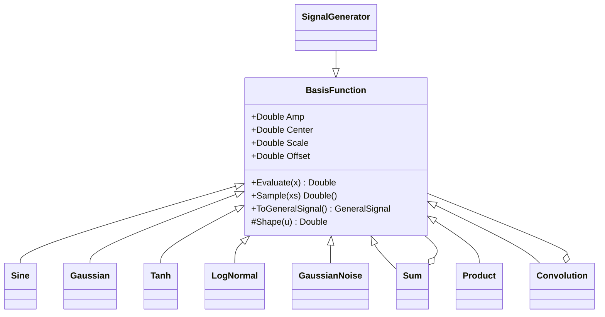

## 用户需求

当前 `Source` 文件夹是基于 `dks-rub/signalgenerator` 移植的音频波形生成模型（`Signal` 基类使用 `calculate(freq, phase)`，含 `Providers` 各类波形、`ArithmeticSignal` 组合、`SignalPeak` 高斯峰、`DumpsSignal` bumps）。需在不破坏旧音频模型的前提下，于 `Source` 文件夹内重构并扩充出一套成熟的确定性时序信号生成模块。

## 产品概述

构建一套“基础信号函数库 + 组合生成器”的时间序列数据生成体系：先定义丰富的基础信号函数（统一携带 `Amp`/`Center`/`Scale`/`Offset` 四个通用参数），再通过加法、乘法、卷积等组合方式拼装出复杂、贴近真实场景的时序信号（如 ECG、机械振动、金融趋势、气象温度）。

## 核心特性

- **通用参数基类**：每个基础函数均支持振幅 `Amp`、中心偏移 `Center`、缩放 `Scale`、垂直偏移 `Offset`。
- **五大类基础函数库**：

1. 周期与振荡：正弦/余弦、方波、三角波、锯齿波、阻尼正弦。
2. 脉冲与局部特征：洛伦兹(柯西)、双边指数、墨西哥草帽(Ricker)、矩形脉冲、高斯。
3. 趋势与渐变：线性、指数增长/衰减、对数、幂律。
4. 阈值与状态切换：Tanh、ReLU、阶跃。
5. 复合特殊：对数正态、Sinc、Gompertz。

- **随机噪声基础函数**：高斯白噪声、均匀噪声（用于 `Signal = 趋势 + 季节 + 噪声` 形式）。
- **组合生成器**：支持加法/减法/乘法/除法（点运算）与卷积（系统响应模拟）；组合结果既可继续嵌套组合，也可一键采样为 `Double()` 或 `GeneralSignal`。
- **便捷工厂与预设**：提供快速构造工厂及若干组合预设示例（ECG、机械振动、气象温度趋势）。

## 技术栈

- 语言/框架：VB.NET（net10.0），与现有 `SignalProcessing` 项目完全一致。
- 命名空间：新建 `Microsoft.VisualBasic.Math.SignalProcessing.Source.Generators`（物理文件仍位于 `Source/` 目录，与旧 `Source` 音频命名空间隔离，避免类名冲突）。
- 复用既有能力（均已验证存在）：
- `Microsoft.VisualBasic.Math.Distributions.Gaussian.Gaussian(x, A, mu, sigma)` 用于高斯峰。
- `Microsoft.VisualBasic.Math.RandomExtensions`（位于 `Microsoft.VisualBasic.Core`，含 `seeds` 与 `NextGaussian`）用于噪声生成。
- 本项目 `MathUtils.Convolve(signal, kernel)`（`SignalProcessing` 根命名空间）用于卷积组合，不再重复实现。

## 实现方案

### 总体策略

在 `Source/` 中新增一套独立的基础函数体系：抽象基类 `BasisFunction` 统一定义四个通用参数与 `Shape(u)` 形状方法；具体基础函数只实现 `Shape(u)`（以 `u = x - Center` 为中心的归一化形状）。组合器（`Sum`/`Product`/`Convolution` 等）继承 `BasisFunction`，通过覆写 `Evaluate(x)` 实现点运算或整体采样，从而既可继续作为子组件嵌套，又能直接采样输出。

### 关键技术决策

- 基类采用 `Evaluate(x) = Offset + Amp * Shape(x - Center)` 的统一封装，使所有基础函数共享 `Amp/Center/Scale/Offset`；`Scale` 含义由各子类 `Shape` 自行解释（频率/宽度/陡峭度），必要时子类附加专属参数（如 `DampedSine` 的阻尼系数）。
- 组合器区分“点运算组合”与“卷积组合”：点运算（加/减/乘/除）覆写 `Evaluate` 对各子函数逐点求值，开销 O(N)；卷积组合覆写 `Sample`，对两路信号在同一时间网格采样后用 `MathUtils.Convolve` 计算，开销 O(N·K)（K 为核长），并缓存避免重复采样。
- 复用而非重写：高斯峰值、噪声随机数、卷积分别复用 `Distributions.Gaussian`、`RandomExtensions`、`MathUtils.Convolve`，降低维护成本并保持一致数值行为。
- 输出兼容：提供 `ToGeneralSignal(timeGrid, reference, unit)`，复用现有 `GeneralSignal(Measures, Strength)` 构造函数，无缝接入后续处理与可视化。

### 性能与可靠性

- 单次 `Evaluate` 为 O(1)；N 点采样为 O(N)。卷积受核长 K 限制，建议核长控制在数百点内。
- 卷积组合首次采样时缓存网格结果，`Evaluate` 走最近邻查表，避免每次重算。
- 处理函数定义域异常（如 `log`/`power` 在 `x-Center ≤ 0` 时）返回 `Offset` 或 0，避免 NaN 污染整条序列。

## 实施要点

- 保持 `Source/Signal.vb`、`Providers.vb`、`ArithmeticSignal.vb`、`SignalPeak.vb`、`DumpsSignal.vb` 不变，确保旧音频模型与依赖其的代码继续可用。
- 新类统一放在 `Source.Generators` 命名空间，物理上位于 `Source/` 目录，文件名以 `Basis*`/`Signal*` 前缀区分。
- 噪声函数复用 `RandomExtensions.seeds` 获取 `Random` 实例；高斯噪声用 `NextGaussian(mean, sd)`。
- 纯函数计算无需日志；仅在采样网格非法（n≤0）时抛出 `ArgumentException`。

## 架构设计



## 目录结构

```
Source/
├── BasisFunction.vb       # [NEW] 抽象基类 BasisFunction，定义 Amp/Center/Scale/Offset 与 Shape/Evaluate/Sample/ToGeneralSignal
├── BasisOscillations.vb   # [NEW] 周期振荡类：Sine/Cosine/Square/Triangle/Sawtooth/DampedSine
├── BasisPulses.vb        # [NEW] 脉冲局部类：Lorentz/DoubleExp/Ricker/RectPulse/Gaussian(复用 Distributions)
├── BasisTrends.vb        # [NEW] 趋势渐变类：Linear/Exponential/Logarithm/Power
├── BasisThresholds.vb    # [NEW] 阈值切换类：Tanh/ReLU/Step
├── BasisSpecials.vb      # [NEW] 复合特殊类：LogNormal/Sinc/Gompertz
├── BasisNoise.vb         # [NEW] 噪声类：GaussianNoise/UniformNoise(复用 RandomExtensions)
├── SignalCombinators.vb  # [NEW] 组合器 Sum/Difference/Product/Quotient/Convolution + 流式 SignalGenerator
└── SignalFactory.vb      # [NEW] 便捷工厂 Basis + 预设组合示例(ECG/振动/气象)
```

## 关键代码结构

```
' BasisFunction.vb —— 统一基类
Public MustInherit Class BasisFunction
    Public Property Amp As Double = 1.0
    Public Property Center As Double = 0.0
    Public Property Scale As Double = 1.0
    Public Property Offset As Double = 0.0

    ' 以 u = x - Center 为中心的归一化形状；组合器可改覆 Evaluate
    Protected Overridable Function Shape(u As Double) As Double
        Return u
    End Function

    Public Overridable Function Evaluate(x As Double) As Double
        Return Offset + Amp * Shape(x - Center)
    End Function

    Public Overridable Function Sample(x As IEnumerable(Of Double)) As Double()
    Public Function ToGeneralSignal(x As IEnumerable(Of Double),
                                    Optional reference As String = "",
                                    Optional unit As String = "") As GeneralSignal
End Class

' SignalCombinators.vb —— 可嵌套组合器（示例：加法与卷积）
Public Class Sum : Inherits BasisFunction
    Public Property A As BasisFunction, B As BasisFunction
    Public Overrides Function Evaluate(x As Double) As Double
        Return A.Evaluate(x) + B.Evaluate(x)
    End Function
End Class

Public Class Convolution : Inherits BasisFunction
    Public Property Signal As BasisFunction, Kernel As BasisFunction
    Public Property GridMin, GridMax As Double, GridN As Integer
    Public Overrides Function Sample(xs As IEnumerable(Of Double)) As Double()
        Return MathUtils.Convolve(Signal.Sample(xs), Kernel.Sample(xs))
    End Function
End Class
```