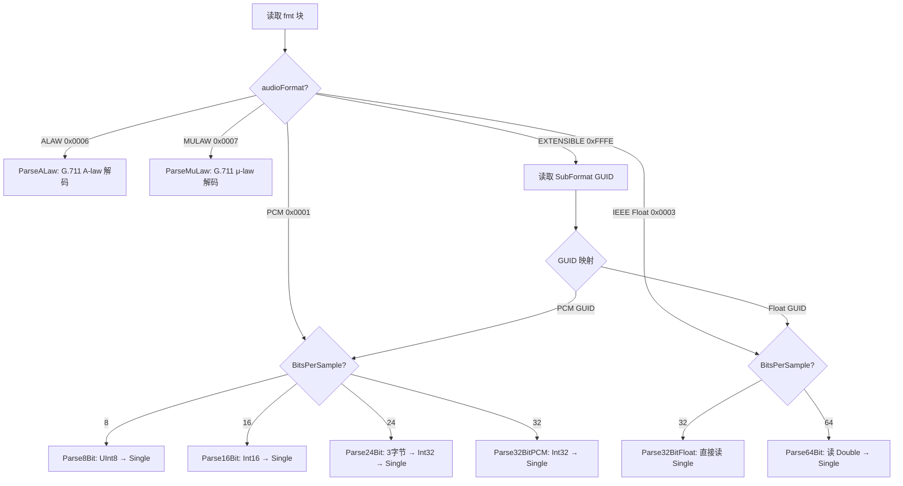
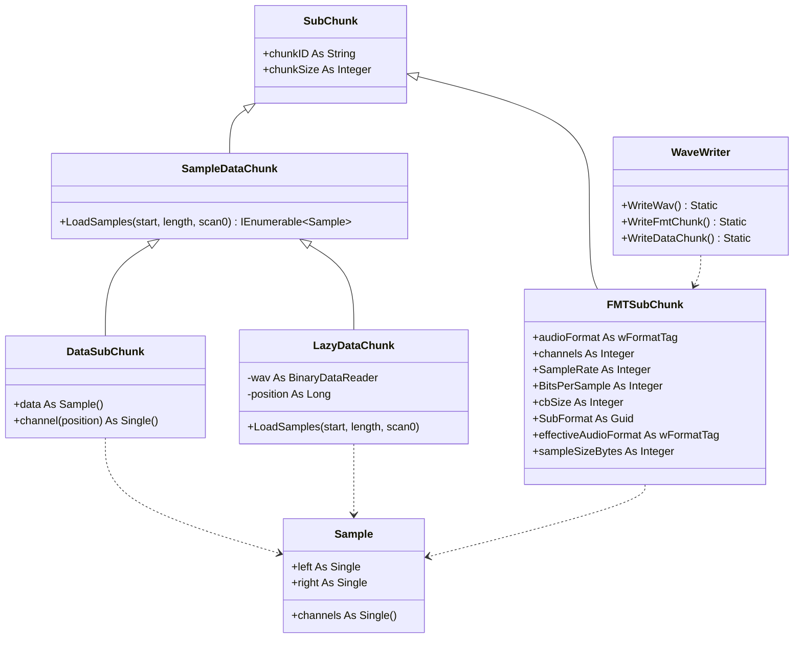

## 用户需求

### 1. 完善 WAV 音频文件解析模块

使解析器能够处理任意编码形式的 WAV 音频文件，包括：

- PCM：8-bit（无符号）、16-bit（有符号整数）、24-bit（有符号整数，3字节打包）、32-bit（有符号整数）
- IEEE Float：32-bit（单精度浮点）、64-bit（双精度浮点）
- G.711 A-law / μ-law：8-bit 压缩编码
- WAVE_FORMAT_EXTENSIBLE：通过 SubFormat GUID 确定实际编码，支持多声道

### 2. 完善两种数据读取方法

- **一次性内存加载（DataSubChunk）**：所有编码格式均能正确加载到内存中的 `Sample()` 数组
- **惰性流式加载（LazyDataChunk）**：所有编码格式均支持按需流式读取，保持低内存占用

确保两种模式下所有编码格式的行为一致，统一分发逻辑。

### 3. 新增 WAV 文件写入模块

新建 `WaveWriter.vb`，支持将音频样本数据写入符合规范的 WAV 文件，可配置采样率、声道数、位深度、编码格式等参数，正确构建 RIFF 头、fmt 块和 data 块。

## 技术方案

### 技术栈

- **语言**：VB.NET
- **目标框架**：net10.0-windows、net10.0、net8.0、net48（与现有项目一致）
- **核心依赖**：`Microsoft.VisualBasic.Data.IO`（提供 `BinaryDataReader`）
- **内部表示**：所有样本统一存储为 `Sample` 结构体（`channels As Single()`），范围 [-1.0, 1.0]

### 架构设计

#### 编码格式分发策略

通过 `(audioFormat, BitsPerSample)` 二元组决定解析器，而非仅依赖 `BitsPerSample`：



#### 模块关系图



### 实现细节

#### 文件修改清单

```
wav/
├── SubChunk/
│   ├── Enums.vb       # [MODIFY] 移除 Channels 枚举约束；增设声道数常量
│   ├── FMT.vb         # [MODIFY] channels→Integer；EXTENSIBLE 解析；effectiveAudioFormat
│   ├── Sample.vb      # [MODIFY] 实现全部缺失的解析器
│   ├── Data.vb        # [MODIFY] 统一双模式分发；补齐 LazyDataChunk 所有位深度
│   └── WaveWriter.vb  # [NEW] WAV 文件写入模块
```

#### 各文件关键变更

**1. Enums.vb — 解除声道数限制**

- `Channels` 枚举保留但不作为属性类型使用
- `FMTSubChunk.channels` 改为 `Integer` 类型
- 利用 `ChannelPositions` 枚举供 `Sample.channels()` 索引器使用（可选优化）

**2. FMT.vb — EXTENSIBLE 支持与属性修正**

- `channels` 类型从 `Channels` 改为 `Integer`
- 在 `ParseChunk` 中：当 `audioFormat = WAVE_FORMAT_EXTENSIBLE` 时，额外读取 `cbSize`(Int16) 和 `SubFormat`(Guid, 16字节)
- 新增只读属性 `effectiveAudioFormat`：对 EXTENSIBLE 格式，将 SubFormat GUID 映射回 PCM 或 IEEE Float
- 新增只读属性 `sampleSizeBytes`：根据 `BitsPerSample` 计算每样本字节数（8→1, 16→2, 24→3, 32→4, 64→8）
- 变更影响分析：`channels` 类型变更后，现有调用方需要确认（如果是枚举比较需改为整型比较）

**3. Sample.vb — 补全所有解析器**

- **Parse8Bit**：读取 `Byte`，转换公式 `CSng(value - 128) / 128.0F`
- **Parse24Bit**：读取 3 字节拼装为 Int32（小端，进行符号扩展），缩放因子 `Int32.MaxValue`
- **Parse32BitPCM**（新增）：读取 `Int32`，缩放 `CSng(value) / Int32.MaxValue`
- **Parse32Bit**（修正）：维持现有逻辑读 `Single`，但仅用于 IEEE Float 格式
- **Parse64Bit**：读取 `Double`，转为 `CSng(value)`，仅用于 IEEE Float 64-bit
- **ParseALaw**：内置 G.711 A-law 256项解码表，读 `Byte`→查表得 Int16→缩放
- **ParseMuLaw**：内置 G.711 μ-law 256项解码表，同上流程
- 对应的单样本版本（用于 LazyDataChunk）：`Parse24BitSample`、`Parse64BitSample`、`ParseALawSample`、`ParseMuLawSample`

**4. Data.vb — 统一双模式分发**

- `DataSubChunk.loadData` 重构：根据 `(fmt.effectiveAudioFormat, fmt.BitsPerSample)` 选择解析器
- `LazyDataChunk.LoadSamples` 重构：与内存模式使用相同的选择逻辑
- `MeasureChunkSize` / `CalculateOffset`：补充 24-bit(×3) 和 64-bit(×8) 的处理分支
- 去除 `MoveToDataChunk` 中的冗余逻辑

**5. WaveWriter.vb — 新建写入模块**

- 类名 `WaveWriter`（静态工具类）
- 公共方法 `WriteWav(path As String, samples As IEnumerable(Of Sample), sampleRate As Integer, channels As Integer, bitsPerSample As Integer, audioFormat As wFormatTag)`
- 内部方法：
- `WriteRiffHeader`：写入 "RIFF" + 文件大小 + "WAVE"
- `WriteFmtChunk`：写入 "fmt " + chunkSize + audioFormat + channels + sampleRate + byteRate + blockAlign + bitsPerSample（EXTENSIBLE 时额外写入 cbSize + SubFormat）
- `WriteDataChunk`：写入 "data" + chunkSize + 样本数据
- `WriteSampleData`：根据 audioFormat + bitsPerSample 将 Single[] 编码为对应字节格式

### 性能考量

- **ALAW/MULAW 解码**：使用静态只读解码表（256 × Int16），O(1) 查表，避免每样本计算
- **LazyDataChunk 定位**：`CalculateOffset` 使用 `sampleSizeBytes` 属性（预计算），避免每次 Seek 前重复判断位深度
- **24-bit 解析**：3 字节拼接无可避免，每次需 3 次 ReadByte + 移位，可通过 `ReadBytes(3)` 批量读取优化
- **内存模式**：保持 `Array.ConstrainedCopy` 切片逻辑不变
- **写入模式**：对于大批量样本，使用缓冲写入（`BinaryWriter` 内部已缓冲）

### 向后兼容性

- `channels` 从 `Channels` 枚举改为 `Integer`：现有代码若使用 `= Channels.Mono` 比较，需改为 `= 1` 或使用 `CInt(Channels.Mono)`
- WaveFile.Open API 签名不变
- 新增编码支持对现有 PCM 16/32-bit 行为无影响
- LazyDataChunk 新增位深度支持不影响现有 32-bit 用例