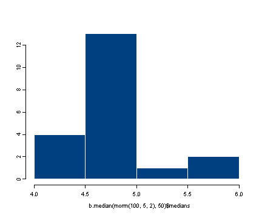

# R Library: Introduction to bootstrapping

## The programs

The [R program](./bootstrap.R) (as a text file) for the code on this page.
In order to see more than just the results from the computations of the functions (i.e. if you want to see the functions echoed back in console as they are processed) use the ``echo=T`` option in the source function when running the program.

```R
source("./bootstrap.R", echo=T)
```

## Introduction

Bootstrapping can be a very useful tool in statistics and it is very easily implemented in R. Bootstrapping comes in handy when there is doubt that the usual distributional assumptions and asymptotic results are valid and accurate. Bootstrapping is a nonparametric method which lets us compute estimated standard errors, confidence intervals and hypothesis testing.

Generally bootstrapping follows the same basic steps:

1. Resample a given data set a specified number of times
2. Calculate a specific statistic from each sample
3. Find the standard deviation of the distribution of that statistic

## The sample function

A major component of bootstrapping is being able to resample a given data set and in R the function which does this is the ``sample`` function.

```R
sample(x, size, replace, prob)
```

The first argument is a vector containing the data set to be resampled or the indices of the data to be resampled. The ``size`` option specifies the sample size with the default being the size of the population being resampled. The ``replace`` option determines if the sample will be drawn with or without replacement where the default value is ``FALSE``, i.e. without replacement. The ``prob`` option takes a vector of length equal to the data set given in the first argument containing the probability of selection for each element of ``x``. The default value is for a random sample where each element has equal probability of being sampled. In a typical bootstrapping situation we would want to obtain bootstrapping samples of the same size as the population being sampled and we would want to sample with replacement.

```R
#using sample to generate a permutation of the sequence 1:10
sample(10)
[1]  4  8  3  5  1 10  6  2  9  7

#bootstrap sample from the same sequence
sample(10, replace=T)
[1]  1  3  9  4 10  3  5  1  6  4

#boostrap sample from the same sequence with
#probabilities that favor the numbers 1-5
prob1 <- c(rep(.15, 5), rep(.05, 5))
prob1
[1] 0.15 0.15 0.15 0.15 0.15 0.05 0.05 0.05 0.05 0.05
sample(10, replace=T, prob=prob1)
[1] 4 2 1 7 6 5 4 4 2 9

#sample of size 5 from elements of a matrix
#creating the data matrix
y1 <- matrix( round(rnorm(25,5)), ncol=5)
y1
     [,1] [,2] [,3] [,4] [,5]
[1,]    6    4    6    4    5
[2,]    6    5    5    7    4
[3,]    5    4    5    7    6
[4,]    5    3    6    6    6
[5,]    3    4    4    5    5

#saving the sample of size 5 in the vector x1
x1 <- y1[sample(25, 5)]
x1
[1] 6 4 5 5 4

#sampling the rows of the a matrix
#creating the data matrix
y2 <- matrix( round(rnorm(40, 5)), ncol=5)
y2
     [,1] [,2] [,3] [,4] [,5]
[1,]    5    5    4    7    4
[2,]    5    6    4    6    4
[3,]    5    4    4    6    3
[4,]    5    6    5    6    6
[5,]    6    5    4    4    4
[6,]    5    5    5    4    5
[7,]    4    5    5    5    4
[8,]    5    5    4    6    6

#saving the sample of rows in the matrix x2
x2 <- y2[sample(8, 3),  ]
x2
     [,1] [,2] [,3] [,4] [,5]
[1,]    4    5    5    5    4
[2,]    5    6    5    6    6
[3,]    6    5    4    4    4
```

## A bootstrap example

In the following bootstrapping example we would like to obtain a standard error for the estimate of the median. We will be using the lapply, sapply functions in combination with the sample function. (For more information about the lapply and sapply function please look at the advanced function R library pages or consult the help manuals.)

```R
#calculating the standard error of the median
#creating the data set by taking 100 observations
#from a normal distribution with mean 5 and stdev 3
#we have rounded each observation to nearest integer
data <- round(rnorm(100, 5, 3))
data[1:10]
[1] 6 3 3 4 3 8 2 2 3 2

#obtaining 20 bootstrap samples
#display the first of the bootstrap samples
resamples <- lapply(1:20, function(i)
sample(data, replace = T))
resamples[1]
[[1]]:
  [1]  5  1  7  6  5  2  2  6  9  5  4  6  6  3  5  4 10  7  8  1  8  0  5  2
 [25]  8  3  0  9  3  2  3 10  5  8  5  4  0  4  7  3  5  6  3  6  3  2  9  7
 [49]  2  4  9  6  6  0  7  5  9  3  0  6  8  5  2  3  3  3  4  3  2  9  3  3
 [73]  2  3  8  2  8  3  9  6  5  2  4  3  3  7  1  3  5  9  4  3  4  2  9  0
 [97]  3  6  9  7

#calculating the median for each bootstrap sample
r.median <- sapply(resamples, median)
r.median
[1] 4.0 4.5 4.0 5.0 4.0 5.0 5.0 5.0 5.0 4.0 5.0 5.0 5.0 5.0 5.0 4.0 5.0 5.0
[19] 6.0 5.0

#calculating the standard deviation of the distribution of medians
sqrt(var(r.median))
[1] 0.5250313

#displaying the histogram of the distribution of the medians
hist(r.median)
```


We can put all these steps into a single function where all we would need to specify is which data set to use and how many times we want to resample in order to obtain the adjusted standard error of the median. For more information on how to construct functions please consult the R library pages on introduction to functions and advanced functions.

```R
#function which will bootstrap the standard error of the median
b.median <- function(data, num) {
    resamples <- lapply(1:num, function(i) sample(data, replace=T))
    r.median <- sapply(resamples, median)
    std.err <- sqrt(var(r.median))
    list(std.err=std.err, resamples=resamples, medians=r.median)
}

#generating the data to be used (same as in the above example)
data1 <- round(rnorm(100, 5, 3))

#saving the results of the function b.median in the object b1
b1 <- b.median(data1, 30)

#displaying the first of the 30 bootstrap samples
b1$resamples[1]
[[1]]:
  [1]  6  6  6  0  9  3  5  6  2  7  5  3  3  2  5  3  0  4  3  7  3  1  6  3
 [25]  6  3  5  9  6  4  8  4  3  1  3  2  4  5  2  3  1  7  6  3  7 10  7  2
 [49]  3  3  5 10  9  6  2  3  4  5  1  3  5  0  8  1  4  2  7  8  2  2 10  6
 [73]  4  8  6  3  5  2 10  5  0  7  6  5  4  9  6  0  6  6  3  4  8 10  7  6
 [97]  3  3  2  3

#displaying the standard error
b1$std.err
[1] 0.5155477

#displaying the histogram of the distribution of medians
hist(b1$medians)
```


```R
#we can input the data directly into the function and display
#the standard error in one line of code
b.median(rnorm(100, 5, 2), 50)$std.err
[1] 0.5104178

#displaying the histogram of the distribution of medians
hist(b.median(rnorm(100, 5, 2), 50)$medians)
```



It would be fairly simple to generalize the function to work for any summary statistic. We will not show that generalized function but encourage the user to try and figure out how to do it before downloading the program which has the answer.

## Built in bootstrapping functions

R has numerous built in bootstrapping functions, too many to mention all of them on this page, please refer to the boot library.

```R
#R example of the function boot
#bootstrap of the ratio of means using the city data included in the boot package

#obtaining the data from the package
data(city)

#defining the ratio function
ratio <- function(d, w) sum(d$x * w)/sum(d$u * w)

#using the boot function
boot(city, ratio, R=999, stype="w")
# ORDINARY NONPARAMETRIC BOOTSTRAP
#
# Bootstrap Statistics :
#     original     bias    std. error
# t1* 1.520313 0.04465751   0.2137274
```

> Bruin, J. 2006. newtest: command to compute new test.  UCLA:
> Statistical Consulting Group.  http://www.ats.ucla.edu/stat/stata/ado/analysis/.
>
> 
